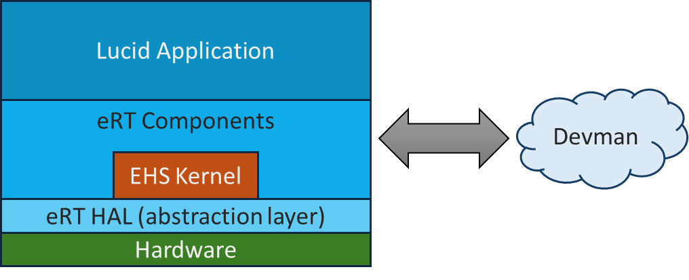

# About inxware

* [Why use inxware?](#why-use-inxware)
* [What is inxware?](#what-is-inxware)
* [How is inxware licenced?](#how-is-inxware-licenced)
* [Where do I get inxware?](#where-do-i-get-inxware)
* [eRT build quick start guide](#ert-build-quick-start-guide)
* [Supported platforms](#supported-platforms)
* [Further reading](#further-reading)
* [Project statistics](#project-statistics)
* [GitHub build status](#github-build-status)

## Why use inxware?

inxware provides the simplest and most advanced framework for developing real-time and data-intensive firmware for embedded devices. It is in active use across [many sectors](https://www.inx-systems.com/sectors/), including industrial IoT, smart buildings, smart domestic energy products, edge-AI applications and advanced control systems.

It supports [devices](#supported-platforms) ranging from basic microcontrollers (e.g. NXP Kinetis, STM32, ESP32, etc.) through Arduino, Raspberry Pi, and Android tablets, all the way to full Windows/Linux PCs and containerised environments, allowing you to build products of any complexity.

The inxware development suite includes a powerful no-code IDE called [Lucid](https://appland.inxware.io//), to help you to assemble the exact components you require for your application - potentially without ever needing to write any code. Our related [Appland](https://appland.inxware.io/appLand/index.php/) community gallery helps inxware users to share their applications. It is not essential to use Lucid with inxware, but it can provide significant development acceleration for many typical cases.

## What is inxware?

inxware encompasses an ecosystem of software, including:

* A graphical, no-code IDE called [Lucid](https://appland.inxware.io/) for creating your application(s) by connecting components together and adding control logic.
* A event-driven runtime application called "eRT" (which includes a proprietary runtime kernel, called EHS Kernel) and Hardware Abstraction Layer (HAL).
* A broad range of 'components' providing all of the functionality you would expect in an embedded system.
* Your applications, these run within the eRT environment.
* An Optional IoT administration platform called [Devman](https://www.inxware.io/devman/), can be used to monitor, manage and update devices running your deployed inxware apps.



eRT can be run bare-metal on microcontrollers or as an application in more full-featured RTOS- and OS-based systems. It is written in C and can be ported to virtually any platform that has a suitable toolchain (e.g. C/C++ compiler). It has already been ported to [many popular platforms](#supported-platforms).

Here are some of the key features of inxware:

**Cross-Platform Runtime**

- **10+ architectures**: ARM, x86, RISC-V, Xtensa.
- **Multiple OS support**: Linux, Android, Windows, FreeRTOS, Arduino.
- **Unified build system**: includes Docker containerisation.

**Rich Component Library**

- **Core components**: Operators, buffers, timers, file I/O.
- **Networking**: Wi-Fi, HTTP, MQTT, TCP/UDP sockets.
- **Graphics & UI**: Display drivers, controls, imaging.
- **Hardware interfaces**: GPIO, ADC/DAC, PWM, UART.

**Production Ready**

- **OTA updates**: Over-the-air firmware deployment.
- **Package formats**: APK, DEB, firmware images, Unity plugins.
- **CI/CD integration**: Automated testing and deployment.

**No-Code Development**

- **Visual programming**: Drag-and-drop component assembly / app development.
- **Real-time debugging**: Live system monitoring and management.
- **Rapid prototyping**: From initial concept to working prototype in minutes.

---

## How is inxware licenced?

The majority of the inxware runtime stack is published under a permissive Open Source licence ([LGPL v3.0](licenses/eRT_Components.md)) and we welcome [contributions](CONTRIBUTING.md) from the community to expand and improve its capabilities and features.

There is a single closed-source component, the inxware event-handling system EHS Kernel, supplied in binary form in our [`ert-build-support`](https://github.com/inxware/ert-build-support) repository. The EHS Kernel is required and automatically included in inxware firmware builds.

Please refer to our [LICENSE.md](LICENSE.md) document for full information on licensing.

## Where do I get inxware from?

There are two routes to trying out inxware:

1. Top-down: build your applications in the Lucid no-code environment and run them on your chosen hardware platform(s)
   
   - Register with the inx [Appland](https://appland.inxware.io/appLand/) community and try out Lucid for free.
2. Bottom-up: integrate your own software components with inxware and build custom firmware images.
   
   - See the "build quick start guide" below.

The second option is only normally required if you need to develop your own eRT components, or create an eRT port to a new target hardware platform which isn't already supported by the published sources.

## eRT build quick start guide

To create an inxware firmware image for your device, you will just need these three items:

1. A Linux build machine (including [Windows Subsystem for Linux](https://learn.microsoft.com/en-us/windows/wsl/))
2. The ERT (Event RunTime) environment
3. Your Lucid application, which would typically be located in the [inxware Apps](https://github.com/inxware/apps) repository.

**Note:** This guide assumes you have access to a bash shell in a Debian/Ubuntu Linux distribution. If you have a Windows PC, you can install and run Linux *within Windows* using [Windows Subsystem for Linux](https://learn.microsoft.com/en-us/windows/wsl/).

### Build system requirements

| Requirement | Minimum                                       | Recommended                        |
| ----------- | --------------------------------------------- | ---------------------------------- |
| **OS**      | Linux (Ubuntu 18.04+) or Windows 10 with WSL2 | Ubuntu 20.04+ or Debian 11+        |
| **RAM**     | 8GB                                           | 16GB+                              |
| **Storage** | 50GB free                                     | 100GB+ SSD                         |
| **CPU**     | 4 cores                                       | 8+ cores                           |
| **Network** | Broadband internet                            | High-speed for container downloads |

Within a Linux bash shell, enter the following commands to check your build environment is working:

```bash
mkdir inxware && cd inxware

# Clone the main `ert-components` repository
#
# If you prefer HTTPS:
# git clone --depth 1 https://github.com/inxware/ert-components.git
#
# If you prefer SSH:
git clone --depth 1 git@github.com:inxware/ert-components.git

cd ert-components

# Configure the build for your chosen target platform
./configure  # List all available targets
./configure linux_x86_64_clang  # Configure for Linux x64 - test on build machine

# Install the build dependencies
make prepdeps       # Downloads toolchains and dependencies (~40GB) 

# Build the runtime binary
make all_docker # Build using containerised environment

# Create a deployable package
make targetenv                  # Assemble the runtime environment
make targetenv_version     # Create versioned release (binary/package)

#Test your build
./configure -run  # Run the built application
```

**Success!** You now have a working eRT runtime. Try the [Lucid IDE](https://appland.inxware.io/) to create your first no-code application.

### Repository dependencies

- **ert-build-support** (~20GB): Binary toolchains and build tools
- **ert-contrib-middleware** (~15GB): Pre-built 3rd-party libraries
- **apps** (optional): Demo applications and examples

### Docker configuration

For optimal performance, configure Docker with:

```bash
# Increase Docker resources (if using Docker Desktop)
# RAM: 8GB minimum, 16GB recommended
# CPU: All available cores
# Disk: 60GB minimum

# For Linux: add user to docker group
sudo usermod -aG docker $USER
# Logout and login again for changes to take effect
```

### Troubleshooting

**"Permission denied" with Docker**

```bash
sudo usermod -aG docker $USER
# Logout and login again
```

**"No space left on device"**

```bash
# Clean Docker cache
docker system prune -a
# Check disk space
df -h
```

**Git LFS download failures**

```bash
# Install/update Git LFS
git lfs install
git lfs pull
```

**Build dependencies missing**

```bash
# Reinstall dependencies
make clean
rm -rf ../ert-build-support ../ert-contrib-middleware
make prepdeps
```

## Supported platforms

| Platform Category    | Architecture | Operating System                  | Status    | Package Format | Use Cases                  |
| -------------------- | ------------ | --------------------------------- | --------- | -------------- | ---------------------------|
| **Desktop/server**   | x86_64       | Linux (Debian 9-12, Ubuntu 14-24) | ✅ Stable | DEB, Binary    | Development, Server apps   |
|                      | x86_64       | Windows 7-11                      | ✅ Stable | EXE, MSI       | Desktop applications       |
| **Single board**     | ARM64        | Linux (Raspberry Pi 3-5)          | ✅ Stable | DEB, Image     | IoT gateways, edge compute |
|                      | ARM64        | Android (Rock Pi, Radxa)          | ✅ Stable | APK            | Media players, kiosks      |
|                      | ARM32        | Linux (Various SBCs)              | ✅ Stable | DEB, Image     | Industrial controllers     |
| **Microcontrollers** | Xtensa       | ESP32/ESP32-S3 (FreeRTOS)         | ✅ Stable | Firmware       | IoT sensors, edge devices  |
|                      | ARM Cortex-M | NXP Kinetis (FreeRTOS)            | ✅ Stable | Firmware       | Industrial automation      |
|                      | ARM Cortex-M | Arduino (MBED, Native)            | ✅ Stable | Firmware       | Prototyping, education     |
| **Mobile/gaming**    | ARM          | Unity Plugin                      | ✅ Stable | Unity Package  | Games, interactive apps    |
|                      | ARM64        | Android NDK                       | ✅ Stable | AAR, SO        | Mobile applications        |

 
 
 

 
 

 
 


### **Industrial & IoT**

- **Raspberry Pi**: All models (3, 4, 5, Zero)
- **Rock Pi**: 4A/4B/4C+, Rock 3C, Rock 5A/5B
- **ESP32 family**: ESP32, ESP32-S3, ESP32-C3
- **NXP Kinetis**: K64F, K66F, RT series
- **STM32**: F4, F7, H7 series (via Arduino)

### **Consumer devices**

- Android tablets and phones
- Set-top boxes and media players
- Digital signage displays
- Interactive kiosks

## Serial TTY Console Commands

Many targets support an interactive serial console for network configuration and diagnostics. This feature is enabled when `EHS_SERIAL_CONSOLE_SUPPORT=1` is set in the build configuration.

> **Note:** Serial console commands are currently supported on ESP32 and ESP32-S3 targets only. Other platforms may have limited or no console support.

### Command Reference

| Command | Function | Description |
|---------|----------|-------------|
| `h` | Help | Display available commands |
| `w` | WiFi Config | Interactive WiFi SSID and password configuration |
| `c` | Reconnect | Reconnect to WiFi using stored credentials |
| `d` | Disconnect | Disconnect from current WiFi network |
| `f` | Forget | Clear stored WiFi credentials |
| `s` | Get SSID | Display current WiFi SSID and connection status |
| `i` | Get IP | Display current IP address (WiFi or Ethernet) |
| `l` | List SSIDs | Scan and list available WiFi networks with RSSI |
| `x` | Stop Scan | Stop any in-progress WiFi scan |
| `r` | Reboot | Reboot the device |

### WiFi Configuration Example

```
Type 'w' to configure WiFi or 'h' for help.
w
**** WiFi config ****
Enter SSID:
MyNetwork
Enter Password:
MyPassword123
Are these correct? (y/n)
y
Saving above WiFi credentials.
Connecting to WiFi, please wait...
```

### Scanning for Networks
** Note: ** some platforms may not be able to scan all SSIDs while connected. You may need to disconnect first.

Use `l` to scan for available WiFi networks:
```
l
Scanning...
SSID=MyNetwork, BSSID(MAC)=aa:bb:cc:dd:ee:ff, Channel=6, RSSI=-45 dBm
SSID=Neighbor_WiFi, BSSID(MAC)=11:22:33:44:55:66, Channel=11, RSSI=-72 dBm
SSID=Office_5G, BSSID(MAC)=77:88:99:aa:bb:cc, Channel=36, RSSI=-58 dBm
```

### Function Block vs Console Control

When WiFi is managed by the `wifi_station` function block in your application, the `w` and `c` commands are disabled. The console will display:
```
WiFi is managed by function block. Please configure WiFi there.
```

This prevents conflicts between application-level and console-level WiFi management.

### Accessing the Console

Use the ESP32 monitor script to connect:
```bash
./scripts/build-deploy/esp32/esp32_monitor_console.sh esp32s3-5.1
```

Or use any serial terminal at 115200 baud on the device's USB/UART port.

## Further reading

The following documents contain more information about inxware, eRT Components, and related topics:

- Guidelines on getting involved with [contributing](CONTRIBUTING.md) to this project.
- Our guide to [building](BUILDING.md) eRT Components.
- Our guide to [developing](DEVELOPING.md) within inxware.
- Our guide to [edge machine learning with inxware](docs/inxware-edge-ml.md), covering model formats and hardware-specific compilation for Nvidia TensorRT, Hailo, DeepX, Qualcomm, Rockchip, NXP eIQ and Arm Ethos-U.
- The eRT [licence](LICENSE.md).

## About inx

inxware is built and maintained by [inx limited](https://www.inx-systems.com/), a UK embedded systems company that designs, builds and deploys connected products for OEMs and service providers, from concept and prototype through certification to volume production.

- [Open source at inx](https://www.inx-systems.com/open-source/) — what inxware is, the platforms it supports, and how to get started
- [Technologies we build with](https://www.inx-systems.com/technologies/) — embedded operating systems, wireless connectivity, security, OTA and device management
- [Edge AI development](https://www.inx-systems.com/embedded-ai/) — taking on-device inference from prototype to production
- [Technology partners](https://www.inx-systems.com/partners/) — Arm, BlackBerry QNX, Onomondo and Cumulocity
- [inxware.io](https://www.inxware.io/) — the full platform, including the Lucid no-code IDE and the Appland community gallery

## GitHub build status

Every badge is a target built from a clean checkout on each push to `main`.
Click one for its log.

| Platform | Configuration | Status |
|---------------|---------------------------------------------|--------|
| Linux x86-64  | LVGL, Debian 11                             | [](https://github.com/inxware/ert-components/actions/workflows/build-linux_x86_64-linux_x86_64_clang_lvgl_debian11-no-certs.yml) |
| Linux x86-64  | GTK/GStreamer, Debian 11                    | [](https://github.com/inxware/ert-components/actions/workflows/build-linux_x86_64_clang_gtk_gst_gg_debian11-no-certs.yml) |
| Linux x86-64  | Qt, Debian 12                               | [](https://github.com/inxware/ert-components/actions/workflows/build-linux_x86_64_qt_debian12.yml) |
| Linux arm64   | LVGL, Debian 11                             | [](https://github.com/inxware/ert-components/actions/workflows/build-linux_arm64_lvgl_gg_debian11.yml) |
| Linux arm64   | GTK/GStreamer, Debian 11                    | [](https://github.com/inxware/ert-components/actions/workflows/build-linux_arm64_gtk_gst_gg_debian11.yml) |
| Raspberry Pi  | LVGL + TensorFlow Lite + Hailo, Debian 13   | [](https://github.com/inxware/ert-components/actions/workflows/build-linux_arm64_lvgl_raspberrypi_debian13.yml) |
| Android       | arm                                         | [](https://github.com/inxware/ert-components/actions/workflows/build-linux_android_arm.yml) |
| Android       | arm64                                       | [](https://github.com/inxware/ert-components/actions/workflows/build-linux_android_arm64.yml) |
| Windows       | 32-bit, Lucid/Win10                         | [](https://github.com/inxware/ert-components/actions/workflows/build-win_x86_32-lucid-win10.yml) |
| Windows       | 64-bit, base                                | [](https://github.com/inxware/ert-components/actions/workflows/build-win_x86_64.yml) |
| Windows       | 64-bit, GTK/GStreamer                       | [](https://github.com/inxware/ert-components/actions/workflows/build-win_x86_64_gtk_gst.yml) |
| ESP32-S3      | FreeRTOS                                    | [](https://github.com/inxware/ert-components/actions/workflows/build-esp32s3_freertos-xtensa-community.yml) |
| ESP32-S3      | RAK3112 (LoRa, n8r8)                        | [](https://github.com/inxware/ert-components/actions/workflows/build-esp32s3_freertos-xtensa-rak3112.yml) |
| Arduino       | Mbed Nano                                   | [](https://github.com/inxware/ert-components/actions/workflows/build-arduino-mbed-nano_community.yml) |
| Zephyr        | nRF52840 RAK4631 + nRF5340 DK (upstream)    | [](https://github.com/inxware/ert-components/actions/workflows/build-zephyr_arm-upstream.yml) |


## Project statistics


[](LICENSE.md)

---

**Ready to get started?** [Try the Quick Start](#ert-build-quick-start-guide), find out more on [YouTube](https://www.youtube.com/@inxiot), or explore the [Lucid IDE](https://appland.inxware.io/) to create your first no-code embedded application!

## Attribution

*Copyright © 2008–2025 inx Limited. The community **eRT Components** release is open‑source under **LGPLv3**. The **EHS Kernel** is proprietary and licensed separately as described in [LICENSE.md](LICENSE.md).*
