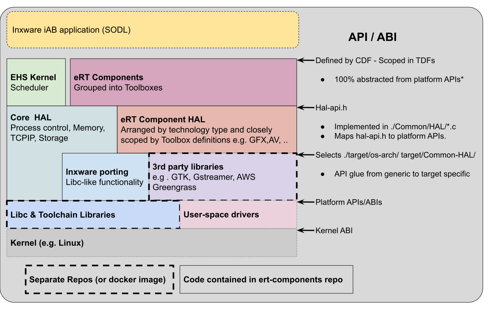
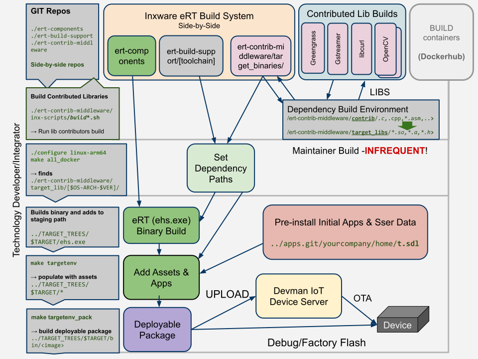
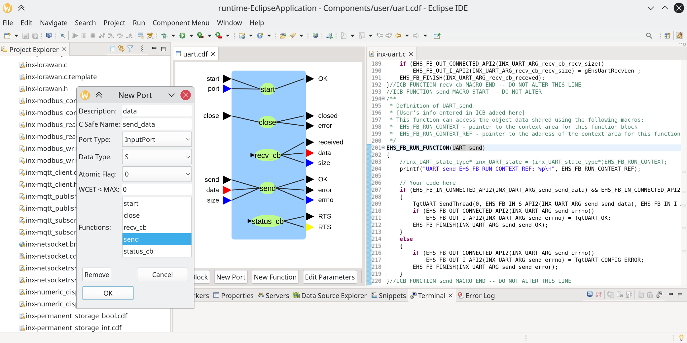

# eRT Porting Guide

This guide is for developers looking to
- Port inxware to new hardware
- Extend functionality 
- Make changes to inxware

>If you are building applications for inxware you don't probably don't need to rebuild inxware for your target. Head over to http://appland.inxware-systems.com to download inxware for your system

> **(Sign up for free and head to the downloads page. Feel free to send us a message if you don't find support for your hardware)**


 The information in this document is for embedded systems engineers porting the inxware runtime (eRT). inxware will run on 1$ MCUs, Arduino boards, Raspberry Pis and bespoke hardware and leverages the best-in-class SDKs, software components and tooling available on a case by case basis.

## Table of Contents

- [Overview & Prerequisites](#overview--prerequisites)
  - [Relevant Reading](#relevant-reading)
    - [Required](#required)
    - [Optional](#optional)
  - [Key Concepts](#key-concepts)
- [Source Tree & Dependencies](#source-tree--dependencies)
  - [Common/ - Cross-Platform Code](#common---cross-platform-code)
  - [target/ - Platform-Specific Code](#target---platform-specific-code)
- [Components (Function Blocks)](#components-function-blocks)
  - [Dependencies](#dependencies)
    - [ert-build-support](#ert-build-support)
    - [ert-contrib-middleware](#ert-contrib-middleware)
    - [EHS-Kernel (Not Published!)](#ehs-kernel-not-published)
- [Build System](#build-system)
  - [Configuration Commands](#configuration-commands)
  - [Building code](#building-code)
    - [Building for the first time](#building-for-the-first-time)
    - [Dependencies Setup](#dependencies-setup)
  - [Runtime Packaging & Image Generations](#runtime-packaging--image-generations)
    - [Deployment QA and Packaging](#deployment-qa-and-packaging)
    - [Platform-Specific Packaging](#platform-specific-packaging)
    - [Development Testing](#development-testing)
- [Make Configuration Variables](#make-configuration-variables)
  - [Hardware & OS Targetting](#hardware--os-targetting)
  - [Component Technology Selection](#component-technology-selection)
  - [Common #defines (Preprocessor Definitions)](#common-defines-preprocessor-definitions)
- [Build System Variables (platform.mk and toolchain.mk)](#build-system-variables-platformmk-and-toolchainmk)
  - [Toolchain Config Variables](#toolchain-config-variables)
  - [Toolchain Modifiers](#toolchain-modifiers)
  - [Build Output Configuration](#build-output-configuration)
  - [Compiler Flags and Switches](#compiler-flags-and-switches)
  - [System Root and Library Paths](#system-root-and-library-paths)
  - [Debug Build Configuration](#debug-build-configuration)
  - [Platform-Specific Variables](#platform-specific-variables)
  - [Environment and Tool Variables](#environment-and-tool-variables)
- [Deployment Utilities](#deployment-utilities)
- [Supported Platforms](#supported-platforms)
  - [SDK and Toolchain Support](#sdk-and-toolchain-support)
- [Platform Porting Guide](#platform-porting-guide)
  - [Porting Overview](#porting-overview)
  - [Platform Configuration Structure](#platform-configuration-structure)
    - [OS Component](#os-component)
    - [ARCH Component](#arch-component)
    - [MIDDLEWARE Component](#middleware-component)
  - [Creating a New Platform](#creating-a-new-platform)
    - [Step 1: Platform Configuration](#step-1-platform-configuration)
    - [Step 2: OS-Architecture Support](#step-2-os-architecture-support)
    - [Step 3: HAL Implementation](#step-3-hal-implementation)
  - [HAL Implementation](#hal-implementation)
    - [Required HAL Functions](#required-hal-functions)
    - [Target-Specific Components](#target-specific-components)
  - [Build Integration](#build-integration)
  - [Validation & Testing](#validation--testing)
- [Component Development](#component-development)
  - [Component Architecture](#component-architecture)
    - [Component Files](#component-files)
  - [Creating New Components](#creating-new-components)
    - [Step 1: Define Component Interface](#step-1-define-component-interface)
    - [Step 2: Implement Component Logic](#step-2-implement-component-logic)
    - [Step 3: Create Visual Representation](#step-3-create-visual-representation)
    - [Step 4: Integration](#step-4-integration)
    - [Step 5: Documentation](#step-5-documentation)
  - [Component Categories](#component-categories)
    - [Core Components (`core/`)](#core-components-core)
    - [GUI Components (`gui/`)](#gui-components-gui)
    - [Networking Components (`networking/`)](#networking-components-networking)
    - [Media Components (`media/`)](#media-components-media)
    - [Machine Learning Components (`ml/`)](#machine-learning-components-ml)
    - [Machine Vision Components (`mv/`)](#machine-vision-components-mv)
- [Testing & Continuous Integration](#testing--continuous-integration)
  - [Build Smoke Test Across Multiple Targets](#build-smoke-test-across-multiple-targets)
  - [Unit Testing](#unit-testing)
    - [Test Structure](#test-structure)
    - [Running Unit Tests](#running-unit-tests)
- [Key Platform Technologies](#key-platform-techologies)
  - [GPIO](#gpio)
  - [Flash Memory Support](#flash-memory-support)
- [Graphics / GUI Targets](#graphics--gui-targets)
  - [Widget Rendering Modes: Mode A vs Mode B](#widget-rendering-modes-mode-a-vs-mode-b)
  - [LVGL](#lvgl)
  - [Qt](#qt)
- [Platform-Specific Guides](#platform-specific-guides)
  - [Embedded RTOS](#embedded-rtos)
  - [Windows](#windows)
  - [GNU Linux](#gnu-linux)
  - [Xtensa-ESP32](#xtensa-esp32)
    - [Platform Overview](#platform-overview)
    - [Build Configuration](#build-configuration)
    - [Typical ESP32 flash Partitions](#typical-esp32-flash-partitiosn)
    - [Networking Configuration](#networking-configuration)
    - [Process Priorities](#process-priorities)
    - [Console Access](#console-access)
    - [Documentation References](#documentation-references)
  - [Arduino (Using Arduino SDK)](#arduino-using-arduino-sdk)
    - [Build Process](#build-process)
    - [Flashing](#flashing)
    - [Default Application](#default-application)
    - [Networking](#networking)
    - [Threading](#threading)
    - [MQTT Support](#mqtt-support)
    - [TLS/SSL Support](#tlsssl-support)
    - [Build and Deploy Process](#build-and-deploy-process)
    - [Platform-Specific Boards](#platform-specific-boards)
    - [Limitations and Considerations](#limitations-and-considerations)
    - [Troubleshooting](#troubleshooting)
  - [Android](#android)
    - [Platform Overview](#platform-overview-1)
    - [Platform Configurations](#platform-configurations)
    - [Product-Specific Configuration](#product-specific-configuration)
    - [Android Supervisor System](#android-supervisor-system)
    - [DevMan Update Scripts](#devman-update-scripts)
    - [Android OS Version Support](#android-os-version-support)
    - [APK Building and Packaging](#apk-building-and-packaging)
      - [Downloader APK](#downloader-apk)
      - [Certificate Management](#certificate-management)
    - [Build and Upload Process](#build-and-upload-process)
    - [Known Issues and Limitations](#known-issues-and-limitations)
  - [Raspberry Pi](#raspberry-pi)
    - [GPIO Control Libraries](#gpio-control-libraries)
    - [Hardware PWM Control](#hardware-pwm-control)
    - [Platform Integration](#platform-integration)
    - [Recommended Approach](#recommended-approach)
    - [Platform.IO Integration](#platformio-integration)
  - [MCU SDKs](#mcu-sdks)
    - [Supported MCU Platforms](#supported-mcu-platforms)
    - [NXP Implementation Notes](#nxp-implementation-notes)
    - [FreeRTOS Integration](#freertos-integration)
    - [Build Integration](#build-integration-1)
    - [MQTT Support (NXP Example)](#mqtt-support-nxp-example)
    - [Debug and Development](#debug-and-development)
    - [MCU SDK Documentation](#mcu-sdk-documentation)
- [Advanced Topics](#advanced-topics)
  - [Debug Logging](#debug-logging)
    - [Logging Configuration](#logging-configuration)
    - [Fine-Grained Logging Control](#fine-grained-logging-control)
    - [Available Log Modules](#available-log-modules)
    - [Log Levels](#log-levels)
    - [Setting Log Levels](#setting-log-levels)
    - [Logging Macros](#logging-macros)
    - [System Architecture](#system-architecture)
    - [Log Message Function](#log-message-function)
    - [Performance Considerations](#performance-considerations)
  - [Network Security](#network-security)
    - [DevMan TLS Security](#devman-tls-security)
    - [MQTT Security Implementation](#mqtt-security-implementation)
    - [Certificate Management](#certificate-management-1)
  - [Process Priorities](#process-priorities-1)
    - [Core Process Priorities](#core-process-priorities)
    - [Platform-Specific Considerations](#platform-specific-considerations)
    - [Configuration](#configuration)
  - [Web Assembly](#web-assembly)
    - [WASM Feasibility for eRT](#wasm-feasibility-for-ert)
    - [Implementation Approach](#implementation-approach)
    - [Networking Limitations](#networking-limitations)
    - [Potential Solutions](#potential-solutions)
    - [Development Considerations](#development-considerations)
    - [Conclusion](#conclusion)
- [Troubleshooting](#troubleshooting-1)
  - [Platform wont build](#platform-wont-build)
  - [Flashing over serial](#flashing-over-serial)
  - [Toolbox functions for](#toolbox-functions-for)
  - [stubbed functionality on some devices](#stubbed-functionality-on-some-devices)
- [Glossary](#glossary)

---

## Overview & Prerequisites

The **ert-components** repository contains the core components needed for the inxware eRT system. eRT is designed to run no-code applications on embedded devices and various computing systems including servers, edge compute, and desktop platforms. Device firmware and OS applications are built in **ert-components**.

Build dependencies may also require git-lfs repos **ert-build-support**, **ert-contrib-middleware**, **DevmanSecurity**, **apps**.

>### Tech Stack
>
### Relevant Reading

- `./about-inxware.md`
- `./ert-build-guide.md`
- https://www.inxware.io
- https://appland.inxware.io


### Key Concepts
inxware short-circuits the considerable overhaeds of working with embedded software when using Lucid, but we also make every effort to make working with embedded software when engineers need to. We do this with the following approach:

>- **Simple** GNU `make` combined with Managed Docker environments 
>- Cross compilation for **all targets** on any linux or WSL
>- Uses `git` and `git-lfs` to **manage dependencies** or provide by **Docker**
>- inxware **components APIs** are uniform across all targets, but may have varying capabilities
>- inxware is natively **event driven**, but approaches the speed of C/C++

# Source Tree & Dependencies

The `ert-components` source-tree can build some targets* without any further dependencies, using host toolchains or toolchains installed into socker images.
However most targets use toolchains, SDKs and contributed open source software that may need to be built from source or provided in a non-standard format.
There are 2 dependency repositories to support more complex builds:
> 1. `ert-build-support` : Provides toolchains and build utilities. 
> 1. `ert-contrib-middleware` : Provides headers and libs contributing technologies

Optional repositories for building production systems include no-code apps (developed with inxware Lucid) and DevmanSecurity that provides keys and certiicates that need to be built into products.

The overall build process can be as simple as 
```bash
./configure <your product config file>
make all_docker
```
or more steps can be includes to package and deploy binaries. 
>## Build Process Flow
>

The **ert-components** repository contains the core components needed for the inxware eRT system.
## [`ert-components.git`](https://github.com/inxware/ert-components)
This repos contains all the source for inxware except for dependencies, toolchains and the ehs kernel library. The ehs kernel is maintained in the build support repository along with toolchains and core dependencies such as libc, lbc++, libgcc etc. 

>### `./Common/` (For all targets)
>- **`Components/`** - Common portion of all component implementations
>  - **`core/`** - Primitive event and data processing components
>  - **`gui/`** - Graphics and UI components (supported by layout tools)
>  - **`networking/`** - Networking components (e.g. HTTP, MQTT, sockets, ...)
>  - **`media/`** - Audio/video processing components
>  - **`ml/`** - Machine Learning (time series, image, LLMs)
>  - **`mv/`** - Machine Vision & Image Processing
>- **`HAL/`** - Hardware Abstraction Layer
>  - **`<...>/`** - SDK/OS independent abstraction for various technologies
>- **`KAPI/`** - inxware Kernel APIs
>- **`Ehs/`** - EHS Kernel console implementation

All the code in `./Common/` is 100% cross platform. LibC functions and data types are abstracted to enable remapping to out-of-band SDKs.  

>### `./target/` - (Target specific code)
>- **`platform/`** - Target configuration for specific inxware platform products
>  - **`<...>/`** - contains a `config.mk` that defines details of each product
>  - **`os-arch/`** - OS and hardware architecture specific code
>  - **`<...>/`** - contains source and `toolchain.mk`, `target.mk` and default `config.mk` build files
>  - **`envtree/`** - Runtime environment assets and target executable scripts
>  - **`Component-HAL/`** - Hardware abstraction components
>  - **`<...>/`** - Technology dependent abstraction to support 

function block implementations
SDK/OS specific source code and build scripts:

## External Dependencies

External dependencies rarely need to be rebuilt because the binary and headers are exported to canonical build system directories, checked into the repos, that are located from the ert-components build system when a project is properly confifured.

> NOTE: The dependency repos contain binary data and are hosted with **git-lfs** support.It is recommended that these repos are cloned with **`--depth=1`**.


The following repositories satisfy ert-components builds where containers are not the preferred environment to save dependencies. 

### [`ert-build-support.git`](https://github.com/inxware/ert-build-support)
This is a mandatory repository containing inxware EHS kernels, toolchains, packaging and flashing utilities. Many targets can be built with toolchains and SDK dependencies provided in standard linux distros and may be completely sourced from the Dockerhub published containers.

The key directories used in `ert-build support` are:

>### `./toolchains/`
> - **`x86_64/`** toolchains that run 64 bit build machines
> - **`i686/`** - toolchains that run on 32bit build machines.
> - **`inx-build-scripts/`** - scripts for building toolchains (!!!!).

>### `./support_libs/`
> - **`target_libs/`** - libc libs and headers can be used as `sysroot` if compiler is lacking.
> - **`target_libs/*/kernel/libehs.a`** - EHS kernels supporting ASCII format SODL.
> - **`target_libs/*/kernel/libert1.a`** - EHS kernel supporting binary format SODL.
> - **`contrib/`** contributed source-code (Usually just out-of-band libc)
> - **`inx-build-scripts/`** - scripts for building toolchains and libc (!!!!).

You almost certainly weill never need to resort to building your own libc, but if you do then the scripts may help. ehs-kernels for parsing both EHS0 and ERT1 format SODL files from lucid are provided by inx. These kernels have no IO dependency and are optimised for all major CPU architectures.

### [`ert-contrib-middleware.git`](https://github.com/inxware/ert-contri-middleware)
Optional repository providing canonical paths to 3rd-party libraries and headers for middleware packages that are typically built with their own environments. Usually includes source code and build scripts using toolchains in ert-build-support or docker environments.

>#### `./target_libs/${EHS_GNU_OS_ARCH}${COMPONENT_VARIANT}-${TOOLCHAIN_NAME}`*
> - **`x86_64/`** toolchains that run 64 bit build machines
> - **`i686/`** - toolchains that run on 32bit build machines.
> - **`inx-build-scripts/`** - scripts for building toolchains (!!!!).

>*Note the middleware build-path path can be further specialised with additional make system variables if they are set in `config.mk` or `target.mk`: 
>```make
>./target_libs/$(EHS_GNU_OS_ARCH)$(EHS_SPECIAL_CLIB_EXT)_$(COMPONENT_VARIANT)-$(TOOLCHAIN_NAME)`
>```

## Build Processes

inxware can be built and tested on github's CI system, however it is recommended to install the repos locally for significant development work.

A quick guide to building ert-components locally is provided in [ert-build-guide.md](./ert-build-guide.md), but a more in-depth view of the inxware build system is provided here for adventurous hacker, technology provider or integration engineer.

The eRT build system uses a simple but comprehensive GNU-Make environment that allows detailed configuration with sensible defaults for each type of target. inxware favours build consistency over fragile automatic configuration guessing.

The inxware eRT build configuration system allows different types of dependencies to be explicitly selected from known sources and suports building subsets of functionality within toolboxes for different types of products.

### The inxware build process may involve one or more of the following steps depending on the novelty of the target being built for with respect to existing target support:

* Creating a new docker environment to run the build tools and provide library dependencies.  
* Creating basic support for a new operating system or silicon architecture.  
* Building open source (or proprietary) third-party contributed dependencies in their respective build environments for linking with eRT.  
* Creating a new specific variant of a platform (e.g. with different configuration or specific additional features, default applications etc.).

The most frequent use-case is rebuilding an already configured target platform, wich will be described first in the next section:

### Getting inxware

Git is required to get inxware and also used during the build process to help maintain dependencies. It is also strongly recommended to install Docker on your system unless you are planning to install toolchains for the targets toy want to build on your host machine.
```bash 
#install docker on a debian/Ubunti/WSL system:
sudo apt install git docker
# you will need to have upload your ssh keys to git hub   
```
inxware builds can be started as soon as the basic repositories are in place. This can be achieved by first cloning ert-components into a (preferably) empty directory and then runnging a make command to pull the remaining dependencies.

```bash
# get ert-components from inxware/github
git clone git@github.com:inxware/ert-components.git
./configure linux_x86_64_lvgl_debian11-debug     
make prepdeps
# hang on - this may take a few minutes
```

### Build Configuration Utilities
Builds usually start with configuring the system for an existing target or creating a new one.

```bash
./configure                       # List available platform targets
./configure [existing-target]     # Set build to a specific platform
./configure -edit                 # View and edit current target
./configure -new [another-target] # Create and edit a new target  
make clean                        # Recommended when changing configs.
```

### Building Binaries
Afer selecting a target with `configure` you are ready to build!

#### First time build
```bash
make prepdeps        # You can run this again to get latest dependency updates
make all_docker      # Build code using the configured docker environment
make targetenv       # Add any resources, assets and default Lucid apps to the build
```
When a target is built for the first time a staging directory is created
```bash
../TARGET_TREE/ehs_env-$TARGET/
```
You built binaries are copied into `./bin` within the target's staging directory. The staging directory is used to allow visibility of deployed assets in their runtime form before package and image generation. Typically this directory will be used by following packaging commands directly, but you will find binaries typically copied to a `/bin/` directory in the staging area. 

>Note a staging directory is created for each configured target and you can switch between targets without clobbering previously configured packages. **However the object files created in the build located in the root of the source tree and should be cleaned when switching configs**
Have a look around at the other make commands that do much more than just compile source code.

#### Exploring inxware's make utilities.
ert-components uses a simple ```Makefile``` in the root of the source tree, which will conditionally select many *.mk files distrubuted throught the code base that support building software components and hardware abstractions.

The approach is kept deliberatly simple to ensure repeatability and visibility of the build process without exposing developers to worst issues normally encounted in cross-compiling build environments. 

The `make` commands is also used to run various build system utilities including dependency diagnostics, release versioning, and package deployment automation.

```bash
make help                     # Show all available build targets and options

******************************************************************************************************************************
*                                 MAKE HELP FOR inxware runtime software
* Make Targets in order of usual execution:
* 
* prepdeps           - Checksout dependencies git (unless SKIP_REPOS=yes)
* all                - makes ehs_esp32s3_freertos-xtensa-hrdcv2B-inx-devman-debug.exe and copied TARGETENV bin as ehs.exe 
* targetenv          - Creates the target runtime file structure in the staging directory ../TAREGET_TREES/
*                        - use make targetenv HOST_OS_CONFIG_SCRIPTS_EXTRA="XXX-ABCD YYY-EFGH"  to include additional OS config
* targetenv_package  - Creates the target runtime package using the installer method speficied by the platform/config.mk
* ---------------------------------------------------------------------------------------------------------------------------
* BUILD Diagnostics:
* chkconfig            - Shows the current key config parameters implied by the platform/<TARGET>config.mk
* compare_kernelconfig - Compares  platform/<TARGET>/config.mk with the one in ../EHS-kernel/targete/platform/<OS ARCH VERSION>/
* chk_ext_deps         - Shows the external dependencies met or unmet for the platform configuration
* depend                        - !!WARNING!! this updated the source level dependencies and update the deps.mk make files
* ---------------------------------------------------------------------------------------------------------------------------
* all_docker           - Makes any target with Dockerimagename file (or defaults to building the host)
* publish_docker_image - Build new docker image and publish it to inxware dockerhub organization
* target_buildenv      - Start the platforms DOCKER environment shell.  Useful during build system tuning.
* targetenv_version    - Create a new version number for the target. Note this will check in all changes and create a tagged commit
* targetenv_cleanall   - Removes ALL data and directories from ../TARGET_TREES/ehs_env-esp32s3_freertos-xtensa-hrdcv2B-inx-devman-debug
* targetenv_cleancfg   - Removes all user data from the TARGETENV tree for deployment.
*                      - Set env variable KEEP_USERCONFIG=yes to keep the userdata/configuration data in tact.
*                      - Set env variable KEEP_DEVMANCONFIG=yes to keep the devman servers in tact.
*                      - Set env variable KEEP_APPLICATION=yes to keep the appdata in tact.
* targetenv_makeprod   - Configures the runtime with standard INX apps and devman configuration. Cleans existing config first! 
* targetenv_deb        - Creates a debian installer for current tree (targetted at /opt/ehs). optional: UPLOAD=<deb repo URL>
* targetenv_apk        - Builds android APK and stores it in ../TARGET_TREES/
* targetenv_apk_docker - Builds android APK and stores it in ../TARGET_TREES/ in an android arm configured docker image.
* targetenv_unity_export - Exports Unity 3D IDE (C#) based project to eRT compatible project/exe e.g. eRT Android Studio project or Windows app with eRT plugin.
* targetenv_unity_export_docker - Same as above but in docker.
* targetenv_esp32      - Builds an esp32 (or esp32s3,...) bootable image for deployment via usb or OTA
* targetenv_esp32_docker    - runs make targetenv_esp32X in an esp32X configured docker image.
* targetenv_nsis_docker - Builds a windows installer using the NSIS installer
* targetenv_upload_appland - Uploads target to the appland alongside all of its documentation. optional: ASSETS_ONLY=yes
* targetenv_upload_ota - Uploads OTA package to Devman server. optional: SERVER_OVERRIDE=<user@url> server destination override
* upload_ehs_via_adb   - Uploads apks to the connected (or IP mapped) android device via adb. optional: ADB_IP=<device ip>
* upload_ehs_deb       - Uploads the debian package created targetenv_deb. Set  UPLOAD=<deb repo URL>
* targetenv_android_dep_pack - Bundles eRT android supplementary apps, supervisor into Devman uploadable packages (no APKs are built).
* upload_ehs_sys_patch - Uploads TARGETENV tree package (Linux and Android only - FREERTOS fimrware images too?) to a Devman server
*                      - Use VERSION_NAME=[your version name] to give the build a special name.
*                      - e.g. make DEVMANSERVER=[your.url.com] DEVMANUID=[your username] upload_ehs_sys_patch.
*                      - If the patch requires a server reboot (i.e. because it has a new start-upo script) then
*                        set an additional variable SYSPATCH_NEED_REBOOT=yes on the command line.
*                        (KEEP_USERCONFIG=yes & KEEP_APPLICATION=yes can also be used here as described above).
*                      - No arguments are required for ANDROID builds. These are deployed to devices using update-to-latest-xxxxx-android
* upload_server2server_OS_Update - This will install an update to the host server DEVMAN_INTERMEDIATE_SERVER=[your.url.com] that can be deployed to a slave
*                             - (e.g. fire-walled) devman instance. One deployed from the host server the packages will become the OS 
*                             - update patches on the final distation. You may also set DEVMAN_INTERMEDIATE_UNAME & DEVMAN_INTERMEDIATE_SSHPORT
* toolsenv_update      - Updates the dist directory's IDF and CDF directories with this EHS's version component description files
* static_analysis      - runs rhe static analyser suite on the full source code tree for all configurations.
* targetenv_run_tests  - Runs all regression tests.
```

For the first time build all necessary dependencies can be downloaded using
```bash
 make prepdeps
```
which will clone binary dependency repos  (ert-build-support and ert-contrib-middleware), and optioanlly the no-code inxware-lucid apps from apps.git. 
The build system requiresthese repositories to be cloned side-by-sdie. These repositories can consume more than ~40GB disk space unless `--depth=1` clones are used.
These repose can also be updated and maintained using standard git commands. e.g. the build support repo can be downloaded without any history with 
```bash
cd .. # move up one directory from ert-components
git clone --depth=1 git@REPOURL/ert-build-support.git
```

After running `make prepdeps` or manually cloneing, each repository should be checked out side-by-side to `ert-components` i.e.

>- `ert-components`         - Build system is built here
>- `ert-build-support`      -> toolchains and SDKs
>- `ert-contrib-middleware` -> pre-built 3rd party dependencies (and source trees)
>- `apps`                   -> pre-installed Lucid apps/home.

For IoT applications using Devman the following private repo may also be required:
>- `DevmanSecurity` - Certificates & keys.


### Runtime Packaging & Image Generations

#### Deployment QA and Packaging 
```bash
make targetenv               # Create runtime file structure in staging directory
make targetenv_version       # Create new version and tag commit
make targetenv_package       # Create target-specific package
make targetenv_run_tests     # Run regression tests for this configuration on the host
```

See also the multi-plafform build regression scripts in section **Build Smoke Test Across Multiple Targets**

#### Platform-Specific Packaging
```bash
make targetenv_deb           # Create Debian package (Linux targets)
make targetenv_apk           # Create Android APK
make targetenv_esp32         # Build ESP32 firmware image
```

#### Development Testing

```bash
./configure -run             # Run the target on current host
./configure -debug           # Debug the target on the host with GDB
```
## Code Conventions
For historic reasons functions and data in ert-compoents are prefixed with the following inx-specific strings:

`EHS_` - used for C reprocessor macro constant values and make variables.

`ehs_` - used for typedefs (see later)
`Ehs` - prefixes all libc and  1:1 mapped standard calls.
`EhsH` - Prefix for Common inxware-specific Hal functions & utilities.
`EhsT` - Prefix for target spefific abstractions that are implemented under the `./target` path, including ./`target/Component-HAL`


### Callback Pattern for Async Events

When HAL needs to trigger InternalPorts from ISR/threads:
1. HAL calls glue callback with event data
2. Glue stores data in component state structure
3. Glue calls InternalPort function (e.g., `EhsRunble_service_on_connect()`)
4. InternalPort reads from state, populates output ports
5. InternalPort triggers finish event

This pattern keeps EHS FB macros out of platform code while enabling async event handling.


## Make Configuration Variables

The following table lists all make variables available in config.mk files across platform configurations. These variables control various aspects of the build system, target capabilities, and runtime behavior.

**BOLD** entries are typically mandatory and others optional (or default to EHS_ARCH/EHS_OS values.)

### Hardware & OS Targetting.

| Variable Name | Possible Values | Description |
|---------------|-----------------|-------------|
| **EHS_ARCH** | arm, arm64, x86, amd64, xtensa, arm_mbednano | Target CPU architecture |
| **EHS_OS** | linux, win32, esp32s3_freertos, android, arduino, | Target operating system |
| EHS_GNU_ARCH | x86_64, i686-pc, arm, arm64, aarch64 | GNU-specific architecture (overrides the ../ert-middleware/ path) |
| EHS_GNU_OS | linux-gnu, win32-msvc, linux-android | GNU-specific OS (overrides the ../ert-middleware/ path) |
| EHS_GNU_OS_VERSION | -clang10_clang10, -4.4.6, ... | Specific GNU toolchain (forms part of the ../ert-middleware/ path)  |
| TOOLCHAIN_NAME | HOST, arm-none-eabi, xtensa-esp32s3-elf-5.1, ... | Toolchain identifier |
| EHS_TOOLCHAIN_TYPE | clang, gcc | Compiler type. Defaults to gcc |
| ERT_SODL_VERSION | 1, 2 | eRT SODL (Service Oriented Dynamic Linking) version |
| EHS_HOST_DEBIAN_BUILD | yes, empty | Whether this is a host Debian build |
| CC_OVERRIDE | compiler executable name | Override C compiler executable name |
| LINK_OVERRIDE | linker executable name | Override linker executable name |
| COMPONENT_VARIANT | gtk_gst, base, sdl2-ffmpeg, gtk_gst-no-gstlibs | choose a different ../ert-contrib-middleware/target_libs/ path |
| CC_SWITCHES | compiler flags | Additional C compiler switches |
| KERNEL_VERSION | linux/2.6.35.9, linux/4.9 | Optional Kernel version in case components build again kernel headers. |
| EHS_DEBUGALL | yes, true, (empty) | Enable all debug features, including all console logging |

### Component Technology Selection
The following paramters determin what component and HAL technologies are used.

| Variable Name | Possible Values | Description |
|---------------|-----------------|-------------|
| EHS_RUNTIME_LOGGER_ENABLED | yes, no | Enable runtime logging |
| EHS_NETWORKING_SUPPORT | all, none | Enable networking support |
| EHS_COMPONENT_NETWORKING_SUPPORT | all, no-curl | Enable network components |
| EHS_DEVMAN_SUPPORT | mqtt,curl, stubbed, none | Enable device management monitoring |
| EHS_GUI_SUPPORT | gtk, framebuffer, OpenGLE1_1, gdi, lvgl | Graphics/UI support type |
| EHS_AV_SUPPORT | gst, gst10, vlc, android, devmanonly | Audio/video support type |
| EHS_MEDIA_SUPPORT | all, none | Media processing support |
| EHS_VIDEO_SUPPORT | yes, no | Video rendering support |
| EHS_PERIPHERAL_DEVICE_SUPPORT | all, none | Peripheral device support |
| EHS_PERIPHERALS_GPIO_SUPPORT | stubbed, NXP_K64, sysfs_linux_arm, arduino | GPIO support implementation |
| EHS_PERIPHERALS_ADC_DAC_SUPPORT | SPI_A6_LTC241X, arduino | ADC/DAC support implementation |
| EHS_PERIPHERALS_ADC_CONTINUOUS_SUPPORT | none, arduino | Continuous ADC support |
| EHS_PERIPHERALS_PWM_SUPPORT | esp32, arduino | PWM support implementation |
| EHS_PERIPHERALS_LED_SUPPORT | arduino_nina | LED support implementation |
| EHS_PERIPHERALS_ACCEL_GYRO_SUPPORT | arduino | Accelerometer/gyroscope support |
| EHS_PERIPHERALS_BACKLIGHT_SUPPORT | stubbed | Backlight control support |
| EHS_MQTT_SUPPORT | esp_mqtt, lwip_nxp, aws_green_grass, arduino | MQTT protocol support |
| EHS_COMMS_API_SUPPORT | arduino_nina | Communications API support |
| EHS_LORAWAN_SUPPORT | yes, no | LoRaWAN protocol support |
| EHS_MODBUS_SUPPORT | yes, no | Modbus protocol support |
| EHS_UART_SUPPORT | yes, no | UART communication support |
| EHS_OTA_SUPPORT | yes, stubbed | Over-the-air update support |
| EHS_PID_SUPPORT | esp32, stubbed | PID controller support |
| EHS_SCHEDULER_SUPPORT | 1, 0 | Task scheduler support |
| EHS_WATCHDOG_SUPPORT | ESP32S3 | Watchdog timer support |
| EHS_ML_SUPPORT | tensorflow-lite, stubbed | Machine learning support |
| EHS_MV_SUPPORT | opencv, stubbed | Machine vision support |
| EHS_CONFIGS_SUPPORT | yes, no | Configuration file support |
| EHS_FILESYSTEM_SUPPORT | yes, stubbed | Filesystem support |
| EHS_MEMORY_MANAGMENT | yes, none | Memory management type |
| EHS_COMPONENTS_CONSOLE_IO | yes, no | Console I/O components |
| EHS_COMPONENTS_NETWORK_TCPIP_SOCKET | yes, no | TCP/IP socket components |
| EHS_COMPONENTS_NETWORK_URL_GET | none | URL GET components |
| EHS_COMPONENTS_NETWORK_DEVMAN_PLAYER | none | Device management player components |
| EHS_COMPONENTS_NETWORK_CONFIG_SUPPORT | none | Network configuration components |
| EHS_TOOLKIT_DEPRECATED | yes, no | Enable deprecated toolkit components |
| EHS_DEBIAN_VERSION | 8, 9, 10, 11 | Target Debian version |
| EHS_HOST_DEBIAN_BUILD | x86, arm64 | Host Debian build architecture |
| EHS_ANDROID | yes, no | Android platform flag |
| EHS_ANDROID_INSTALL_VERSION | 9.0 | Android installation version |
| EHS_ANDROID_PACKAGE_SIGNING_PATH | file path | Android APK signing path |
| EHS_ESP32 | yes, no | ESP32 platform flag - not to be used widely|
| EHS_NXP_SUPPORT | yes, no | NXP platform support |
| ERT_SODL_VERSION | 1 | eRT SODL version |
| EHS_DEFAULT_APP | systemapps/Home, tutorials/hello_world, NONE | Default application to run |
| EHS_AUTO_START | --no-autostart | Auto-start behavior |
| EHS_TARGET_NO_MAIN_ARGS | yes, no | Skip main function arguments |
| EHS_SKIP_APPLICATION_INFO_GETTER | 1, y | Skip application info getter |
| EHS_EXCLUDE_XML_PARSER | 1, yes | Exclude XML parser |
| EHS_NO_LIBXML2_SUPPORT | 1 | Disable libxml2 support |
| EHS_SKIP_GNULIBRARIES | yes | Skip GNU libraries |
| SYSTEM_VARIANT | ambifier, unity, windesktop, pine64_rock64 | System-specific variant |
| INXWARE_TARGETENV_HACKS | arduino, esp32 | Target environment hacks |
| DEVMAN_SERVER_DOMAIN | domain name | Device management server domain |
| DEVMAN_SERVER_PROTOCOL | https | Device management server protocol |
| DEVMAN_SERVER_CERTS_FULL_CA_BUNDLE | yes, no, none | Certificate authority bundle |
| DEVMAN_SERVER_CERTS_CLIENT_AUTH_REQUIRED | yes, no | Client authentication requirement |
| HOST_OS_CONFIG_SCRIPTS | script names | Host OS configuration scripts to run |
| EHS_PACKAGER_TYPE | deb | Package type for distribution |
| EHS_APPLAND_INST_SUPPORT | yes, no | AppLand installation support |
| EHS_APPLAND_INST_DEPLOY_NAME | deployment name | AppLand deployment name |
| EHS_APPLAND_INST_OS_NAME | OS name | AppLand OS name |
| DEBIAN_PACKAGE_NAME | ehs | Debian package name |
| ERT_PACKAGE_NAME | ehs | eRT package name |
| ERT_NSIS_EXE_NAME | eRT | Windows NSIS executable name |
| HEATROD_CONTROLLER_PROJECT | 0, 1 | Heat rod controller project flag |

### Common #defines (Preprocessor Definitions)
#defines can be set using the `DEFS` make environment variable and is typically used for conditional compilation within a a c/c++ file or may be used to set a size.
#defines for a specific platform can also be set in the `target_config.h` which is more convenient for large data mappings (e.g. GPIO mappings etc.)

**NOTE: Preprocessor definitions (DEFS+=) should be avoided platform config.mk files if their are defaults for particular os-arch configs.**

The `DEFS` variable is converted to a srries of `-D` flags for the compiler (the same as `#define` in C/C++ code). These are usually set contingent on make environment variables in the os-arch `toolchain.mk`, `target.mk` and `platform.mk` files.

The following preprocessor definitions are likely to be removed from all platform `config.mk` and moved to `target/os-arch/*.mk` files:

| Definition | Possible Values | Description |
|------------|-----------------|-------------|
| EHS_BSD | defined/undefined | BSD libc/posix compatibility flag |
| EHS_ANDROID | defined/undefined | Android platform flag |
| EHS_DEBUG_AV | defined/undefined | Audio/video debug flag |
| EHS_ARDUINO_SUPPORT | defined/undefined | Arduino platform support |
| EHS_ESP32 | defined/undefined | ESP32 platform flag |
| EHS_LWIP | defined/undefined | LwIP networking stack flag |
| EHS_FLOAT_AS_FLOAT_TYPE | defined/undefined | Use float instead of double |
| EHS_COORD_16_ENABLED | defined/undefined | Enable 16-bit coordinates |
| EHS_NO_LIBXML2_SUPPORT | defined/undefined | Disable libxml2 |
| EHS_SKIP_GNULIBRARIES | defined/undefined | Skip GNU libraries |
| EHS_TARGET_UART_COUNT | numeric value | Number of UART interfaces |
| EHS_DEBUG_CONSOLE_BUFFER_SIZE | buffer size in bytes | Debug console buffer size |
| EHS_DEBUG_CONSOLE_THREAD_STACK_SIZE | stack size in bytes | Debug console thread stack size |

## Build System Variables (platform.mk and toolchain.mk)

The following variables are defined in platform.mk and toolchain.mk files and control the build system infrastructure, toolchain configuration, and platform abstraction. These are typically set by the build system rather than manually configured.

### Toolchain Config Variables

| Variable Name | Possible Values | Description |
|---------------|-----------------|-------------|
| **CC** | gcc, clang, arm-none-eabi-gcc, xtensa-esp32-elf-gcc | C compiler executable |
| CPP / CXX | g++, clang++, arm-none-eabi-g++, xtensa-esp32-elf-gcc | C++ compiler executable |
| **LINK** | $(CC), $(CPP), ld.lld, arm-none-eabi-ar | Linker executable |
| AS | as, arm-none-eabi-gcc, xtensa-esp32-elf-gcc | Assembler executable |
| CC_OVERRIDE   | compiler path/name | Override without effecting dependency paths |
| CXX_OVERRIDE  | compiler path/name | Override without effecting dependency paths |
| LINK_OVERRIDE | linker path/name | Override without effecting dependency paths |
| AS_OVERRIDE   | assembler path/name | Override without effecting dependency paths |

### Toolchain Modifiers
Standard format GCC compilers should be automatically selected from the `EHS_ARCH`/`EHS_GNU_ARCH` variables, however the binary names and paths can be modified with the following configuration variables.

These variables may be overriden in platform specific `config.mk` files.

| Variable Name | Possible Values | Description |
|---------------|-----------------|-------------|
| TOOLCHAIN_NAME | HOST, specific toolchain names | Name of the toolchain to use |
| TOOLCHAIN_PATH | HOST, relative path to toolchain | Path to toolchain binaries |
| EHS_TOOLCHAIN_TYPE | clang, gcc | Type of toolchain being used |
| EHS_BUILD_MAC_ARCH | $(shell uname -m) | Build host machine architecture |

### Build Output Configuration

| Variable Name | Possible Values | Description |
|---------------|-----------------|-------------|
| **EXE** | exe, so, dll, elf, axf | Deployed binary ecexcutable file extension|
| **OBJ** | o, obj | Compiled object file extension |
| **FINAL** | Usually the same as $(EXE) | Build system binary format extension |

### Compiler Flags and Switches

| Variable Name | Possible Values | Description |
|---------------|-----------------|-------------|
| **CFLAGS** | compiler-specific flags | set by the os-arch/toolchain.mk |
| CPPFLAGS | compiler-specific flags | C++ compiler flags |
| CC_SWITCHES | Core switches (like --sysroot) for C++ and C | 
| **LNKFLAGS** | linker-specific flags | Linker flags |
| LD_SWITCHES | various  | Additional linker switches |

### System Root and Library Paths
The following variables are set by the os-arch make files and shouldn't need any platform-specific setting apart from the override options that can be used to select custom paths to dependencies.

>These are set up to automatically in the `os-arch` and `compoent-HAL` make scripts.

| Variable Name | Possible Values | Description |
|---------------|-----------------|-------------|
| **INC_DIRS** | list of include directories | Include search paths |
| **VPATH** | source search paths | Source/object file search paths |
| **OBJECTS** | <C-file name> | List of C files files to compile |
| **LIB_DIRS** | list of library directories | Library search paths |
| **LIB** | library names | Libraries to link against |
| EHS_SYSROOT_ABS_PATH_OVERRIDE | absolute path | Override for sysroot location for the compiler |
| EHS_CLIB_OVERRIDE_PATH | path to Libc | Override path for Libc |
| INC | -I..., -I..., | Processed **INC_DIRS** directories (dont set) |


### Debug Build Configuration

| Variable Name | Possible Values | Description |
|---------------|-----------------|-------------|
| EHS_INSTRUMENT_GPERF_PROFILING | yes, empty | Enable gperf profiling instrumentation |


### Platform-Specific Variables

| Variable Name | Possible Values | Description |
|---------------|-----------------|-------------|
| EHS_ANDROID_API | 30, ... | Android API level |
| EHS_ANDROID | yes, empty | Building for Android platform |
| EHS_ESP32 | yes, empty | Building for ESP32 platform |
| EHS_MCU_TARGET | yes, empty | Building for microcontroller target |
| EHS_MINGW | yes, empty | Building with MinGW |
| EHS_NXP_BUILD| yes, empty | Building for NXP platform |
| ESP32_TOOLCHAIN_MATCH | yes, empty | ESP32 toolchain version match |
| ESP32S3_DEBUG_BUILD | yes, empty | Specific ESP32S3 debug (obsolete) |

### Environment and Tool Variables

| Variable Name | Possible Values | Description |
|---------------|-----------------|-------------|
| **LD_LIBRARY_PATH** | library search path | Runtime library search path |
| **CLEAN_FILES** | file patterns | Files to clean during build cleanup |


## Deployment Utilities
ert-componets repo and the ert-build-support repo contains utilities to make deploying applications and flash images to devices and IoT code servers less magical.

The scripts and recipes for product specific builds are held in the `./scripts/` directory, which may have dependencies on `ert-build-support` and some cases virtual pythin environments.

See the READM.md files in each target-type specific directory for more information.

The general directories contain a number of utilities related to maintaining and deploying inxware software:
- **`scripts/`** - Utility scripts for managing devices and build environments
  - **`build-deploy/`** - Deployment scripts for generic and specific products
  - **`docker-utilities/`** - Container building and deploying tools
  - **`git-utilities/`** - Version control utilities for maintaining customer and community users

## Supported Platforms

| Platform Name | SDK/OS Architecture | Build Status | Cross-Compile | Host OSs | 
| ---- | ---- | ---- | ---- | ---- |
| linux_amd64 | linux amd64 | Working | HOST | Linux | 
| linux_amd64_gtk_gst | linux amd64 | Working | HOST | Linux
| linux_x86_gtk_gst | linux x86  | Working | XC | Linux |
| linux_x86_64_clang | linux x86_64 | Working | HOST | Linux |
| linux_armv7l_clang | linux armv7l | Working | XC | Linux |
| linux_armv7l_gtk_gst | linux armv7l | Working | XC | Linux |
| android_arm | linux-android arm | Working | XC | Android |
| android_arm64 | linux-android arm64 | Working | XC | Android |
| esp32_freertos | FreeRTOS xtensa | Working | XC | IDF/FreeRTOS |
| esp32s3_freertos | FreeRTOS xtensa | Working | XC | IDF/FreeRTOS |
| arduino_mbed_nano | Arduino | Working | XC | Arduino |
| nxp_arm_freertos | FreeRTOS ARM | Working | XC | NXP MCU |
| win32_x86 | Windows x86 | Working | XC | Windows |


## Platform Porting Guide

### Porting Overview

Creating a new platform target may involve several key components, dependening on the novelty of the new platform. There are 4 levels of change for a new platform:


| Level | Purpose | Relevant paths |
| :--- | :---| :--- | 
|1.| Platform configuration files |`./target/platform/*/config.mk/target_config.h`|
|2.| Target non-specific utilities & middleware | `./Common/HAL/` |
|3.| Target dependent middleware |`./target/Component-HAL/`|
|4.| OS/SDK/Architecture abstractions | `./target/os-arch/`|

Creating variations of existing platforms for different board configurations for example may be as simple as just step 1 below. New operating systems, new middleware integrations and new SDKs may involve more substantial changes. 

#### Level 1: Platform Configuration
New platforms that are similar to existing ones can be cloned or included from other platforms using `include` commands in `config.mk` or `target_config.h` 

Create a new directory under `target/platform/[new platform_name]/` with template or relevant clones of:
- `config.mk` - Platform-specific build configuration
- `target_config.h` - optional simple #define acros for the target (eg. GPIO port mappings, display sizes,...)

**Notes** 
1. The `config.mk` should be used for enabling and disabling features and selecting specific versions and variants of dependencies.
2. The `config.mk` file should NOT be used for hacking build switches e.g. setting `CFLAGS` or `DEFS +=` C macros. 

3. `os-arch` build targets may include a default `config.mk` file for defaults for a specific OS and CPU architecture. 

4. To ensure a feature is not built, even if a default config.mk defines it as a default you should use `EHS_<FEATURE>=none`.

5. Many features support a stubbed version that allows the function blocks to be present in a build but execute safe NOPs for the relevant feature when the applications run. This is useful for simulation builds and for hardware variants that have different capabilities, but have a common Lucid application.

#### Level 2: Common HAL Implementation
Implement required HAL functions for your platform such as 
- application management, 
- string utilities used across many functions and the kernel
- timer logic 
- ...

#### Level 3: target-specific HAL Implementation
Open Source middleware is often partially OS or CPU architecture independent and may be runnable across multiple OS-ARCH combinations but not all. Where there are more than one technology that can satidfy the same feature for different targets a common interface (or glue layer) should be built so that the `./Common/COmponents/` does not need to conditionally compile different API requests for different technologies. Instead a common interface in `./target/Component-HAL/` is defined and the implementation carries out the target-specific conditional build logic. 

#### Level 4: OS-Architecture Support
Create or reference an existing directory under `target/os-arch/[os-arch]/` containing:
- `toolchain.mk` - Toolchain configuration
- `target.mk` - Target-specific build rules
- `config.mk` - Default configuration
- OS/architecture-specific source code

The HAL build configuration and rationale for where abstractions are located is described in the following section.

## Component HAL

The eRT HAL system enables components to work across platforms through a three-layer architecture: Component → Glue → HAL. This allows the same component to run on ESP32, Linux, Windows, etc. with only the HAL layer changing.

Component Implemtations may span 1 to 3 layers of abstraction: 
1. **Component Layer** (`Common/Components/`) - Platform-independent, handles ports and events
2. **Common Abstractions** (`Common/HAL/[category]/`) - May be self contained or potentially implement common functionality that ultimately depends on a target-specific abstraction.
3. **Target-specific Component HAL** (`target/Component-HAL/[subsystem]/[implementation]/`) - Platform-specific hardware/SDK integration

### Key Design Principles
#### Don't trust SDKs to be 100% compliant.
- Components never call Actual SDK APIs directly. At least a macro is used for 1:1 mappings of even standard libc APIs.
#### Try to avoid duplicating code that is used in different target implementations.
- Add a Common HAL implementation for such utilities or middleware layers.
### Create target-dependent Component HALs with sensible os-arch defaults.
- Conditionally include the `xxx.mk` file in the Component-HAL to include or exclude the build to minimise deeper layered middleware-specific make files (even if these duplicate the conditional build logic.  
- Try to provide a `stubbed/` implementation for unsupported platforms in the relevant Component-HAL directory and avoid doing this in the common component code.

### Components-HAL Entry Example
**temporary notes generated with Claude code - NEEDS REVIEW!**

See `CLAUDE.md` section "Hardware Abstraction Layer (HAL) Components" for comprehensive guidance on:
- Directory structure and naming conventions
- Makefile organization with conditional includes
- Implementation-specific build integration
- Data type conventions (always use `ehs_*` types in interfaces)
- Callback patterns for async events (ISR/threads → InternalPorts)
- Example: BLE service component with NimBLE and stubbed implementations

**Quick Reference Pattern:**

1. **Define in config.mk:**
   ```makefile
   EHS_NETWORK_BLE_SUPPORT=nimble  # or stubbed, esp32, linux, etc.
   ```

2. **Create HAL structure:**
   ```
   target/Component-HAL/ble/
   ├── ble.mk                      # Main HAL makefile (conditional includes)
   ├── nimble/
   │   ├── target_ble.mk          # Implementation build rules
   │   ├── ble_service_nimble.c   # NimBLE integration
   │   └── ble_service_nimble.h   # HAL API (ehs_* types)
   └── stubbed/
       ├── target_ble.mk          # Stub build rules
       ├── ble_service_stubbed.c  # Returns errors
       └── ble_service_stubbed.h  # HAL API (ehs_* types)
   ```

3. **Main HAL makefile pattern (ble.mk):**
   ```makefile
   ifdef EHS_NETWORK_BLE_SUPPORT
   ifneq ($(EHS_NETWORK_BLE_SUPPORT),none)
       EHS_TARGET_BLE_HAL_PATH=$(EHS_TARGET_COMPONENT_HAL_PATH)/ble/$(EHS_NETWORK_BLE_SUPPORT)
       include $(EHS_TARGET_BLE_HAL_PATH)/target_ble.mk
       INC_DIRS += $(EHS_TARGET_BLE_HAL_PATH)
       VPATH += $(EHS_TARGET_BLE_HAL_PATH)
   endif
   endif
   ```

4. **Integration points:**
   - Add to `target/Component-HAL/component-hal.mk`
   - Add to component category makefile (e.g., `Common/Components/networking/components.mk`)
   - Create glue layer in `Common/Components/[category]/`


### Mandatory HAL Functions
All os-arch and platforms must provide an implement of the following target-specific HAL functions:
- Timer management
- Memory allocation
- File system access (if applicable)
- Network communication (if applicable)
- Serial/console communication

#### Target-Specific Components
Create component implementations that bridge the generic component API to platform-specific capabilities. Use the HAL three-layer architecture to keep platform-specific code isolated in `target/Component-HAL/`.


## Developing HAL Components from the ground up

When developing HAL implementations or target-specific components when there are no components or clients to test it in eRT or you want to isolate just one function and run that without any other distrations, the you can use a special build modifier:

```bash
make TEST_FUNC=yourTestFunction all_docker
```

The TESTFUNC option let's you select any function that will be built for a target and run that instead of ehsMain.

This is particularly useful for:

- **HAL component testing** - Test hardware abstraction layers in isolation
- **Driver verification**   - Validate low-level drivers without application overhead
- **Hardware bring-up**     - Quick testing of new platform integrations
- **Component debugging**   - Isolate and debug specific components
- **Component debugging**   - Excluding other dependencies

The build system provides two modes for running your test code via Makefile parameters.

**Test with Normal Initialization**:
```
make TEST_FUNC=my_test_function all_docker
```
This mode:
- Runs all normal platform initialization (network, filesystem, threads, etc.)
- Replaces `EhsMain()` with your test function

**Bare Metal Test Mode** (minimal initialization):
```bash
make TEST_FUNC=my_test_function ERT_INIT=none all_docker
```
This mode:
- Runs test function immediately from OS entry point (usually `main`)
- Doesn't run any nonessential eRT initialization in target_main.c
- Avoids the most dependencies and syste conflicts

**Example Test Function** (in `target/Component-HAL/[subsystem]/[implementation]/test.c`):
```c
#include "globals.h"
#include "my_hal_component.h"

// ...
// ...
// ... the function can be placed in any file that will build 
// ...
// ...


#ifdef EHS_TEST_FUNC_OVERRIDE//optional but advisable

// Test function with full initialization
void my_hal_test(void)
{
    TEST_LOG("HAL Test (with eRT init) starting");

    // Can use eRT services
    const ehs_char* inst_path = EhsHMetaGetInstPath();
    TEST_LOG("Installation path: %s", inst_path);

    // Test HAL component
    ehs_sint32 result = my_hal_component_init();
    TEST_LOG("Component init result: %d", result);

    // Run tests
    for (int i = 0; i < 10; i++) {
        TEST_LOG("Test iteration %d", i);
        TEST_DELAY_MS(1000);
    }

    my_hal_component_deinit();
    TEST_LOG("Test completed");

    #ifdef EHS_ESP32_SUPPORT
    while(1) { TEST_DELAY_MS(1000); }
    #endif
}
#endif // EHS_TEST_FUNC_OVERRIDE
```

**Build Examples:**
```bash
# MCU target (8MB/2MB esp32s3)
./configure esp32s3_freertos-xtensa-base_n8r2
# Allow full initialization test
make TEST_FUNC=test_bsdsockets_hal all_docker

# Dissallow intialisation and bare metal test
make TEST_FUNC=test_bsdsockets_hal ERT_INIT=none all_docker

```
For MCU targets you may use a tty terminal like minicom to see the debug output. Ssee `/scripts/build-deploy`/ for examples

For functions that will run on linux you can debug on your build host. e.g.
```bash
# Linux target
./configure linux_x86_64_clang_gtk_gst_gg_debian11-no-certs
make TEST_FUNC=test_bsdsockets_hal all
./configure run # quick way of running your executable on the build host

```

### Implementation Notes:
- Test functions should  be defined with `#ifdef EHS_TEST_FUNC_OVERRIDE` guards
- For MCU targets the test function will run as a threaded taskwhen init is allowed.
   - Otherwise the no init opption runs as the bare metal process 
 - Linux/Android test functions run as the main process thread in both cases.
- Test functions on MCUs should loop forever at the end 


## Component (Function Block) Development

eRT uses a component-based architecture where all components are presented as objects. Component are represented with an XML discription and related C-code. An eclipse plugin called iCB (inxware Component Builder) allows graphical building of components and management of the XMLS and C API code.

- **CDF** (Component Description Files) - Define component interfaces and exported to Lucid's library chooser
- **C/C++ implementations** - Component business logic and optional interface to target-specific HALs
- **help.html** - provides a narrative manual for the function block, displayed in the Lucid IDE
- **tests/** - directory for each component should contain one or more Lucid application that tests the function block's expected behaviour

Components are categorized into functional groups called **toolboxes** arranged thematicaly as 
> - core
> - networking, 
> - gui
> - peripherals
> - media
> - machine vision
> - machine learning
> - ... (See [appland](https://appland.inxware.io) for more information

Components in eRT follow a standardized structure with three main elements:

#### Component Files
- **`.cdf`** files - Component Description Files defining interfaces
- **C/C++ source** - Implementation of component logic
- **`help.html`** - Documentation displayed in Lucid IDE
- **`tests/`** directory - Unit tests and examples

### Creating New Components

Building and maintaing ert-components comprises of building an XML descriptor of the function block that is used in the inxware-Lucid no-code IDE (and other app building tools) and developing C/C++ code that implements (or integrates) the feataures using VERY SIMPLE event-based API. The API and CDF can be generated using a graphical plugin for the eclipse IDE, through the generated code and XML is very human readable and modifiable without the aid of the plugin.

>#### inxware Component Builder (iCB)
>

#### Step 1: Define Component Interface
Create a `.cdf` file specifying:
- Component inputs and outputs
- Configuration parameters
- Event handling behavior

#### Step 2: Implement Component Logic
Write C/C++ implementation following eRT coding standards and patterns.

#### Step 3: Create Visual Representation
Design bitmap files for IDE representation.

#### Step 4: Integration
Add component to appropriate category and update build system.

#### Step 5: Documentation
Create help.html and test applications.

### Previewing CDF

For quick reference and debugging, you can visualize component structure in the console using the CDF to ASCII tool.

**Generate Documentation for All Components:**
```bash
make components_gendocs
```

This will generate markdown files for all CDF files in their respective `docs/` directories. For example:
- `Common/Components/core/const_i1.cdf` → `Common/Components/core/const_i1/docs/const_i1.md`
- `Common/Components/user/PID.cdf` → `Common/Components/user/PID/docs/PID.md`

The generated `.md` files are automatically updated when their corresponding `.cdf` files change.

**Manual Usage for Single Component:**
```bash
python3 scripts/software-utilities/cdf_to_ascii.py <path-to-cdf-file>
```

**Example:**
```bash
python3 scripts/software-utilities/cdf_to_ascii.py Common/Components/user/PID.cdf
```

**Output includes:**
- ASCII diagram showing component structure with ports
- Event ports marked with `►─` and data ports with `──`
- Complete parameter listings with types, defaults, and ranges
- Port summaries showing counts of events vs data ports
- Component metadata (name, description, menu location)

**Example visualization:**
```
PID Controller
             ┌─────────────────────────┐
       init►─┤                         ├►─done
   isr mode──┤                         │
      calib──┤                         │
    measure►─┤                         ├►─done
      value──┤     ┌─────────┐         │
  set point►─┤     │   PID   │         ├►─measured
      value──┤     │   [1]   │         ├──value (F)
 pid config►─┤     └─────────┘         │
          p──┤                         ├►─ctrl
          i──┤                         ├──out% (F)
             └─────────────────────────┘

Legend: ── Data | ►─ Event

Parameters (12):
  1. PIDNo: 1 (1 to 3) - Channel number
  ...
```

This tool is useful for:
- Quick reference without opening the IDE
- Documentation generation
- Code reviews and component audits
- Understanding component interfaces during development

## Coding Conventions
In addition to inxware general code format recommendations and conventions there are number of naming and build system conventions that should be used in ert-compoents:

### Data Type Naming Convention
- **Use `ehs_*` types in all Common/ code and HAL headers**
- Types: `ehs_uint8`, `ehs_uint16`, `ehs_uint32`, `ehs_sint32`, `ehs_bool`, `ehs_char ehs_uchar`
- Platform types (SDK-specific) only allowed inside .c implementation files
- Ensures cross-platform compatibility

## QA & Regression Testing

### Build Smoke Test Across Multiple Targets

A list of targets that sohuld build and run is included in a script (along with build commands for each):
```bash
./SystemTests/CI/regression_test-published-only.sh
#You  can re-display the results from the last run using
./SystemTests/CI/display_regression_tests.sh
```

### Build Smoke Test Across Multiple Targets


The CI system includes automated build verification for all supported platforms.

### Unit Testing

#### Test Structure
- Component-level unit tests
- Integration tests
- Regression test suites

#### Running Unit Tests

Each build configuration that will run on your host linux/WSL environment can be tested across all defined function-blocks in a unit test process using the following `make` command  

```bash
make targetenv_run_tests     # Run regression tests
```


# Key Platform Techologies
Platform technologies are typically supported either as POSIX/Linux user space libraries or MCU SDKs. 

## TCPIP Networking

The network Hardware Abstraction Layer (HAL) provides a unified interface for TCP/IP configuration across different platforms (MCUs, linux, ...).

### Function Blocks and Network Relationship

Network configuration can be managed either through function blocks (application-level) or via the serial console (system-level). The HAL checks `isEhsWiFiManagedByComponent()` to determine which mode is active.

Note: Currently the serial console terminal may not be usable whie an application with a Network Interface setting block is active. (Note this is not intended or porbably not necessary)

**Networking Function Blocks:**

| Function Block | FB ID | Description |
|----------------|-------|-------------|
| `network_config` | 0x6B0B | Get/set TCP/IP configuration (mode, IP, gateway, mask, DNS) |
| `interface_manager` | 0xF2F0 | Switch between WiFi and Ethernet interfaces |
| `wifi_station` | 0xED92 | WiFi connection management (connect, disconnect, credentials) |
| `mqtt_client` | 0x4F38 | MQTT messaging |
| `url_get` | - | HTTP GET requests |
| `netsocket` | - | Raw TCP/UDP socket communication |

**Configuration Persistence:**
- WiFi credentials: Stored in NVS under `if_config` namespace
- Network config: Stored in `/ehs/userdata/config/net_config`
- Interface config: Stored in `/ehs/userdata/config/if_config`


### Configuration HAL
Netowrk configuration can be read and applied from applications using function blocks, but also globally on platforms supporting serial connections. Global access to network set (WiFi & Ethernet) is useful for deveopers using Lucid for example.

**Key HAL Header:** `Common/HAL/include/hal_network.h`

The HAL defines configuration structures for TCPIP, Interface Control and WiFi.

#### TCPIP
```c
/* TCP/IP configuration */
typedef struct EhsNetworkConfigData {
    ehs_uint16 mode;           /* 0=DHCP, 1=Static */
    const ehs_char* address;   /* IP address (static mode) */
    const ehs_char* gateway;   /* Gateway address */
    const ehs_char* mask;      /* Subnet mask */
    const ehs_char* dns;       /* DNS server */
    ehs_bool save;             /* Persist to NVS */
} EhsNetworkConfigDataType;
```
#### Netowrk Interfaces

```c
/* Interface selection (WiFi/Ethernet) */
typedef struct EhsNetworkInterfaceConfigData {
    ehs_bool b_wifi_enable;    /* Enable WiFi interface */
    ehs_bool b_eth_enable;     /* Enable Ethernet interface */
    ehs_bool save;             /* Persist to NVS */
} EhsNetworkInterfaceConfigDataType;
```

#### WiFi Configuration

TODO

#### Build COnfiguration
Not all platforms support the same level of networking and sometimes capabilites may be removed for memory or security reasons. 


The following `config.mk` variables control networking support on ESP32 targets:

| Variable                                | Default Value                    | Description |
|----------                               |---------------                   |-------------|
| `EHS_COMPONENTS_NETWORK_CONFIG_SUPPORT` | `yes`                            | Enables network configuration function blocks |
| `EHS_HAL_INTERFACE_CONFIG_SUPPORT`      | `EHS_HAL_INTERFACE_CONFIG_ESP32` | Enables WiFi SSID/password configuration via serial TTY |
| `EHS_HAL_NETWORK_CONFIG_SUPPORT`        | `EHS_HAL_NETWORK_CONFIG_ESP32`   | Enables TCP/IP configuration via serial TTY |
| `EHS_NVS_SUPPORT`                       | `ESP32S3`                        | Enables NVS storage for WiFi credentials |
| `EHS_MQTT_SUPPORT`                      | `esp_mqtt`                       | MQTT client implementation (use `esp_mqtt` for ESP32) |
| `EHS_COMMS_API_SUPPORT`                 | `lwip`                           | Communications API (LwIP for TCP/IP) |

**Additional build flags in `target.mk`:**

NOTE: THe following should probably be in the osarch config.mk rather than target.mk
```makefile
EHS_NETWORK_WIFI_SUPPORT=1      # Enable WiFi driver
EHS_NETWORK_ETHERNET_SUPPORT=1  # Enable Ethernet driver (W5500 SPI)
EHS_SERIAL_CONSOLE_SUPPORT=1    # Enable serial console commands
```


#### Net Config HAL API

| Function                             | Description |
|----------                            |-------------|
| `EhsNetworkIsConnected()`            | Returns true when network is connected |
| `EhsNetworkConfigure()`              | Configures TCP/IP settings, returns error code |
| `EhsNetworkInterfaceConfigure()`     | Switches between WiFi/Ethernet interfaces |
| `EhsNetworkInterfaceWifiIsEnabled()` | Check if WiFi is enabled |
| `EhsNetworkInterfaceEthIsEnabled()`  | Check if Ethernet is enabled |

**Error Codes:**
| Code | ID | Description |
|------|-----|-------------|
| 0 | `EHS_NETWORK_CONFIG_NO_ERROR_ID`      | Success |
| 1 | `EHS_NETWORK_CONFIG_FAILED_STATIC_ID` | Static IP configuration failed |
| 2 | `EHS_NETWORK_CONFIG_FAILED_DHCP_ID`   | DHCP configuration failed |
| 3 | `EHS_NETWORK_CONFIG_FAILED_DNS1_ID`   | DNS configuration failed |
| 4 | `EHS_NETWORK_CONFIG_INVALID_PARAM_ID` | Invalid parameter |


#### Network Management Entities:
```
Application Layer (Function Blocks)
├── network_config (TCP/IP settings)
├── interface_manager (WiFi/Ethernet selection)
├── wifi_station (WiFi connection)
└── mqtt_client, url_get, netsocket

HAL Layer
├── hal_network.h (interface definitions)
├── target_wifi.c (WiFi driver)
├── target_ethernet.c (Ethernet W5500 SPI)
└── target_uart.c (serial console)

Protocol Layer
├── TCPIP (bsdsockets, LwIP, curl)
├── TLS/SSL (mbedTLS, openSSL/linux)
└── Hardware Interfaces (linux, esp_wifi, esp_eth )
```

## GPIO

## Flash Memory Support

Different MCUs have varying capabilities and inxware abstraction my be via littlefs or inx's super-simple flast file system allowing using of standard C's file.h API or direct flash HAL to native target file APIs.


| Microcontroller | Direct| File System | Notes |
|-----------------|-------|-------------|-------|
| **NXP Kensis**  | ✅    | inx-fs      | MCUXpresso SDK      |
| **STM32**       | ✅    | inx-fs      | Supports flash writes via HAL library |
| **RP20XX (Pico)** | ✅  | inx-fs      | Arduino SDK         |
| **ESP32**       | ✅ | littlefs       | Espressif IDF       |
| **ESP8266**     | ❌ | not supported  |                     |
| **Linux Systems**| ? | POSIX | Any Linux FS accessed via FS  | 
.


## Graphics / GUI Targets

eRT supports multiple graphics backends. The choice of backend affects how widgets are rendered, how input events are processed, and what HAL functions you need to implement.

### Widget Rendering Modes: Mode A vs Mode B

eRT supports two fundamentally different approaches to widget rendering. The mode determines how widgets are drawn, how mouse/touch input is processed, and how events reach EHS function blocks. Understanding this distinction is essential when porting the graphics HAL.

**Render Mode A** (GTK, framebuffer):
eRT owns the pixel buffers and is responsible for all rendering. The HAL receives raw mouse/touch coordinates from the OS and must perform coordinate-based hit-testing against each widget's bounding rectangle (`xCurRect`) and z-order (`nZ`) to determine which widget was touched. Once the target widget is identified, the HAL fires the appropriate EHS kernel finish port directly using per-widget port numbers stored on the `EhsWidgetStruct` (e.g. `mouseClickPortNumber`, `mouseDownPortNumber`, `mouseUpPortNumber`, `mouseDragPortNumber`). These port numbers are populated during widget creation from the CDF/function-block definition and allow the HAL to dispatch events without knowing the function block's internal wiring.

These Mode A-specific fields are compiled out (via `#if !defined(EHS_GUI_SUPPORT_MODE_B)`) when building for Mode B targets.

**Render Mode B** (LVGL, Qt):
An external widget library owns both the widgets and rendering. eRT does **not** perform hit-testing — the library knows which of its own widgets was interacted with. Mouse/touch events arrive in eRT via the `event_callback` function pointer in `EhsWidgetUiSubclass` (part of the `specificWidgetType` union), carrying a generic event ID such as `EHS_WIDGET_UI_EVENT_MOUSE_CLICKED`. The Mode B event handler in the component layer then fires the appropriate finish port using the function block's own port definitions, rather than per-widget stored port numbers.

eRT communicates property changes to the external library (text, position, colour, opacity) via the `pfDrawFunc` virtual method, which checks the dirty flags (`bContentUpdated`, `bPositionUpdated`, `bColourUpdated`) to minimise unnecessary updates.

**Porting a new Mode B target:** Your HAL needs to:
1. Create library-native widgets in `pfCreateFunc` (e.g. `EhsTargetWidgetUi_create`)
2. Push property changes in `pfDrawFunc` using the dirty flags
3. Bind library signals/events to invoke `event_callback` with the appropriate `EHS_WIDGET_UI_EVENT_*` ID
4. You do **not** need to implement hit-testing or manage per-widget port numbers

### LVGL

LVGL is a lightweight embedded graphics library used on MCU and resource-constrained Linux targets. It operates as a Mode B backend. Set `EHS_GUI_SUPPORT=lvgl` in the platform `config.mk`.

Platform examples: `linux_x86_64_lvgl_debian11-debug`

### Qt

Qt5/Qt6 is used as a Mode B GUI backend for Linux desktop and ARM64 targets. It provides QML-based interfaces where the UI layout is defined in `.qml` files and eRT controls widget properties and receives events through the Qt object system.

#### How It Works

eRT runs inside a Qt application. The main execution flow is:

1. `ertqt_init()` creates a `QGuiApplication` and `QQmlApplicationEngine`, loads `app.qml`
2. A `QTimer::singleShot` chain fires `ehs_tick_callback` on the Qt GUI thread, which single-steps the eRT kernel via `EhsMainLoopSingle()`
3. Widget names from `.gui` files are matched to QML objects by `objectName` — so a widget called `widget1` in the `.gui` file will bind to a QML object with `objectName: "widget1"`
4. eRT pushes property changes (text, colour, position) to QML objects via `ertqt_set_property()`
5. QML signals (e.g. button clicks) are connected back to eRT via `QSignalMapper`, invoking the widget's `event_callback`

The glue layer lives in `target/Component-HAL/graphics/qt/ertqt.cpp`.

Whole bundles of QML and assets can be placed in the same directory as the app.qml (i.e. the application folder.These can be added as resources to an app if they are all located in a single directoty. (Currently Lucid and the inxware runtime doesn't support sub-directories in application folders.))

#### Platform Targets

- `linux_x86_64_qt_debian12-no-certs` — x86_64 host build
- `linux_arm64_qt_debian12-no-certs` — ARM64 (e.g., Raspberry Pi)

#### Build Configuration

Key `config.mk` settings:

| Variable                     | Value        | Description |
|------------------------------|--------------|-------------|
| `EHS_GUI_SUPPORT`            | `qt` or `qt6`| Select Qt as the GUI backend |
| `EHS_GUI_SUPPORT_QT6`        | `yes`        | (Optional) Use Qt6 instead of Qt5 |
| `EHS_MAIN_LOOP_ITERATIVE`    | `yes`        | Required for Qt event loop integration |
| `EHS_DEBUG_TCPIP_CONSOLE`    | `stubbed`    | Disable TCPIP console (conflicts with Qt event loop) |

#### Build Dependencies

For **Docker builds** (recommended), each Qt platform includes a Dockerfile with all dependencies:
```bash
make all_docker
```

For **host machine builds** on Debian 12 / Ubuntu 24.04:

```bash
# Build tools
sudo apt install build-essential cmake git clang llvm \
    libarchive-dev libcurl4-openssl-dev zlib1g-dev \
    libexpat-dev libidn2-dev libxml2-dev

# Qt5 (or substitute qt6 equivalents)
sudo apt install qtbase5-dev qtdeclarative5-dev \
    qtbase5-dev-tools qtdeclarative5-dev-tools

# GTK2 and graphics (required for image handling)
sudo apt install libgtk2.0-dev libgdk-pixbuf2.0-dev \
    libcairo2-dev libpango1.0-dev libatk1.0-dev libglib2.0-dev

# X11
sudo apt install libx11-dev libxext-dev libxrender-dev \
    libxcomposite-dev libxfixes-dev libfontconfig1-dev libfreetype6-dev
```

#### Runtime Dependencies

```bash
# Core Qt5 libraries
sudo apt install libqt5core5a libqt5gui5 libqt5qml5 libqt5quick5 \
    libqt5quickcontrols2-5 libqt5quicktemplates2-5

# QML modules (required for QML imports to work)
sudo apt install qml-module-qtquick2 qml-module-qtquick-window2 \
    qml-module-qtquick-controls qml-module-qtquick-controls2 \
    qml-module-qtquick-layouts qml-module-qtquick-templates2
```

**Note:** The `qml-module-qtquick-controls2` package is essential — without it you get: "Cannot protect module QtQuick.Controls 2 as it was never registered"

#### QML Application Structure

Qt platforms load `app.qml` from the application directory (e.g. `appdata/default/app.qml`). The QML file defines the window layout and references eRT widgets by `objectName`. Sibling `.qml` files in the same directory are automatically resolved as QML types by filename. Native Qt modules (e.g. `QtQuick.Timeline`) must be installed separately as system packages.

#### Qt5 / Qt6 Compatibility

Both Qt5 and Qt6 are supported. Qt6 renamed `QSignalMapper::mapped(int)` to `mappedInt(int)` and removed string-based `QObject::connect()` with lambdas. The codebase handles this via a `ERTQT_SIGNAL_MAPPER_MAPPED_INT` compatibility macro in `ertqt.cpp`.

# Platform-Specific Guides

## Windows
- **Win32**: Desktop applications via MinGW toolchain. The installation directory structure is similar to linux (see below).

## GNU Linux

Linux support is typically available:
- **x86/x86_64**: Full desktop and server support with optional GUI
- **ARM/ARM64**: Embedded Linux support for various SBC platforms
(Various other options available for MIPS, PPC if required)


inxware builds as a binary executable application (`ehs.exe`) for standard linux targets. It can be run on the command line as a standalone application, but can also be installed into a canonical directory structure, where assets such as inxware application pacakges, media, certificates  and packaged dependencies can be installed. Launcher scripts for daemon modes, debug modes and system boot checks can also be managed in the `./target/envtree` directories 
 
 inxware can be run as `root` to allow privelaged pre-emptive execution over other applications or access resources drivers such as GPIO or TTY interfaces.

`make targetenv` produces the following tree strucuture in the staging directory, which can be installed onto devices as tarballs, deb packages, rsync or scp. 
 
```
├── appdata/                      : Lucid-inware apps 
│   ├── default/                  : Default boot app
│   │   ├── g0000000.gui          : UI layout for app
│   │   └── t.sdl                 : Lucid app.
│   ├── fallbacks/                : Optional fallback apps 
│   └── temp/                     : Lucid deployed app
├── bin/
│   ├── ehs.exe                   : inxware executable
│   ├── run_ehs.sh                : Optional inxware launcher
│   ├── reboot.sh                 : Used by device managers
│   ├── restart.sh                : Used by device managers
│   ├── runOsInit.sh              : OS-specific setup (run_ehs.sh) 
│   ├── stop_ehs.sh
│   ├── sys.crons
│   ├── HostOsInit/
│   ├── corelib/
│   ├── cslib/
│   │   ├── liblccv.so
│   │   ├── libopencv_wrapper.so
│   │   ├── libtensorflow-lite.so
│       └── libtensorflowlite_c.so
├── devman/
├── install/
├── inx-icon.png
├── sysdata
│   ├── default.crons
│   ├── devman.crons
│   ├── platform
│   ├── sys.crons
│   ├── var
│   └── version.nfo
└── userdata
```

## Embedded RTOS
- **FreeRTOS**: ESP32, ESP32-S3, NXP ARM MCUs
- **Arduino**: Various Arduino-compatible boards

### Xtensa-ESP32

ESP32 and ESP32-S3 platforms are supported using espresiff's FreeRTOS-based IDF SDK. The toolchain part os the SDKs are extracted into ert-build-support and the IDF components into ert-contrib-middleware. The toolchain will run on any linux version similar to Ubuntu 22, but a Docker image to run this is also provided. 

**Supported Platforms:**
- `esp32_freertos` - FreeRTOS xtensa for ESP32
- `esp32s3_freertos` - FreeRTOS xtensa for ESP32-S3

#### Build Configuration

Basic development ESP32 images are built using the following build commands:

```bash
make all_docker                 # Build inxware with 
make targetenv_esp32_docker     # Builds firmware partition image and also a full factory image. 
./scripts/build-deploy/esp32/esp32_flash.sh esp32s3-5.1
./scripts/build-deploy/esp32/esp32_monitor_console.sh esp32s3-5.1 
```

If you are enabling OTA support and pre-integrating default applications into the image you also need to run the following to build the image **BEFORE** building the source code:

```bash
make targetenv_prebuild         # Stage the applications that will go int to the the factory or OTA update images
make targetenv_littlefs         # Build the file system (which we)
# ...make all_docker as above  
```

### Typical ESP32 flash Partitions
Builds including Espressif's IDF OTA support are typically partitioned as follows:
- `firmware partiion (active)` - inxware-firmware -currently booted application ( flipped to inactive after OTA update)
- `firmware partiion (in active)` - incoming OTA firmware partition (flipped to active after OTA updatee)
- `App data (littlefs)` - inxware-Lucid Applications - Overwritten on OTA updates on boot.
- `User & System data` - data stored and used by inxware applications and system services.
- `Non volatile storage` -  flashed at factory (IDF SDK)
- `WiFi calibration` data- flashed at factory (IDF SDK)
- `OTA partition metadata` - Managed by IDF OTA manager 

(A core dump partition may also be added to debug builds)

#### Networking Configuration
ESP32 targets us LWIP and FreeRTOS for network support. 
TLS support is privided by IDF SDK (sourced from MBED).

- Use `EHS_MQTT_SUPPORT=esp32` to use ESP32's IDF MQTT client implementation.

#### Process Priorities

ESP32 uses three core process priorities when running with debugger console:
1. **eRT hardware event handler** (highest priority)
2. **eRT scheduler loop (EHS)** (medium priority)
3. **eRT console** (for debugger connections to tools)

The priorities are configured at build time and can be modified per target.

#### Console Access
THe inxware repos contains console utilities for scripted communications with ESP32 devices using the Esperessif Tools (see `./scripts/build-deploy/esp32/README.md`).
These python based tools are awkward to manage and it is possible instead to use a web-based console application [Meshtastic Web Flasher](https://meshtastic.org/docs/getting-started/flashing-firmware/esp32/web-flasher) which can be adapted for eRT binaries.

#### Documentation References

- [IDF API ](https://docs.espressif.com/projects/esp-idf/en/stable/esp32s3/api-reference/index.html) - IDF API Specifications (ESP32XX)

## Arduino (Using Arduino SDK)

> 1. BUild an image
> 2. Build a library (for use in Arduino IDE )

Arduino integration leverages Arduino SDKs for hardware compatibility across all targets and leverage the hardware independence of Arduino's core features, however Arduino projects typically also require a number of board specific libraries and APIs to support platforms.

For thrreaded applications Arduino targets can be supported using native BSPs, where silicon/module vendors additional APIs can be accessed.
The ert-components build uses the arduino **C++ compiler to build all of ert-components source code** irresepctive of C or C++ source. 


The normal eRT intialisation and main functions are implemented as Arduino sketeches (i.e.)
```C++

#include <Arduino.h>
#include <eRT.h>

void setup() {
  Serial.begin(9600);   // removed in Release builds.
  eRT_wifi(NULL, NULL); // Start WiFi with backed in credentials (if supported) 
  eRT_setup();          // Intialise any other ert or SDK (via targetos_init.c). 
}

void loop() {
  eRT_loop();          // One iteration of the EHS scheduler and debug console monitor
}         
```


```
EHS_MQTT_SUPPORT=arduino
```

### Build Process

There are two approaches to using inxware:
1. Build a full image
2. Build a library to integrate into the Arduino SDK.

1. Compile EHS into a single object file
2. Package the compiled object file as an Arduino library
3. Compile all together using Docker image for building and flashing

### Flashing
arduino-cli upload -p /dev/ttyACM0 --fqbn arduino:mbed_nano:nanorp2040connect --verbose ${ERT_ARDUINO_PROJECT_PATH}

#### Default Application

The default SODL binary is overwritten on every boot. A SODL .c file is created for the default app (SODL must be ert1):
```
target/os-arch/arduino_ALL/sodl_bin.c
```

Generate the .c file using:
```bash
python3 ./scripts/software-utilities/sodl_bin_to_c_file.py <path/to/ert1/SODL>/t.sdl ./target/os-arch/arduino_ALL/sodl_bin.c
```

**Alternative Filesystems:**
- **SPIFFS:** For ESP32 boards
- **From Flash:** Direct flash storage reading

#### Networking

Arduino networking uses **WiFiNINA** library:
- Supports web server functionality
- Socket communication available through WiFiNINA utilities
- Examples available for RP2040 web server implementations

#### Threading

Arduino threading is supported through:
- **Arduino_Threads** library using mbed threading API (rtos::Thread)
- Direct use of mbed RTOS API: [mbed RTOS handbook](https://os.mbed.com/handbook/RTOS)

#### MQTT Support

**Primary Option:** Official Arduino MQTT client (ArduinoMqttClient)
- Beta version but broadly supported
- Compatible with WiFiNINA boards
- TLS support through WiFi module configuration

**Alternative:** 256dpi Arduino MQTT library for specific use cases

#### TLS/SSL Support

TLS configuration is handled through the WiFi module:
- **ArduinoBearSSL** library provides SSL support
- **ArduinoECCX08** for hardware crypto chip support (ATECC608A)
- Certificate management through WiFiNINA module's secure storage
- Client certificates require alternative solutions (file storage or external secure elements)

#### Build and Deploy Process

**Build Commands:**
```bash
./configure arduino_arduino-mbed-nano_lib
make prepdeps  # (optional)
make clean
make all_docker
make targetenv
```

**Flashing:**
```bash
# Create image and flash device
make targetenv_arduino FLASH_BOARD=1

# Create flashable image only
make targetenv_arduino
```

**Configuration:**
WiFi credentials can be set in:
- `target/platform/arduino_arduino-mbed-nano_lib/config.mk`
- Or in the .ino template project after building

**Library Deployment:**
```bash
# Copy eRT library to Arduino libraries directory
cp -r ../TARGET_TREES/ehs_env-arduino_arduino-mbed-nano_lib/libraries/eRT ~/Arduino/libraries/
```

**Dependencies Required:**
- WiFiNINA
- ArduinoMqttClient  
- Arduino_LSM6DS3

#### Platform-Specific Boards

**Arduino Opta:**
- Professional industrial board
- Mbed-based platform
- Installable through Arduino IDE

**Arduino UNO R4 WiFi:**
- Renesas-based (not mbed)
- Requires separate target structure for non-mbed dependencies
- Installable through Arduino IDE

#### Limitations and Considerations

- **Memory Constraints:** Arduino has memory corruption issues with large static buffers
- **Global Data Limit:** Keep static data under 65k to avoid overflow
- **sscanf Limitations:** Limited functionality (e.g., %hhu doesn't work)
- **Flash Management:** Manual sector management required for direct flash writes

#### Troubleshooting

**Bricked RP2040 Recovery:**
- Use `flash_nuke.uf2` from `ert-build-support/toolchains/x86_64/rp2040tools`
- Double-click reset button to enter bootloader mode
- Follow Arduino's board recovery documentation

**Linux Permissions:**
```bash
# Fix udev rules for Arduino boards
sudo "/home/[user]/.arduino15/packages/arduino/hardware/[platform]/[version]/post_install.sh"
```

### Android

Android platform implementation including JNI integration, APK creation, and device management.

#### Platform Overview

The Android port of eRT provides:
- Native Android applications via JNI integration
- Support for both ARM and ARM64 architectures
- APK packaging and deployment
- Supervisor-based application lifecycle management
- Device deployment via ADB (Android Debug Bridge)

#### Platform Configurations

To add support for a new Android platform variant (e.g., Radxa Rock3), create a platform variant directory with support files and override scripts:

```
target/envbuildscripts/installers/android-adb/install_scripts/platform/radxa_rock3/
├── ehs_service.rc       # Android supervisor daemon startup script
├── install_utils.sh     # Overriding script functions for installing via adb
├── setup.sh             # Runs commands via adb for setting up platform-specific components
└── ehs_id_gen.sh        # Override methods for reading MAC address and generating ID
```

#### Product-Specific Configurationandroid_studio_ehs

The product configuration is used mainly for selecting an Android install script for a particular product. This is similar to the SYSTEM_VARIANT but focused more on deployment methods rather than build configuration.

Product examples: ambifier, ehs, player

To add a product-specific directory (e.g., ambifier) with override scripts:

```
target/envbuildscripts/installers/android-adb/install_scripts/product/ambifier/
├── install.sh           # Runs product-specific installation adb commands
└── ehs_app_manager.sh   # Overwrites supervisor script for managing product-specific applications
```
##### Android Targets
Android builds produce an NDK-based DLL (.so) that is added to an Android Studio project in 
```bash
./target/os-arch/android_ALL/${ANDROID_STUDIO_EHS_PROJECT}/
```
where `${ANDROID_STUDIO_EHS_PROJECT}` can be set in your `config.mk` file. Otherwise it defaults to `android_studio_ehs`, which is configured for a modern (but not too modern) Android version / API level)

Each project can potenitally be configured with different reverse domain names or any other variations (We are not currently using gradle flavours to allow for variants). 

###### Android Supervisor System

The Android supervisor is used for DevMan OTA and eRT application lifecycle management. It consists of:
- Platform/OS specific shell scripts (supervisor)
- A downloader Java application

The scripts are abstracted to work on different Android-based platforms (e.g., pine64_a6) which can run different products (e.g., ambifier2.apk+ehs.apk).

Scripts pushed via ADB to the Android device are located here:
```
target/envtree/android-ehs-tree/root-dir
```

This structure contains scripts with abstracted functions that need to be overridden for specific Platform, Product, and Android OS. The override is done by the ert-components Android build option `make targetenv_android_dep_pack`, which stages the target-specific scripts in `../TARGET_TREES/ehs_env-<android target>/supervisor`.

The supervisor scripts are installed to the device via:
- ADB: `make upload_ehs_via_adb`
- DevMan OTA (if previously installed)

#### DevMan Update Scripts

Scripts sent from DevMan to initiate updates depend on Platform and Product:

**Platform Updates** (e.g., radxa_rock3):
```
target/envbuildscripts/installers/android-adb/devman/updates/platform/radxa_rock3/
└── update-supervisor.sh  # Contains platform-specific commands for supervisor OTA
```

**Product Updates** (e.g., ambifier):
```
target/envbuildscripts/installers/android-adb/devman/updates/product/ambifier/
└── dldata.sh             # Script run on device to install updates (e.g., new .apk)
```

Make sure that abstracted script calls functions that have been sourced:
```bash
source "$EHS_SUPERVISOR_LOCATION/ehs_utils.sh"
source "$EHS_SUPERVISOR_LOCATION/ehs_app_manager.sh"
```

#### Android OS Version Support

Android device supervisors are OS version specific and sometimes vendor specific. Builds targeting specific devices should specify the `EHS_ANDROID_INSTALL_VERSION` for deployment.

Supported Android OS versions: 7 (7.1), 9 (9.0), 11, and 12

For OS-specific scripts:
```
target/envbuildscripts/installers/android-adb/install_scripts/android/7.1/
├── ehs_scripts/         # Scripts added to Android /etc (e.g., get_volume.sh)
├── ehs_utils.sh         # OS-specific function implementations
├── install_utils.sh     # ADB installation functions for this OS
└── install.sh           # Android OS-specific installation ADB commands
```

#### APK Building and Packaging

##### Downloader APK

The downloader APK requires Android Studio for building and signing. It's not built every time we build eRT but is built by Android Studio when needed and committed to the repository at:
```
target/envtree/android-ehs-tree/utils/downloader.apk
```

To update the downloader APK:
1. Open the project with Android Studio: `target/envtree/android-ehs-tree/utils/downloader`
2. Build with Build → Generate Signed App/Bundle/APK
3. Choose APK, select key: `target/envtree/android-ehs-tree/utils/downloader.jks`
4. Use passwords and alias from: `target/envtree/android-ehs-tree/utils/password.txt`
5. Build the release
6. Overwrite the APK in repo: `target/envtree/android-ehs-tree/utils/downloader.apk`

##### Certificate Management

For compatibility with Android 9 and older devices, certificates must be generated using Ubuntu 20.04, as newer distributions use algorithms not supported by older Android devices.

Certificate generation command:
```bash
openssl pkcs12 -export -out "./devman-client-crt-key.p12" -in "./devman-client-crt-key.pem" -passin pass: -passout pass:
```

#### Build and Upload Process

Example build and upload workflow:
```bash
# Configure for Android target
./configure linux_android_arm_radxa_rock_3c_player-adnoc-brown

# Clean and build
make clean
make all_docker && make targetenv && make targetenv_apk_docker 

make targetenv_android_dep_pack

# Upload via USB
make upload_ehs_via_adb

# Upload to server
make upload_ehs_sys_patch
```

#### Known Issues and Limitations

1. **File Overwriting**: The Android eRT overwrites all eRT files (except userdata) on every boot from the APK's asset files. DEVMANURL.000 is preserved if it exists, but this can complicate software updates.

2. **Multiple Server Domains**: eRT can try multiple server URLs (DEVMANURL.000, DEVMANURL.001, etc.), but the Android downloader (supervisor) always uses DEVMANURL.000, which can cause connection issues.

3. **App Status Reporting**: On Android versions past 7, apps are sandboxed and accessing process IDs of other apps is blocked. The only workaround is to read miscellaneous app CPU and memory usage via supervisor script and write to a file accessible by eRT.

### Raspberry Pi

Raspberry Pi specific implementation details including GPIO control and Linux integration.

#### GPIO Control Libraries

eRT supports various GPIO control libraries for Raspberry Pi platforms, each with different capabilities and platform support:

| Library | Language | Supported Platforms | Hardware PWM Support | Notes |
|---------|----------|-------------------|-------------------|-------|
| [pigpio](https://abyz.me.uk/rpi/pigpio/download.html) | C | Up to RPi **4** | YES | Unusable for RPi5 |
| [WiringPi](https://github.com/WiringPi/WiringPi) | C | Up to RPi **5** | YES | RPi5 cannot use balanced PWM mode, lacks GCLK feature |
| [libgpiod](https://git.kernel.org/pub/scm/libs/libgpiod/libgpiod.git/) | C | Generic SBC | NO | Official low-level C library for GPIO devices (Linux Kernel 4.8+), no software PWM |
| [lgpio](https://abyz.me.uk/lg/lgpio.html) | C | Generic SBC | NO | Supports all SBC with GPIO, provides software PWM API |
| [gpiozero](https://github.com/gpiozero/gpiozero) | Python | Up to RPi **4** | Unknown | Uses pigpio backend, inherits pigpio constraints |
| [RPi.GPIO](https://github.com/metachris/RPIO) | Python | Unknown | NO | **NOT MAINTAINED** |

#### Hardware PWM Control

For hardware PWM control beyond standard GPIO libraries:
- **Direct Register Access:** Code examples available at [eLinux RPi GPIO Code Samples](https://elinux.org/RPi_GPIO_Code_Samples#C)
- **Device Tree Overlay:** [Hardware PWM with Device Tree Overlay](https://gist.github.com/Gadgetoid/b92ad3db06ff8c264eef2abf0e09d569)

#### Platform Integration

Raspberry Pi platforms run standard Linux builds with optional GUI support:
- **ARM/ARM64:** Embedded Linux support for various SBC platforms
- **GPIO Integration:** Hardware abstraction through supported GPIO libraries
- **System Integration:** Standard Linux HAL implementation with Pi-specific extensions

#### Recommended Approach

For new Raspberry Pi implementations:
1. **RPi 4 and earlier:** Use **pigpio** for full hardware PWM support
2. **RPi 5:** Use **WiringPi** with awareness of PWM limitations
3. **Generic SBC compatibility:** Use **libgpiod** + **lgpio** combination
4. **Software PWM only:** Use **lgpio** for broad compatibility

#### Platform.IO Integration

eRT can leverage Platform.IO for Raspberry Pi Pico development:
- See [Raspberry Pi Pico Platform.IO documentation](https://docs.platformio.org/en/latest/boards/raspberrypi/pico.html#uploading)
- Supports multiple upload methods including raspberrypi-swd

### MCU SDKs

Support for various MCU platforms including NXP Kinetis and STM32.

#### Supported MCU Platforms

**NXP Platforms:**
- `nxp_arm_freertos` - FreeRTOS ARM for NXP MCUs
- `nxp_arm_inx_hrcdispv1_ehs_debug` - FreeRTOS ARM with debug support

**STM32 Platforms:**
- Various STM32 families supported through HAL Flash API
- Direct flash write capability for firmware updates


#### NXP Implementation Notes

**Current Limitations:**
- EHS clock events don't work properly
- EHS should be higher priority than Network Management thread
- Currently implemented with EHS loop called by regular ISR

**Architecture:**
- Commands are shunted off to network thread for console command reading
- Uses EhsHThread_execute with priority management

#### FreeRTOS Integration

MCU platforms use FreeRTOS with specific timing considerations:
- **Context Switch Time:** ~0.84μS (840nS) for 100MHz devices
- **Timing Requirements:** Must consider scheduling overhead plus maximum duration of high priority processing
- **Thread Priorities:** Configurable at build time per target

#### Build Integration

MCU SDK builds typically require:
- Cross-compilation toolchains in ert-build-support
- SDK-specific libraries and headers
- Platform-specific configuration files
- Hardware abstraction layer implementations

#### MQTT Support (NXP Example)

NXP platforms support MQTT through:
- Similar MQTT implementation as ESP32 source
- NXP LWIP + EmbedTLS integration
- Built in ert-component environment
- Currently in OS-arch layer (may remain there vs. moving to HAL)

#### Debug and Development

MCU platforms support various debugging methods:
- **SEGGER J-Link:** For professional debugging
- **GDB Integration:** Command-line debugging support
- **Serial Console:** Basic output and command interface

Example debug workflow:
```bash
# Build, flash and start debugging server
make all_docker && ./scripts/build-deploy/backer-hrdx/flash_HRDC_eRT.sh && ../ert-build-support/debuggers/SEGGER/JLink_V646j/JLinkGDBServerCLExe -nosilent -select USB=000611000001 -singlerun -endian little -noir -speed auto -port 2331 -vd -device MK64FN1M0xxx12 -if SWD -halt -reportuseraction

# Start GDB environment
../ert-build-support/toolchains/x86_64/arm-nxp/bin/arm-none-eabi-gdb-py -ex="target remote localhost:2331" -x ./scripts/build-deploy/heatrodCommissioning/runtime/gdbClientLogCLIScript
```

#### MCU SDK Documentation

For detailed MCU-specific information, refer to:
- [MCU SDK Landscape](https://docs.google.com/document/d/1y8Qq-96kSxGVWjXbCyN8425Q6GvMUf5xYSnhz73DThU) - Comprehensive MCU SDK overview
- [FreeRTOS Documentation](https://www.st.com/content/st_com/en/support/learning/stm32-education/stm32-moocs/freertos-common-microcontroller-software-interface-standard-osv2.html) - STM32 FreeRTOS integration
- Platform-specific documentation in ert-build-support repository

## Advanced Topics

###  Debug Logging

Comprehensive per-module logging system with build-time and runtime verbosity control.

#### Build-Time Logging Configuration

Logging is controlled by a hierarchy of build variables set in the platform's `config.mk` and resolved in `Common/Ehs/ehs.mk`:

**1. Global debug enable** (`config.mk`):
```makefile
EHS_DEBUGALL=true
```
When set, `ehs.mk` automatically enables:
- `EHS_RUNTIME_LOGGER_ENABLED=yes` (unless explicitly set to `no` in `config.mk`)
- `EHS_DEBUG_TCPIP_CONSOLE=yes` (unless set to `target_specific`)
- `EHS_DEBUG_AV=yes`
- `BUILD_MODE=debug`

**2. Logger-only enable** — for platforms that want logging without the full debug suite:
```makefile
# In config.mk (instead of EHS_DEBUGALL):
EHS_RUNTIME_LOGGER_ENABLED=yes
```

**3. Verbose log levels** — enables INFO+WARNING+ERROR for all modules (instead of ERROR-only):
```makefile
# In config.mk:
DEFS += EHS_LOG_LEVEL_VERBOSE
```

**4. Explicitly disable logging** — useful for memory-constrained ESP32 builds:
```makefile
# In config.mk:
EHS_DEBUGALL=yes               # Still want TCPIP console etc.
EHS_RUNTIME_LOGGER_ENABLED=no  # But disable the logger to save code space
```

**5. File logging** — writes log output to a file in addition to console:
```makefile
DEFS += EHS_RUNTIME_FILELOGGER_ENABLED
```

**6. Function tracing** — very verbose, logs function entry/exit via `EHS_TRACE_FUNC*` macros:
```makefile
# In config.mk:
EHS_DEBUG_TRACE=yes
```
This enables both `EHS_BUILDOPT_STDIO_MESSAGE_TRACE` and `EHS_BUILDOPT_STDIO_ENABLE_FUNCTION_TRACING` defines and also forces `EHS_RUNTIME_LOGGER_ENABLED`.

#### How Build Variables Become Compiler Defines

The translation chain is:

```
config.mk:  EHS_DEBUGALL=true
                ↓
ehs.mk:     ifdef EHS_DEBUGALL → sets EHS_RUNTIME_LOGGER_ENABLED=yes
                ↓
ehs.mk:     ifdef EHS_RUNTIME_LOGGER_ENABLED → DEFS += EHS_RUNTIME_LOGGER_ENABLED
                ↓
compiler:    -DEHS_RUNTIME_LOGGER_ENABLED
                ↓
hal_logger.h: #ifdef EHS_RUNTIME_LOGGER_ENABLED → logging macros expand to real code
              #else → logging macros expand to nothing (zero overhead)
```

#### Per-Module Logging Architecture

Every source file that uses logging must define `EHSL_MODULE_ID` **before** including `hal_logger.h`. This identifies which module the file belongs to for per-module log level filtering:

```c
#define EHSL_MODULE_ID (EHSH_LOG_MODULE_GRAPHICS)  /* must be before includes */
#include "globals.h"
#include "hal_logger.h"
```

If `EHSL_MODULE_ID` is not defined, it defaults to `EHSH_LOG_MODULE_UNDEFINED` and the `EHSH_LOG_CHECK` macro returns 0 (all logging suppressed for that file).

#### Available Log Modules

Each module has an independent log level. The module IDs (defined in `hal_logger.h`) and their display names (defined in `hal_logger.c`) are:

| Enum | Display Name | Typical Usage |
|------|-------------|---------------|
| `EHSH_LOG_MODULE_UNDEFINED` | `Undefined` | Files without an explicit `EHSL_MODULE_ID` |
| `EHSH_LOG_MODULE_KERNEL` | `Kernel` | EHS kernel and scheduler |
| `EHSH_LOG_MODULE_GRAPHICS` | `Graphics` | Graphics HAL, viewport, widget rendering |
| `EHSH_LOG_MODULE_LOGGER` | `Logger` | The logger subsystem itself |
| `EHSH_LOG_MODULE_HAL_MEMORY` | `HalMemory` | Memory pool management |
| `EHSH_LOG_MODULE_HAL_PROCESS` | `HalProcess` | Process/thread management |
| `EHSH_LOG_MODULE_HAL_STRING` | `HalString` | String handling utilities |
| `EHSH_LOG_MODULE_TGT_VIEWPORT` | `TgtViewport` | Target-specific viewport code |
| `EHSH_LOG_MODULE_HAL_NETWORK` | `Network` | Networking HAL (HTTP, sockets, etc.) |
| `EHSH_LOG_MODULE_HAL_DEVMANMON` | `Devman` | Device manager/monitor |
| `EHSH_LOG_MODULE_HAL_FILE` | `file` | File system HAL |

**Important:** The `EhsHLoggerModuleId` enum and the `EhsLModuleNames[]` string array in `hal_logger.c` must be kept in sync. The logger validates this at init time.

#### Log Levels

Log levels are **bitmask flags** that can be OR'd together. Each module maintains its own bitmask of enabled levels in the `EhsHLoggerModuleLogLevel[]` array:

| Level | Value | Macro | Description |
|-------|-------|-------|-------------|
| ERROR | `0x01` | `EHSH_LOG_ERROR(...)` | Error conditions |
| WARNING | `0x02` | `EHSH_LOG_WARNING(...)` | Warning conditions |
| INFO | `0x04` | `EHSH_LOG_INFO(...)` | Informational messages |
| ENTER | `0x08` | `EHSH_LOG_ENTER(...)` | Function entry tracing |
| EXIT | `0x10` | `EHSH_LOG_EXIT(...)` | Function exit tracing |

Pre-defined level combinations:
- `EHSH_LOG_DEFAULT_LEVEL` = `ERROR | WARNING`
- `EHSH_LOG_ALL_LEVEL` = `ERROR | WARNING | INFO | ENTER | EXIT`

#### Setting Log Levels Per Module

Log levels are set at runtime by calling `EhsHLogger_setLogLevel()` with the module's display name string and the desired bitmask:

```c
EhsHLogger_setLogLevel("Graphics", EHSH_LOG_LEVEL_INFO | EHSH_LOG_LEVEL_WARNING | EHSH_LOG_LEVEL_ERROR);
EhsHLogger_setLogLevel("Kernel", EHSH_LOG_LEVEL_ERROR);  /* errors only */
EhsHLogger_setLogLevel("Network", EHSH_LOG_LEVEL_INFO);  /* info and above */
```

**Where default levels are configured:** The function `EhsHSetLogLevels()` in `Common/HAL/hal.c` sets the initial per-module levels. It is called during HAL initialisation (after `EhsHLogger_init()`). There are two compile-time variants:

- **`#ifdef EHS_LOG_LEVEL_VERBOSE`:** All modules set to `INFO | WARNING | ERROR`
- **Default (non-verbose):** All modules set to `ERROR` only, except `Network` which defaults to `INFO`

To customise default levels for a specific platform, there are three options:

**Option 1: Verbose mode** — switch all modules to `INFO | WARNING | ERROR`:
```makefile
# In config.mk:
DEFS += EHS_LOG_LEVEL_VERBOSE
```

**Option 2: Per-module override** — set individual module levels from `config.mk` without modifying C code. Define make variables named `EHS_LOG_LEVEL_<MODULE>` with the desired bitmask value. `HAL.mk` checks for each variable and adds a compiler define if set:

```makefile
# In config.mk:
EHS_LOG_LEVEL_GRAPHICS=0x07     # ERROR|WARNING|INFO for Graphics
EHS_LOG_LEVEL_NETWORK=0x01      # ERROR only for Network
EHS_LOG_LEVEL_KERNEL=0x1f       # All levels for Kernel
```

Available module names for `EHS_LOG_LEVEL_<MODULE>`:

| Make variable | Default (non-verbose) | Overrides module |
|---------------|----------------------|------------------|
| `EHS_LOG_LEVEL_UNDEFINED` | `0x01` (ERROR) | Undefined |
| `EHS_LOG_LEVEL_KERNEL` | `0x01` (ERROR) | Kernel |
| `EHS_LOG_LEVEL_GRAPHICS` | `0x01` (ERROR) | Graphics |
| `EHS_LOG_LEVEL_LOGGER` | `0x01` (ERROR) | Logger |
| `EHS_LOG_LEVEL_HALMEMORY` | `0x01` (ERROR) | HalMemory |
| `EHS_LOG_LEVEL_HALPROCESS` | `0x01` (ERROR) | HalProcess |
| `EHS_LOG_LEVEL_HALSTRING` | `0x01` (ERROR) | HalString |
| `EHS_LOG_LEVEL_TGTVIEWPORT` | `0x01` (ERROR) | TgtViewport |
| `EHS_LOG_LEVEL_NETWORK` | `0x04` (INFO) | Network |
| `EHS_LOG_LEVEL_DEVMAN` | `0x01` (ERROR) | Devman |
| `EHS_LOG_LEVEL_FILE` | `0x01` (ERROR) | file |

Bitmask values: `ERROR=0x01`, `WARNING=0x02`, `INFO=0x04`, `ENTER=0x08`, `EXIT=0x10`. OR them together, e.g. `0x07` = ERROR+WARNING+INFO.

**Option 3: Runtime** — call `EhsHLogger_setLogLevel()` at any point to change a module's level dynamically (e.g. via a debug console command).

#### Logging Macros

Use the following macros in source code:
```c
EHSH_LOG_ERROR("Connection failed: %d", error_code);
EHSH_LOG_WARNING("Timeout on port %d", port);
EHSH_LOG_INFO("Widget created: %s", name);
EHSH_LOG_ENTER("EhsWidget_create(%p)", pWidget);
EHSH_LOG_EXIT("EhsWidget_create");
```

Each macro expands to a call that:
1. Checks `EHSH_LOG_CHECK(level)` — tests the calling file's `EHSL_MODULE_ID` against `EhsHLoggerModuleLogLevel[]`
2. If the level is enabled, formats the message into the shared `EhsHLogger_Msg` buffer using `EhsSnprintf`
3. Calls `EhsHLogger_log()` with the module ID, level, `__FILE__`, `__LINE__`, and formatted message

When `EHS_RUNTIME_LOGGER_ENABLED` is not defined, all macros expand to nothing (zero code/data overhead).

#### Log Output Format

Log output is formatted as:
```
[timestamp][Level][ModuleName][filename]:line:"message"
```

Example:
```
[0][Info][Graphics][target/Component-HAL/graphics/qt/target_viewport.c]:362:"Qt Graphics HAL initialised"
[0][Warning][Logger][target/os-arch/linux_ALL/targetos_init.c]:924:"Could not retrieve CPU and RAM info"
```

Output goes to:
- **stdio** (console/serial) — always when logger is enabled
- **Log file** (`ehs_log.000`) — when `EHS_RUNTIME_FILELOGGER_ENABLED` is defined

#### Log Message Function

All log macros ultimately call:
```c
void EhsHLogger_log(
    EhsHLoggerModuleId nModule,   /* module enum value */
    EhsHLoggerLogLevel nLevel,    /* level bitmask flag */
    const ehs_char* szFilename,   /* __FILE__ */
    ehs_uint32 nLine,             /* __LINE__ */
    const ehs_char* szMsg         /* pre-formatted message */
);
```

#### Additional Trace Macros

For low-level function tracing (enabled by `EHS_DEBUG_TRACE=yes` in `config.mk`):

```c
EHS_TRACE_MESSAGE("custom trace: %d", value);       /* requires EHS_BUILDOPT_STDIO_MESSAGE_TRACE */
EHS_TRACE_FUNCTION(MyFunction);                      /* prints "MyFunction" */
EHS_TRACE_FUNC1(EHS_TRACE_FLAG_KERNEL, MyFunc, "%d", arg);  /* conditional on trace flags */
```

Trace flags are a separate bitmask system (`EhsTraceFlags`) for subsystem-level function tracing:
- `EHS_TRACE_FLAG_KERNEL` (0x0010) — kernel functions
- `EHS_TRACE_FLAG_PARSER` (0x0020) — parser functions
- `EHS_TRACE_FLAG_HAL_FILE` (0x0001) — file HAL functions
- `EHS_TRACE_FLAG_ATOM/ITEM/GROUP/TOPLEVEL` — granularity levels

#### Performance Considerations

- When `EHS_RUNTIME_LOGGER_ENABLED` is not defined, all `EHSH_LOG_*` macros expand to nothing — **zero overhead**
- When enabled, the level check (`EHSH_LOG_CHECK`) is a cheap array lookup and bitmask test — messages at disabled levels are not formatted
- The format string and `__FILE__` path strings are compiled into the binary even for disabled levels — this can consume significant code space on memory-constrained targets (ESP32, NXP)
- The shared `EhsHLogger_Msg` buffer (2048 bytes) is **not thread-safe** — concurrent logging from multiple threads may corrupt messages
- For resource-constrained devices, consider setting `EHS_RUNTIME_LOGGER_ENABLED=no` in `config.mk` and using `printf` directly for targeted debugging
- Log file output adds file I/O overhead on each log call

### Network Security

Security considerations and implementation details for networked components.

#### DevMan TLS Security

eRT includes macros for defining certificates installed on devices. Certificate management is crucial for secure device communication.

**Certificate Repository:** [DevMan TLS Security & Certificate Repo](https://docs.google.com/document/d/162P-DDr7Ue4ErgVWr-mzwoS8oLS1IoZ5FAZ5x7-7ZE8/edit)

#### MQTT Security Implementation

Different platforms support various levels of MQTT security:

**ESP32 & ESP32-S3:**
- MQTT & LWIP IDF libraries with embedded TLS
- ESP32 OS-arch implementation
- Built-in security through ESP-IDF framework

**NXP Platforms:**
- MQTT implementation similar to ESP32
- NXP LWIP + EmbedTLS integration
- Custom security implementations in ert-component environment

#### Certificate Management

For platforms requiring certificate management:
- Root CA certificates for server verification
- Client certificates for mutual TLS authentication
- Platform-specific secure storage implementations
- Hardware security module integration where available

### Process Priorities

Thread and process priority management across different platforms.

#### Core Process Priorities

eRT systems use different priority schemes depending on whether debug console is active:

**Debug Build (3 priorities):**
1. **eRT hardware event handler** (highest priority)
   - Handles time-critical hardware events
   - Should be higher priority than any system process with duration > 0.1x smallest EHS group processing granularity
2. **eRT scheduler loop (EHS)** (medium priority)  
   - Medium duration up to utility % time of any group processing activity
   - Similar priority to other system processes for hard real-time requirements
3. **eRT console** (lowest priority)
   - For debugger connections to tools
   - TCP/IP socket durations must be responsive to tool connections
   - Lower priority than processes 1 & 2, networking, and system critical threads

**Release Build (2 priorities):**
- Hardware event handler and scheduler loop only
- No debug console overhead

#### Platform-Specific Considerations

**FreeRTOS Platforms:**
- Context switch time: ~0.84μS (840nS) for 100MHz devices
- Timing requirements must consider scheduling overhead
- Maximum duration of high priority processing affects period timing

**Thread Priority Guidelines:**
- eRT hardware events: Higher than any long-duration system processes
- eRT scheduling: Consider system stability vs. hard real-time requirements  
- eRT console: Sufficient priority for debugger network data handling in gaps

#### Configuration

Process priorities are configured at build time and can be modified per target through platform-specific configuration files.

# Proposed Platform Ports
> This section is soon to moved to an independent new document with discussion.

## Unity 3D
inxware has been ported to run natively within UNITY3D by clients with inxware support but is not included in the community version for licensing reasons.
inx are able to provide the porting code to customers with appropriate UNITY3D licnenses and terms of use.
Several products, including digital signage and BGM music players have been built with inxware.

## Zephyr OS
We are currently working on Zephyr OS support for inxware and will be releasing a version to the community with support for popular evaluation board hardware 

## RISC OS
The first OS for ARM microcontrollers in 1998! It's still going and runs on Raspberry Pis, Beagle, OMPA5, Panda & Pine64 boards - still actively maintained... Perhaps

## Apple MacOS
A build of the Lucid IDE for apple desktop is likely to be released in 2026 and a community build of ert will be available then. Let us know if you would like to see work in progress on github. 

## Apple iOS
We have not started looking at this, but ert should compile with an obective C compiler without too many tweaks. Let us know if you want to make a start and we'll build the kernel.

## Web Assembly
Web asembly allows inxware to run in a browser and would be an interesting development for used wishing to deploy or debug via a broswer.
This is one of the more challenging ports of inxware as web browser do not support certain entworking methods that inxware default to using for debugging, however many otheraspects of web browser deployment including OpenGL graphics rendering are already supported in ert-components.

### Why?
**Pros:**
- Cross-platform compatibility through web browsers
- Browser-based deployment and debugging possible
- in browser debugging (with Lucid in Browser)

**Cons:**  
- Local networking severely limited
- Complex workarounds required for rapid development workflow

### Emscripton C/C++ Compiler
WebAssembly support for eRT is possible using Emscripten, but comes with significant networking limitations.

#### Implementation Steps

1. Create new EHS build target for WASM
2. Pull in Emscripten headers to define main function
3. Use Emscripten compilation toolchain
4. Follow Mozilla documentation: [Existing C to WASM](https://developer.mozilla.org/en-US/docs/WebAssembly/existing_C_to_wasm)

#### Implementation Steps
- Use Emscripten pthreads: [Emscripten pthreads documentation](https://emscripten.org/docs/porting/pthreads.html)
- Limited threading capabilities compared to native platforms

#### Networking Limitations

**Major Constraint:** Local networking is severely limited in browser environments:
- No listening server sockets (see [Emscripten networking limitations](https://emscripten.org/docs/porting/networking.html))
- Basic TCP/IP networking is "dead in the water" for local connections
- Standard socket operations not available
#### Debugging
1. **USB Serial:**
   - Web browser support for USB is OK (Emscirpton support TBC)

1. **WebSocket Bridge:** 
   - WebSocket address to local machine
   - Small web server converts WebSocket messages to TCP messages
   - "Messy" but functional approach

2. **Central Server Architecture:**
   - Depend only on Devman for app deployment (outbound connections)
   - 

# Component Toolbox Organisation 
Commuity developers will typically develop all function blocks within the `Common/Components/user/` toolbox directory and any that are submitted for inclusion into the standard toolboxes will be done by inx-limited.

Toolboxes are components are cryptograpically signed and the has is used by the runtime to check that applications have been built with API compatiable components and optionally also that they origin of the components and runtime are from a specific vendor.

More details of Toolbox organisation and the XML meta data used to organise toolboxes in the Lucid IDE are available from inx limited on request. A summary of toolboxes if cinluded below to provide an intial inderstanding of of the **SBOM** concepts used in 

#### Core Components (`./Common/Components/core/`)
Essential components for data processing and control flow:
- Operators (mathematical, logical)
- Buffers and delays
- Timers & Clocks
- Counters and iterators
- Converters and formatters
- Event flow control structures
- String processing
- Data parsers and formatters
- 

#### IO Peripherals (`./Common/Components/peripherals`)
- GPIO & PWM
- ADC/DAC
- Serial (UART, SPI, I2C)

#### GUI Components (`./Common/Components/gui/`)
User interface and graphics components for supported platforms.

- Widget function blocks
- Viewport configuration
- Backlight controllers 

#### Networking Components (`./Common/Components/networking/`)
Communication protocols and network interfaces
- HTTP
- MQTT
- sockets
- TCPIP configuration
- Wireless, ...

#### Audio/Visual Rendering (`./Common/Components/AV/`)

- Universal Audio & Video media decoder and renderer.

#### Media Processing (`./Common/Components/media/`)
Audio and video processing capabilities.

- Playlist Parser (SMIL)
- URL/File media decoder and renderer

#### Machine Learning Components (`./Common/Components/ml/`)
- Inference function blocks for image data
- Inference function blocks for vector data
- Inference function blocks for text data

#### Machine Vision Components (`./Common/Components/mv/`)
- Camera input frame aquisition
- Frame resize 
- Frame pixel format converters
- Frame display 
- AprilTAG detectors

#### Deprecated (`./Common/Components/deprecated/`)
 This is used to move legacy versions of function blocks that some applications may still use but shouldn't be used in new designs.

 Lucid allows upgrading of components from old versions to new, but this is not always convenient and may cause regressions. In such cases legacy versions of the function block can be moved to this directory and enabled for any builds that require legacy components.

## Testing & Continuous Integration
ert-compoenents has built in scripting for carrying our continuous and adhoc regression testing.

The tests aim to QA the following aspects of the platform:
- Cross-platform builds for all supported target types
- Component functionality
- Maintenance over SDK and OS versions

## Troubleshooting
### Platform wont build
use `make checkconfig` to show all the dependency paths to `../ert-contrib-middleware` and `../ert-build-support`  

### Flashing over serial.
See scripts in `./scripts/build-deploy` for your target type. 

Note these scripts may require `Python venv` or may be suppported by host executables in target specific SDKs  `../ert-build-support` 


# Glossary

**CDF (Component Description File)**: XML-based files that define component interfaces, parameters, and behavior for the Lucid IDE.

**EHS (Event Handling System)**: The proprietary kernel that manages event processing and component communication in eRT.

**eRT (event-based RunTime)**: The core runtime system that executes inxware applications on target devices.

**HAL (Hardware Abstraction Layer)**: Platform-specific code that provides a uniform interface to hardware capabilities.

**inxware**: The no-code development platform that uses eRT for application deployment.

**Lucid IDE**: The visual development environment for creating inxware applications.

**Target**: A specific hardware/software platform configuration (e.g., ESP32, Android, Linux).

**Component**: A reusable functional block that can be connected to other components to create applications.

**KAPI (Kernel API)**: The programming interface for interacting with the EHS kernel.

**Cross-compilation**: Building software for a target platform different from the build host.

**Docker Environment**: Containerized build environment ensuring reproducible builds across different host systems.

---

*This document is a living guide that will be updated as new platforms are added and existing implementations are refined.*
