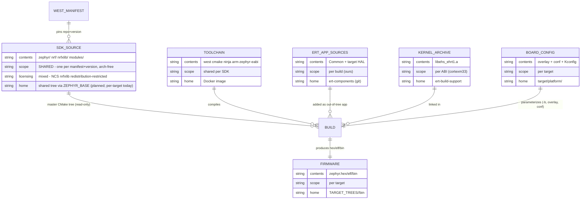

# eRT Porting Guide

This guide is for developers looking to
- Port inxware to new hardware
- Extend functionality 
- Make changes to inxware

>If you are building applications for inxware you don't probably don't need to rebuild inxware for your target. Head over to http://appland.inxware-systems.com to download inxware for your system

> **(Sign up for free and head to the downloads page. Feel free to send us a message if you don't find support for your hardware)**


 The information in this document is for embedded systems engineers porting the inxware runtime (eRT). inxware will run on 1$ MCUs, Arduino boards, Raspberry Pis and bespoke hardware and leverages the best-in-class SDKs, software components and tooling available on a case by case basis.

## Table of Contents

- [Overview & Prerequisites](#overview--prerequisites)
  - [Relevant Reading](#relevant-reading)
    - [Required](#required)
    - [Optional](#optional)
  - [Key Concepts](#key-concepts)
- [Source Tree & Dependencies](#source-tree--dependencies)
  - [Common/ - Cross-Platform Code](#common---cross-platform-code)
  - [target/ - Platform-Specific Code](#target---platform-specific-code)
- [Components (Function Blocks)](#components-function-blocks)
  - [Dependencies](#dependencies)
    - [ert-build-support](#ert-build-support)
    - [ert-contrib-middleware](#ert-contrib-middleware)
    - [EHS-Kernel (Not Published!)](#ehs-kernel-not-published)
- [Build System](#build-system)
  - [Configuration Commands](#configuration-commands)
  - [Building code](#building-code)
    - [Building for the first time](#building-for-the-first-time)
    - [Dependencies Setup](#dependencies-setup)
  - [Runtime Packaging & Image Generations](#runtime-packaging--image-generations)
    - [Deployment QA and Packaging](#deployment-qa-and-packaging)
    - [Platform-Specific Packaging](#platform-specific-packaging)
    - [Development Testing](#development-testing)
- [Make Configuration Variables](#make-configuration-variables)
  - [Hardware & OS Targetting](#hardware--os-targetting)
  - [Component Technology Selection](#component-technology-selection)
  - [Common #defines (Preprocessor Definitions)](#common-defines-preprocessor-definitions)
- [Build System Variables (platform.mk and toolchain.mk)](#build-system-variables-platformmk-and-toolchainmk)
  - [Toolchain Config Variables](#toolchain-config-variables)
  - [Toolchain Modifiers](#toolchain-modifiers)
  - [Build Output Configuration](#build-output-configuration)
  - [Compiler Flags and Switches](#compiler-flags-and-switches)
  - [System Root and Library Paths](#system-root-and-library-paths)
  - [Debug Build Configuration](#debug-build-configuration)
  - [Platform-Specific Variables](#platform-specific-variables)
  - [Environment and Tool Variables](#environment-and-tool-variables)
- [Deployment Utilities](#deployment-utilities)
- [Supported Platforms](#supported-platforms)
  - [SDK and Toolchain Support](#sdk-and-toolchain-support)
- [Platform Porting Guide](#platform-porting-guide)
  - [Porting Overview](#porting-overview)
  - [Platform Configuration Structure](#platform-configuration-structure)
    - [OS Component](#os-component)
    - [ARCH Component](#arch-component)
    - [MIDDLEWARE Component](#middleware-component)
  - [Creating a New Platform](#creating-a-new-platform)
    - [Step 1: Platform Configuration](#step-1-platform-configuration)
    - [Step 2: OS-Architecture Support](#step-2-os-architecture-support)
    - [Step 3: HAL Implementation](#step-3-hal-implementation)
  - [HAL Implementation](#hal-implementation)
    - [Required HAL Functions](#required-hal-functions)
    - [Target-Specific Components](#target-specific-components)
  - [Build Integration](#build-integration)
  - [Validation & Testing](#validation--testing)
- [Component Development](#component-development)
  - [Component Architecture](#component-architecture)
    - [Component Files](#component-files)
  - [Creating New Components](#creating-new-components)
    - [Step 1: Define Component Interface](#step-1-define-component-interface)
    - [Step 2: Implement Component Logic](#step-2-implement-component-logic)
    - [Step 3: Create Visual Representation](#step-3-create-visual-representation)
    - [Step 4: Integration](#step-4-integration)
    - [Step 5: Documentation](#step-5-documentation)
  - [Function Block IDs](#function-block-ids)
  - [Component Categories](#component-categories)
    - [Core Components (`core/`)](#core-components-core)
    - [GUI Components (`gui/`)](#gui-components-gui)
    - [Networking Components (`networking/`)](#networking-components-networking)
    - [Media Components (`media/`)](#media-components-media)
    - [Machine Learning Components (`ml/`)](#machine-learning-components-ml)
    - [Machine Vision Components (`mv/`)](#machine-vision-components-mv)
- [Testing & Continuous Integration](#testing--continuous-integration)
  - [Build Smoke Test Across Multiple Targets](#build-smoke-test-across-multiple-targets)
  - [Unit Testing](#unit-testing)
    - [Test Structure](#test-structure)
    - [Running Unit Tests](#running-unit-tests)
- [Key Platform Technologies](#key-platform-techologies)
  - [GPIO](#gpio)
  - [Flash Memory Support](#flash-memory-support)
- [Graphics / GUI Targets](#graphics--gui-targets)
  - [Widget Rendering Modes: Mode A vs Mode B](#widget-rendering-modes-mode-a-vs-mode-b)
  - [LVGL](#lvgl)
  - [Qt](#qt)
- [Platform-Specific Guides](#platform-specific-guides)
  - [Embedded RTOS](#embedded-rtos)
  - [Windows](#windows)
  - [GNU Linux](#gnu-linux)
  - [Xtensa-ESP32](#xtensa-esp32)
    - [Platform Overview](#platform-overview)
    - [Build Configuration](#build-configuration)
    - [Typical ESP32 flash Partitions](#typical-esp32-flash-partitiosn)
    - [Networking Configuration](#networking-configuration)
    - [Process Priorities](#process-priorities)
    - [Console Access](#console-access)
    - [Documentation References](#documentation-references)
  - [Arduino (Using Arduino SDK)](#arduino-using-arduino-sdk)
    - [Build Process](#build-process)
    - [Flashing](#flashing)
    - [Default Application](#default-application)
    - [Networking](#networking)
    - [Threading](#threading)
    - [MQTT Support](#mqtt-support)
    - [TLS/SSL Support](#tlsssl-support)
    - [Build and Deploy Process](#build-and-deploy-process)
    - [Platform-Specific Boards](#platform-specific-boards)
    - [Limitations and Considerations](#limitations-and-considerations)
    - [Troubleshooting](#troubleshooting)
  - [Android](#android)
    - [Platform Overview](#platform-overview-1)
    - [Platform Configurations](#platform-configurations)
    - [Product-Specific Configuration](#product-specific-configuration)
    - [Android Supervisor System](#android-supervisor-system)
    - [DevMan Update Scripts](#devman-update-scripts)
    - [Android OS Version Support](#android-os-version-support)
    - [APK Building and Packaging](#apk-building-and-packaging)
      - [Downloader APK](#downloader-apk)
      - [Certificate Management](#certificate-management)
    - [Build and Upload Process](#build-and-upload-process)
    - [Known Issues and Limitations](#known-issues-and-limitations)
  - [Raspberry Pi](#raspberry-pi)
    - [GPIO Control Libraries](#gpio-control-libraries)
    - [Hardware PWM Control](#hardware-pwm-control)
    - [Platform Integration](#platform-integration)
    - [Recommended Approach](#recommended-approach)
    - [Platform.IO Integration](#platformio-integration)
  - [MCU SDKs](#mcu-sdks)
    - [Supported MCU Platforms](#supported-mcu-platforms)
    - [NXP Implementation Notes](#nxp-implementation-notes)
    - [FreeRTOS Integration](#freertos-integration)
    - [Build Integration](#build-integration-1)
    - [MQTT Support (NXP Example)](#mqtt-support-nxp-example)
    - [Debug and Development](#debug-and-development)
    - [MCU SDK Documentation](#mcu-sdk-documentation)
- [Advanced Topics](#advanced-topics)
  - [Debug Logging](#debug-logging)
    - [Architecture & Approach](#architecture--approach)
    - [Modules](#modules)
    - [Log Levels](#log-levels)
    - [Logging Macros](#logging-macros)
    - [Common Failure Modes](#common-failure-modes--what-happens-when-this-isnt-configured-correctly)
    - [Build-Time Configuration](#build-time-configuration)
    - [What Each Build-Time Option Actually Does To The Build](#what-each-build-time-option-actually-does-to-the-build)
    - [Target-Specific Output Path](#target-specific-output-path-ehsstdioprintf--ehsconsoleprintf)
    - [Does Enabling Logging Need A Bigger Thread Stack?](#does-enabling-logging-need-a-bigger-thread-stack)
    - [Case Study: Five Bugs, One "It's Still Not Working"](#case-study-five-bugs-one-its-still-not-working-2026-08)
  - [Network Security](#network-security)
    - [DevMan TLS Security](#devman-tls-security)
    - [MQTT Security Implementation](#mqtt-security-implementation)
    - [Certificate Management](#certificate-management-1)
  - [Process Priorities](#process-priorities-1)
    - [Core Process Priorities](#core-process-priorities)
    - [Platform-Specific Considerations](#platform-specific-considerations)
    - [Configuration](#configuration)
  - [Web Assembly](#web-assembly)
    - [WASM Feasibility for eRT](#wasm-feasibility-for-ert)
    - [Implementation Approach](#implementation-approach)
    - [Networking Limitations](#networking-limitations)
    - [Potential Solutions](#potential-solutions)
    - [Development Considerations](#development-considerations)
    - [Conclusion](#conclusion)
- [Troubleshooting](#troubleshooting-1)
  - [Platform wont build](#platform-wont-build)
  - [Flashing over serial](#flashing-over-serial)
  - [Toolbox functions for](#toolbox-functions-for)
  - [stubbed functionality on some devices](#stubbed-functionality-on-some-devices)
- [Glossary](#glossary)

---

## Overview & Prerequisites

The **ert-components** repository contains the core components needed for the inxware eRT system. eRT is designed to run no-code applications on embedded devices and various computing systems including servers, edge compute, and desktop platforms. Device firmware and OS applications are built in **ert-components**.

Build dependencies may also require git-lfs repos **ert-build-support**, **ert-contrib-middleware**, **DevmanSecurity**, **apps**.

>### Tech Stack
>
### Relevant Reading

- `./about-inxware.md`
- `./ert-build-guide.md`
- https://www.inxware.io
- https://appland.inxware.io


### Key Concepts
inxware short-circuits the considerable overhaeds of working with embedded software when using Lucid, but we also make every effort to make working with embedded software when engineers need to. We do this with the following approach:

>- **Simple** GNU `make` combined with Managed Docker environments 
>- Cross compilation for **all targets** on any linux or WSL
>- Uses `git` and `git-lfs` to **manage dependencies** or provide by **Docker**
>- inxware **components APIs** are uniform across all targets, but may have varying capabilities
>- inxware is natively **event driven**, but approaches the speed of C/C++

# Source Tree & Dependencies

The `ert-components` source-tree can build some targets* without any further dependencies, using host toolchains or toolchains installed into socker images.
However most targets use toolchains, SDKs and contributed open source software that may need to be built from source or provided in a non-standard format.
There are 2 dependency repositories to support more complex builds:
> 1. `ert-build-support` : Provides toolchains and build utilities. 
> 1. `ert-contrib-middleware` : Provides headers and libs contributing technologies

Optional repositories for building production systems include no-code apps (developed with inxware Lucid) and DevmanSecurity that provides keys and certiicates that need to be built into products.

The overall build process can be as simple as 
```bash
./configure <your product config file>
make all_docker
```
or more steps can be includes to package and deploy binaries. 
>## Build Process Flow
>

The **ert-components** repository contains the core components needed for the inxware eRT system.
## [`ert-components.git`](https://github.com/inxware/ert-components)
This repos contains all the source for inxware except for dependencies, toolchains and the ehs kernel library. The ehs kernel is maintained in the build support repository along with toolchains and core dependencies such as libc, lbc++, libgcc etc. 

>### `./Common/` (For all targets)
>- **`Components/`** - Common portion of all component implementations
>  - **`core/`** - Primitive event and data processing components
>  - **`gui/`** - Graphics and UI components (supported by layout tools)
>  - **`networking/`** - Networking components (e.g. HTTP, MQTT, sockets, ...)
>  - **`media/`** - Audio/video processing components
>  - **`ml/`** - Machine Learning (time series, image, LLMs)
>  - **`mv/`** - Machine Vision & Image Processing
>- **`HAL/`** - Hardware Abstraction Layer
>  - **`<...>/`** - SDK/OS independent abstraction for various technologies
>- **`KAPI/`** - inxware Kernel APIs
>- **`Ehs/`** - EHS Kernel console implementation

All the code in `./Common/` is 100% cross platform. LibC functions and data types are abstracted to enable remapping to out-of-band SDKs.  

>### `./target/` - (Target specific code)
>- **`platform/`** - Target configuration for specific inxware platform products
>  - **`<...>/`** - contains a `config.mk` that defines details of each product
>  - **`os-arch/`** - OS and hardware architecture specific code
>  - **`<...>/`** - contains source and `toolchain.mk`, `target.mk` and default `config.mk` build files
>  - **`envtree/`** - Runtime environment assets and target executable scripts
>  - **`Component-HAL/`** - Hardware abstraction components
>  - **`<...>/`** - Technology dependent abstraction to support 

function block implementations
SDK/OS specific source code and build scripts:

## External Dependencies

External dependencies rarely need to be rebuilt because the binary and headers are exported to canonical build system directories, checked into the repos, that are located from the ert-components build system when a project is properly confifured.

> NOTE: The dependency repos contain binary data and are hosted with **git-lfs** support.It is recommended that these repos are cloned with **`--depth=1`**.


The following repositories satisfy ert-components builds where containers are not the preferred environment to save dependencies. 

### [`ert-build-support.git`](https://github.com/inxware/ert-build-support)
This is a mandatory repository containing inxware EHS kernels, toolchains, packaging and flashing utilities. Many targets can be built with toolchains and SDK dependencies provided in standard linux distros and may be completely sourced from the Dockerhub published containers.

The key directories used in `ert-build support` are:

>### `./toolchains/`
> - **`x86_64/`** toolchains that run 64 bit build machines
> - **`i686/`** - toolchains that run on 32bit build machines.
> - **`inx-build-scripts/`** - scripts for building toolchains (!!!!).

>### `./support_libs/`
> - **`target_libs/`** - libc libs and headers can be used as `sysroot` if compiler is lacking.
> - **`target_libs/*/kernel/libehs.a`** - EHS kernels supporting ASCII format SODL.
> - **`target_libs/*/kernel/libert1.a`** - EHS kernel supporting binary format SODL.
> - **`contrib/`** contributed source-code (Usually just out-of-band libc)
> - **`inx-build-scripts/`** - scripts for building toolchains and libc (!!!!).

You almost certainly weill never need to resort to building your own libc, but if you do then the scripts may help. ehs-kernels for parsing both EHS0 and ERT1 format SODL files from lucid are provided by inx. These kernels have no IO dependency and are optimised for all major CPU architectures.

### [`ert-contrib-middleware.git`](https://github.com/inxware/ert-contri-middleware)
Optional repository providing canonical paths to 3rd-party libraries and headers for middleware packages that are typically built with their own environments. Usually includes source code and build scripts using toolchains in ert-build-support or docker environments.

>#### `./target_libs/${EHS_GNU_OS_ARCH}${COMPONENT_VARIANT}-${TOOLCHAIN_NAME}`*
> - **`x86_64/`** toolchains that run 64 bit build machines
> - **`i686/`** - toolchains that run on 32bit build machines.
> - **`inx-build-scripts/`** - scripts for building toolchains (!!!!).

>*Note the middleware build-path path can be further specialised with additional make system variables if they are set in `config.mk` or `target.mk`: 
>```make
>./target_libs/$(EHS_GNU_OS_ARCH)_$(COMPONENT_VARIANT)-$(TOOLCHAIN_NAME)`
>```

## Build Processes

inxware can be built and tested on github's CI system, however it is recommended to install the repos locally for significant development work.

A quick guide to building ert-components locally is provided in [ert-build-guide.md](./ert-build-guide.md), but a more in-depth view of the inxware build system is provided here for adventurous hacker, technology provider or integration engineer.

The eRT build system uses a simple but comprehensive GNU-Make environment that allows detailed configuration with sensible defaults for each type of target. inxware favours build consistency over fragile automatic configuration guessing.

The inxware eRT build configuration system allows different types of dependencies to be explicitly selected from known sources and suports building subsets of functionality within toolboxes for different types of products.

### Choosing an SDK Integration Method

Before porting to a new target or adding a new toolchain, decide how the compiler and SDK will be delivered to the build. There are three methods, listed in preference order:

---

#### Method 1 — Docker-hosted toolchain (preferred)

The compiler, SDK, and any required system libraries live **inside a Docker image**. The build runs in a container; the host machine needs only Docker and `make`.

Set `TOOLCHAIN_NAME=HOST` in `config.mk` — the toolchain is on `$PATH` inside the container.

**Use this when:** the toolchain or SDK is freely redistributable (open source, vendor-published), or when it is proprietary but can be installed inside a private image using the vendor's installer.

| Image type             | How to get it                                                                      | When to use                                          |
| ---------------------- | ---------------------------------------------------------------------------------- | ---------------------------------------------------- |
| Public Docker Hub      | `docker pull inxware/<image>` or `ghcr.io/…` — automatic on `make all_docker`      | Open-source or freely redistributable toolchain      |
| Private — locally built | `make build_docker_local` — builds from the platform's `Dockerfile` using `build_docker_pre.sh` to gather credentials | Licensed / proprietary SDK that cannot be redistributed (QNX, XMOS) |

The `build_docker_pre.sh` hook (sourced automatically by `make build_docker_local`) prompts for credentials interactively if they are not in the environment, then forwards them to `docker build` as BuildKit secrets — they are never stored in the image.

---

#### Method 2 — ert-build-support toolchain

The compiler binaries are checked into the `ert-build-support` git-lfs repository under `toolchains/<host-arch>/<TOOLCHAIN_NAME>/`. Set `TOOLCHAIN_NAME=<name>` in `config.mk`; `platform.mk` constructs the full path automatically.

**Use this when:** the toolchain is redistributable (or distributable within the team) and you want it version-controlled alongside the source — useful for older or vendor-specific toolchains where no Docker image exists, or where licensing allows private distribution but not a public registry.

A Docker image can optionally still be used for the OS environment (apt packages, system libs) while the compiler itself comes from ert-build-support.

---

#### Method 3 — Custom host-installed (`/opt/` or system PATH)

The SDK is installed by the developer on the build machine (e.g. by running a vendor installer to `/opt/<sdk>/`) and is accessed via `TOOLCHAIN_NAME=HOST` with tools on the host `$PATH`, or via an explicit path variable in `config.mk`.

**Use this when:** the SDK has per-machine licence activation that prevents containerisation, or when Docker is not available. This method produces hard-to-reproduce builds and per-developer SOPs — avoid it for anything that will be built by more than one person, and prefer Method 1 with a private image instead.

---

#### Method comparison

| Factor                       | Method 1 — Docker    | Method 2 — ert-build-support      | Method 3 — Host install             |
| ---------------------------- | -------------------- | --------------------------------- | ----------------------------------- |
| Reproducibility              | ✅ High               | ✅ High (version-controlled)       | ⚠️ Developer-dependent              |
| CI/CD friendly               | ✅ Yes                | ✅ Yes                             | ⚠️ Requires pre-configured agents   |
| Proprietary SDK support      | ✅ Private image      | ✅ If distributable in team        | ✅                                   |
| First-time setup effort      | Low (pull or `make build_docker_local`) | Medium (clone ert-build-support with git-lfs) | High (manual installer + PATH)      |
| Recommended for new targets  | ✅ **Yes**            | Only if Docker is not viable      | Last resort                         |

---

#### SDK integration method by `os-arch`

| `os-arch`                      | Method                     | Docker image                                     | SDK / toolchain                        | Notes                                                       |
| ------------------------------ | -------------------------- | ------------------------------------------------ | -------------------------------------- | ----------------------------------------------------------- |
| `linux-amd64`                  | 1 — Docker (public)        | `inxware/inx-debian*` / `inxware/ubuntu*`        | Clang or GCC (HOST in image)           | Native amd64 compile                                        |
| `linux-x86`                    | 1 — Docker (public)        | `inxware/ubuntu18-build-essential`               | GCC (HOST in image)                    | 32-bit x86                                                  |
| `linux-arm64`                  | 1 — Docker (public)        | `inxware/inx-debian12-clang-arm-qt` etc.         | Clang cross-compiler (HOST in image)   | ARM64 cross-compile from x86_64 host                        |
| `linux-arm`                    | 2 — ert-build-support      | (none)                                           | `arm-none-linux-gnueabi-4.4.6`         | Legacy 32-bit ARM; toolchain in ert-build-support           |
| `linux-android-arm`            | 1 — Docker (public)        | `inxware/ubuntu22.04-build-essential`            | Android NDK (in image)                 | NDK is freely redistributable                               |
| `zephyr-arm`                   | 1 — Docker (public)        | `ghcr.io/zephyrproject-rtos/ci:v0.27.4`          | arm-zephyr-eabi (in image)             | Official Zephyr CI image; also west + full SDK              |
| `esp32_freertos-xtensa`        | 1 — Docker (public)        | `inxware/esp32_ubuntu22.04-build-essential`      | ESP-IDF + Xtensa GCC (in image)        | IDF is Apache 2.0 licensed                                  |
| `esp32s3_freertos-xtensa`      | 1 + 2                      | `inxware/esp32s3_ubuntu22.04-build-essential`    | HOST or `xtensa-esp32s3-elf-5.1`       | Some platforms override to ert-build-support toolchain      |
| `arduino-arm_mbednano`         | 1 — Docker (public)        | `inxware/inx-arduino`                            | Arduino MBED toolchain (in image)      |                                                             |
| `nxp-redlib-freertos-arm`      | 2 — ert-build-support      | (none)                                           | `arm-nxp`                              | NXP MCU SDK; no Docker; toolchain in ert-build-support      |
| `mingw-x86`                    | 1 — Docker (public)        | `inxware/ubuntu22.04-build-essential-mingw`      | MinGW-w64 (HOST in image)              | Cross-compile for Windows from Linux                        |
| `xcore_freertos-xcore`         | 1 — Docker (private)       | `inxware/xcore_ubuntu22.04-xtc-tools`            | XMOS XTC Tools 15.x (in image)         | Proprietary; private image, `make build_docker_local`. Two-phase build (Phase 1 archive → Phase 2 `.xe` link via xcommon_cmake). See [`docs/llm-dev-contexts/CLAUDE-xcore.md`](llm-dev-contexts/CLAUDE-xcore.md) |
| `qnx-arm64`                    | 1 — Docker (private)       | `inxware/qnx800-arm64:local`                     | QNX SDP 8.0 (installed in image)       | Licensed; BuildKit secrets via `build_docker_pre.sh`        |

---

### The inxware build process may involve one or more of the following steps depending on the novelty of the target being built for with respect to existing target support:

* Creating a new docker environment to run the build tools and provide library dependencies.
* Creating basic support for a new operating system or silicon architecture.
* Building open source (or proprietary) third-party contributed dependencies in their respective build environments for linking with eRT.
* Creating a new specific variant of a platform (e.g. with different configuration or specific additional features, default applications etc.).

### Passing environment variables into the Docker container

Docker containers do **not** automatically inherit the host shell or Make environment. Any Make or bash variable that the build needs inside the container must be explicitly listed in the `INX_ERTCOMPONENTS_BUILDENV` string inside:

```
target/envbuildscripts/target_buildenv_run_command.sh
```

Each entry is passed as `-e VARIABLE_NAME` in the `docker run` invocation. When adding a new platform or toolchain that requires an additional variable (for example a licence path, SDK root directory, or board selection flag), add it to that list — otherwise the build will silently see an empty value for that variable inside the container.

Variables set directly in the platform `Dockerfile` with the `ENV` directive are baked into the image at `make build_docker_local` time and are always available inside the container without needing an entry in `INX_ERTCOMPONENTS_BUILDENV`.

The most frequent use-case is rebuilding an already configured target platform, wich will be described first in the next section:

### Getting inxware

Git is required to get inxware and also used during the build process to help maintain dependencies. It is also strongly recommended to install Docker on your system unless you are planning to install toolchains for the targets toy want to build on your host machine.
```bash 
#install docker on a debian/Ubunti/WSL system:
sudo apt install git docker
# you will need to have upload your ssh keys to git hub   
```
inxware builds can be started as soon as the basic repositories are in place. This can be achieved by first cloning ert-components into a (preferably) empty directory and then runnging a make command to pull the remaining dependencies.

```bash
# get ert-components from inxware/github
git clone git@github.com:inxware/ert-components.git
./configure linux_x86_64_lvgl_debian11-debug     
make prepdeps
# hang on - this may take a few minutes
```

### Build Configuration Utilities
Builds usually start with configuring the system for an existing target or creating a new one.

```bash
./configure                       # List available platform targets
./configure [existing-target]     # Set build to a specific platform
./configure -edit                 # View and edit current target
./configure -new [another-target] # Create and edit a new target  
make clean                        # Recommended when changing configs.
```

### Building Binaries
Afer selecting a target with `configure` you are ready to build!

#### First time build
```bash
make prepdeps        # You can run this again to get latest dependency updates
make all_docker      # Build code using the configured docker environment
make targetenv       # Add any resources, assets and default Lucid apps to the build
```
When a target is built for the first time a staging directory is created
```bash
../TARGET_TREE/ehs_env-$TARGET/
```
You built binaries are copied into `./bin` within the target's staging directory. The staging directory is used to allow visibility of deployed assets in their runtime form before package and image generation. Typically this directory will be used by following packaging commands directly, but you will find binaries typically copied to a `/bin/` directory in the staging area. 

>Note a staging directory is created for each configured target and you can switch between targets without clobbering previously configured packages. **However the object files created in the build located in the root of the source tree and should be cleaned when switching configs**
Have a look around at the other make commands that do much more than just compile source code.

#### Exploring inxware's make utilities.
ert-components uses a simple ```Makefile``` in the root of the source tree, which will conditionally select many *.mk files distrubuted throught the code base that support building software components and hardware abstractions.

The approach is kept deliberatly simple to ensure repeatability and visibility of the build process without exposing developers to worst issues normally encounted in cross-compiling build environments. 

The `make` commands is also used to run various build system utilities including dependency diagnostics, release versioning, and package deployment automation.

```bash
make help                     # Show all available build targets and options

******************************************************************************************************************************
*                                 MAKE HELP FOR inxware runtime software
* Make Targets in order of usual execution:
* 
* prepdeps           - Checksout dependencies git (unless SKIP_REPOS=yes)
* all                - makes ehs_esp32s3_freertos-xtensa-hrdcv2B-inx-devman-debug.exe and copied TARGETENV bin as ehs.exe 
* targetenv          - Creates the target runtime file structure in the staging directory ../TAREGET_TREES/
*                        - use make targetenv HOST_OS_CONFIG_SCRIPTS_EXTRA="XXX-ABCD YYY-EFGH"  to include additional OS config
* targetenv_package  - Creates the target runtime package using the installer method speficied by the platform/config.mk
* ---------------------------------------------------------------------------------------------------------------------------
* BUILD Diagnostics:
* chkconfig            - Shows the current key config parameters implied by the platform/<TARGET>config.mk
* compare_kernelconfig - Compares  platform/<TARGET>/config.mk with the one in ../EHS-kernel/targete/platform/<OS ARCH VERSION>/
* chk_ext_deps         - Shows the external dependencies met or unmet for the platform configuration
* depend                        - !!WARNING!! this updated the source level dependencies and update the deps.mk make files
* ---------------------------------------------------------------------------------------------------------------------------
* all_docker           - Makes any target with Dockerimagename file (or defaults to building the host)
* publish_docker_image - Build new docker image and publish it to inxware dockerhub organization
* target_buildenv      - Start the platforms DOCKER environment shell.  Useful during build system tuning.
* targetenv_version    - Create a new version number for the target. Note this will check in all changes and create a tagged commit
* targetenv_cleanall   - Removes ALL data and directories from ../TARGET_TREES/ehs_env-esp32s3_freertos-xtensa-hrdcv2B-inx-devman-debug
* targetenv_cleancfg   - Removes all user data from the TARGETENV tree for deployment.
*                      - Set env variable KEEP_USERCONFIG=yes to keep the userdata/configuration data in tact.
*                      - Set env variable KEEP_DEVMANCONFIG=yes to keep the devman servers in tact.
*                      - Set env variable KEEP_APPLICATION=yes to keep the appdata in tact.
* targetenv_makeprod   - Configures the runtime with standard INX apps and devman configuration. Cleans existing config first! 
* targetenv_deb        - Creates a debian installer for current tree (targetted at /opt/ehs). optional: UPLOAD=<deb repo URL>
* targetenv_apk        - Builds android APK and stores it in ../TARGET_TREES/
* targetenv_apk_docker - Builds android APK and stores it in ../TARGET_TREES/ in an android arm configured docker image.
* targetenv_unity_export - Exports Unity 3D IDE (C#) based project to eRT compatible project/exe e.g. eRT Android Studio project or Windows app with eRT plugin.
* targetenv_unity_export_docker - Same as above but in docker.
* targetenv_esp32      - Builds an esp32 (or esp32s3,...) bootable image for deployment via usb or OTA
* targetenv_esp32_docker    - runs make targetenv_esp32X in an esp32X configured docker image.
* targetenv_nsis_docker - Builds a windows installer using the NSIS installer
* targetenv_upload_appland - Uploads target to the appland alongside all of its documentation. optional: ASSETS_ONLY=yes
* targetenv_upload_ota - Uploads OTA package to Devman server. optional: SERVER_OVERRIDE=<user@url> server destination override
* upload_ehs_via_adb   - Uploads apks to the connected (or IP mapped) android device via adb. optional: ADB_IP=<device ip>
* upload_ehs_deb       - Uploads the debian package created targetenv_deb. Set  UPLOAD=<deb repo URL>
* targetenv_android_dep_pack - Bundles eRT android supplementary apps, supervisor into Devman uploadable packages (no APKs are built).
* upload_ehs_sys_patch - Uploads TARGETENV tree package (Linux and Android only - FREERTOS fimrware images too?) to a Devman server
*                      - Use VERSION_NAME=[your version name] to give the build a special name.
*                      - e.g. make DEVMANSERVER=[your.url.com] DEVMANUID=[your username] upload_ehs_sys_patch.
*                      - If the patch requires a server reboot (i.e. because it has a new start-upo script) then
*                        set an additional variable SYSPATCH_NEED_REBOOT=yes on the command line.
*                        (KEEP_USERCONFIG=yes & KEEP_APPLICATION=yes can also be used here as described above).
*                      - No arguments are required for ANDROID builds. These are deployed to devices using update-to-latest-xxxxx-android
* upload_server2server_OS_Update - This will install an update to the host server DEVMAN_INTERMEDIATE_SERVER=[your.url.com] that can be deployed to a slave
*                             - (e.g. fire-walled) devman instance. One deployed from the host server the packages will become the OS 
*                             - update patches on the final distation. You may also set DEVMAN_INTERMEDIATE_UNAME & DEVMAN_INTERMEDIATE_SSHPORT
* toolsenv_update      - Updates the dist directory's IDF and CDF directories with this EHS's version component description files
* static_analysis      - runs rhe static analyser suite on the full source code tree for all configurations.
* targetenv_run_tests  - Runs all regression tests.
```

For the first time build all necessary dependencies can be downloaded using
```bash
 make prepdeps
```
which will clone binary dependency repos  (ert-build-support and ert-contrib-middleware), and optioanlly the no-code inxware-lucid apps from apps.git. 
The build system requiresthese repositories to be cloned side-by-sdie. These repositories can consume more than ~40GB disk space unless `--depth=1` clones are used.
These repose can also be updated and maintained using standard git commands. e.g. the build support repo can be downloaded without any history with 
```bash
cd .. # move up one directory from ert-components
git clone --depth=1 git@REPOURL/ert-build-support.git
```

After running `make prepdeps` or manually cloneing, each repository should be checked out side-by-side to `ert-components` i.e.

>- `ert-components`         - Build system is built here
>- `ert-build-support`      -> toolchains and SDKs
>- `ert-contrib-middleware` -> pre-built 3rd party dependencies (and source trees)
>- `apps`                   -> pre-installed Lucid apps/home.

For IoT applications using Devman the following private repo may also be required:
>- `DevmanSecurity` - Certificates & keys.


### Runtime Packaging & Image Generations

#### Deployment QA and Packaging 
```bash
make targetenv               # Create runtime file structure in staging directory
make targetenv_version       # Create new version and tag commit
make targetenv_package       # Create target-specific package
make targetenv_run_tests     # Run regression tests for this configuration on the host
```

See also the multi-plafform build regression scripts in section **Build Smoke Test Across Multiple Targets**

#### Platform-Specific Packaging
```bash
make targetenv_deb           # Create Debian package (Linux targets)
make targetenv_apk           # Create Android APK
make targetenv_esp32         # Build ESP32 firmware image
```

#### Development Testing

```bash
./configure -run             # Run the target on current host
./configure -debug           # Debug the target on the host with GDB
```
## Code Conventions
For historic reasons functions and data in ert-compoents are prefixed with the following inx-specific strings:

`EHS_` - used for C reprocessor macro constant values and make variables.

`ehs_` - used for typedefs (see later)
`Ehs` - prefixes all libc and  1:1 mapped standard calls.
`EhsH` - Prefix for Common inxware-specific Hal functions & utilities.
`EhsT` - Prefix for target spefific abstractions that are implemented under the `./target` path, including ./`target/Component-HAL`


### Callback Pattern for Async Events

When HAL needs to trigger InternalPorts from ISR/threads:
1. HAL calls glue callback with event data
2. Glue stores data in component state structure
3. Glue calls InternalPort function (e.g., `EhsRunble_service_on_connect()`)
4. InternalPort reads from state, populates output ports
5. InternalPort triggers finish event

This pattern keeps EHS FB macros out of platform code while enabling async event handling.


## Make Configuration Variables

The following table lists all make variables available in config.mk files across platform configurations. These variables control various aspects of the build system, target capabilities, and runtime behavior.

**BOLD** entries are typically mandatory and others optional (or default to EHS_ARCH/EHS_OS values.)

### Hardware & OS Targetting.

| Variable Name           | Possible Values                                       | Description                                                             |
| ----------------------- | ----------------------------------------------------- | ----------------------------------------------------------------------- |
| **EHS_ARCH**            | arm, arm64, x86, amd64, xtensa, arm_mbednano          | Target CPU architecture                                                 |
| **EHS_OS**              | linux, win32, esp32s3_freertos, android, arduino,     | Target operating system                                                 |
| EHS_GNU_ARCH            | x86_64, i686-pc, arm, arm64, aarch64                  | GNU-specific architecture (overrides the ../ert-middleware/ path)       |
| EHS_GNU_OS              | linux-gnu, win32-msvc, linux-android                  | GNU-specific OS (overrides the ../ert-middleware/ path)                 |
| EHS_TARGET_LIB_VARIANT  | -clang10_clang10, -4.4.6, ...                         | Specific GNU toolchain (forms part of the ../ert-middleware/ path)      |
| TOOLCHAIN_NAME          | HOST, arm-none-eabi, xtensa-esp32s3-elf-5.1, ...      | Toolchain identifier                                                    |
| EHS_TOOLCHAIN_TYPE      | clang, gcc                                            | Compiler type. Defaults to gcc                                          |
| ERT_SODL_VERSION        | 1, 2                                                  | eRT SODL (Service Oriented Dynamic Linking) version                     |
| EHS_HOST_DEBIAN_BUILD   | yes, empty                                            | Whether this is a host Debian build                                     |
| CC_OVERRIDE             | compiler executable name                              | Override C compiler executable name                                     |
| LINK_OVERRIDE           | linker executable name                                | Override linker executable name                                         |
| COMPONENT_VARIANT       | gtk_gst, base, sdl2-ffmpeg, gtk_gst-no-gstlibs        | choose a different ../ert-contrib-middleware/target_libs/ path          |
| CC_SWITCHES             | compiler flags                                        | Additional C compiler switches                                          |
| KERNEL_VERSION          | linux/2.6.35.9, linux/4.9                             | Optional Kernel version in case components build again kernel headers.  |
| EHS_DEBUGALL            | yes, true, (empty)                                    | Enable all debug features, including all console logging                |

### Configuration variable conventions (`yes` / `none` / named implementation)

eRT configuration variables follow a three-form convention so that intent is always visible in `config.mk`:

| Form                                | Meaning                                                                                  | Example                                  |
| ----------------------------------- | ---------------------------------------------------------------------------------------- | ---------------------------------------- |
| `EHS_FOO=yes`                       | Feature is enabled. Use this when there is exactly one possible implementation.          | `EHS_RUNTIME_LOGGER_ENABLED=yes`         |
| `EHS_FOO=<implementation_name>`     | Feature is enabled and this is *which* implementation to use. The string usually selects a HAL subdirectory or strategy. | `EHS_GUI_SUPPORT=lvgl`, `EHS_DEVMAN_SUPPORT=mqtt`, `EHS_LORAWAN_SUPPORT=rak3112` |
| `EHS_FOO=none`                      | Feature is **explicitly disabled**. This is the canonical "off" form — preferred over `=no` or leaving the variable empty, because `=none` makes the intent searchable and unambiguous in code review. | `EHS_DEVMAN_SUPPORT=none`, `EHS_TARGET_APPLOAD_RESTARTING_REBOOT=none` |

**Why `=none` and not just commenting out:** make variables are inherited from `included` parent configs (e.g. `base_n8r8/config.mk`). Commenting out a line in a child config does **not** override the parent's value — the inherited setting survives untouched. The only ways to override are to reassign the variable to a different value (use `=none` if you want it off) or `undefine` it. Always assume any flag your platform doesn't explicitly want enabled may have been turned on by a baseline config you `include`.

**A platform's `config.mk` should be readable as a delta from its baseline.** Every line is either reaffirming or overriding something the parent set — `=none` is how you declare "I have considered this and turned it off."

**Authoring a new variable:** test against the named value, not `ifdef`. Use `ifeq ($(EHS_FOO),yes)` or `ifeq ($(EHS_FOO),mqtt)` (or `ifneq ($(EHS_FOO),none)` for "anything but off") rather than `ifdef EHS_FOO`. `ifdef` treats `=none` as defined-and-true, which defeats the convention. The runtime-logger flag in `Common/Ehs/ehs.mk:109` (`ifeq ($(EHS_TARGET_APPLOAD_RESTARTING_REBOOT),yes)`) is a good model.

The table below was written under historical conventions and mixes `no` / `none` / leaves the disable form unstated. Treat any "no" entry as equivalent to "use `=none` from now on" and prefer the three-form pattern above for new variables.

### Component Technology Selection
The following paramters determin what component and HAL technologies are used.

**Disable form:** all rows below use `none` as the canonical "off" value (per § "Configuration variable conventions"). Where a row's "Possible Values" column lists `stubbed`, `none-curl`, etc., that's a *named implementation* (often a no-op backend) and is the right form for that variable's selection model — `=none` would still be wrong there because the variable selects an implementation, not a yes/no toggle. Numeric flags (`0`/`1`) and ad-hoc forms (`y`, `--no-autostart`) are pre-convention historical and should migrate to `yes`/`none` when next touched.

| Variable Name                            | Possible Values                                       | Description                                  |
| ---------------------------------------- | ----------------------------------------------------- | -------------------------------------------- |
| EHS_RUNTIME_LOGGER_ENABLED               | yes, none                                             | Enable runtime logging                       |
| EHS_NETWORKING_SUPPORT                   | all, none                                             | Enable networking support                    |
| EHS_COMPONENT_NETWORKING_SUPPORT         | all, no-curl                                          | Enable network components                    |
| EHS_NETWORK_WIFI_SUPPORT                 | yes, none                                             | Wi-Fi station support                        |
| EHS_NETWORK_BLE_SUPPORT                  | nimble, none                                          | BLE stack selection                          |
| EHS_NETWORK_ETHERNET_SUPPORT             | yes, none                                             | Ethernet support                             |
| EHS_DEVMAN_SUPPORT                       | mqtt, curl, stubbed, none                             | Device management transport                  |
| EHS_GUI_SUPPORT                          | gtk, framebuffer, OpenGLE1_1, gdi, lvgl, qt, stubbed, none | Graphics/UI backend                       |
| EHS_AV_SUPPORT                           | gst, gst10, vlc, android, devmanonly, none            | Audio/video support type                     |
| EHS_MEDIA_SUPPORT                        | all, none                                             | Media processing support                     |
| EHS_VIDEO_SUPPORT                        | yes, none                                             | Video rendering support                      |
| EHS_PERIPHERAL_DEVICE_SUPPORT            | all, none                                             | Peripheral device support                    |
| EHS_PERIPHERALS_GPIO_SUPPORT             | stubbed, NXP_K64, sysfs_linux_arm, arduino, ESP32_IDF, none | GPIO HAL implementation                |
| EHS_PERIPHERALS_ADC_DAC_SUPPORT          | SPI_A6_LTC241X, arduino, ESP32S3_IDF, stubbed, none   | ADC/DAC HAL implementation                   |
| EHS_PERIPHERALS_ADC_CONTINUOUS_SUPPORT   | arduino, none                                         | Continuous ADC support                       |
| EHS_PERIPHERALS_PWM_SUPPORT              | esp32, arduino, none                                  | PWM HAL implementation                       |
| EHS_PERIPHERALS_LED_SUPPORT              | arduino_nina, none                                    | LED HAL implementation                       |
| EHS_PERIPHERALS_ACCEL_GYRO_SUPPORT       | arduino, stubbed, none                                | Accelerometer/gyroscope support              |
| EHS_PERIPHERALS_BACKLIGHT_SUPPORT        | esp32s3, stubbed, none                                | Backlight control support                    |
| EHS_MQTT_SUPPORT                         | esp_mqtt, lwip_nxp, aws_green_grass, arduino, none    | MQTT protocol support                        |
| EHS_COMMS_API_SUPPORT                    | arduino_nina, none                                    | Communications API support                   |
| EHS_LORAWAN_SUPPORT                      | wio_e5, rak3112, stubbed, none                        | LoRaWAN modem backend                        |
| EHS_MODBUS_SUPPORT                       | yes, none                                             | Modbus protocol support                      |
| EHS_UART_SUPPORT                         | yes, none                                             | UART communication support                   |
| EHS_SERIAL_CONSOLE_SUPPORT               | yes, none                                             | Interactive serial console                   |
| EHS_OTA_SUPPORT                          | yes, stubbed, none                                    | Over-the-air update support                  |
| EHS_PID_SUPPORT                          | esp32, stubbed, none                                  | PID controller support                       |
| EHS_SCHEDULER_SUPPORT                    | 1, 0                                                  | Task scheduler support (legacy 0/1 — migrate to yes/none) |
| EHS_WATCHDOG_SUPPORT                     | ESP32S3, stubbed, none                                | Watchdog HAL implementation                  |
| EHS_ML_SUPPORT                           | tensorflow-lite, stubbed, none                        | Machine learning support                     |
| EHS_MV_SUPPORT                           | opencv, stubbed, none                                 | Machine vision support                       |
| EHS_CONFIGS_SUPPORT                      | yes, none                                             | Configuration file support                   |
| EHS_FILESYSTEM_SUPPORT                   | yes, stubbed, none                                    | Filesystem support                           |
| EHS_MEMORY_MANAGMENT                     | yes, none                                             | Memory management type                       |
| EHS_COMPONENTS_CONSOLE_IO                | yes, none                                             | Console I/O components                       |
| EHS_COMPONENTS_NETWORK_TCPIP_SOCKET      | yes, none                                             | TCP/IP socket components                     |
| EHS_COMPONENTS_NETWORK_URL_GET           | none                                                  | URL GET components                           |
| EHS_COMPONENTS_NETWORK_DEVMAN_PLAYER     | none                                                  | Device management player components          |
| EHS_COMPONENTS_NETWORK_CONFIG_SUPPORT    | none                                                  | Network configuration components             |
| EHS_DEBUG_TCPIP_CONSOLE                  | yes, stubbed, none                                    | Lucid TCP/IP debug console                   |
| EHS_TARGET_APPLOAD_RESTARTING_REBOOT     | yes, none                                             | Reboot device on app reload (vs in-place)    |
| EHS_TOOLKIT_DEPRECATED                   | yes, none                                             | Enable deprecated toolkit components         |
| EHS_DEBIAN_VERSION                       | 8, 9, 10, 11, 13                                      | Target Debian version                        |
| EHS_HOST_DEBIAN_BUILD                    | x86, arm64                                            | Host Debian build architecture               |
| EHS_ANDROID                              | yes, none                                             | Android platform flag                        |
| EHS_ANDROID_INSTALL_VERSION              | 9.0                                                   | Android installation version                 |
| EHS_ANDROID_PACKAGE_SIGNING_PATH         | file path                                             | Android APK signing path                     |
| EHS_NXP_SUPPORT                          | yes, none                                             | NXP platform support                         |
| ERT_SODL_VERSION                         | 1                                                     | eRT SODL version                             |
| EHS_DEFAULT_APP                          | systemapps/Home, tutorials/hello_world, none          | Default application to run                   |
| EHS_AUTO_START                           | --no-autostart                                        | Auto-start behavior (legacy form)            |
| EHS_TARGET_NO_MAIN_ARGS                  | yes, none                                             | Skip main function arguments                 |
| EHS_SKIP_APPLICATION_INFO_GETTER         | 1, y                                                  | Skip application info getter (legacy form)   |
| EHS_EXCLUDE_XML_PARSER                   | 1, yes                                                | Exclude XML parser (legacy form)             |
| EHS_NO_LIBXML2_SUPPORT                   | 1                                                     | Disable libxml2 support (legacy form)        |
| EHS_SKIP_GNULIBRARIES                    | yes                                                   | Skip GNU libraries                           |
| SYSTEM_VARIANT                           | ambifier, unity, windesktop, pine64_rock64            | System-specific variant                      |
| INXWARE_TARGETENV_HACKS                  | arduino, esp32                                        | Target environment hacks                     |
| DEVMAN_SERVER_DOMAIN                     | domain name                                           | Device management server domain              |
| DEVMAN_SERVER_PROTOCOL                   | https                                                 | Device management server protocol            |
| DEVMAN_SERVER_CERTS_FULL_CA_BUNDLE       | yes, none                                             | Certificate authority bundle                 |
| DEVMAN_SERVER_CERTS_CLIENT_AUTH_REQUIRED | yes, none                                             | Client authentication requirement            |
| HOST_OS_CONFIG_SCRIPTS                   | script names                                          | Host OS configuration scripts to run         |
| EHS_PACKAGER_TYPE                        | deb                                                   | Package type for distribution                |
| EHS_APPLAND_INST_SUPPORT                 | yes, none                                             | AppLand installation support                 |
| EHS_APPLAND_INST_DEPLOY_NAME             | deployment name                                       | AppLand deployment name                      |
| EHS_APPLAND_INST_OS_NAME                 | OS name                                               | AppLand OS name                              |
| DEBIAN_PACKAGE_NAME                      | ehs                                                   | Debian package name                          |
| ERT_PACKAGE_NAME                         | ehs                                                   | eRT package name                             |
| ERT_NSIS_EXE_NAME                        | eRT                                                   | Windows NSIS executable name                 |
| HEATROD_CONTROLLER_PROJECT               | 0, 1                                                  | Heat rod controller project flag (legacy)    |

### Common #defines (Preprocessor Definitions)
#defines can be set using the `DEFS` make environment variable and is typically used for conditional compilation within a a c/c++ file or may be used to set a size.
#defines for a specific platform can also be set in the `target_config.h` which is more convenient for large data mappings (e.g. GPIO mappings etc.)

**NOTE: Preprocessor definitions (DEFS+=) should be avoided platform config.mk files if their are defaults for particular os-arch configs.**

The `DEFS` variable is converted to a srries of `-D` flags for the compiler (the same as `#define` in C/C++ code). These are usually set contingent on make environment variables in the os-arch `toolchain.mk`, `target.mk` and `platform.mk` files.

The following preprocessor definitions are likely to be removed from all platform `config.mk` and moved to `target/os-arch/*.mk` files:

| Definition                         | Possible Values          | Description                          |
| ---------------------------------- | ------------------------ | ------------------------------------ |
| EHS_BSD                            | defined/undefined        | BSD libc/posix compatibility flag    |
| EHS_ANDROID                        | defined/undefined        | Android platform flag                |
| EHS_DEBUG_AV                       | defined/undefined        | Audio/video debug flag               |
| EHS_ARDUINO_SUPPORT                | defined/undefined        | Arduino platform support             |
| EHS_LWIP                           | defined/undefined        | LwIP networking stack flag           |
| EHS_FLOAT_AS_FLOAT_TYPE            | defined/undefined        | Use float instead of double          |
| EHS_COORD_16_ENABLED               | defined/undefined        | Enable 16-bit coordinates            |
| EHS_NO_LIBXML2_SUPPORT             | defined/undefined        | Disable libxml2                      |
| EHS_SKIP_GNULIBRARIES              | defined/undefined        | Skip GNU libraries                   |
| EHS_TARGET_UART_COUNT              | numeric value            | Number of UART interfaces            |
| EHS_DEBUG_CONSOLE_BUFFER_SIZE      | buffer size in bytes     | Debug console buffer size            |
| EHS_DEBUG_CONSOLE_THREAD_STACK_SIZE | stack size in bytes      | Debug console thread stack size      |

## Build System Variables (platform.mk and toolchain.mk)

The following variables are defined in platform.mk and toolchain.mk files and control the build system infrastructure, toolchain configuration, and platform abstraction. These are typically set by the build system rather than manually configured.

### Toolchain Config Variables

| Variable Name     | Possible Values                                          | Description                                      |
| ----------------- | -------------------------------------------------------- | ------------------------------------------------ |
| **CC**            | gcc, clang, arm-none-eabi-gcc, xtensa-esp32-elf-gcc      | C compiler executable                            |
| CPP / CXX         | g++, clang++, arm-none-eabi-g++, xtensa-esp32-elf-gcc    | C++ compiler executable                          |
| **LINK**          | $(CC), $(CPP), ld.lld, arm-none-eabi-ar                  | Linker executable                                |
| AS                | as, arm-none-eabi-gcc, xtensa-esp32-elf-gcc              | Assembler executable                             |
| CC_OVERRIDE       | compiler path/name                                       | Override without effecting dependency paths      |
| CXX_OVERRIDE      | compiler path/name                                       | Override without effecting dependency paths      |
| LINK_OVERRIDE     | linker path/name                                         | Override without effecting dependency paths      |
| AS_OVERRIDE       | assembler path/name                                      | Override without effecting dependency paths      |

### Toolchain Modifiers
Standard format GCC compilers should be automatically selected from the `EHS_ARCH`/`EHS_GNU_ARCH` variables, however the binary names and paths can be modified with the following configuration variables.

These variables may be overriden in platform specific `config.mk` files.

| Variable Name           | Possible Values                     | Description                       |
| ----------------------- | ----------------------------------- | --------------------------------- |
| TOOLCHAIN_NAME          | HOST, specific toolchain names      | Name of the toolchain to use      |
| TOOLCHAIN_PATH          | HOST, relative path to toolchain    | Path to toolchain binaries        |
| EHS_TOOLCHAIN_TYPE      | clang, gcc                          | Type of toolchain being used      |
| EHS_BUILD_MAC_ARCH      | $(shell uname -m)                   | Build host machine architecture   |

### Build Output Configuration

| Variable Name | Possible Values             | Description                               |
| ------------- | --------------------------- | ----------------------------------------- |
| **EXE**       | exe, so, dll, elf, axf      | Deployed binary ecexcutable file extension |
| **OBJ**       | o, obj                      | Compiled object file extension            |
| **FINAL**     | Usually the same as $(EXE)  | Build system binary format extension      |

### Compiler Flags and Switches

| Variable Name    | Possible Values              | Description                     |
| ---------------- | ---------------------------- | ------------------------------- |
| **CFLAGS**       | compiler-specific flags      | set by the os-arch/toolchain.mk |
| CPPFLAGS         | compiler-specific flags      | C++ compiler flags              |
| CC_SWITCHES      | Core switches (like --sysroot) for C++ and C |                                 |
| **LNKFLAGS**     | linker-specific flags        | Linker flags                    |
| LD_SWITCHES      | various                      | Additional linker switches      |

### System Root and Library Paths
The following variables are set by the os-arch make files and shouldn't need any platform-specific setting apart from the override options that can be used to select custom paths to dependencies.

>These are set up to automatically in the `os-arch` and `compoent-HAL` make scripts.

| Variable Name               | Possible Values                  | Description                                        |
| --------------------------- | -------------------------------- | -------------------------------------------------- |
| **INC_DIRS**                | list of include directories      | Include search paths                               |
| **VPATH**                   | source search paths              | Source/object file search paths                    |
| **OBJECTS**                 | <C-file name>                    | List of C files files to compile                   |
| **LIB_DIRS**                | list of library directories      | Library search paths                               |
| **LIB**                     | library names                    | Libraries to link against                          |
| EHS_SYSROOT_ABS_PATH_OVERRIDE | absolute path                    | Override for sysroot location for the compiler     |
| EHS_CLIB_OVERRIDE_PATH      | path to Libc                     | Override path for Libc                             |
| INC                         | -I..., -I...,                    | Processed **INC_DIRS** directories (dont set)      |


### Debug Build Configuration

| Variable Name                       | Possible Values | Description                                 |
| ----------------------------------- | --------------- | ------------------------------------------- |
| EHS_INSTRUMENT_GPERF_PROFILING      | yes, empty      | Enable gperf profiling instrumentation      |


### Platform-Specific Variables

| Variable Name            | Possible Values | Description                            |
| ------------------------ | --------------- | -------------------------------------- |
| EHS_ANDROID_API          | 30, ...         | Android API level                      |
| EHS_ANDROID              | yes, empty      | Building for Android platform          |
| EHS_MCU_TARGET           | yes, empty      | Building for microcontroller target    |
| EHS_MINGW                | yes, empty      | Building with MinGW                    |
| EHS_NXP_BUILD            | yes, empty      | Building for NXP platform              |
| ESP32_TOOLCHAIN_MATCH    | yes, empty      | ESP32 toolchain version match          |
| ESP32S3_DEBUG_BUILD      | yes, empty      | Specific ESP32S3 debug (obsolete)      |

### Environment and Tool Variables

| Variable Name        | Possible Values    | Description                      |
| -------------------- | ------------------ | -------------------------------- |
| **LD_LIBRARY_PATH**  | library search path | Runtime library search path      |
| **CLEAN_FILES**      | file patterns      | Files to clean during build cleanup |


## Deployment Utilities
ert-componets repo and the ert-build-support repo contains utilities to make deploying applications and flash images to devices and IoT code servers less magical.

The scripts and recipes for product specific builds are held in the `./scripts/` directory, which may have dependencies on `ert-build-support` and some cases virtual pythin environments.

See the READM.md files in each target-type specific directory for more information.

The general directories contain a number of utilities related to maintaining and deploying inxware software:
- **`scripts/`** - Utility scripts for managing devices and build environments
  - **`build-deploy/`** - Deployment scripts for generic and specific products
  - **`docker-utilities/`** - Container building and deploying tools
  - **`git-utilities/`** - Version control utilities for maintaining customer and community users

## Supported Platforms

| Platform Name                    | SDK/OS Architecture    | Build Status                | Cross-Compile         | Host OSs               |
| -------------------------------- | ---------------------- | --------------------------- | --------------------- | ---------------------- |
| linux_amd64                      | linux amd64            | Working                     | HOST                  | Linux                  |
| linux_amd64_gtk_gst              | linux amd64            | Working                     | HOST                  | Linux                  |
| linux_x86_gtk_gst                | linux x86              | Working                     | XC                    | Linux                  |
| linux_x86_64_clang               | linux x86_64           | Working                     | HOST                  | Linux                  |
| linux_armv7l_clang               | linux armv7l           | Working                     | XC                    | Linux                  |
| linux_armv7l_gtk_gst             | linux armv7l           | Working                     | XC                    | Linux                  |
| android_arm                      | linux-android arm      | Working                     | XC                    | Android                |
| android_arm64                    | linux-android arm64    | Working                     | XC                    | Android                |
| esp32_freertos                   | FreeRTOS xtensa        | Working                     | XC                    | IDF/FreeRTOS           |
| esp32s3_freertos                 | FreeRTOS xtensa        | Working                     | XC                    | IDF/FreeRTOS           |
| arduino_mbed_nano                | Arduino                | Working                     | XC                    | Arduino                |
| nxp_arm_freertos                 | FreeRTOS ARM           | Working                     | XC                    | NXP MCU                |
| win32_x86                        | Windows x86            | Working                     | XC                    | Windows                |
| zephyr_arm-nrf5340_nrf5340dk     | Zephyr RTOS ARM        | Building (kernel linked)    | XC (west/Docker)      | Nordic nRF5340 DK      |
| zephyr_arm-nrf52840_rak4631      | Zephyr RTOS ARM        | Building (kernel linked)    | XC (west/Docker)      | RAK Wireless RAK4631   |


## EHS Kernel Operating Modes

The EHS kernel can be run in three distinct modes depending on the platform's integration needs. All three share the same underlying scheduling, console, and lifecycle logic — they differ only in how the host platform's `target_main.c` integrates with the kernel's main loop. Understanding these modes is essential when porting to a new platform, as the choice determines how `target_main.c` should be structured.

### Mode 1: Blocking (Monolithic) — `EhsMain()`

The simplest and most common mode. A single call to `EhsMain()` handles everything: initialisation, application loading, the scheduler loop, console command processing, application reload, and exit. It only returns when the kernel receives an `EHS_EXIT_EHS` command. The caller does not need to call `EhsInit()` or manage any loop.

```c
/* target_main.c — blocking mode (most platforms) */
EhsMain(NULL, NULL);
```

**When to use:** The platform has no other main-loop work to interleave and can surrender control entirely to the kernel until exit. This is the default for most Linux, Windows, NXP, ESP32, and Arduino targets.

### Mode 2: Non-Blocking (Cooperative Single-Iteration) — `EhsMainLoopSingle()`

For platforms that cannot surrender control to a monolithic loop (e.g. bare-metal systems, RTOS tasks, or applications that must interleave their own processing), the kernel is stepped one iteration at a time using the decomposed API.

The caller (`target_main.c`) is responsible for:
1. Calling `EhsInit()` once at startup to bootstrap the kernel (HAL, subsystems, memory manager, static modules).
2. Calling `EhsAppLoadingStateMachine()` once to load the initial SODL application.
3. Calling `EhsMainLoopSingle()` as fast as possible from its own main loop. This drains all currently-queued events and returns immediately when the queues are empty — it never blocks.

```c
/* target_main.c — non-blocking mode (bare-metal, RTOS, cooperative platforms) */
EhsInit();
EhsAppLoadingStateMachine(NULL, NULL);
while (true) {
    cmd = EhsMainLoopSingle(NULL, NULL);
    cmd = EhsProcessInAppStateMachine(cmd);
    cmd = EhsProcessExAppStateMachine(cmd);
    if (EhsCheckAppExitLoop(cmd)) break;
    // ... platform-specific work here (sensor polling, RTOS yields, etc.) ...
}
```

`EhsCheckAppExitLoop()` returns `EHS_TRUE` (and performs cleanup) when the kernel receives `EHS_EXIT_EHS`. The caller should treat this as the signal to exit its own loop.

**When to use:** The platform needs cooperative scheduling and must interleave its own work between kernel iterations, or cannot block indefinitely inside the kernel.

### Mode 3: Blocking with Per-Iteration Callback — `EhsMain()` with `target_loop_iteration`

A variant of Mode 1 where the kernel is still fully blocking, but the caller provides a callback function that is invoked cooperatively once per scheduler iteration inside the kernel's `EhsMainLoop()`. This allows the platform to perform periodic work (e.g. rendering UIs, servicing OS message queues, proving thread liveness) without needing the fully decomposed API.

```c
/* target_main.c — blocking with callback (Android) */
Ehs_ConsoleCommand_Type my_platform_tick(void *blob) {
    MyPlatformState *state = (MyPlatformState *)blob;
    // service OS events, render UI, pump message queues, etc.
    return EHS_CONTINUE;  /* or EHS_EXIT_EHS to request shutdown */
}

EhsMain(my_platform_tick, &my_state);
```

The callback receives the `target_env_blob` pointer and returns a command. Returning `EHS_CONTINUE` lets the kernel proceed normally; returning `EHS_EXIT_EHS` (or other lifecycle commands) injects that command back into the kernel's state machine. The callback **must be non-blocking and short** — it runs synchronously inside the scheduler loop.

**When to use:** The platform needs periodic cooperative callbacks but is otherwise happy to let the kernel own the main loop. Currently used by the **Android** platform.

### Mode Summary

| Mode                     | Entry Point                | Init by Caller?              | Blocks?              | Platform Work                    | Primary Use                                |
| ------------------------ | -------------------------- | ---------------------------- | -------------------- | -------------------------------- | ------------------------------------------ |
| **1. Blocking**          | `EhsMain(NULL, NULL)`      | No (handled internally)      | Yes, until exit      | None — kernel owns the loop      | Most platforms (Linux, Windows, NXP, ESP32, Arduino) |
| **2. Non-Blocking**      | `EhsMainLoopSingle()`      | Yes (`EhsInit()` + `EhsAppLoadingStateMachine()`) | No — returns when queues empty | Interleaved between iterations   | Bare-metal, RTOS, cooperative systems      |
| **3. Blocking + Callback** | `EhsMain(callback, blob)`  | No (handled internally)      | Yes, until exit      | Via per-iteration callback       | Android (OS event pump, UI rendering)      |

### Decomposed API Functions

All three modes ultimately use the same set of decomposed kernel functions. Modes 2 and 3 expose them directly to the caller; Mode 1 (`EhsMain`) calls them internally.

| Function                             | Purpose                                                                            |
| ------------------------------------ | ---------------------------------------------------------------------------------- |
| `EhsInit()`                          | One-time kernel and HAL initialisation. Call once at startup.                      |
| `EhsAppLoadingStateMachine()`        | Attempts SODL loading and transitions state. Call once after init.                 |
| `EhsMainLoop()`                      | Blocking scheduling batch. Blocks when queues are empty.                           |
| `EhsMainLoopSingle()`                | Non-blocking scheduling batch. Returns when queues are empty.                      |
| `EhsProcessInAppStateMachine()`      | In-application command processing (console poll, internal interrupts, idle sleep). |
| `EhsProcessExAppStateMachine()`      | Ex-application lifecycle transitions (teardown, reload, watchdog management).      |
| `EhsCheckAppExitLoop()`              | Tests for exit condition and performs cleanup.                                     |

For detailed descriptions of each function, see `EHS-kernel/docs/README.md`.

---

## Kernel Behaviour

### Application loading & lifecycle

This is how the kernel decides which app to run at boot, how it responds when that app fails, and the mechanisms that back the user-facing delete / reload operations. Understanding this is essential when wiring platform-level recovery policies — e.g. the ESP32S3 crash-auto-delete or the LVGL app-reload-reboot flag.

**The "app-to-run" marker.** The kernel picks the app to boot from a plain-text file on flash at `appdata/app2run.nfo` (macro `EHS_SYS_APP2RUN_FILENAME`), written by `EhsAppSetDefaultApp(name)` and read by `EhsAppGetDefaultApp(buf)`. The console `L` command writes this marker to `temp` after saving a newly-uploaded SODL to `appdata/temp/t.sdl`. MQTT OTA writes it to the appropriate partition name. Anything else may write it via `EhsAppSetDefaultApp()`.

**Per-app storage layout** (for any app name `X`):

| Directory          | Purpose                                                  |
|--------------------|----------------------------------------------------------|
| `appdata/X/`       | Live version — what `EhsKP_parse` reads `t.sdl` from     |
| `appdata/X_prev/`  | Previous version, kept so we can roll back on failure    |
| `appdata/X_dl/`    | Download staging while a new version is streaming in     |

**Boot-time cascade — `SetupApplication()`** (`ehs_main.c`):

```
1. EhsAppInitLiveAppDir()   — read app2run.nfo, chdir to appdata/<name>/
2. EhsKP_parse("t.sdl")     — try to parse the selected app
     ├─ success → EhsAppConfirmCurrentApp() (clean up _prev), state=READY, done
     └─ fail    → EhsAppDenyCurrentApp()  (see below) then retry parse
                   ├─ success (reverted to _prev) → state=READY, done
                   └─ fail → chdir to appdata/default/ → retry parse
                               ├─ success → state=READY, done
                               └─ fail → EhsAppDenyCurrentApp() → one more retry → state=EMPTY on final failure
```

**`EhsAppDenyApp(name)` and `EhsAppDenyCurrentApp()`** (`Common/HAL/appmanager/appstorage.c`). Deny is the kernel's single primitive for "this app is broken, take corrective action". It:

1. Refuses `EHS_SYS_APP_DEFAULT_NAME` — the default is the fallback target and must never be denied.
2. Removes `appdata/<name>/` unconditionally.
3. Tries to rename `appdata/<name>_prev/` → `appdata/<name>/`. If it works, the previous version is now live — return `EHS_TRUE`.
4. If there was no `_prev` to revert to, and the denied app was the live-meta current, roll metadata to `default` — return `EHS_FALSE`.

`EhsAppDenyCurrentApp()` is a thin wrapper that reads the live-meta current name and calls `EhsAppDenyApp()`. The by-name form is used by callers that know which app to deny.

**Callers of `EhsAppDenyApp` / `EhsAppDenyCurrentApp`:**

| Trigger                                              | Caller                                                   | Which app                              |
|------------------------------------------------------|----------------------------------------------------------|----------------------------------------|
| SODL parse failure during `SetupApplication`         | `ehs_main.c` (kernel internal)                           | current (`DenyCurrentApp`)             |
| Console `X<name>` command                            | `console.c EhsProcessCommands`                           | as typed (`DenyApp`)                   |
| `application_info_getter.deleteApp` FB port          | `Common/Components/user/inx-application_info_getter.c`   | FB input `app_name` (`DenyApp`)        |
| Boot-time crash-auto-delete (`EHS_APP_DELETE_ON_CRASH`) | `ehs_main.c::EhsAppLoadingStateMachine` (start of loop) | current from app2run (`DenyApp`)       |

All four paths share one primitive — adding a new trigger means calling `EhsAppDenyApp()`, not inventing a new delete helper.

### Master switch: `EHS_APP_AUTO_DELETE` (default OFF)

> **2026 Q2 — feature globally disabled while stabilising.** Both the crash-auto-delete and failed-load-detection paths below are gated behind a single umbrella flag, `EHS_APP_AUTO_DELETE`. With the default `EHS_APP_AUTO_DELETE=no` the HAL gates `EhsHShouldDeleteAppForCrashReason()` and `EhsHFailedBootShouldDenyApp()` both unconditionally return FALSE — so **no app is ever denied at boot**, no matter what the finer-grained flags say. The kernel still records boot-state for diagnostic purposes; only the destructive action is suppressed.
>
> The feature was disabled because the boot-confirm window and crash-reason classifier weren't reliable on every platform — symptom was the temp/debugger app being deleted on every boot during dev. Re-enable per-platform once the underlying detection is trusted, by setting `EHS_APP_AUTO_DELETE=yes` in that platform's `config.mk`. The platform-specific flags below (`EHS_APP_DELETE_ON_CRASH`, `EHS_APP_FAILED_BOOT_LIMIT`) only have effect when the master switch is on.
>
> TODO 2026 — restore per-platform once the boot-state mechanism is verified end-to-end.

### Crash-auto-delete

At the top of `EhsAppLoadingStateMachine` the kernel **unconditionally** calls `EhsHShouldDeleteAppForCrashReason(EhsHMetaGetLastResetReason())`. If that returns TRUE, the kernel calls `EhsAppDenyApp(current)` and prints `**Warning: previous boot crashed (reset_reason=X) — denying app 'Y'; falling back to previous or default` before `SetupApplication` runs.

**Policy is in the HAL, not the kernel.** `EhsHShouldDeleteAppForCrashReason()` in `Common/HAL/hal.c` is the single switch. It's compiled in ert-components, so:

- The same kernel archive serves targets with or without crash-auto-delete.
- Toggling the feature needs only an ert-components rebuild — no kernel rebuild.
- A future consecutive-crash counter implementation lands entirely in the HAL.

Under the covers, `EhsHShouldDeleteAppForCrashReason()` returns `EHS_FALSE` unless the HAL was compiled with `EHS_APP_DELETE_ON_CRASH` defined, in which case it returns `EhsHResetReasonIsAppCrash(reason)` (TRUE for `panic`/`task-wdt`/`int-wdt`/`other-wdt`).

**Default policy** (set in `Common/Ehs/ehs.mk` based on `EHS_OS`):

| `EHS_OS` values                                                                 | Default | Why                                                                                                                   |
|---------------------------------------------------------------------------------|---------|-----------------------------------------------------------------------------------------------------------------------|
| `arduino`, `esp32_freertos`, `esp32s3_freertos`, `nxp-redlib-freertos`, `xcore_freertos`, `zephyr` | **on**  | Headless / single-app / no supervisor — a broken upload would otherwise brick the device with no recovery path       |
| `linux`, `linux-android`, `linux_gcc`, `mingw`, `qnx`                           | **off** | Supervisor (systemd, Windows service, ActivityManager, launchd) handles crash recovery; auto-deleting would hide bugs |

Explicit override wins: set `EHS_APP_DELETE_ON_CRASH=no` or `=yes` in a target's `config.mk` to force either way regardless of OS default.

Classifier lives at `Common/HAL/hal.c::EhsHResetReasonIsAppCrash()`. Policy gate one level higher at `EhsHShouldDeleteAppForCrashReason()`. The kernel always goes through the policy gate — never calls `IsAppCrash` directly — so a future consecutive-crash counter (see below) is a single-site change.

Brownout, external-reset, deep-sleep-wake, cold power-on, and deliberate software restart are explicitly **not** counted as app crashes — those aren't the app's fault.

### Failed-load detection (boot-state flag)

Crash-auto-delete only fires when the platform's reset-reason hook captures a software crash. Several real failure modes go undetected by that path:

- App that hangs without tripping any watchdog the platform has wired up.
- Power loss during initialisation (no reset reason recorded).
- User hard-resets the device.
- A platform-layer crash that pre-empts the reset-reason hook.

To catch those, the kernel uses a complementary boot-state flag stored via the HAL. Just before SODL parse on **initial boot** the kernel calls `EhsHBootStateSet(EHS_BOOT_STATE_APP_LOAD_STARTED)`. Once the app has been running for 5 s (`EHS_APP_BOOT_CONFIRM_TICKS` in `ehs_main.c`) the kernel calls `EhsHBootStateClear(...)`. If the flag is still set at the next boot, the previous boot didn't survive the confirm window — the kernel logs a warning and (when the per-state counter has reached the configured limit) calls `EhsAppDenyApp(current)`, the same primitive used by crash-auto-delete.

Runtime reloads (console `L`/`F`, `EHS_RELOAD_EHS_FROM_FILE`) deliberately do **not** participate. Only the initial-boot path arms the confirm.

The flag store is enum-keyed so future named persistent boot states can be added without inventing new HAL pairs:

```c
typedef enum {
    EHS_BOOT_STATE_APP_LOAD_STARTED = 0,
    /* ... */
    EHS_BOOT_STATE_COUNT
} EhsBootStateType;

ehs_bool   EhsHBootStateSet(EhsBootStateType state);   /* increments counter */
ehs_bool   EhsHBootStateClear(EhsBootStateType state); /* resets counter */
ehs_bool   EhsHBootStateIsSet(EhsBootStateType state);
ehs_uint32 EhsHBootStateGetCount(EhsBootStateType state);
ehs_bool   EhsHFailedBootShouldDenyApp(void);          /* policy gate */
```

Default implementation (`Common/HAL/bootstate/hal_bootstate.c`) persists each state to a small file in the system dir whose contents are the decimal counter. Targets that need NVRAM / RTC RAM can replace `hal_bootstate.c` with their own implementation of the same prototypes — the kernel never sees the backing.

#### Per-target tolerance: `EHS_APP_FAILED_BOOT_LIMIT`

`EhsHFailedBootShouldDenyApp()` is the policy gate. It returns `EHS_TRUE` once `EhsHBootStateGetCount(EHS_BOOT_STATE_APP_LOAD_STARTED) >= EHS_APP_FAILED_BOOT_LIMIT`. The threshold is a build-time `-D` set in `ert-components/Common/Ehs/ehs.mk` from a make variable in the target's `config.mk`:

```makefile
EHS_APP_FAILED_BOOT_LIMIT = 3   # tolerate 2 unconfirmed boots before denying
```

Default is **1** — deny on first failure, parity with crash-auto-delete. Dev / debug devices typically set this to 3–5 so a transient hang doesn't nuke the app on the very next reboot.

Counters and limits live entirely in the HAL, so the same kernel archive serves targets with any tolerance. A target that wants the feature off altogether can set `EHS_APP_FAILED_BOOT_LIMIT` to a very large number — the flag is still set/cleared (one tiny disk write per boot) but the deny gate never fires.

#### Report-only mode: `EHS_CRASH_DETECTION__REPORTONLY`

A kernel-side build flag (set in `EHS-kernel/Common/Ehs/ehs.mk` from a make variable in the target's `config.mk`):

```makefile
EHS_CRASH_DETECTION__REPORTONLY = yes
```

When set, the kernel keeps every detection wire intact:

- The boot-state flag is still set just before SODL parse and cleared after the 30 s confirm.
- The reset-reason path still computes `EhsHShouldDeleteAppForCrashReason(rr)`.
- The failed-load path still reads `EhsHBootStateIsSet`/`EhsHBootStateGetCount`.
- Both paths still emit warnings via `EhsConsolePrintf` + `EHSH_LOG_ERROR` (with `[REPORTONLY]` in the prefix so it's grep-distinguishable from enforcing builds).

But the kernel does not take any action: no `EhsAppDenyApp`, no counter clear, no fall-back-to-default. The kernel proceeds with the configured app regardless of detection state.

Two intended uses:

- **Verifying detection during a fleet rollout.** Ship report-only first; collect logs from a sample of devices to confirm the detection itself is sound and the limits are tuned right; then ship the enforcing build.
- **Local dev/debug observation.** Watch repeated crash patterns build up the counter without the kernel nuking the app under test on every reboot.

The flag is kernel-side because the actions live in the kernel. Trustless-fatal macros in `hal_logger.h` (sub-page-pointer / NULL-pointer fatals during FB execution) are unaffected — those are gated independently by `EHS_APP_TRUST_MODEL` since they're a different system.

#### TODO: consecutive-crash counter

The reset-reason crash-delete still denies on the *first* app crash. A more robust policy only acts after N consecutive app-crash reboots, so a one-off transient doesn't nuke the user's app. Design sketch:

- Store a 1-byte counter in **RTC RAM** where available (survives reboot but not power-off — a user can power-cycle to reset the tolerance). Fall back to NVS on targets without RTC RAM.
- On boot, if reset reason is an app crash → increment counter; otherwise → reset counter to 0.
- `EhsHShouldDeleteAppForCrashReason(reason)` returns `EHS_TRUE` only when `counter >= EHS_APP_CRASH_DELETE_THRESHOLD` (build-time, default ~3).
- Surface the counter in the `=n` target-info response so Lucid can show "this device has crashed N times in a row".

Implementation scope: one new HAL pair (`EhsHCrashCounterBump()` / `EhsHCrashCounterClear()`), target-side impl using RTC RAM / NVS, and the one-line change inside `EhsHShouldDeleteAppForCrashReason()`. Kernel doesn't need to change. The boot-state-flag mechanism above can serve as a reference for the enum-keyed shape; a target that wants RTC-RAM backing for both can share the same backend file.

### Application lifecycle states

The kernel runs in one of three states, tracked by the `EhsKEState` global (`EhsKEStateType` enum in `ehs_types.h`):

| State                  | Meaning                                                                                           |
|------------------------|---------------------------------------------------------------------------------------------------|
| `EHSKE_STATE_EMPTY`    | No SODL parsed. Kernel is idle in `EhsProcessInAppStateMachine`'s sleep path waiting for a load.  |
| `EHSKE_STATE_READY`    | SODL parsed and tables populated. Initial trigger event has *not* fired yet — scheduler is gated. |
| `EHSKE_STATE_RUNNING`  | App is live. `Ehs_AppStart()` has fired the initial trigger event; scheduler executes groups.     |

Transitions are driven by:

| Trigger                                                       | From → To                              | Notes                                                 |
|---------------------------------------------------------------|----------------------------------------|-------------------------------------------------------|
| `EhsAppLoadingStateMachine` at boot (success)                 | `EMPTY` → `READY` → `RUNNING`          | Direct boot-time path; calls `Ehs_AppStart()` immediately on success |
| `EhsProcessExAppStateMachine` on `EHS_RELOAD_EHS_FROM_FILE`   | any → `RUNNING`                        | Full teardown + `SetupApplication` + `Ehs_AppStart` (used by `F`, by `R`-from-RUNNING) |
| `EhsProcessExAppStateMachine` on `EHS_RELOAD_EHS_FROM_FILE_DONTSTART` | any → `READY`                  | Same teardown + `SetupApplication`, but no `Ehs_AppStart` (used by `D`) |
| `EhsCommandRun` (`R`)                                         | `READY` → `RUNNING`                    | Calls `Ehs_AppStart()` directly; no reload (preserves breakpoints set in READY) |
| `EhsCommandContinue` (`C`)                                    | `READY` → `RUNNING`                    | State change only — does NOT call `Ehs_AppStart`. Used to *resume* after `P`, not to start fresh |
| `EhsCommandPause` (`P`)                                       | `RUNNING` → `READY`                    | Stops the scheduler; can resume with `C`              |
| `EhsCommandStep` (`S`)                                        | `READY` → `RUNNING` (1 step)           | Sets `EhsSingleStepFlag` so the scheduler runs a single iteration |
| `EhsCommandKill` (`K`)                                        | any → `EMPTY`                          | Teardown without restart                              |

The distinction between **`R` from `READY`** and **`C` from `READY`** is subtle but important for the debug-launch flow below: `R` *fires the initial trigger event*; `C` does not. `C` is for resuming an app that was previously running and got paused.

### Debug-launch flow (catching the very first event with debug armed)

To set breakpoints / monitors / debug mode that are *active when the app's initial trigger event fires*, the IDE needs a way to load the SODL but pause before that first event. The console `D` command + `EHS_RELOAD_EHS_FROM_FILE_DONTSTART` enum + the corresponding branch in `EhsProcessExAppStateMachine` provide exactly this.

**Sequence (issued by Lucid or any TCPIP-console client):**

The `D` command has two modes:

- **`D <filename> <size>` + bytes** — streams a new SODL onto the device, then parks at READY.
- **`D` (bare, no args)** — re-uses whatever SODL is already on disk (i.e. whatever `app2run` currently points at), parks at READY. Useful right after `K` when the bytes are already there and you just want to re-arm with debug.

```
[ optional: K — kill current app, state → EMPTY ]

1. D <file> <size> + bytes   OR   D                 (parks at READY)
2. =+                                               (debug mode on)
3. =B<id> / =M<id>                                  (optional: breakpoints / monitors)
4. R                                                (fires initial event with debug armed)
```

What the kernel does at each step:

| Step | What happens                                                                            |
|------|-----------------------------------------------------------------------------------------|
| 1    | Signals `EHS_RELOAD_EHS_FROM_FILE_DONTSTART` → `EhsCloseAppThreadsAndWaitForTearDown` + `EhsResetStaticModules` + `EhsApplicationReset` + `SetupApplication()`. Stops at `EHSKE_STATE_READY` (no `Ehs_AppStart`, no initial event). |
| 2    | `EhsDebugMode = EHS_DEBUG_ON` globally; `EhsDataConnectionTable_resetMonitorFlags()` zeros the monitor-flag arrays in the *freshly-parsed* tables. |
| 3    | Per-line breakpoint / monitor flags set against the parsed SODL's IDs. Survive into step 4. |
| 4    | `EhsCommandRun` from `READY`: state → `RUNNING`, calls `Ehs_AppStart()`. Initial event fires with debug on and any breakpoints armed. The `R` console handler deliberately skips its outer `EHS_RELOAD_EHS_FROM_FILE` wrap when entering from `READY` — without that, the reload's `EhsApplicationReset` would wipe the breakpoints. |

**Why each piece is needed:**

- The `D`-vs-`L` split exists because `L` only saves bytes to disk; it doesn't parse them into the kernel's tables. Until parsed, breakpoint IDs have nothing to attach to. `D` does the parse *and* parks at READY in one step.
- The bare-`D` form exists for the `K` → reload-don't-run sequence. After a `K` the kernel is at `EMPTY` with no parsed app; re-streaming bytes you already have on disk is wasteful, so bare-`D` triggers the same DONTSTART path against the existing on-disk SODL.
- `EhsApplicationReset` (called during the DONTSTART teardown) wipes data-table contents, which is *why* breakpoints must be set after `D`, not before.
- `R`-from-READY skipping the outer `EHS_RELOAD_EHS_FROM_FILE` is the same insight applied to the run trigger: `EhsCommandRun`'s inner `Ehs_AppStart` already does the right thing from READY, and a redundant reload would wipe the just-set breakpoints. Run-from-RUNNING still triggers the full reload (preserving the historical "R == restart from disk" semantic).

**Anti-patterns:**

- **`K → =+ → R` (no parse step).** Wrong. After `K` the kernel has no parsed app, so `=+` operates on torn-down data tables. The `R` from `EMPTY` then triggers a reload + `Ehs_AppStart`, but `=+`'s effect on monitor flags is lost (the reload reparses, replacing those tables). Also, prior to a defensive fix in `EhsApplicationReset` that zeros data-table scalars/pointers on teardown, the `=+` here was writing to freed pool memory via the stale `pbMonitor*` pointers and `nNum*` counts — leaving the device in undefined state. Use `K → D → =+ → R` (or just `D → =+ → R`) instead.
- **Setting breakpoints before `D`.** Wrong. `D`'s teardown calls `EhsApplicationReset` which wipes the function-instance / data tables — including any breakpoint flags set against the previous app. Always set breakpoints *after* `D`'s parse completes.

**Lighter-weight variant (debug mode only, no breakpoints):**

If the IDE only needs `EhsDebugMode = ON` for the first event and doesn't care about per-line breakpoints, the simpler path also works because `EhsDebugMode` is a kernel-global that survives across `EHS_RELOAD_EHS_FROM_FILE`:

```
=+    (debug on; survives reload)
F     (or R from RUNNING — full reload + run, debug stays on)
```

This skips the READY pause entirely. Use it when you just want everything monitored in DEBUG_ON mode without specific breakpoints.

#### Target-side incompatibility: `EHS_TARGET_APPLOAD_RESTARTING_REBOOT=yes`

On targets that set `EHS_TARGET_APPLOAD_RESTARTING_REBOOT=yes` in `config.mk`, the `target_main.c::app_load_status_handler` for `EHS_APP_LOAD_RESTARTING` calls `esp_restart()` instead of going through the in-place teardown. **This is fundamentally incompatible with `D`'s park-at-READY behaviour from a `RUNNING` state**:

1. Lucid sends `D` while the app is `RUNNING`.
2. Kernel fires `EhsHAppLoadStatusNotify(EHS_APP_LOAD_RESTARTING)`.
3. Target handler calls `esp_restart()` → device reboots.
4. After reboot, `EhsAppLoadingStateMachine` runs the boot-time path (not the DONTSTART path), calls `Ehs_AppStart()` automatically → state becomes `RUNNING`, not `READY`.

The kernel never sees the DONTSTART intent across the reboot boundary, so the IDE's `=+` / `=B<id>` / `R` sequence afterwards has nothing to pause for and the initial event has already fired without debug armed.

The kernel-side mitigation (added 2026-05) is to **skip the `EHS_APP_LOAD_RESTARTING` notify entirely if state is already `EMPTY`**. This makes the `K → D → =+ → R` flow work on these targets — `K` does the teardown (via the regular `K` path, which doesn't fire `RESTARTING`), and the subsequent `D` only fires `EHS_APP_LOAD_STARTED` (no esp_restart), parses the SODL, parks at `READY`. So:

| Workflow on `EHS_TARGET_APPLOAD_RESTARTING_REBOOT=yes` target | Result |
|---|---|
| `K → D → =+ → R` | **Works** — K pre-tears-down, D's notify is suppressed, parse + park at READY succeeds. |
| `D` from `RUNNING` (no prior `K`) | **Reboots** — `RESTARTING` notify still fires, `esp_restart` happens, device boots back into `RUNNING`. |
| `D` from `READY` (no prior `K`, app paused) | **Reboots** — same as above. |

The clean fix on these targets is to differentiate "restarting to run" from "restarting to park at READY" inside `app_load_status_handler` — e.g. the kernel passes a hint via a separate notify code (`EHS_APP_LOAD_RESTARTING_PARK` or similar), and the handler suppresses `esp_restart` for the park variant. Logged as a target-side TODO; for now, document `K → D` as the required IDE workflow on reboot-mode targets.

### Kernel Console Protocol

| Command | Action |
|---|---|
| `C` | **Continue** - Transition from `READY` to `RUNNING` (resume after `P`). Does NOT fire the initial event — use `R` for that. |
| `P` | **Pause** - Transition from `RUNNING` to `READY`. |
| `R` | **Run** - From `READY`, fires the initial event without reload (preserves breakpoints — see "Debug-launch flow"). From `RUNNING`, triggers a full reload-from-disk cycle. |
| `S` | **Step** - Execute a single step (sets single-step flag). |
| `E` | **Exit** - Shut down the kernel. |
| `B` | **Reboot** - Reboot the target (`EhsHSysReboot` → `EhsTargetReboot` → native primitive). Does not return. On MCU targets with a persistent app2run marker and `EHS_TARGET_APPLOAD_RESTARTING_REBOOT`/crash-auto-deny settings, this is the clean way to pick up filesystem-side changes from `X` / `L`. |
| `K` | **Kill** - Tear down the current application and free resources without exiting. |
| `L` | **Load** - Receive a file (typically SODL) from the console stream and save it to disk; if it's `t.sdl`, sets `app2run` marker to `temp`. Does NOT load into kernel tables — use `F` to follow up. |
| `D` | **Debug-load** - Two modes. `D <file> <size>` streams SODL bytes + parks at `READY` (like `L` but parses + stops). `D` (bare, no args) just parks at `READY` using whatever SODL is already on disk — useful after `K` when the bytes are already on the device. The IDE then sets debug mode / breakpoints / monitors and issues `R` to fire the initial event with debug fully armed. See "Debug-launch flow" above. |
| `F` | **Load from file** - Trigger full reload from the existing file on disk (`EHS_RELOAD_EHS_FROM_FILE`) — `Ehs_AppStart` fires automatically. |
| `X` | **Deny app** (storage-only) - `X` (no arg) denies the currently-selected app; `X<name>` denies the named app. See the § "Deny app (`X`) — semantics and caveats" note below. |
| `?` | **Get** - Query kernel state. Sub-commands: `S` (state), `D` (debug mode), `Q` (queue length), `T` (time), `A` (tools poll), `N` (target info), `B` (toolboxes), `C` (SODL hash). |
| `=` | **Set** - Modify kernel state. Sub-commands: `+`/`-` (debug on/off), `E` (fire event), `D` (set data), `M` (set monitor), `B` (set breakpoint). |


### Console stream framing

Everything the runtime sends is a **newline-terminated record on a single stream**. Debug mode does not switch to a different protocol — trace records are *interleaved* with command replies. The first character identifies which grammar applies, which is what lets a reader handle both modes with one parser:

| First char | Record type            | Grammar                              | Example                    |
|------------|------------------------|--------------------------------------|----------------------------|
| `#`        | debug trace record     | `#<seq>#<id>#<type>[#<field>…]`       | `#412#7#D#1043#I#250`      |
| `=`        | command reply          | `=<letter> <payload>`                 | `=a 2,3,MyApp,1,…`         |
| `**`       | out-of-band flag/aside | see *Out-of-band flag records* below  | `**Z`, `**T235,412`        |
| other      | free-form console text | any                                   | app output, diagnostics    |

Debug record types (`../EHS-kernel/Common/Kernel/debug.c`), all prefixed `#<seq>#<id>#`:

| Type | Meaning                | Trailing fields         |
|------|------------------------|-------------------------|
| `E`  | event dispatched       | `#<us>`                 |
| `S`  | function start         | `#<us>`                 |
| `F`  | function finish        | `#<us>`                 |
| `D`  | connection data value  | `#<us>#<subtype>#<val>` |
| `O`  | event queue overflow   | none                    |

`D` subtypes: `I` int, `B` bool, `S` string, `R` real/float.

**The debug parser is not robust against a stray `#` inside a field value** — see the note at `Common/Ehs/messages.h:48`. Anything the runtime interpolates into a record (app name, version, target variant, string data values) must be `#`-free, and any new flag payload must be too.

### Out-of-band flag records

Short machine-readable flags that must be recognisable in **both** command and debug mode. They are the runtime's only way to tell the tools that data was lost.

| Flag  | Macro                                  | Meaning                                                        |
|-------|----------------------------------------|----------------------------------------------------------------|
| `**Z` | `EHS_FLAG_CONSOLE_CONSOLE_OVERFLOW`    | A console record was dropped entirely — the queue stayed full.  |
| `**O` | `EHS_FLAG_CONSOLE_EVENTQUEUE_OVERFLOW` | The event queue overflowed.                                     |
| `**T` | `EHS_FLAG_CONSOLE_TRUNCATED`           | The preceding record was delivered but cut short.               |

Grammar:

```
flag_record := "**" flag_id payload? LF
flag_id     := [A-Z]                  ; Z, O, T — one uppercase letter
payload     := [0-9,]*                ; digits and commas only; never '#', never LF
```

`**T` payload is `<delivered>,<formatted>` — bytes that reached the reader, and the length the message would have been. A `formatted` of `0` means the count was unavailable. Example: `**T235,412`.

Parsing rules for tool authors:

- **One regex covers all of them in both modes:** `\*\*[A-Z][0-9,]*\n`. Today's payload-free `**Z` / `**O` are just the empty-payload case, so this is backward compatible.
- **It does not collide with the human-readable asides.** `**Error: …` and `**Warning: …` have a *lowercase* character at position 3; a machine flag has a digit or the newline. Don't add a flag whose ID is followed by lowercase text.
- **Flags carry no sequence number**, so they can't be sorted into the trace timeline by ID. They arrive *in stream order*, so bracket them between the preceding and following `#<seq>#` records to place them. This is deliberate: it keeps the console HAL free of any dependency on `EhsDebugMode`, which lives kernel-side.

### Console queue behaviour and sizing

Both directions go through a power-of-two ring sized by `EHS_DEBUG_CONSOLE_BUFFER_SIZE` in the platform `config.mk` (256 on all current MCU targets). `Common/Ehs/console_queue.c` implements the ring; `target/Component-HAL/comms/tcp_server_common/target_console.c` implements the HAL either side of it.

**Output (`EhsConsolePrintf`)** — the behaviours this path guarantees, and how:

| # | Behaviour                                          | Mechanism                                                                                                   |
|---|----------------------------------------------------|-------------------------------------------------------------------------------------------------------------|
| 1 | Whole records only — never a fragment              | `EhsConsoleQueue_pushRecord` tests space and copies under one lock, so a record is never split or interleaved |
| 2 | Never blocks                                       | No retry loop, no sleep, no queue flush. One call, one decision. Safe from the EHS event thread and small-stack handlers |
| 3 | The decision is made once, atomically              | Space test and copy are inside `EhsTPMutex_consoleQueue`. `_length`/`_space` are hints only, never a basis for a decision |
| 4 | Loss policy is **drop-newest**                     | Queued records survive; the incoming record is discarded. Nothing already accepted is ever displaced         |
| 5 | Loss is always detectable                          | `**Z` is emitted from the reserve, which normal records may never spend. One marker per loss run             |
| 6 | Over-long records truncated, not split             | Cut at `EHS_CONSOLE_MSG_MAX` (derived from the ring) and followed by `**T<delivered>,<formatted>`             |
| 7 | Safe with multiple concurrent producers             | `EhsTPMutex_consoleQueue` serializes every `push`/`pushRecord`/`pop` call — see *Concurrency* below            |

Consequences worth being explicit about:

- **The ring must be big enough for one record plus the reserve — not for everything in flight.** Overload is a normal, documented outcome with a visible marker, not something the code tries to paper over.
- **Never raise a platform's ring size to fit a long message.** The budget is deliberate; `EHS_CONSOLE_MSG_MAX` follows the ring, not the reverse. See CLAUDE.md § *HAL code must work on every target*.
- The reserve is sized for the **longest** notice, so one always fits. Normal pushes pass it as `nKeepFree`; a notice passes `0` to spend it.
- A loss run produces exactly **one** `**Z`, cleared by the next record that queues successfully. Repeating it would fill the reserve with markers.

Resulting numbers — every buffer and stack in the console data path, compared across a typical MCU target (`esp32s3_freertos-xtensa-*`, the `_n8r2` variant) and a typical desktop/Linux target (`linux_x86_64_qt_debian12-no-certs`, uses `base_full`/`bsdsockets` defaults with no per-target override):

| Quantity | File / define | MCU (ESP32S3) | Linux (desktop) | Storage |
|---|---|---|---|---|
| Ring (`EHS_DEBUG_CONSOLE_BUFFER_SIZE`) — input queue and output queue, one each | `console_queue.h`; MCU default `esp32s3_freertos-xtensa-base/config.mk:152`, Linux default `base_full/base_config.h:137` (`1u<<18`) | 256 B each (512 B total) | 262144 B each (512 KB total) | static/global |
| Reserve (longest notice record, `EHS_CONSOLE_FLAG_RESERVE`) | `target_console.c:90`, from `EHS_FLAG_CONSOLE_TRUNCATED_MAX_LEN` (`messages.h:66`) | 20 B | 20 B (fixed, platform-independent) | stack (`szFlag`) |
| `EHS_CONSOLE_MSG_MAX` (staging buffer, `szBuffer`) | `target_console.c:96-100` — `min(ring − reserve, EHS_STRING_LENGTH_MAX)` | 236 B (ring-bound: `256−20`) | 2047 B (`EHS_STRING_LENGTH_MAX`-bound: `262144−20` is far bigger, so the string-length cap wins instead) | stack |
| Max record queued (text + newline) | `EHS_CONSOLE_MSG_MAX − 1` | 235 B | 2046 B | — |
| Worst case in flight (record + `**T`) | max record + reserve | 255 B | 2066 B | — |
| TCP chunk size, `recv()` side (`EHS_TGT_TCP_IN_BUFF_SIZE`) | `comms/lwip/target_tcp.h:42` (MCU) vs `comms/bsdsockets/target_tcp.h:56` (Linux) | 128 B | 61440 B | static (`bBuffIn`, `console_server.c:433`) |
| TCP chunk size, `send()` side (`EHS_TGT_TCP_OUT_BUFF_SIZE`) | `comms/lwip/target_tcp.h:38` vs `comms/bsdsockets/target_tcp.h:53` | 128 B | 65536 B | static (`bBuffOut`, `console_server.c:531`) |
| Console server thread stack (`EHS_DEBUG_CONSOLE_THREAD_STACK_SIZE`) | `hal.c:1318` creates the thread; MCU override `esp32s3_freertos-xtensa-base_n8r2/config.mk:154`, Linux falls back to `hal.c:71-72`'s `EHS_THREAD_USE_DEFAULT_STACK_SIZE` (`-1`) | 2048 B (fixed) | OS/pthread default (typically 8 MB on Linux, `ulimit -s`-controlled, not set by ert) | thread stack |
| `EhsHLogger_Msg` — the *separate*, repo-wide `EHSH_LOG_*` formatting buffer (not console-specific; shared by every log call in the whole codebase) | `hal_logger.h:37` (`EHSH_LOG_MAX_MSG`), `hal_logger.c:210` | 2048 B (fixed, no per-platform override found) | 2048 B (same) | static/global |

The MCU/Linux contrast is a good illustration of the general HAL rule (CLAUDE.md § *HAL code must work on every target*): **which quantity is the binding constraint changes with the platform.** On the MCU target the 256-byte ring is what limits `EHS_CONSOLE_MSG_MAX`; on the Linux target the ring is enormous by comparison (512 KB) and it's `EHS_STRING_LENGTH_MAX` (a fixed 2047, unrelated to the ring) that binds instead. Code that assumes "the ring is always the tight constraint" would be wrong on desktop targets, and code that assumes "there's effectively no limit" would be wrong on MCU targets — the `min()` in `EHS_CONSOLE_MSG_MAX`'s definition exists specifically so neither assumption has to be made at any call site.

Compile-time guards in `target_console.c` reject a ring that is unset, not a power of two (`EHS_CONSOLE_QUEUE_INDEX` masks with `size−1`), or too small to carry a record.

### Concurrency

**The ring itself is multi-thread-safe.** `EhsTPMutex_consoleQueue` serializes every `push`/`pushRecord`/`pop` call on both queues, from as many threads as call them. `EhsConsoleQueue_length`/`_space` are unlocked and are hints only — a decision must always go through `pushRecord`'s own atomic space-test-and-copy, never a separate `_space` check followed by a separate `push`.

**Function block callback run-funcs routinely call into this queue from threads other than the EHS event thread**, and this is expected and safe. The LoRaWAN worker thread (`target/Component-HAL/lorawan/lorawan.c`) is the current concrete example: `EhsCallbackQueue_execute` runs a callback's run-func synchronously on whichever thread calls it, and kernel code reachable from a run-func calls `EhsConsolePrintf`. Any code path that assumes `EhsConsolePrintf`/the console queue is only ever touched by the EHS event thread is wrong.

**What is *not* thread-safe, and must stay that way without a lock:** `EhsConsolePrintf`'s own staging buffers (`szBuffer`, `szFlag` in `target_console.c`) are stack-local, not queue-protected — nothing else guards the `vsnprintf` formatting step before the record is pushed. Their safety under concurrent callers comes entirely from each call using its own thread's stack. **Do not convert these to `static`/global without also adding a mutex around the whole function body** — two threads formatting into a shared buffer at once would corrupt both messages. Contrast this with `console_server.c`'s `bBuffIn`/`bBuffOut`, which *are* `static`: that's safe there specifically because exactly one thread (the console server thread) ever calls the functions that use them, not because of a lock.

**`EHS_TRUSTLESS_NULL_FATAL`'s dual-sink logging is necessary, not a mistake.** `../EHS-kernel/Common/Kernel/callback_queue.c` uses it to guard `pEntry->fpRunFunc`/`pFuncInst` against the LoRaWAN worker race documented in CLAUDE.md. The macro (`hal_logger.h`) emits through both `EHSH_LOG_ERROR` and `EhsConsolePrintf` because on the LoRaWAN worker thread the runtime logger's per-module level array cannot be relied on, while `EhsConsolePrintf` is unfiltered and always reaches the console. Keep this dual-sink in place until the underlying cross-thread race itself is fixed — removing it would remove the only reliable crash diagnostic for a known, currently-open race condition.

> Historical: this ring was originally a lock-free single-producer/single-consumer queue; it is now multi-producer, made safe by `EhsTPMutex_consoleQueue` as described above.

**Placement is wrong and known.** This file is `target/Component-HAL/comms/tcp_server_common/target_console.c` and its functions are named `target_*` / `EhsTgt*`, but **none of the record, framing, reserve or loss-policy logic is target-specific** — it is the same on every platform and must stay that way. Only the transport underneath (socket vs UART) genuinely varies. Do not treat the behaviour above as something a target may reimplement or tune; see *Separating transport from protocol* below.

**Input (`EhsConsoleGetLine`)** returns one complete line at a time, NUL-terminated within the caller's buffer. A line longer than that buffer is truncated *and its remainder discarded*, so the tail can't be re-parsed as a spurious command. The kernel's command buffer is `EHS_CMD_LINE_SIZE` (80) in `../EHS-kernel/Common/Kernel/console.c`; every command the tools send is well inside it.

**Who drains the queue:** `console_server.c` only shunts data while a client is connected (`while (ClientConnected)`). With no client attached nothing drains the output ring, so console output is dropped once it fills — expected, and why the drop path is non-destructive rather than resetting.

### Zombied-connection detection (idle timeout)

A client (Lucid) that crashes or loses network without a clean FIN/RST leaves `console_server.c`'s socket looking connected indefinitely — nothing notices until a `send()` eventually fails via the TCP stack's own retransmission timeout (~2 minutes observed on lwIP), which also blocks `EhsSvcTcp_waitForClient` from accepting a new client meanwhile.

| Variable                              | Effect                                                                                   |
|-----------------------------------------|-------------------------------------------------------------------------------------------|
| `EHS_TGT_TCP_IDLE_TIMEOUT_ENABLE=yes`   | Compiles in the check: close the connection after `EHS_TGT_TCP_IDLE_TIMEOUT_us` of no *received* data. |
| unset (default)                         | Feature fully compiled out.                                                                |
| `EHS_TGT_TCP_IDLE_TIMEOUT_us=<value>`    | Overrides the default (8 hours), in microseconds, as an `EhsTickType` expression.          |

Keyed off received data only, never sent: a `send()` into a dead socket can keep "succeeding" (locally buffered) well after the peer is gone, so treating a send as proof of life would re-introduce the same multi-minute-plus blind spot this feature exists to close.

Off by default — Lucid's real idle-ping/reconnect behaviour isn't known yet, so the shipped default (8 hours) is conservative rather than tuned. `EhsSvcTcp_tLastRecvActivity` (the last-seen timestamp) is `EhsTickType`, not a fixed-width int — `EhsTickType` is 32-bit on some targets (`qnx_ALL`, `linux_ALL`, `nxp-redlib-freertos-arm`) and 64-bit on others (esp32, esp32s3, zephyr-arm, xcore, arduino). On a 32-bit-`EhsTickType` target the maximum representable microsecond delta is ~71 minutes (2³²); leave this feature off there until it's ported to a coarser unit (e.g. milliseconds) for those targets.

### Separating transport from protocol (console over UART)

The seam already exists: **it is the queue.** Everything above the queue is protocol and is identical on every target; everything below it is transport.

| Concern                                                                | Where it lives today                                | Target-specific? |
|------------------------------------------------------------------------|-----------------------------------------------------|------------------|
| Record framing, reserve, loss policy, truncation, `**` flags            | `target/…/tcp_server_common/target_console.c`        | **No** — identical everywhere |
| The ring itself                                                         | `Common/Ehs/console_queue.c`                         | No               |
| Socket open/bind/listen/accept, `send`/`recv`, client lifecycle          | `target/…/tcp_server_common/console_server.c`        | **Yes**          |
| Socket primitives                                                       | `target/Component-HAL/comms/{lwip,bsdsockets,winsock}/` | Yes           |

So `target_console.c` is misnamed and misplaced — it contains no target-specific code at all. The file has carried a `todo2022` to that effect since it was written:

> *"this file should be moved to the common code - it doesn't have target specific stuff in it and can provide console over other non TCPIP transports too."*

**How much work is the move?** Small, and mostly mechanical:

1. Move `target_console.c` → `Common/Ehs/console_io.c` (or similar) and drop the `target_` prefix from the filename. The exported functions are already correctly named — `EhsConsolePrintf`, `EhsConsoleGetLine`, `EhsConsoleInputHit`, `EhsConsoleLineReady`, `EhsConsoleToFile` — no `EhsTgt*` in the API.
2. Fix the two remaining transport leaks, both in `EhsConsoleToFile`:
   - the `#ifdef EHS_LWIP` inter-chunk delay (50 ms vs 5 ticks) → a config value (`EHS_CONSOLE_FILE_CHUNK_PAUSE_US`) defaulted per platform, as the in-file `todo` already suggests;
   - `EHS_FILE_BUFF_SIZE` and `EHS_TIMEOUT_READ_FILE`, which are transfer tuning rather than protocol.
3. The two queue *pointers* (`EhsTgtConsoleInputQueueRef` / `EhsTgtConsoleOutputQueueRef`) keep their `Tgt` names because the transport layer owns the buffers — those are the legitimate seam variables.
4. Move the build entry out of `tcp_server_common/tcp.mk` into the `Common/Ehs` makefile, so it is no longer conditional on a TCP comms layer being selected.

**What a UART transport then needs.** Only a peer to `console_server.c`: a task that copies bytes between the UART and the two queues. No protocol code, no reimplementation of any of the seven behaviours. The stubbed variant (`stubbed_console.c`) already demonstrates the shape for "no transport at all".

**What must not happen.** Because the file sits under `target/` and is called `target_*`, it invites the assumption that a platform may reimplement or tune the behaviour. It may not. The seven behaviours are a protocol contract shared with the Lucid tools: a target that framed records differently, chose drop-oldest, or omitted `**Z` would silently break the tools. Only the transport may vary. Until the move happens, treat this file as `Common/` code that is living in the wrong directory.

### Reboot-on-reload build flag

`EHS_TARGET_APPLOAD_RESTARTING_REBOOT=yes` in the target's `config.mk` makes the `EHS_APP_LOAD_RESTARTING` notification handler in `target_main.c` call `esp_restart()` instead of going through the in-place teardown path. Useful on targets where in-place teardown is fragile — currently required on LVGL targets (see § "LVGL → Known Issue: KILL APP …"). Cost: WiFi / MQTT reconnect delay after every app upload.

To explicitly disable on a platform that inherits `=yes` from a baseline config, set `EHS_TARGET_APPLOAD_RESTARTING_REBOOT=none` (per the convention in § "Configuration variable conventions"). Commenting the line out in the child config does **not** override the inherited value. Before disabling, confirm the in-place teardown path actually works on this target — on LVGL builds it crashes the render thread; switch to `EHS_GUI_SUPPORT=stubbed` (or `=qt`) first if applicable.

---

## Platform Porting Guide

### Porting Overview

Creating a new platform target may involve several key components, dependening on the novelty of the new platform. There are 4 levels of change for a new platform:


| Level   | Purpose                               | Relevant paths                 |
| ------- | ------------------------------------- | ------------------------------ |
| 1.      | Platform configuration files          | `./target/platform/*/config.mk/target_config.h` |
| 2.      | Target non-specific utilities & middleware | `./Common/HAL/`                |
| 3.      | Target dependent middleware           | `./target/Component-HAL/`      |
| 4.      | OS/SDK/Architecture abstractions      | `./target/os-arch/`            |

Creating variations of existing platforms for different board configurations for example may be as simple as just step 1 below. New operating systems, new middleware integrations and new SDKs may involve more substantial changes. 

#### Level 1: Platform Configuration
New platforms that are similar to existing ones can be cloned or included from other platforms using `include` commands in `config.mk` or `target_config.h` 

Create a new directory under `target/platform/[new platform_name]/` with template or relevant clones of:
- `config.mk` - Platform-specific build configuration
- `target_config.h` - optional simple #define acros for the target (eg. GPIO port mappings, display sizes,...)

**Notes** 
1. The `config.mk` should be used for enabling and disabling features and selecting specific versions and variants of dependencies.
2. The `config.mk` file should NOT be used for hacking build switches e.g. setting `CFLAGS` or `DEFS +=` C macros. 

3. `os-arch` build targets may include a default `config.mk` file for defaults for a specific OS and CPU architecture. 

4. To ensure a feature is not built, even if a default config.mk defines it as a default you should use `EHS_<FEATURE>=none`.

5. Many features support a stubbed version that allows the function blocks to be present in a build but execute safe NOPs for the relevant feature when the applications run. This is useful for simulation builds and for hardware variants that have different capabilities, but have a common Lucid application.

#### Level 2: Common HAL Implementation
Implement required HAL functions for your platform such as 
- application management, 
- string utilities used across many functions and the kernel
- timer logic 
- ...

#### Level 3: target-specific HAL Implementation
Open Source middleware is often partially OS or CPU architecture independent and may be runnable across multiple OS-ARCH combinations but not all. Where there are more than one technology that can satidfy the same feature for different targets a common interface (or glue layer) should be built so that the `./Common/COmponents/` does not need to conditionally compile different API requests for different technologies. Instead a common interface in `./target/Component-HAL/` is defined and the implementation carries out the target-specific conditional build logic. 

#### Level 4: OS-Architecture Support
Create or reference an existing directory under `target/os-arch/[os-arch]/` containing:
- `toolchain.mk` - Toolchain configuration
- `target.mk` - Target-specific build rules
- `config.mk` - Default configuration
- OS/architecture-specific source code

The HAL build configuration and rationale for where abstractions are located is described in the following section.

## Component HAL

The eRT HAL system enables components to work across platforms through a three-layer architecture: Component → Glue → HAL. This allows the same component to run on ESP32, Linux, Windows, etc. with only the HAL layer changing.

Component Implemtations may span 1 to 3 layers of abstraction: 
1. **Component Layer** (`Common/Components/`) - Platform-independent, handles ports and events
2. **Common Abstractions** (`Common/HAL/[category]/`) - May be self contained or potentially implement common functionality that ultimately depends on a target-specific abstraction.
3. **Target-specific Component HAL** (`target/Component-HAL/[subsystem]/[implementation]/`) - Platform-specific hardware/SDK integration

### Key Design Principles
#### Don't trust SDKs to be 100% compliant.
- Components never call Actual SDK APIs directly. At least a macro is used for 1:1 mappings of even standard libc APIs.
#### Try to avoid duplicating code that is used in different target implementations.
- Add a Common HAL implementation for such utilities or middleware layers.
### Create target-dependent Component HALs with sensible os-arch defaults.
- Conditionally include the `xxx.mk` file in the Component-HAL to include or exclude the build to minimise deeper layered middleware-specific make files (even if these duplicate the conditional build logic.  
- Try to provide a `stubbed/` implementation for unsupported platforms in the relevant Component-HAL directory and avoid doing this in the common component code.

### Components-HAL Entry Example
**temporary notes generated with Claude code - NEEDS REVIEW!**

See `CLAUDE.md` section "Hardware Abstraction Layer (HAL) Components" for comprehensive guidance on:
- Directory structure and naming conventions
- Makefile organization with conditional includes
- Implementation-specific build integration
- Data type conventions (always use `ehs_*` types in interfaces)
- Callback patterns for async events (ISR/threads → InternalPorts)
- Example: BLE service component with NimBLE and stubbed implementations

**Quick Reference Pattern:**

1. **Define in config.mk:**
   ```makefile
   EHS_NETWORK_BLE_SUPPORT=nimble  # or stubbed, esp32, linux, etc.
   ```

2. **Create HAL structure:**
   ```
   target/Component-HAL/ble/
   ├── ble.mk                      # Main HAL makefile (conditional includes)
   ├── nimble/
   │   ├── target_ble.mk          # Implementation build rules
   │   ├── ble_service_nimble.c   # NimBLE integration
   │   └── ble_service_nimble.h   # HAL API (ehs_* types)
   └── stubbed/
       ├── target_ble.mk          # Stub build rules
       ├── ble_service_stubbed.c  # Returns errors
       └── ble_service_stubbed.h  # HAL API (ehs_* types)
   ```

3. **Main HAL makefile pattern (ble.mk):**
   ```makefile
   ifdef EHS_NETWORK_BLE_SUPPORT
   ifneq ($(EHS_NETWORK_BLE_SUPPORT),none)
       EHS_TARGET_BLE_HAL_PATH=$(EHS_TARGET_COMPONENT_HAL_PATH)/ble/$(EHS_NETWORK_BLE_SUPPORT)
       include $(EHS_TARGET_BLE_HAL_PATH)/target_ble.mk
       INC_DIRS += $(EHS_TARGET_BLE_HAL_PATH)
       VPATH += $(EHS_TARGET_BLE_HAL_PATH)
   endif
   endif
   ```

4. **Integration points:**
   - Add to `target/Component-HAL/component-hal.mk`
   - Add to component category makefile (e.g., `Common/Components/networking/components.mk`)
   - Create glue layer in `Common/Components/[category]/`


### Mandatory HAL Functions
All os-arch and platforms must provide an implement of the following target-specific HAL functions:
- Timer management
- Memory allocation
- File system access (if applicable)
- Network communication (if applicable)
- Serial/console communication

#### Target-Specific Components
Create component implementations that bridge the generic component API to platform-specific capabilities. Use the HAL three-layer architecture to keep platform-specific code isolated in `target/Component-HAL/`.


## Developing HAL Components from the ground up

When developing HAL implementations or target-specific components when there are no components or clients to test it in eRT or you want to isolate just one function and run that without any other distrations, the you can use a special build modifier:

```bash
make TEST_FUNC=yourTestFunction all_docker
```

The TESTFUNC option let's you select any function that will be built for a target and run that instead of ehsMain.

This is particularly useful for:

- **HAL component testing** - Test hardware abstraction layers in isolation
- **Driver verification**   - Validate low-level drivers without application overhead
- **Hardware bring-up**     - Quick testing of new platform integrations
- **Component debugging**   - Isolate and debug specific components
- **Component debugging**   - Excluding other dependencies

The build system provides two modes for running your test code via Makefile parameters.

**Test with Normal Initialization**:
```
make TEST_FUNC=my_test_function all_docker
```
This mode:
- Runs all normal platform initialization (network, filesystem, threads, etc.)
- Replaces `EhsMain()` with your test function

**Bare Metal Test Mode** (minimal initialization):
```bash
make TEST_FUNC=my_test_function ERT_INIT=none all_docker
```
This mode:
- Runs test function immediately from OS entry point (usually `main`)
- Doesn't run any nonessential eRT initialization in target_main.c
- Avoids the most dependencies and syste conflicts

**Example Test Function** (in `target/Component-HAL/[subsystem]/[implementation]/test.c`):
```c
#include "globals.h"
#include "my_hal_component.h"

// ...
// ...
// ... the function can be placed in any file that will build 
// ...
// ...


#ifdef EHS_TEST_FUNC_OVERRIDE//optional but advisable

// Test function with full initialization
void my_hal_test(void)
{
    TEST_LOG("HAL Test (with eRT init) starting");

    // Can use eRT services
    const ehs_char* inst_path = EhsHMetaGetInstPath();
    TEST_LOG("Installation path: %s", inst_path);

    // Test HAL component
    ehs_sint32 result = my_hal_component_init();
    TEST_LOG("Component init result: %d", result);

    // Run tests
    for (int i = 0; i < 10; i++) {
        TEST_LOG("Test iteration %d", i);
        TEST_DELAY_MS(1000);
    }

    my_hal_component_deinit();
    TEST_LOG("Test completed");

    #ifdef EHS_ESP32_SUPPORT
    while(1) { TEST_DELAY_MS(1000); }
    #endif
}
#endif // EHS_TEST_FUNC_OVERRIDE
```

**Build Examples:**
```bash
# MCU target (8MB/2MB esp32s3)
./configure esp32s3_freertos-xtensa-base_n8r2
# Allow full initialization test
make TEST_FUNC=test_bsdsockets_hal all_docker

# Dissallow intialisation and bare metal test
make TEST_FUNC=test_bsdsockets_hal ERT_INIT=none all_docker

```
For MCU targets you may use a tty terminal like minicom to see the debug output. Ssee `/scripts/build-deploy`/ for examples

For functions that will run on linux you can debug on your build host. e.g.
```bash
# Linux target
./configure linux_x86_64_clang_gtk_gst_gg_debian11-no-certs
make TEST_FUNC=test_bsdsockets_hal all
./configure run # quick way of running your executable on the build host

```

### Implementation Notes:
- Test functions should  be defined with `#ifdef EHS_TEST_FUNC_OVERRIDE` guards
- For MCU targets the test function will run as a threaded taskwhen init is allowed.
   - Otherwise the no init opption runs as the bare metal process 
 - Linux/Android test functions run as the main process thread in both cases.
- Test functions on MCUs should loop forever at the end 


## Component (Function Block) Development

eRT uses a component-based architecture where all components are presented as objects. Component are represented with an XML discription and related C-code. An eclipse plugin called iCB (inxware Component Builder) allows graphical building of components and management of the XMLS and C API code.

- **CDF** (Component Description Files) - Define component interfaces and exported to Lucid's library chooser
- **C/C++ implementations** - Component business logic and optional interface to target-specific HALs
- **help.html** - provides a narrative manual for the function block, displayed in the Lucid IDE
- **tests/** - directory for each component should contain one or more Lucid application that tests the function block's expected behaviour

Components are categorized into functional groups called **toolboxes** arranged thematicaly as 
> - core
> - networking, 
> - gui
> - peripherals
> - media
> - machine vision
> - machine learning
> - ... (See [appland](https://appland.inxware.io) for more information

Components in eRT follow a standardized structure with three main elements:

#### Component Files
- **`.cdf`** files - Component Description Files defining interfaces
- **C/C++ source** - Implementation of component logic
- **`help.html`** - Documentation displayed in Lucid IDE
- **`tests/`** directory - Unit tests and examples

### Creating New Components

Building and maintaing ert-components comprises of building an XML descriptor of the function block that is used in the inxware-Lucid no-code IDE (and other app building tools) and developing C/C++ code that implements (or integrates) the feataures using VERY SIMPLE event-based API. The API and CDF can be generated using a graphical plugin for the eclipse IDE, through the generated code and XML is very human readable and modifiable without the aid of the plugin.

>#### inxware Component Builder (iCB)
>

#### Step 1: Define Component Interface
Create a `.cdf` file specifying:
- Component inputs and outputs
- Configuration parameters
- Event handling behavior

#### Step 2: Implement Component Logic
Write C/C++ implementation following eRT coding standards and patterns.

#### Step 3: Create Visual Representation
Design bitmap files for IDE representation.

#### Step 4: Integration
Add component to appropriate category and update build system.

#### Step 5: Documentation
Create help.html and test applications.

### Port Argument Numbers

Every CDF port declares `<Function argument="N">` to identify which runtime API2 slot it occupies. The rules below are enforced by `check_cdf_function_args.py` — a violation causes silent SODL corruption, not a build error.

**`argument="0"` — trigger port only.** StartPorts and InternalPorts always use `argument="0"`. No data port may use 0.

**Each port type has its own contiguous range starting at 1, with no holes and no duplicates.** In the CDF, InputPorts, OutputPorts, and FinishPorts are each numbered independently per function starting at 1. The Lucid IDE loader (`updateFunctionArg`) converts these per-type numbers to global offsets when the block is first placed: outputs become N+1.. and finishes become N+M+1.. (where N and M are the input/output counts for that function). The LPJ project file stores the already-converted global values — so `check_cdf_function_args.py` validates the CDF (per-type 1,2,3..) while `ValidatePayload` in the IDE validates the loaded in-memory data (global offsets).

**InputPorts, OutputPorts, and FinishPorts may share an argument number.** The macros are type-specific (`EHS_FB_IN_*`, `EHS_FB_OUT_*`, `EHS_FB_FINISH`), so there is no ambiguity. Standard two-path pattern:

| argument | Typical contents |
|---|---|
| 0 | StartPort |
| 1 | InputPort(s) + OutputPort/I (errno) + success FinishPort |
| 2 | OutputPort/S (detail string) + error FinishPort |

**At most one OutputPort per argument number per function** (any data type). Two OutputPorts at the same slot overwrite each other silently.

**FinishPorts must be unique per argument number** within their type for a given function.

```bash
# Validate after any port addition or change:
python3 scripts/inxware-id-tool/check_cdf_function_args.py Common/Components/<cat>/<block>.cdf
```

Full four-validator checklist and worked examples: `docs/llm-dev-contexts/CLAUDE-function-blocks.md` § "CDF Port Argument Number Rules".

### Function Block IDs

Every function block needs two identifiers in its CDF `<Hashes>` block and mirrored in its `.h` header.

Currenty these are hashes of the names, but we may switch to incremental UUIDs in the future.

#### `NameHash_CRC16` — generate with `inxtool.py`

Run from the repo root:
```bash
python3 scripts/inxware-id-tool/inxtool.py -genHash "<class_name>" -hash 16CRC
```

The tool prints 4 uppercase hex digits. Prepend `0x` and write it in two places:

**CDF `<Hashes>` element:**
```xml
<Hashes>
    <NameHash_CRC16>0xF512</NameHash_CRC16>
    <FbApiDescriptorHash_CRC32>00000000</FbApiDescriptorHash_CRC32>
    <FbApiDescriptorHash/>
</Hashes>
```

**`.h` header macro** (value must match the CDF exactly):
```c
#define INXWARE_FB_ID_my_block_class  0xF512
```

> The `<Class>` name in the CDF, the CDF filename, and the docs directory must all be identical — Lucid IDE uses the `<Class>` value to locate the help file.

#### `FbApiDescriptorHash_CRC32` — always leave as `00000000`

This field is not used by the runtime or by Lucid IDE (marked as `@TODO` in Lucid source). Existing CDFs show non-zero values set by older IDE versions, but **do not attempt to reproduce these** — the algorithm is not available in the open-source tools. For any new or manually edited CDF, `00000000` is correct.

#### Checking for missing or zero IDs

```bash
# Find CDFs with zero NameHash_CRC16
grep -r 'NameHash_CRC16>0x0000' Common/Components/
# Validate CDF function IDs against C implementation
python3 scripts/inxware-id-tool/cdf_validate.py
```

### Previewing CDF

For quick reference and debugging, you can visualize component structure in the console using the CDF to ASCII tool.

**Generate Documentation for All Components:**
```bash
make components_gendocs
```

This will generate markdown files for all CDF files in their respective `docs/` directories. For example:
- `Common/Components/core/const_i1.cdf` → `Common/Components/core/const_i1/docs/const_i1.md`
- `Common/Components/user/PID.cdf` → `Common/Components/user/PID/docs/PID.md`

The generated `.md` files are automatically updated when their corresponding `.cdf` files change.

**Manual Usage for Single Component:**
```bash
python3 scripts/software-utilities/cdf_to_ascii.py <path-to-cdf-file>
```

**Example:**
```bash
python3 scripts/software-utilities/cdf_to_ascii.py Common/Components/user/PID.cdf
```

**Output includes:**
- ASCII diagram showing component structure with ports
- Event ports marked with `►─` and data ports with `──`
- Complete parameter listings with types, defaults, and ranges
- Port summaries showing counts of events vs data ports
- Component metadata (name, description, menu location)

**Example visualization:**
```
PID Controller
             ┌─────────────────────────┐
       init►─┤                         ├►─done
   isr mode──┤                         │
      calib──┤                         │
    measure►─┤                         ├►─done
      value──┤     ┌─────────┐         │
  set point►─┤     │   PID   │         ├►─measured
      value──┤     │   [1]   │         ├──value (F)
 pid config►─┤     └─────────┘         │
          p──┤                         ├►─ctrl
          i──┤                         ├──out% (F)
             └─────────────────────────┘

Legend: ── Data | ►─ Event

Parameters (12):
  1. PIDNo: 1 (1 to 3) - Channel number
  ...
```

This tool is useful for:
- Quick reference without opening the IDE
- Documentation generation
- Code reviews and component audits
- Understanding component interfaces during development

## Coding Conventions
In addition to inxware general code format recommendations and conventions there are number of naming and build system conventions that should be used in ert-compoents:

### Data Type Naming Convention
- **Use `ehs_*` types in all Common/ code and HAL headers**
- Types: `ehs_uint8`, `ehs_uint16`, `ehs_uint32`, `ehs_sint32`, `ehs_bool`, `ehs_char ehs_uchar`
- Platform types (SDK-specific) only allowed inside .c implementation files
- Ensures cross-platform compatibility

## QA & Regression Testing

### Build Smoke Test Across Multiple Targets

A list of targets that sohuld build and run is included in a script (along with build commands for each):
```bash
./SystemTests/CI/regression_test-published-only.sh
#You  can re-display the results from the last run using
./SystemTests/CI/display_regression_tests.sh
```

### Build Smoke Test Across Multiple Targets


The CI system includes automated build verification for all supported platforms.

### Unit Testing

#### Test Structure
- Component-level unit tests
- Integration tests
- Regression test suites

#### Running Unit Tests

Each build configuration that will run on your host linux/WSL environment can be tested across all defined function-blocks in a unit test process using the following `make` command  

```bash
make targetenv_run_tests     # Run regression tests
```


# Key Platform Techologies
Platform technologies are typically supported either as POSIX/Linux user space libraries or MCU SDKs. 

## TCPIP Networking

The network Hardware Abstraction Layer (HAL) provides a unified interface for TCP/IP configuration across different platforms (MCUs, linux, ...).

### Function Blocks and Network Relationship

Network configuration can be managed either through function blocks (application-level) or via the serial console (system-level). The HAL checks `isEhsWiFiManagedByComponent()` to determine which mode is active.

Note: Currently the serial console terminal may not be usable whie an application with a Network Interface setting block is active. (Note this is not intended or porbably not necessary)

**Networking Function Blocks:**

| Function Block        | FB ID       | Description                                                      |
| --------------------- | ----------- | ---------------------------------------------------------------- |
| `network_config`      | 0x6B0B      | Get/set TCP/IP configuration (mode, IP, gateway, mask, DNS)      |
| `interface_manager`   | 0xF2F0      | Switch between WiFi and Ethernet interfaces                      |
| `wifi_station`        | 0xED92      | WiFi connection management (connect, disconnect, credentials)    |
| `mqtt_client`         | 0x4F38      | MQTT messaging                                                   |
| `url_get`             | -           | HTTP GET requests                                                |
| `netsocket`           | -           | Raw TCP/UDP socket communication                                 |

**Configuration Persistence:**
- WiFi credentials: Stored in NVS under `if_config` namespace
- Network config: Stored in `/ehs/userdata/config/net_config`
- Interface config: Stored in `/ehs/userdata/config/if_config`


### Configuration HAL
Netowrk configuration can be read and applied from applications using function blocks, but also globally on platforms supporting serial connections. Global access to network set (WiFi & Ethernet) is useful for deveopers using Lucid for example.

**Key HAL Header:** `Common/HAL/include/hal_network.h`

The HAL defines configuration structures for TCPIP, Interface Control and WiFi.

#### TCPIP
```c
/* TCP/IP configuration */
typedef struct EhsNetworkConfigData {
    ehs_uint16 mode;           /* 0=DHCP, 1=Static */
    const ehs_char* address;   /* IP address (static mode) */
    const ehs_char* gateway;   /* Gateway address */
    const ehs_char* mask;      /* Subnet mask */
    const ehs_char* dns;       /* DNS server */
    ehs_bool save;             /* Persist to NVS */
} EhsNetworkConfigDataType;
```
#### Netowrk Interfaces

```c
/* Interface selection (WiFi/Ethernet) */
typedef struct EhsNetworkInterfaceConfigData {
    ehs_bool b_wifi_enable;    /* Enable WiFi interface */
    ehs_bool b_eth_enable;     /* Enable Ethernet interface */
    ehs_bool save;             /* Persist to NVS */
} EhsNetworkInterfaceConfigDataType;
```

#### WiFi Configuration

TODO

#### Build COnfiguration
Not all platforms support the same level of networking and sometimes capabilites may be removed for memory or security reasons. 


The following `config.mk` variables control networking support on ESP32 targets:

| Variable                                | Default Value                       | Description                                                |
| --------------------------------------- | ----------------------------------- | ---------------------------------------------------------- |
| `EHS_COMPONENTS_NETWORK_CONFIG_SUPPORT` | `yes`                               | Enables network configuration function blocks              |
| `EHS_HAL_INTERFACE_CONFIG_SUPPORT`      | `EHS_HAL_INTERFACE_CONFIG_ESP32`    | Enables WiFi SSID/password configuration via serial TTY    |
| `EHS_HAL_NETWORK_CONFIG_SUPPORT`        | `EHS_HAL_NETWORK_CONFIG_ESP32`      | Enables TCP/IP configuration via serial TTY                |
| `EHS_NVS_SUPPORT`                       | `ESP32S3`                           | Enables NVS storage for WiFi credentials                   |
| `EHS_MQTT_SUPPORT`                      | `esp_mqtt`                          | MQTT client implementation (use `esp_mqtt` for ESP32)      |
| `EHS_COMMS_API_SUPPORT`                 | `lwip`                              | Communications API (LwIP for TCP/IP)                       |

**Additional build flags in `target.mk`:**

NOTE: THe following should probably be in the osarch config.mk rather than target.mk
```makefile
EHS_NETWORK_WIFI_SUPPORT=1      # Enable WiFi driver
EHS_NETWORK_ETHERNET_SUPPORT=1  # Enable Ethernet driver (W5500 SPI)
EHS_SERIAL_CONSOLE_SUPPORT=1    # Enable serial console commands
```


#### Net Config HAL API

| Function                                 | Description                                    |
| ---------------------------------------- | ---------------------------------------------- |
| `EhsNetworkIsConnected()`                | Returns true when network is connected         |
| `EhsNetworkConfigure()`                  | Configures TCP/IP settings, returns error code |
| `EhsNetworkInterfaceConfigure()`         | Switches between WiFi/Ethernet interfaces      |
| `EhsNetworkInterfaceWifiIsEnabled()`     | Check if WiFi is enabled                       |
| `EhsNetworkInterfaceEthIsEnabled()`      | Check if Ethernet is enabled                   |

**Error Codes:**
| Code   | ID                                         | Description                    |
| ------ | ------------------------------------------ | ------------------------------ |
| 0      | `EHS_NETWORK_CONFIG_NO_ERROR_ID`           | Success                        |
| 1      | `EHS_NETWORK_CONFIG_FAILED_STATIC_ID`      | Static IP configuration failed |
| 2      | `EHS_NETWORK_CONFIG_FAILED_DHCP_ID`        | DHCP configuration failed      |
| 3      | `EHS_NETWORK_CONFIG_FAILED_DNS1_ID`        | DNS configuration failed       |
| 4      | `EHS_NETWORK_CONFIG_INVALID_PARAM_ID`      | Invalid parameter              |


#### Network Management Entities:
```
Application Layer (Function Blocks)
├── network_config (TCP/IP settings)
├── interface_manager (WiFi/Ethernet selection)
├── wifi_station (WiFi connection)
└── mqtt_client, url_get, netsocket

HAL Layer
├── hal_network.h (interface definitions)
├── target_wifi.c (WiFi driver)
├── target_ethernet.c (Ethernet W5500 SPI)
└── target_uart.c (serial console)

Protocol Layer
├── TCPIP (bsdsockets, LwIP, curl)
├── TLS/SSL (mbedTLS, openSSL/linux)
└── Hardware Interfaces (linux, esp_wifi, esp_eth )
```

## GPIO

## Flash Memory & File Support

Different MCUs have varying capabilities and inxware abstraction my be via littlefs or inx's super-simple flast file system allowing using of standard C's file.h API or direct flash HAL to native target file APIs.


| Microcontroller        | Direct | File System   | Notes                             |
| ---------------------- | ------ | ------------- | --------------------------------- |
| **NXP Kenesis**        | ✅      | inx-fs        | MCUXpresso SDK                    |
| **STM32**              | ✅      | inx-fs        | Supports flash writes via HAL library |
| **RP20XX (Pico)**      | ✅      | inx-fs        | Arduino SDK                       |
| **ESP32**              | ✅      | littlefs      | Espressif IDF                     |
| **ESP8266**            | ❌      | not supported |                                   |
| **Linux Systems**      | ?      | POSIX         | Any Linux FS accessed via FS      |
.


## WiFi Subsystem

The WiFi station subsystem (the code that brings a link up, joins an AP, and reports connection status) is defined as a single, target-agnostic state machine in `target/Component-HAL/wifi/wifi_station.h`. Every target port (ESP32, ESP32-S3, future NXP/Nordic/STM32 WiFi parts, Linux wpa_supplicant wrappers, etc.) must conform to the same state names, transitions, and timeout contract. Targets may add private internal flags but must surface their behaviour through the public enums declared in that header.

### Canonical State Machine

The authoritative reference is the header-top block comment in `target/Component-HAL/wifi/wifi_station.h` — it contains the state list, transition diagram, timeouts, and known gaps. Start there when porting or debugging.

States are defined by `eWifiStationConnectState`:

| State                                      | Active timer  | Meaning                                      |
|--------------------------------------------|---------------|----------------------------------------------|
| `WifiStationConnectState_IDLE`             | —             | subsystem stopped                            |
| `WifiStationConnectState_CONNECT`          | —             | connect requested, about to start            |
| `WifiStationConnectState_CONNECTING`       | sm_drv (10 s) | radio starting, awaiting STA_START           |
| `WifiStationConnectState_SCANNING`         | sm_scan (30s) | targeted scan for configured SSID            |
| `WifiStationConnectState_ASSOCIATING`      | sm_assoc (30) | `esp_wifi_connect` (or HAL equivalent) issued|
| `WifiStationConnectState_AUTHENTICATED`    | sm_assoc (30) | associated but DHCP still in flight          |
| `WifiStationConnectState_CONNECTING_GOT_IP`| —             | IP obtained; thread converts to CONNECTED    |
| `WifiStationConnectState_CONNECTED`        | —             | fully online                                 |
| `WifiStationConnectState_RECONNECTING`     | sm_assoc (30) | retry after link loss                        |
| `WifiStationConnectState_DISCONNECTING`    | —             | user-initiated disconnect                    |
| `WifiStationConnectState_FAILED`           | —             | terminal; manual recovery required           |

### The Two State Variables

- `gEhsWifiStationConnectState` of type `eWifiStationConnectState` — the authoritative state of the connection attempt, read via `getWifiStationConnectState()` / written via `setWifiStationConnectState()`.
- `sWifiStationCallbackSource` of type `enum eWifiStationCallbackSource` — the component-thread work queue: "what should the shared `wifi_station_thread` do next". Advanced by HAL event handlers; consumed by the thread loop in `Common/Components/networking/inx-wifi_station.c`.

The cbSource enum values (`Connect`, `Scan`, `ScanResult`, `Reconnect`, `Internal`, `Connected`, `Disconnect`) map onto the states above — they are the *mechanism* that drives state transitions, not a parallel state machine.

### Timeout Contract

Every transitory state must have exactly one active timer. The watchdog at the top of `wifi_station_thread` arms/disarms `sm_drv_armed`, `sm_scan_armed`, and `sm_assoc_armed` as states are entered and left. Persistent states (`IDLE`, `CONNECTED`, `FAILED`) arm no timer.

Timeout constants are defined in `target/Component-HAL/wifi/wifi_station.h` (they are part of the porting contract, so a HAL that needs its own driver-level deadline must *derive* it from these rather than hard-code a matching number):

| Constant                     | Default | Bounds which phase              |
|------------------------------|---------|---------------------------------|
| `WIFI_SM_TIMEOUT_START_MS`   | 10000   | CONNECTING → SCANNING           |
| `WIFI_SM_TIMEOUT_SCAN_MS`    | 30000   | per scan attempt                |
| `WIFI_SM_TIMEOUT_ASSOC_MS`   | 30000   | ASSOCIATING + AUTHENTICATED     |

On timeout the watchdog takes a corrective action (restart, retry scan, trigger reconnect) and sets `gWifiSmTimedOut`; `command_prompt_task` polls this and prints `"WiFi: connection attempt timed out."`.

### Porting Contract (new WiFi-capable target)

A new target's HAL must, at minimum:

1. Implement the `do*` functions declared in `wifi_station.h` (`doWifiStationStart`, `doWifiStationScan`, `doWifiStationScanStop`, `doWifiStationConnect`, `doWifiStationDisconnect`, `doWifiStationDestroy`, `doWifiStationFullScan`, …).
2. Expose the boolean accessors: `isWifiStationInitalised`, `isWifiStationScanning`, `isWifiStationConnecting`, `isWifiStationConnected`.
3. Translate native events into cbSource transitions via `EhsWifiStationSetCBSource()`:
   - Radio ready → `eWifiStationCallbackSource_Scan`
   - Scan complete → `eWifiStationCallbackSource_ScanResult`
   - Link up (IP acquired) → `eWifiStationCallbackSource_Connected`
   - Link lost → `eWifiStationCallbackSource_Reconnect`
   - **Do not** fire `Connected` on the association event (pre-DHCP) — wait for the IP event. Firing early disarms the assoc timer and causes an undiagnosed hang if DHCP fails. This rule is enforced by the shared state machine but must be respected by the HAL event handler.
4. Maintain a static results buffer readable via `WifiStationScanResult(index, …)` and `WifiStationScanResultCount()`.

Targets should *not* implement a parallel state machine. The shared component thread in `inx-wifi_station.c` drives all logic; the HAL only needs to react to native events and call the cbSource setters.

### Existing backends

| Backend            | File                                                | Driver API                       |
|--------------------|-----------------------------------------------------|----------------------------------|
| ESP32-S3 (ESP-IDF) | `target/os-arch/esp32s3_freertos-xtensa/target_wifi.c` | `esp_wifi_*` + `esp_event`    |
| Zephyr / nRF70     | `target/os-arch/zephyr-arm/target_wifi.c`           | `net_mgmt` + `wifi_ready` lib     |

`wifi_station.h` is deliberately free of any ESP-IDF type — `doWifiStationFullScan` returns `eWifiStationStatus`, not `esp_err_t`. Keep it that way when adding a backend.

### Zephyr / nRF70 backend notes

The Zephyr port follows the same contract but differs from ESP-IDF in four ways worth knowing before touching it:

- **Every `net_mgmt(NET_REQUEST_WIFI_*)` call runs the wpa_supplicant CLI chain on the caller's stack**, and needs ~5 KB. The shared SM thread is an EHS dynamic thread with only `EHS_ZEPHYR_DEFAULT_STACK_SIZE` (4096). So the `do*` entry points enqueue a command on a `k_msgq` and return; a worker thread owned by `target_wifi.c` performs the actual net_mgmt calls. Calling net_mgmt from the system workqueue instead overflows its stack outright.
- **There is no "radio started" event.** The equivalent of `WIFI_EVENT_STA_START` is the `wifi_ready` library callback firing after `net_if_up()` triggers the RPU firmware load and supplicant interface registration. That takes *seconds*, so the worker waits for it off the SM thread and promotes the SM to `SCANNING` when it completes.
- **There is no scan-abort request** (`enum net_request_wifi_cmd` has no `SCAN_STOP`), so `doWifiStationScanStop()` returns `EHS_FALSE` while a scan is in flight and the scan runs to completion.
- **DHCP has to be started by the HAL.** `CONFIG_NRF_WIFI_IF_AUTO_START=n` sets `NET_IF_NO_AUTO_START` on the interface, and `net_config_init_by_iface()` returns `-ENETDOWN` on that flag *before* it reaches `setup_dhcpv4()` — so `CONFIG_NET_CONFIG_SETTINGS=y` alone never starts the client. The backend calls `net_dhcpv4_start()` from its `NET_EVENT_WIFI_CONNECT_RESULT` success path instead.

Two gaps remain on this backend: **Enterprise (802.1X) is rejected** with `WifiStation_NotImplemented` (needs `CONFIG_WIFI_NM_WPA_SUPPLICANT_CRYPTO_ENTERPRISE` plus a certificate store), and **credentials do not persist** because `EHS_NVS_SUPPORT` is still `stubbed` on Zephyr — see the config.mk comment on `CONFIG_WIFI_CREDENTIALS_STATIC_SSID` for the boot-time seeding that stands in for it.

#### The Lucid TCP console on Zephyr (nRF9151) — what it took, and what it costs

Enabled on `zephyr_arm-nrf9151_thingy91x-wifi`. Serves the Lucid tools protocol on TCP **11425** (`EHS_TGT_TCP_PORTNUM`), bound to `INADDR_ANY` so the listener is up before DHCP completes.

No target startup code was needed: `Common/HAL/hal.c`'s `EhsHSys_init()` already spawns `EhsSvcTcp_server` under `#ifdef EHS_DEBUG_TCPIP_CONSOLE` and calls `EhsTCommsSys_init()` under `#ifdef EHS_COMMS_API_SUPPORT`. Platform config:

```make
EHS_DEBUG_TCPIP_CONSOLE      = yes
EHS_COMMS_API_SUPPORT        = bsdsockets   # plain POSIX over CONFIG_NET_SOCKETS/POSIX_API
ERT_ZEPHYR_NET_MAX_CONTEXTS  = 5            # listener + accepted conn on top of DHCP's
DEFS += EHS_TGT_TCP_IN_BUFF_SIZE=128        # bsdsockets defaults to 61440 — see below
DEFS += EHS_TGT_TCP_OUT_BUFF_SIZE=128       # ...and 65536
DEFS += EHS_DEBUG_CONSOLE_BUFFER_SIZE=256   # power of two, >= both TCP buffers
```

Four things had to be fixed, none of them obvious:

1. **`bsdsockets/target_tcp.c` pulled in `linux/netlink.h`.** rtnetlink interface enumeration is a Linux facility, not POSIX. It was already excluded for macOS with `#ifndef EHS_MACOS` at two sites; that is now a positive capability macro, `EHS_BSDSOCKETS_HAVE_NETLINK`. Safe to drop — `EhsTgtTcp_IterateInterfaces()` / `rtnl_get_link_ipv4addr()` have no callers anywhere in the tree.
2. **`target/os-arch/zephyr-arm/target_tcp.h` shadowed the backend header.** `hal_network.h` includes `"target_tcp.h"` unconditionally, and the os-arch directory is added to `INC_DIRS` *before* `EHS_TARGET_COMMS_API_PATH`, so the empty Zephyr stub won. It now delegates to the backend header — **before** defining its own guard, because both use `EHS_TARGET_TCP_H` and defining ours first would silently suppress the real one.
3. **The console ring buffers were never allocated.** `EhsConsoleQueueType` holds a `xQueue` *pointer*; every other target mallocs it in its own `targetos_init.c` (esp32, esp32s3, nxp-redlib, arduino, qnx all have the identical block) and Zephyr's did not. Nothing catches this at build time — the result is a NULL dereference inside the console server (`_push` guards against NULL, `_length`/`_space` do not). Now allocated in `EhsTOsSys_init()`, and **idempotently**: this port calls `EhsTOsSys_init()` twice, once from `main()` and once from `EhsHSys_init()`.
4. **The bsdsockets TCP buffer defaults are desktop-sized** — 65536 + 61440 = ~124 KB of static RAM. Overridden to 128 each, matching the lwip/ESP32 MCU backend. `console_server.c` and `target_console.c` `#error` if `EHS_DEBUG_CONSOLE_BUFFER_SIZE` is smaller than either, so a mistake here fails the build rather than the board.

**Measured cost** (production image, nRF9151):

| | Before | After | Delta |
|---------|-------------|-------------|---------|
| FLASH   | 715,304 B (94.91%) | 720,024 B (95.54%) | **+4,720 B** |
| RAM     | 211,768 B (95.74%) | 214,384 B (96.93%) | **+2,616 B** |

The RAM splits as 2,312 B for the three extra `net_context`s (~771 B each, measured) and only 304 B of eRT statics. The console server **thread is free**: `EhsHThread_execute` draws on the 8 × 4096 pool in `target_process.c` that is unconditionally allocated whether used or not, and production uses one slot.

> **Read "free RAM" as "application heap" on this target.** `CONFIG_COMMON_LIBC_MALLOC_ARENA_SIZE=-1` means *all remaining system RAM* becomes the malloc arena, and `EhsTMem_alloc` is plain `malloc` — so `hal_mem.c`'s kernel pools, SODL parsing, function-block instances and the two console queues all come out of exactly the bytes the linker reports as unused. Enabling the console took that arena from ~9.4 KB to ~6.8 KB, less ~512 B for the queues themselves. Static RAM and application heap are the same pot here; there is no separate slack.

#### `k_timer_init()` is construction, not reset — and misusing it corrupts the kernel

Worth knowing on any Zephyr port, because the fault lands nowhere near the cause.

`EhsTimer_init()` is called on **every app teardown** (`KILL APP` → `EhsResetStaticModules()` → `EhsTimer_init()` → `EhsTgtTimer_reset()`), and the obvious implementation of `EhsTgtTimer_reset()` is `k_timer_init()`. That is wrong. `k_timer_init()` re-runs `z_init_timeout()`, which `sys_dnode_init()`s the timer's embedded `struct _timeout` — zeroing its `prev`/`next` **while Zephyr's global timeout list still links to it**. The list is now corrupt.

The crash then happens somewhere else entirely, the next time *anything* arms a timeout:

```
sys_dlist_insert():  prev = successor->prev;   /* NULL */
                     prev->next = node;        /* store to 0x0 */
```

On a TrustZone part that is `SECURE FAULT / Attribution unit violation, Address: 0x0` (address 0 is secure-attributed flash, the app runs non-secure), with `r0` and `r3` zero. The reported PC is inside Zephyr's dlist code with no eRT frame in sight.

**Use `k_timer_stop()` to reset an already-initialised timer**, and gate `k_timer_init()` behind a one-shot flag — see `target/os-arch/zephyr-arm/target_time.c`.

**Resolving a Zephyr fault PC to a source line** — do this first, before theorising; it turns a guessing game into a one-line answer:

```bash
docker run --rm -v $PWD/..:/w ghcr.io/nrfconnect/sdk-nrf-toolchain:v2.9.0 \
  "arm-zephyr-eabi-addr2line -f -C -i -e /w/TARGET_TREES/ehs_env-<target>/zephyr-staging/build/app/zephyr/zephyr.elf <PC>"
```

`-i` matters: the frame you need is usually an inlined one (`sys_dlist_insert` ← `z_add_timeout`).

#### Three nRF70 traps that cost a bring-up cycle

**1. `CONFIG_NRF70_RX_NUM_BUFS` must be ≥ 3 and a multiple of 3.** `fmac_main.c` splits it across three RX queues with plain integer division (`CONFIG_NRF70_RX_NUM_BUFS / 3`, no rounding) and `fmac_api.c` sums the three back into `num_rx_bufs`. Kconfig declares **no range** for the symbol, so 1 or 2 is accepted silently, gives 0 buffers per queue, and makes `nrf_wifi_fmac_init_rx()` loop zero times and return its `NRF_WIFI_STATUS_FAIL` initialiser *without logging a reason*. The entire symptom is:

```
<err> wifi_nrf: nrf_wifi_fmac_fw_init: Init RX failed
<err> wifi_nrf: nrf_wifi_fmac_dev_init: nrf_wifi_fmac_fw_init failed
<err> wifi_nrf: nrf_wifi_fmac_dev_add_zep: nrf_wifi_fmac_dev_init failed
<err> wifi_nrf: nrf_wifi_if_start_zep: nrf_wifi_fmac_dev_add_zep failed
<dbg> wifi_nrf: ...: RPU context not initialized      (every later supplicant call)
```

A bare `Init RX failed` with **no preceding reason line** is this bug. If instead you see `No space for allocating RX buffer` first, that is heap exhaustion — raise `ERT_ZEPHYR_NRF70_HEAP_EXTRA`. `wifi_nrf70.mk` sets the count via `ERT_ZEPHYR_NRF70_RX_NUM_BUFS` (default 6, Nordic's own low-memory figure) and hard-errors at build time on an invalid value.

**2. `net_if_up()` returns success even when RPU bring-up failed.** In NCS v2.9.0 `nrf_wifi_if_start_zep()` assigns `ret = k_mutex_lock(...)` (0) partway through, and its later error paths `goto out` without reassigning `ret` — so the whole `fmac_dev_add_zep` failure is reported upward as 0. Ethernet L2 passes that straight through, `NET_IF_UP` gets set, and even the `wifi_ready` callback fires. Nothing in the public API reflects the failure; only the driver's private `if_op_state` knows, which is why the first scan fails with `Interface not UP`.

Consequence for a HAL: **do not treat `net_if_up() == 0` or `wifi_ready` as proof the radio works.** This backend's `worker_scan()` therefore treats a scan the driver refuses while unassociated as "the radio is not operational" — it clears `gWifiStationInitalised` and goes to `FAILED` with a diagnostic, rather than retrying against a dead radio.

**3. The heap is unprotected, and the supplicant's socketpairs are the biggest single consumer.** `wifi_nrf70.mk` sets `CONFIG_HEAP_MEM_POOL_IGNORE_MIN=y`, which suppresses Zephyr's build-time check that `CONFIG_HEAP_MEM_POOL_SIZE` covers the sum of every subsystem's `CONFIG_HEAP_MEM_POOL_ADD_SIZE_*`. On this build that sum is **213 KB** (NRF70 150000 + SOCKETPAIR 32000 + HOSTAP 30000 + MQUEUE 1024) against a 216 KB RAM region — we give it 60000. Those are worst-case declarations and the board runs on a fraction, but there is *no* build-time protection, so the heap is the first suspect for any runtime allocation failure.

The trap: `struct spair` in `subsys/net/lib/sockets/socketpair.c` embeds `uint8_t buf[CONFIG_NET_SOCKETPAIR_BUFFER_SIZE]` inline and is `k_malloc`'d **per endpoint**, so one socketpair costs `2 x BUFFER_SIZE`. Zephyr defaults that to 4096 *when the supplicant is enabled*, and the supplicant opens **two** pairs per interface (control, then monitor) — ~16.8 KB of heap before it does any real work. The failure is silent and looks nothing like a memory problem:

```
<err> wifi_supplicant: Failed to initialize supplicant control interface
```

with the interface having been added successfully just before. Because `supp_main.c` only emits `NET_EVENT_SUPPLICANT_CMD_READY` *after* `zephyr_wpa_ctrl_init()`, `wifi_ready` then never fires and bring-up hangs until the HAL times out. `wifi_nrf70.mk` sets `CONFIG_NET_SOCKETPAIR_BUFFER_SIZE=1024` — still 2x the supplicant's own `MAX_CMD_SIZE`/`MAX_RESPONSE_SIZE` of 512, and scan results do not travel this path — which recovers ~12.4 KB.

Rule of thumb for this board: after any Kconfig change, re-check `grep HEAP_MEM_POOL_ADD_SIZE <build>/app/zephyr/.config`, and treat every new heap consumer as coming out of a fixed 60 KB.

#### Exercising it: `TEST_FUNC=test_wifi_station`

`target/os-arch/zephyr-arm/target_wifi_test.c` is a TEST_FUNC harness that drives the Wi-Fi HAL through its public API with no SODL, filesystem or application involved — bring-up → scan → connect → monitor, printing every state transition. Credentials are two `#define`s at the top of that file; **edit them before building**.

```bash
./configure zephyr_arm-nrf9151_thingy91x-wifi
make TEST_FUNC=test_wifi_station zephyr_cmake_gen     # TEST_FUNC matters HERE
make TEST_FUNC=test_wifi_station zephyr_build_docker
```

**Gotcha specific to Zephyr targets:** `zephyr_build_docker` does not depend on `zephyr_cmake_gen`, so `TEST_FUNC` has to be on the **generate** step — that is what bakes `EHS_TEST_FUNC_OVERRIDE` / `EHS_TEST_FUNC_NAME` into the generated `CMakeLists.txt`. Passing it to the build step as well is harmless and worth doing out of habit. Re-run `zephyr_cmake_gen` *without* `TEST_FUNC` to get back to a normal image.

This is not only about `TEST_FUNC`. **Every `config.mk` value is frozen into the staging tree at generation time** — Kconfig, DEFS, include paths, the source list. Editing `config.mk` and running only `zephyr_build_docker` compiles the *previous* configuration and succeeds, so the firmware silently disagrees with the config you are reading. This cost a debugging session once already: a Wi-Fi SSID/PSK change never reached the image and the board kept trying to join the old network.

`make zephyr_build`/`zephyr_build_docker` now run a `zephyr_check_staging_fresh` prerequisite that refuses to build when either

- any `TARGET.cfg` / platform `config.mk` / `target/os-arch/**/*.mk` is newer than the generated `prj.conf`, or
- the `TEST_FUNC` on the command line differs from the one baked into the generated `CMakeLists.txt`,

naming the offending files and the exact `zephyr_cmake_gen` command to run. `ERT_ZEPHYR_SKIP_STALE_CHECK=1` bypasses it if you deliberately want to rebuild the staging tree as-is. The two steps are still independent by design — auto-regenerating would silently flip a `TEST_FUNC` build back to production depending on which variables happened to be on the command line.

The TEST_FUNC hooks in `target/os-arch/zephyr-arm/target_main.c` follow the same two-mode contract as the other MCU targets: default replaces the EHS kernel thread's body with the test function (all target init has run), and `ERT_INIT=none` runs it straight from `main()` before any eRT init. In the default mode the boot-time Wi-Fi auto-connect block is compiled out, so the test owns the connect sequence and nothing races it.

### Known Gaps

- `AUTH_FAIL` disconnect reason is not distinguished from transient drop — reconnect retries will loop against a bad password. Fix would require the HAL to surface the reason code and the SM to route AUTH_FAIL to `FAILED`.
- No absolute "give up after N total minutes" cap on the slow reconnect cycling phase.

### TODOs

- **Decouple `wifi_station_thread` from the app-thread counter** — *done* (April 2026). The thread no longer calls `Ehs_FB_ThreadStarted()` / `Ehs_FB_ThreadComplete()` at entry/exit, so it is not tracked by `EHS_Kernel_fb_thread_counter` and KILL APP / app reload no longer waits on it. Kept as a persistent kernel-level worker that outlives any SODL load. Any new WiFi-style long-lived workers should follow the same pattern.

- **Reverse-engineer `EhsSleep(EHS_TIME_s(1))` at `inx-wifi_station.c:537`.** It sits unexplained just before `doWifiStationStart()` in the `eWifiStationCallbackSource_Connect` case. Almost certainly guarding a known race (NVS commit, driver settle, or credential propagation). Removing it without understanding it risks intermittent connection failures in fresh-boot / password-change / enterprise-creds paths. Ship a replacement as its own commit — arm a new `sm_connect_delay_armed` watchdog for 1 s and do the `doWifiStationStart()` call on the next iteration after it fires. This must land before any attempt to merge the SM onto a shared thread, since a blocking sleep on `MCU_SLOW_LP_THR` would stall MQTT, OTA and UART TX.

- **Candidate: merge `wifi_station_thread` into `MCU_SLOW_LP_THR`.** Dedicated thread uses ~5 KB of stack and one task slot for work that is predominantly event-driven with a 1 Hz watchdog tick — a natural fit for the shared slow-LP service loop alongside the MQTT / OTA / UART-drain / I²C-RTC ticks. Moderate risk, tractable if the preceding `EhsSleep` TODO is completed first. Outline of the change:
  1. Convert the `do/while` body into a single `EhsWifiStationTick()` function.
  2. Hoist thread-stack locals (`retry_num`, `sm_*_tick`, `sm_*_armed`, `reconnect_in_progress`, `proceed_action`, `sWifiStationStatus`, and the four `canonicalXxxFileName[EHS_STRING_LENGTH_MAX]` buffers — ~2 KB together) to module-scope `static` storage. Audit each for reset semantics on re-entry.
  3. Self-gate the tick to ~1 Hz inside the function so it doesn't fire at MCU_SLOW_LP_THR's 100 Hz cadence.
  4. Register the tick from the target's MCU_SLOW_LP_THR loop in place of the current `EhsStartWifiStationThread()` task spawn.
  5. Delete `wifi_station_thread`, its `EHS_FB_START_THREAD(wifi_station_thread, -99)` call sites, and the `EHS_THREAD_USE_DEFAULT_STACK_SIZE` override.
  6. Keep the kernel fb-thread traces (`fbT+`, `fbT-`, `td-entry`) enabled during bring-up so regressions that re-add the counter show up immediately. Validate against all of: cold boot, reconnect after link loss, password change, enterprise TLS, SSID switch, scan-during-dense-spectrum.


## BLE Subsystem

The BLE service is exposed to applications via the `ble_service` function block (`Common/Components/networking/inx-ble_service.c`) which calls into a thin platform-independent glue (`Common/Components/networking/inx-ble_service_hal_glue.c`) which in turn calls the per-target HAL implementation under `target/Component-HAL/ble/<stack>/`. Today the only real backend is `nimble/` (NimBLE on ESP32-S3 / ESP32 / ESP32-C3); a `stubbed/` no-op backend exists for non-BLE targets.

### Threading model

Three threads are involved on an ESP32-class target. Targets porting BLE to a different stack must be aware of all three.

| Thread                  | Created by                                                | Runs                                                                                | Notes                                                                                                                                                  |
|-------------------------|-----------------------------------------------------------|-------------------------------------------------------------------------------------|--------------------------------------------------------------------------------------------------------------------------------------------------------|
| `EhsMain` (EHS event)   | `target_main.c`                                           | The FB graph: `ble_service_init`, `_start_adv`, `_write_char`, `_notify_char` etc.  | This is where the HAL `inx_ble_service_hal_*` entry points are first called. Long blocks here stall the entire eRT scheduler.                          |
| `nimble_host`           | `nimble_port_freertos_init()` (called from HAL init)      | `nimble_port_run()` event loop — drains `g_eventq_dflt` until `nimble_port_stop`    | Runs on `CONFIG_BT_NIMBLE_PINNED_TO_CORE` (default core 0). Stack `CONFIG_BT_NIMBLE_HOST_TASK_STACK_SIZE` (default 4096). All NimBLE callbacks fire here. |
| BT controller (internal)| `esp_bt_controller_init/enable` (folded into `nimble_port_init`) | HCI / link-layer / radio scheduling                                          | Pre-built binary task; not visible to app code. Must be in IDLE before `esp_bt_controller_init` is called again — see *Idempotency contract* below.    |

**Where each callback runs:**

- `ble_hs_cfg.sync_cb` / `reset_cb` — `nimble_host` task.
- `ble_gap_event_handler` (connect / disconnect / adv complete / MTU / subscribe) — `nimble_host` task.
- `ble_gatt_char_access_cb` (client read / write of a characteristic) — `nimble_host` task.
- HAL-level cb-glue functions (`hal_on_client_write_callback`, `hal_on_connect_callback`, `hal_on_disconnect_callback` in `inx-ble_service_hal_glue.c`) — also `nimble_host` task. They synchronously invoke `EhsRunble_service_on_*`, which means the FB internal-port run functions execute **on the `nimble_host` task, not on `EhsMain`**. This is the same cross-thread cb-dispatch race documented for LoRaWAN in repo `CLAUDE.md`; the band-aid pattern there (take `EhsTPMutex_fbIO`) has not been applied to BLE yet — see *TODOs* below.

**BLE does NOT route through lwIP / `esp_netif`.** lwIP only handles IP-style interfaces (WiFi STA/AP, ethernet) — BLE has its own protocol stack (L2CAP / ATT / GATT / GAP) and never enters the lwIP `tiT` task or surfaces as a netif. BLE will not appear in `esp_netif_get_*` listings, won't show up in `ifconfig`-style enumeration, and shares nothing with the WiFi station / DHCP / MQTT thread chain. The only place BLE and WiFi *do* share state is the radio coex layer (`esp_coex_*`) which arbitrates RF airtime — that's inline code called from both stacks, not a third thread. (IPSP / 6LoWPAN-over-BLE would change this picture, but it isn't compiled in.)

### Blocking calls — what to call from where

**The 10 ms rule for `EhsMain`.** Anything that blocks `EhsMain` for more than ~10 ms is a problem — it stalls the FB scheduler, defers timer ticks, can starve `MCU_SLOW_LP_THR` consumers (MQTT keepalive, OTA pacing, UART drain), and on app-reload paths can push the kernel past its watchdog allowance. Calls flagged ⚠️ below break this rule today and need to move off `EhsMain` — see the *TODOs* section.

| HAL call                                                         | Blocks?                                          | Safe to call from `EhsMain`?      | Safe from `nimble_host` task?  |
|------------------------------------------------------------------|--------------------------------------------------|-----------------------------------|-------------------------------|
| `nimble_port_init()`                                             | bounded sync, **~50–150 ms** (controller bring-up + PHY cal) | ⚠️ runs once at first FB init — exceeds the 10 ms rule | **no** — must not re-enter    |
| `nimble_port_freertos_init(host_task)`                           | quick (creates task)                             | yes                               | n/a                           |
| `nimble_port_run()`                                              | **forever** (host event loop)                    | n/a — only the host task body     | this **is** that task         |
| `nimble_port_stop()`                                             | yes — `ble_npl_sem_pend(... TIME_FOREVER)` (×2)  | ⚠️ only if host task is running, and may take tens of ms or wedge | **no** — would self-deadlock  |
| `nimble_port_freertos_deinit()`                                  | quick (`vTaskDelete`)                            | yes, after `nimble_port_run` returned | only from the host task on exit |
| `nimble_port_deinit()`                                           | bounded sync, **~tens of ms** (controller teardown) | ⚠️ exceeds the 10 ms rule       | **no**                        |
| `ble_hs_start()`                                                 | quick (queues an event)                          | yes — but redundant; `nimble_port_run` handles host start | yes |
| `ble_gap_adv_set_fields` / `ble_gap_adv_start` / `ble_gap_adv_stop` | quick (operation queued to host)               | yes — **but only after `sync_cb`** | yes |
| `ble_gatts_count_cfg` / `ble_gatts_add_svcs` / `ble_gatts_start` | quick                                            | yes                               | yes                           |
| `ble_gattc_notify_custom`                                        | quick                                            | yes                               | yes                           |

The dangerous ones from the FB graph thread (`EhsMain`) are `nimble_port_stop` and any GAP call before sync. `nimble_port_stop` from inside an event handler that itself runs on `nimble_host` would deadlock — never call it from `gap_event_handler`, `gatt access cb`, or any HAL-side cb-glue function. The ⚠️ rows additionally need to be marshalled off `EhsMain` (see TODOs).

### Init / config sequence

The canonical sequence for the NimBLE backend (see `target/Component-HAL/ble/nimble/ble_service_nimble.c`, `inx_ble_service_hal_init`, and `ert-contrib-middleware/contrib/esp-idf/esp-idf-5.1/examples/bluetooth/nimble/bleprph/main/main.c` for the IDF reference):

| # | Step                                                       | Where in our HAL                  |
|---|------------------------------------------------------------|-----------------------------------|
| 0 | `nvs_flash_init()`                                         | `target_main.c` (once, at boot)   |
| 1 | Idempotency guard — tear down if not UNINIT                | `inx_ble_service_hal_init` top    |
| 2 | `nimble_port_init()` — controller + host transport         | `inx_ble_service_hal_init`        |
| 3 | `ble_hs_cfg.sync_cb` / `reset_cb`                          | `inx_ble_service_hal_init`        |
| 4 | `ble_svc_gap_init()` / `ble_svc_gatt_init()`               | `inx_ble_service_hal_init`        |
| 5 | `ble_svc_gap_device_name_set(name)`                        | `inx_ble_service_hal_init`        |
| 6 | App GATT services: `ble_gatts_count_cfg` + `add_svcs` + `gatts_start` | `inx_ble_service_hal_register_gatt` (called by glue right after init) |
| 7 | `nimble_port_freertos_init(host_task)` — spawn `nimble_host` | `inx_ble_service_hal_init`        |
| 8 | `ble_hs_id_infer_auto` + `ble_gap_adv_set_fields` + `ble_gap_adv_start` | deferred via sync barrier — see `ble_do_start_adv` |

Step 8 is gated by `g_ble_ctx.host_synced` — the FB graph can call `_hal_start_adv` immediately after `_hal_init` and the call simply records `want_adv = true` if sync hasn't fired. `ble_on_sync` replays it on the `nimble_host` task. This decouples the FB graph from the controller-sync handshake.

### Lifecycle state

The HAL tracks a small lifecycle state internally (`UNINIT → INITIALIZED → RUNNING → ERROR`) in `target/Component-HAL/ble/nimble/ble_service_nimble.c` (`g_ble_hal_state`). It serves two purposes:

1. **Idempotency** — re-entering `_hal_init` while a previous init is still active is now a no-op (init-once, stay-initialised — see *Lifecycle policy* below). The state variable is what makes that decision deterministic.
2. **Defensive checks** — `_hal_start_adv` rejects calls while UNINIT or ERROR, and the sync callback flips state to RUNNING when the controller handshake completes.

This is currently target-local. **TODO (matches the WiFi station SM pattern):** lift the enum and transition helpers into a shared `Common/HAL/ble/ble_hal_state.h` so future BLE backends (Zephyr `bt_enable`, BlueZ, Win32) inherit the contract instead of reinventing it. Skeleton:

```c
typedef enum {
    BLE_HAL_STATE_UNINIT = 0,
    BLE_HAL_STATE_INITIALIZED,
    BLE_HAL_STATE_RUNNING,
    BLE_HAL_STATE_ERROR,
} eBleHalState;

eBleHalState EhsBleHalGetState(void);
void         EhsBleHalSetState(eBleHalState s);  /* logs transition + asserts legal */
ehs_bool     EhsBleHalIsRunning(void);
```

When this is lifted, the shared SM should also distinguish **app-transition** from **same-app-multi-FB** — see *Lifecycle policy* below — so the HAL knows whether a call to `_hal_init` is the first BT FB of a fresh app load (might need teardown of a previous app's BLE state) or the second BT FB of the *current* app (definitely a no-op).

Targets implement only the actual transitions (controller bring-up / start-adv / optional teardown); the shared header owns the state variable, the legal-transition table, and the diagnostic logging — same idea as `gEhsWifiStationConnectState` for WiFi.

### Lifecycle policy — open questions

The HAL currently follows an **init-once, stay-initialised** policy:

- The first `inx_ble_service_hal_init()` call brings up the NimBLE host and controller.
- Every subsequent call (second BT FB in the same app, FB destroy → init cycle, app reload) returns success without touching the controller. Only `component_context` and the cb-glue pointers are refreshed so events fire against the most-recent FB instance.
- `inx_ble_service_hal_deinit()` is a no-op. The teardown helper (`ble_full_teardown` — `nimble_port_stop` → `nimble_port_deinit` → `memset(g_ble_ctx)`) is kept in source for the day this policy is revisited.

This is a deliberate retreat from the earlier "tear-down-and-reinit on every FB destroy" approach because that approach raised more questions than it answered. The unresolved design questions are:

1. **What should happen when an application is unloaded and a different one loaded?**
   The new app may not use BLE at all — should the controller stay up (consuming RF time and a couple of mA) on the off chance that a *next* app uses it? Or should the kernel deliberately tear down BLE when the running app stops using it?
   No clear best practice yet. Plausible options:
   - *Stay up always.* Simplest. Wastes power on apps that don't use BLE. Adv stays alive between apps.
   - *Tear down on app unload, re-init when next app first calls `_hal_init`.* Cleanest separation but introduces re-init cost (~tens of ms of controller bring-up + PHY cal) on every BLE-using app load and the `0x103` re-init hazard documented above.
   - *Tear down only if the new app's CDF doesn't include `ble_service`.* Best of both, but requires the kernel to inspect FB classes during app load and call `_hal_deinit` selectively — currently no such hook exists.

2. **Is BLE an application-scoped resource or a system-scoped resource?**
   This is the more fundamental question. If BLE is *application*-scoped, `inx_ble_service_hal_init()` driven from the FB graph (today's model) is correct. If it is *system*-scoped (e.g. a device that must remain connectable / pairable regardless of which app is running for OTA, devman, lost-and-found, …), the init belongs in `target_main.c` at boot, before `EhsMain`, and FBs only register their app-specific GATT services against an already-up host.
   The right answer probably depends on the product. The HAL needs to support both shapes. A sensible split would be:
   - System-scoped init: `inx_ble_subsystem_init_at_boot()` called from `target_main.c`, brings up the controller + host + standard GAP/GATT services; runs once per boot, never torn down.
   - App-scoped per-FB: `inx_ble_service_hal_init()` registers the FB's app-specific service against the already-up host. Idempotent, never touches the controller.

3. **Multiple BT FBs in one application.**
   The current HAL has a single global `g_ble_ctx` — only one service / one set of characteristics. A second `ble_service` FB in the same app silently shares the first FB's adv state, which is almost certainly not what the graph author intended. Either:
   - Document the constraint (one BT FB per app) and have `_hal_init` log a warning if a second FB instance appears, or
   - Lift `g_ble_ctx` to a per-instance struct keyed by `component_context`, so each FB can register its own GATT service against the shared host. Closer to the system-scoped model in (2).

4. **Should `_hal_init` run on `EhsMain`, or be marshalled onto a thread / state machine?**
   `nimble_port_init()` is bounded but not instant (controller bring-up + PHY calibration — typically 50–150 ms on a cold ESP32-S3). Running it directly on `EhsMain` stalls the FB scheduler for that duration during the first `ble_service_init` event. Acceptable today, but if BLE init moves to boot-time (option 2 above) the stall lands before any app code runs, so it's harmless. If it stays FB-driven, a state-machine pattern — *FB sets a "want init" flag, a low-priority worker (`MCU_SLOW_LP_THR`-style tick) does the actual `nimble_port_init` and signals completion via a flag the FB polls* — keeps `EhsMain` responsive.
   Whichever way we go, the answer is intertwined with question (2): boot-time init is a single bounded stall during boot; FB-driven init is a stall every time an app first uses BLE.

These are the points on which we want product / architecture input before re-enabling teardown or moving init out of the FB. Until then the HAL is conservative: init once on first FB, never tear down, never re-touch the controller after the first call.

### Porting Contract (new BLE-capable target)

A new BLE backend's HAL must, at minimum:

1. Implement the `inx_ble_service_hal_*` API declared in `target/Component-HAL/ble/<stack>/ble_service_<stack>.h`.
2. Make `_hal_init` idempotent: if a previous init is still in effect, fully tear down the underlying stack (controller deinit, host deinit, transport teardown) before re-initialising.
3. Provide a sync barrier — the equivalent of NimBLE's `sync_cb` or Zephyr's `bt_ready_t`. Advertising / scanning / connecting must not be issued before this barrier.
4. Translate native connect / disconnect / write / subscribe events into the `inx_ble_service_callbacks_t` structure (`on_connect`, `on_disconnect`, `on_client_write`).
5. Document — in this section — which thread the stack runs on, what the cb dispatch thread is, and any blocking calls from API entry points.

### Known Gaps

- **Cross-thread cb dispatch race.** HAL callbacks (`hal_on_*_callback` in `inx-ble_service_hal_glue.c`) run on `nimble_host` and synchronously invoke `EhsRunble_service_on_*`, so the FB internal-port run executes off-thread relative to `EhsMain`. The same shape caused the long tail of `LoadProhibited` / `StoreProhibited` reload crashes in LoRaWAN — see the LoRaWAN TODO block in repo `CLAUDE.md` for Option A (worker sets flag, EHS-thread FB polls) vs Option B (private trigger fires through the kernel event queue). Either pattern is the right end state for BLE.
- **GATT service register lifecycle.** `inx_ble_service_hal_register_gatt` allocates `gatt_svcs` / `gatt_chrs` with `calloc` and never frees them ("still in use by NimBLE"). On a destroy / re-init cycle this leaks — the next register call allocates a fresh pair. Tracking the previous allocation and freeing it after `nimble_port_deinit` would close the leak.
- **State machine is target-local.** Lift to `Common/HAL/ble/ble_hal_state.h` (see *Lifecycle state* TODO above).
- **No security / bonding store.** `ble_store_config_init()` is not called — pairing is unsupported. Add when an application needs encrypted characteristics.
- **Up to 4 characteristics** are wired through the glue layer (`char_0_*` … `char_3_*`); the underlying HAL supports `MAX_CHARACTERISTICS = 16`. The glue's per-index `if (num_chars > N)` ladder needs extending to use the full range.

### TODOs

- **Move >10 ms blocking BLE calls off `EhsMain`.** `nimble_port_init()` (~50–150 ms first-time controller bring-up + PHY cal), `nimble_port_deinit()` (~tens of ms) and `nimble_port_stop()` (semaphore wait, can be much longer if the host task is wedged) all currently run on `EhsMain` when invoked from the FB graph. Any block on `EhsMain` longer than ~10 ms stalls the FB scheduler, defers timer ticks, and risks tripping the kernel's app-reload watchdog. These calls need to be marshalled onto a worker thread — natural candidates are `MCU_SLOW_LP_THR` (the existing low-priority slow-tick service loop on this target — see *MCU target thread model* in `docs/llm-dev-contexts/CLAUDE-general.md`) or a dedicated network-style thread modelled on `wifi_station_thread`. The shape of the fix should mirror the WiFi pattern: the FB calls a non-blocking "request init" entry that flips a flag, the worker picks the flag up on its next tick, performs the actual blocking call, and signals completion via the lifecycle state. This is also the natural place to handle the *lifecycle policy* questions (see above) — once init is on a worker, "tear down on app unload" / "init at boot" become trivially configurable.
- **Apply the LoRaWAN cb-dispatch fix to BLE.** The `nimble_host` → FB-internal-port path needs to defer onto `EhsMain` either via a "pending cmd" flag polled by a low-rate FB tick (Option A) or via a private trigger fired through `EhsTrigger_fire` (Option B). Until this lands the HAL is racy on app reload — same failure mode that prompted the band-aid `EhsTPMutex_fbIO` calls in `mqtt_publish.c` and `mqtt_subscribe.c`.
- **Lift `eBleHalState` and helpers** into `Common/HAL/ble/ble_hal_state.h` as outlined above. Mirror the WiFi station SM split: shared component thread / SM owns transitions, HALs only do platform work.
- **Free `gatt_svcs` / `gatt_chrs`** in `ble_full_teardown` (pair the `calloc` in `_hal_register_gatt` with a free after `nimble_port_deinit` returns).

## Graphics / GUI Targets

eRT supports multiple graphics backends. The choice of backend affects how widgets are rendered, how input events are processed, and what HAL functions you need to implement.

### Widget Rendering Modes: Mode A vs Mode B

eRT supports two fundamentally different approaches to widget rendering. The mode determines how widgets are drawn, how mouse/touch input is processed, and how events reach EHS function blocks. Understanding this distinction is essential when porting the graphics HAL.

**Render Mode A** (GTK, framebuffer):
eRT owns the pixel buffers and is responsible for all rendering. The HAL receives raw mouse/touch coordinates from the OS and must perform coordinate-based hit-testing against each widget's bounding rectangle (`xCurRect`) and z-order (`nZ`) to determine which widget was touched. Once the target widget is identified, the HAL fires the appropriate EHS kernel finish port directly using per-widget port numbers stored on the `EhsWidgetStruct` (e.g. `mouseClickPortNumber`, `mouseDownPortNumber`, `mouseUpPortNumber`, `mouseDragPortNumber`). These port numbers are populated during widget creation from the CDF/function-block definition and allow the HAL to dispatch events without knowing the function block's internal wiring.

These Mode A-specific fields are compiled out (via `#if !defined(EHS_GUI_SUPPORT_MODE_B)`) when building for Mode B targets.

**Render Mode B** (LVGL, Qt):
An external widget library owns both the widgets and rendering. eRT does **not** perform hit-testing — the library knows which of its own widgets was interacted with. Mouse/touch events arrive in eRT via the `event_callback` function pointer in `EhsWidgetUiSubclass` (part of the `specificWidgetType` union), carrying a generic event ID such as `EHS_WIDGET_UI_EVENT_MOUSE_CLICKED`. The Mode B event handler in the component layer then fires the appropriate finish port using the function block's own port definitions, rather than per-widget stored port numbers.

eRT communicates property changes to the external library (text, position, colour, opacity) via the `pfDrawFunc` virtual method, which checks the dirty flags (`bContentUpdated`, `bPositionUpdated`, `bColourUpdated`) to minimise unnecessary updates.

**Porting a new Mode B target:** Your HAL needs to:
1. Create library-native widgets in `pfCreateFunc` (e.g. `EhsTargetWidgetUi_create`)
2. Push property changes in `pfDrawFunc` using the dirty flags
3. Bind library signals/events to invoke `event_callback` with the appropriate `EHS_WIDGET_UI_EVENT_*` ID
4. You do **not** need to implement hit-testing or manage per-widget port numbers

### LVGL

LVGL is a lightweight embedded graphics library used on MCU and resource-constrained Linux targets. It operates as a Mode B backend. Set `EHS_GUI_SUPPORT=lvgl` in the platform `config.mk`.

Platform examples: `linux_x86_64_lvgl_debian11-debug`

#### Known Issue: KILL APP / app-reload crashes the LVGL render path (April 2026)

**Symptom.** On an LVGL target, the console `k` (KILL APP) command and the `F` (reload-from-file) command both hit a panic in `lv_refr.c::draw_buf_flush` with an `RTC_SW_SYS_RST` reset shortly after the kernel prints `**** KILL APP ****` / starts the teardown sequence.

**Root cause.** LVGL objects hold **raw pointers into EHS app-pool memory** without copying it — specifically:
- Image widgets via `lv_img_set_src(obj, buffer)` (target_viewport.c:1524) — the pixel/descriptor buffer usually lives in the app's SODL/DATA pool.
- Other widget types may do the same for resource-like data.

At KILL APP the kernel's `EhsApplicationReset()` wipes these pools (`EhsHMem_switchPool(EHSHM_POOL_APP_SODL)` and `EhsHMem_switchPool(EHSHM_POOL_APP_DATA)` via `EhsHApp_reset()`). The LVGL gui_thread's next `lv_timer_handler()` call then dereferences the now-freed memory → panic.

**Why a mutex wrap isn't the fix.** The obvious intervention is to take `EhsTPMutex_viewport` for the duration of the teardown so the gui_thread can't run. This does not work because:
1. The existing `EhsTV_reset()` (called from `EhsResetStaticModules()`) uses a **flag-handoff** pattern — it sets `EHS_LVGL_STATE_CLEAN` and then busy-waits for the gui_thread to process it. If the teardown thread holds the viewport mutex, the gui_thread can't run → `EhsTV_reset` hangs.
2. Narrow-wrapping *only* `EhsApplicationReset()` leaves the race open. `lv_obj_clean(lv_scr_act())` empties the on-screen tree but does not invalidate pointers that other LVGL internal structures (refresh list, pending flush, `disp_refr->driver->draw_buf`) may still hold into app memory.

**Infrastructure already in place.** The HAL provides `EhsHApp_quiesce()` / `EhsHApp_resume()` in `Common/HAL/hal.c` (default impl takes `EhsTPMutex_viewport` under `#ifdef EHS_GUI_SUPPORT`). The kernel intentionally does **not** bracket the teardown with these calls today because doing so hangs the LVGL `EhsTV_reset` handoff. The hooks remain declared for future use once the underlying data-ownership issue is fixed.

**Proper fix direction (TODO).** Two viable approaches:

1. **Fix data ownership at the Mode B drawing layer.** Make `EhsTargetWidgetUi_draw_lvgl` and friends copy app-pool data (strings, image buffers) into LVGL-owned memory (via `lv_mem_alloc` or the caller-owned copy semantics `lv_img_set_src` supports) before handing the pointer to LVGL. Result: app-pool wipe no longer affects LVGL and the mutex band-aid isn't needed. This is the correct long-term fix; estimated cost is touching each `lv_*_set_*(obj, ptr-into-app-pool)` call site in `target_viewport.c`.

2. **Restructure `EhsTV_reset` away from the flag-handoff pattern.** Have the teardown thread call `lv_obj_clean(lv_scr_act())` directly under viewport mutex (LVGL is thread-safe if serialised by the same mutex the gui_thread uses). Remove the CLEAN-flag wait. Once that's done, the kernel can wrap the whole teardown with `EhsHApp_quiesce()`/`EhsHApp_resume()` without deadlocking on the handoff. This fixes the hang but not the underlying data-ownership issue — raw image pointers would still bite on any future path that frees app memory.

The preferred fix is (1); (2) is a defensive measure that makes the existing mutex wrap viable.

**Current workaround.** For the `esp32s3_freertos-xtensa-n8r8-community-inx-devman` target, `EHS_TARGET_APPLOAD_RESTARTING_REBOOT=yes` is set in `config.mk`. The `EHS_APP_LOAD_RESTARTING` notification (fired by `EhsProcessExAppStateMachine` before the in-place teardown starts) is handled in `target_main.c::app_load_status_handler` by calling `esp_restart()` — so a console `F` (reload-from-file) always results in a full reboot rather than in-place teardown. The previously-committed SODL (`L` command wrote to `/appdata/temp/t.sdl` and the app2run marker in flash) is picked up on the next boot. Cost: WiFi + MQTT reconnect delay after every app upload. The `k` (KILL APP) console command still hits this bug and should be avoided on live LVGL builds.

### Reboot HAL abstraction (TODO)

The app-reload-reboot path in `target_main.c::app_load_status_handler` currently calls `esp_restart()` **directly**, bypassing the existing `EhsTargetReboot()` HAL function. This is because `EhsTargetReboot()` also calls `EhsApplicationReset()` — which wipes the app memory pools and races with the LVGL gui_thread (same root cause as the KILL APP crash above).

Proper fix options:

1. **Add a HAL variant `EhsTargetRebootNow()`** (or similar) that performs *just* the platform reset (`esp_restart` / Zephyr `sys_reboot` / Linux `reboot`) without any memory-reset pre-step. The MQTT-OTA reboot path at `Common/HAL/devmanmon/devman_mon_ota.c:181` and the new app-reload path would both use this; the existing `EhsTargetReboot()` stays for callers that really do want the state wipe first.
2. **Restructure `EhsTargetReboot()`** so the `EhsApplicationReset()` call is conditional / separable, letting callers pick whether they want a clean wipe or just a restart.

Option 1 is cleaner (no API behaviour change for existing callers) and the preferred direction.

Until one of those is done, the `#ifdef EHS_TARGET_APPLOAD_RESTARTING_REBOOT` block in each target's `target_main.c` will have a direct `esp_restart()` (or equivalent) call with a `TODO (HAL layering)` comment pointing back to this section.

### Qt

Qt5/Qt6 is used as a Mode B GUI backend for Linux desktop and ARM64 targets. It provides QML-based interfaces where the UI layout is defined in `.qml` files and eRT controls widget properties and receives events through the Qt object system.

#### How It Works

eRT runs inside a Qt application. The main execution flow is:

1. `ertqt_init()` creates a `QGuiApplication` and `QQmlApplicationEngine`, loads `app.qml`
2. A `QTimer::singleShot` chain fires `ehs_tick_callback` on the Qt GUI thread, which single-steps the eRT kernel via `EhsMainLoopSingle()`
3. Widget names from `.gui` files are matched to QML objects by `objectName` — so a widget called `widget1` in the `.gui` file will bind to a QML object with `objectName: "widget1"`
4. eRT pushes property changes (text, colour, position) to QML objects via `ertqt_set_property()`
5. QML signals (e.g. button clicks) are connected back to eRT via `QSignalMapper`, invoking the widget's `event_callback`

The glue layer lives in `target/Component-HAL/graphics/qt/ertqt.cpp`.

Whole bundles of QML and assets can be placed in the same directory as the app.qml (i.e. the application folder.These can be added as resources to an app if they are all located in a single directoty. (Currently Lucid and the inxware runtime doesn't support sub-directories in application folders.))

#### Platform Targets

- `linux_x86_64_qt_debian12-no-certs` — x86_64 host build
- `linux_arm64_qt_debian12-no-certs` — ARM64 (e.g., Raspberry Pi)

#### Build Configuration

Key `config.mk` settings:

| Variable                       | Value          | Description                                 |
| ------------------------------ | -------------- | ------------------------------------------- |
| `EHS_GUI_SUPPORT`              | `qt` or `qt6`  | Select Qt as the GUI backend                |
| `EHS_GUI_SUPPORT_QT6`          | `yes`          | (Optional) Use Qt6 instead of Qt5           |
| `EHS_MAIN_LOOP_ITERATIVE`      | `yes`          | Required for Qt event loop integration      |
| `EHS_DEBUG_TCPIP_CONSOLE`      | `stubbed`      | Disable TCPIP console (conflicts with Qt event loop) |

#### Build Dependencies

For **Docker builds** (recommended), each Qt platform includes a Dockerfile with all dependencies:
```bash
make all_docker
```

For **host machine builds** on Debian 12 / Ubuntu 24.04:

```bash
# Build tools
sudo apt install build-essential cmake git clang llvm \
    libarchive-dev libcurl4-openssl-dev zlib1g-dev \
    libexpat-dev libidn2-dev libxml2-dev

# Qt5 (or substitute qt6 equivalents)
sudo apt install qtbase5-dev qtdeclarative5-dev \
    qtbase5-dev-tools qtdeclarative5-dev-tools

# GTK2 and graphics (required for image handling)
sudo apt install libgtk2.0-dev libgdk-pixbuf2.0-dev \
    libcairo2-dev libpango1.0-dev libatk1.0-dev libglib2.0-dev

# X11
sudo apt install libx11-dev libxext-dev libxrender-dev \
    libxcomposite-dev libxfixes-dev libfontconfig1-dev libfreetype6-dev
```

#### Runtime Dependencies

**QT6 Dependencies**
```
qml6-module-qtquick
qml6-module-qtquick-timeline
qt6-base-dev qt6-declarative-dev                  
qml6-module-qtquick                  
qml6-module-qtquick-timeline
qml6-module-qtquick-templates
qml6-module-qtquick-window
qml6-module-quick3d
qml6-module-quick3d-particleeffects
qml6-module-quick3d-particles3d
qml6-module-quick3d-helpers 
qml6-module-quick3d-logichelper ???
qml6-module-quick3d-effects 
qml6-module-qtqml-workerscript
```
**QT5 Dependencies**
Note: we probably don't ever want to support QT5 further, but here's for the basics that work:
```bash
# Core Qt5 libraries
libqt5core5a 
libqt5gui5
libqt5qml5
libqt5quick5 
libqt5quickcontrols2-5
libqt5quicktemplates2-5

# QML modules (required for QML imports to work)
qml-module-qtquick2
qml-module-qtquick-window2 
qml-module-qtquick-controls 
qml-module-qtquick-controls2 
qml-module-qtquick-layouts 
qml-module-qtquick-templates2
```

#### QML Application Structure

Qt platforms load `app.qml` from the application directory (e.g. `appdata/default/app.qml`). The QML file defines the window layout and references eRT widgets by `objectName`. Sibling `.qml` files in the same directory are automatically resolved as QML types by filename. Native Qt modules (e.g. `QtQuick.Timeline`) must be installed separately as system packages.

#### Qt5 / Qt6 Compatibility

Both Qt5 and Qt6 are supported. Qt6 renamed `QSignalMapper::mapped(int)` to `mappedInt(int)` and removed string-based `QObject::connect()` with lambdas. The codebase handles this via a `ERTQT_SIGNAL_MAPPER_MAPPED_INT` compatibility macro in `ertqt.cpp`.

# Platform-Specific Guides

## Embedded RTOS
- **Zephyr**  : Nordic, NXP, STM32 (Most ARM MCUs)
- **FreeRTOS**: ESP32, ESP32-S3, NXP ARM MCUs
- **Arduino** : Various Arduino-compatible boards
- **QNX Neutrino**: Raspberry Pi 4, automotive, industrial (ARM64 / AArch64)

## Windows
- **Win32**: Desktop applications via MinGW toolchain. The installation directory structure is similar to linux (see below).

### 32-bit and 64-bit

There are two parallel Windows target families. **New work goes to 64-bit.**

| | 32-bit | 64-bit |
|---------------------|--------------------------------|--------------------------------|
| Targets | `win_x86*` (7) | `win_x86_64*` (7) |
| Key | `i686-mingw32posix` | `x86_64-mingw32posix` |
| Docker image | `inxware/ubuntu22.04-build-essential-mingw` | `inxware/ubuntu24.04-build-essential-mingw` |
| mingw gcc | 10.3.0 | 13.2.0 |
| NSIS | 3.0.4.1 (2019 CVS) | 3.09 |
| Contrib source | MSYS2 `mingw32` — **retired** | MSYS2 `mingw64` — maintained |
| Output | `PE32 Intel 80386` | `PE32+ x86-64` |

The 32-bit family is **frozen deliberately**. It links MSYS2 contrib fetched in
2022/2023 that can no longer be re-fetched, so its toolchain stays pinned to
what those libraries were proven against.

Three naming rules, each of which will cost you a build if broken:

- **`EHS_ARCH` stays `x86` for 64-bit.** It selects the shared source directory
  `target/os-arch/mingw-x86/`; the word size comes from `EHS_GNU_ARCH=x86_64`.
  Setting `EHS_ARCH=x86_64` sends the build looking for
  `target/os-arch/mingw-x86_64/deps.mk` and it stops. Same split as
  `linux_x86_64_debian13_ehrt1`.
- **`EHS_GNU_OS` stays `mingw32posix` for 64-bit.** It is the OS field of the
  GNU triplet, and the canonical triplet for 64-bit Windows is
  `x86_64-w64-mingw32` — "mingw32" names the OS, not the word size, which
  `x86_64-` already carries. Seven `.mk` files compare `EHS_GNU_OS` against that
  literal (`gnu_ALL/toolchain.mk`, `graphics/gtk`, `graphics/qt`,
  `comms/winsock`, `mqtt/aws_green_grass`, `usercomponents.mk`). Using
  `mingw64posix` makes every one go false and the build **silently** selects the
  Linux/X11 branch — it links `gtk-x11-2.0`, `X11`, `Xcomposite` and drops
  `ws2_32`/`gdi32`, then fails at link with `undefined reference to
  __imp_connect`. Note MSYS2's *repository* is called `mingw64`; the triplet OS
  field is not. Do not conflate them.
- **`LINK_OVERRIDE` must be set alongside `CC_OVERRIDE`.**
  `target/os-arch/mingw-x86/toolchain.mk:58` defaults it to
  `i686-w64-mingw32-gcc`, so overriding only `CC_OVERRIDE` compiles 64-bit
  objects and links them with the 32-bit linker.

### Toolchain and build environment

The mingw compiler is **supplied by the Docker image**, not vendored in
`ert-build-support`. `win_x86/config.mk` sets `TOOLCHAIN_NAME=HOST`, which means
"the build environment provides the compiler" — under `make all_docker` that
environment is the container, not your workstation. This is the SDK-sharing rule
working as intended, and it is why no `i686-mingw32posix` directory exists under
`ert-build-support/toolchains/`. Do not add one.

| Item | Value |
|--------------------|--------------------------------------------------------|
| Image | `inxware/ubuntu24.04-build-essential-mingw` |
| Dockerfile | `target/platform/win_x86/Dockerfile` |
| Image name file | `target/platform/<target>/Dockerimagename` (7 win targets) |
| Compiler | mingw-w64 gcc 13.2, `CC_OVERRIDE=i686-w64-mingw32-gcc-posix` |
| Installer | NSIS 3.09 (`makensis`), script `scripts/build-deploy/packagers/nsis/inxware-ert-installer.nsi` |

`CC_OVERRIDE` is deliberately **unversioned**. Pinning it to
`…-gcc-10-posix` put the image's gcc version inside seven platform configs, so
every image bump meant editing them all. The unversioned driver exists in both
jammy and noble, so the compiler version is now a property of
`Dockerimagename` alone.

A bare `make` will fail on a host whose mingw is a different major version —
`make all_docker` is the supported path.

### Where dependencies come from: image sysroot vs ert-contrib-middleware

This is general to every target, not just Windows, and it is the thing to be
clear about before adding a target.

There are **three** places a dependency can come from, and they are not
interchangeable:

| Layer | What it is | Where it comes from | Needs `-L`/`-I`? |
|--------------------|--------------------------------|--------------------------------|------------------|
| Compiler | gcc/clang and binutils | Docker image, or `ert-build-support/toolchains/` | no |
| **Platform** | OS API + C runtime | the toolchain's **sysroot**, inside the image | **no — automatic** |
| **Third-party** | curl, zlib, GTK, GStreamer, … | `ert-contrib-middleware` | yes, explicit |

**The platform layer is automatic, and mingw is no different from any other GNU
cross toolchain here.** A distro-packaged cross compiler installs a sysroot at
`/usr/<triplet>/{include,lib}` and searches it without being told. In our image:

```
/usr/i686-w64-mingw32/lib     431 libraries
/usr/x86_64-w64-mingw32/lib   892 libraries
```

That is where `ws2_32`, `gdi32`, `kernel32`, `iphlpapi` and `wldap32` come from —
the Win32 API import libraries and the mingw CRT. Nothing in this repository
points at them, and nothing needs to: `-lws2_32` resolves out of the sysroot.
Confirm with `x86_64-w64-mingw32-gcc-posix -print-search-dirs`.

So **mingw needs nothing extra to reach dependencies in the Docker image.** The
link line for a successful Windows build carries `-L` flags for ert-components,
ert-build-support, ert-kernels and ert-contrib-middleware only — no `/usr` paths,
because those are implicit.

**What mingw cannot get from the image is the third-party layer**, and this is
the real asymmetry:

```
libws2_32.a   PRESENT in sysroot        <- Win32 API
libgdi32.a    PRESENT in sysroot
libz.a        absent  -> contrib        <- third-party
libcurl.a     absent  -> contrib
libgtk-3.a    absent  -> contrib
```

Ubuntu ships **65 mingw packages and every one is a compiler** (gcc, g++,
gfortran, gnat, binutils). There is not a single third-party mingw library in
apt. That is precisely why `ert-contrib-middleware` exists for Windows, and why a
Windows target with no contrib tree cannot build anything that touches curl,
zlib or a GUI.

Contrast a **native Linux** target: the distro *does* package third-party
libraries for the host architecture, so the image can supply all three layers and
no contrib tree is needed at all. `linux_x86_debian11` is this case — its
contrib path resolves to a directory that does not exist, and that is harmless.

For a **cross Linux** target, Debian multiarch (`/usr/lib/<triplet>/`, with the
foreign architecture enabled) can supply some third-party libraries, but our
cross targets generally use contrib instead so the versions are pinned.

**The practical rule when a target fails on a missing header:**

1. Is it an OS/platform header (`windows.h`, `winsock2.h`, `stdio.h`)? It should
   come from the sysroot — if it is missing, the toolchain package is wrong or
   absent, not contrib.
2. Is it third-party (`curl/curl.h`, `gtk/gtk.h`, `zlib.h`)? It must come from
   contrib. A missing contrib directory is only harmless when nothing references
   it — the moment a header is needed, it is a hard error.

This is why `make chkconfig` reporting `CONTRIB INC: … MISSING` is not by itself
a fault: 63 of the tree's targets show it and most build cleanly. It becomes a
fault only for a cross target that genuinely needs third-party code — which is
exactly `win_x86`'s `curl/curl.h` failure.

### Prebuilt Windows libraries — where they come from

The Windows contrib trees under `ert-contrib-middleware/target_libs/` were
**downloaded, not cross-built**. They are MSYS2 `mingw32` packages: `libcurl-4.dll`
carries `/mingw32/etc/ssl/certs/ca-bundle.crt`, and the AWS libraries carry MSYS2
build-farm paths (`C:/M/B/src/aws-c-common-0.9.0/…`). No build script in
`inx_build_scripts/` targets mingw.

| Tree | Consumers | Built with |
|---------------------------------|-----------------------------------|-------------|
| `i686-mingw32posix_sdl2-ffmpeg` | 5, incl. `win_x86_32-lucid-win10` | MSYS2 gcc 13.2 |
| `i686-mingw32posix_gtk-gst`     | `win_x86_gtk_gst`                 | MSYS2 gcc 12.1 |

**MSYS2 has retired its 32-bit environment.** The `mingw32` repository is down to
a few hundred packages; GTK3, GStreamer and all `aws-c-*` are gone, and the
package files those trees were built from are no longer served. Neither 32-bit
tree can be reproduced from MSYS2.

Where prebuilt Windows libraries can come from:

| Source | 32-bit (i686) status | GTK3 / GStreamer | AWS CRT |
|-------------------------|---------------------|------------------|---------|
| MSYS2 `mingw32` | retired, 248 pkgs | gone | gone |
| Cygwin `mingw64-i686-*` | alive, 760 pkgs | present | **absent** |
| MSYS2 `mingw64` / `ucrt64` | alive (x86_64 only) | present | present |
| Debian/Ubuntu `mingw-w64` | compiler only | — | — |

- **Cygwin** is the viable prebuilt source for 32-bit now:
  <https://cygwin.com/cgi-bin2/package-grep.cgi?grep=mingw64-i686&arch=x86_64>
  Two traps. First, that CGI **echoes your search term back whether or not the
  package exists**, so it cannot prove absence — query `setup.ini` instead:
  `curl -fsSL https://mirrors.kernel.org/sourceware/cygwin/x86_64/setup.ini | grep -E '^@ mingw64-i686-'`.
  Second, "mingw64" there names the mingw-w64 *project*, not the architecture:
  `mingw64-i686-*` is the 32-bit set, `mingw64-x86_64-*` the 64-bit one.
  It has no `aws-c-*`; those would need a source cross-build (AWS CRT is plain
  CMake C — see `fetch-aws-crt-sources.sh`).
- **Moving the Windows targets to 64-bit** is the durable answer. MSYS2's
  `mingw64`/`ucrt64` are fully maintained and carry everything including the AWS
  CRT.

Until one of those is done, **the checked-in trees are the only complete 32-bit
set that exists — do not delete them on the assumption they can be re-fetched.**

`inx_build_scripts/fetch-msys2-mingw32-packages.sh` fetches, dependency-resolves,
sha256-verifies and lock-files MSYS2 packages. Versions are per package, so the
"version argument" is a lock file (`--manifest`) rather than a single version.
It still works for what `mingw32` carries, and prints a `WARNING: not in
repository` line per missing package — heed those rather than shipping a
half-populated tree. A Cygwin backend does not exist yet (different format:
`setup.ini` plus `.tar.xz`).

One consistency rule whatever the source: MSYS2 i686 builds use the **dwarf-2**
exception model (`libgcc_s_dw2-1.dll`). Mixing dw2 and sjlj objects breaks C++
exception propagation across the boundary.

## GNU Linux

Linux support is typically available:
- **x86/x86_64**: Full desktop and server support with optional GUI
- **ARM/ARM64**: Embedded Linux support for various SBC platforms
(Various other options available for MIPS, PPC if required)


inxware builds as a binary executable application (`ehs.exe`) for standard linux targets. It can be run on the command line as a standalone application, but can also be installed into a canonical directory structure, where assets such as inxware application pacakges, media, certificates  and packaged dependencies can be installed. Launcher scripts for daemon modes, debug modes and system boot checks can also be managed in the `./target/envtree` directories 
 
 inxware can be run as `root` to allow privelaged pre-emptive execution over other applications or access resources drivers such as GPIO or TTY interfaces.

`make targetenv` produces the following tree strucuture in the staging directory, which can be installed onto devices as tarballs, deb packages, rsync or scp. 
 
```
├── appdata/                      : Lucid-inware apps 
│   ├── default/                  : Default boot app
│   │   ├── g0000000.gui          : UI layout for app
│   │   └── t.sdl                 : Lucid app.
│   ├── fallbacks/                : Optional fallback apps 
│   └── temp/                     : Lucid deployed app
├── bin/
│   ├── ehs.exe                   : inxware executable
│   ├── run_ehs.sh                : Optional inxware launcher
│   ├── reboot.sh                 : Used by device managers
│   ├── restart.sh                : Used by device managers
│   ├── runOsInit.sh              : OS-specific setup (run_ehs.sh) 
│   ├── stop_ehs.sh
│   ├── sys.crons
│   ├── HostOsInit/
│   ├── corelib/
│   ├── cslib/
│   │   ├── liblccv.so
│   │   ├── libopencv_wrapper.so
│   │   ├── libtensorflow-lite.so
│       └── libtensorflowlite_c.so
├── devman/
├── install/
├── inx-icon.png
├── sysdata
│   ├── default.crons
│   ├── devman.crons
│   ├── platform
│   ├── sys.crons
│   ├── var
│   └── version.nfo
└── userdata
```

## Zephyr RTOS

[Zephyr](https://zephyrproject.org/) is an open-source real-time operating system backed by the Linux Foundation and supported by vendors including Nordic Semiconductor, NXP, STMicroelectronics, and Intel. It targets resource-constrained microcontrollers (from a few KB of RAM up to full Cortex-M33 and RISC-V devices) and provides a unified, hardware-abstracted API across hundreds of supported boards.

inxware eRT builds for Zephyr targets by configuring Zephyr's CMAKE build system. 
The first two supported boards released are the **Nordic nRF5340 DK** (dual-core Cortex-M33, 512 KB RAM, 1 MB Flash) and the **RAK Wireless RAK4631** (nRF52840, Cortex-M4F, 256 KB RAM). The eRT function-block engine, HAL, and all platform-independent components compile and link cleanly. The real eRT kernel is now cross-compiled and linked into these targets (the earlier stub is retired for them); validating the scheduler runs on real hardware is the remaining step (see status below).

### Why Zephyr?

Zephyr offers an unusually wide board support matrix — over 500 boards from a single SDK — which means an eRT port to Zephyr is effectively a port to a very large family of microcontrollers. Particularly relevant targets include the entire Nordic nRF5x family (widely used for BLE and low-power IoT), NXP i.MX RT, STM32, and ESP32-C3/S3. Zephyr also provides production-quality drivers for BLE, IEEE 802.15.4, USB, CAN, and other peripherals that are tedious to implement from scratch.

### How the Zephyr build works

The Zephyr build system is **CMake-master**: Zephyr's `west` tool drives the entire compile, and eRT source files are added as a Zephyr application library. The eRT make system is used only to collect and resolve source paths, then hands off to west.

This results in a **three-step workflow**:

**Step 1 — generate CMake inputs (runs on your host, no Docker needed):**
```bash
./configure zephyr_arm-nrf5340_nrf5340dk
make zephyr_cmake_gen
```
This resolves all eRT source files, include paths, and preprocessor defines through the normal make variable chain and writes them into a generated `CMakeLists.txt` and `prj.conf` in the staging directory under `../TARGET_TREES/`. You only need to re-run this step when sources, includes, or build flags change.

**Step 2 — fetch the Zephyr/NCS source (its own Docker invocation, needs internet):**
```bash
make zephyr_prepdeps
```
This runs `west init`/`west update` inside the Zephyr Docker image (same image as Step 3) to populate the west workspace under `../TARGET_TREES/ehs_env-<TARGET>/zephyr-staging/west-workspace/` — the first run takes a few minutes and requires internet access from the container. `west` never needs to be installed on the host; the image already bakes it in, same as for the compile step. It runs automatically as a prerequisite of Step 3, so you rarely need to invoke it by hand; it no-ops once the workspace exists (or immediately, if `ZEPHYR_BASE` is set).

This step's container is launched with **`--network host`** — it uses the host's own network stack directly instead of Docker's default bridge network. That alone works around the common case of a host that blocks bridge-network egress for containers by firewall policy while still allowing the host's own traffic through. Step 3's container does **not** set this — it never needs the network, so it keeps Docker's normal network isolation, and only this one fetch step needs the relaxed setting.

If the container still can't reach the internet even with `--network host` (a genuinely offline/air-gapped host, or a policy that blocks *all* container network access regardless of mode), `zephyr_prepdeps.sh` checks connectivity to the west manifest before attempting the clone and fails with an explicit error explaining what to check on the host, rather than hanging or producing a confusing partial-clone failure. There is no further automatic workaround for that case — the fetch genuinely needs a path to the internet from somewhere Docker can use.

**Step 3 — compile and link inside Docker:**
```bash
make zephyr_build_docker
```
This launches the Zephyr CI Docker container (see below), which runs `west build` against the already-fetched tree. Subsequent builds are incremental and much faster.

> **Zephyr targets do NOT build with `make` / `make all` / `make all_docker`.** Those drive the legacy direct-compile-and-link path, which has no Zephyr kernel/RTOS glue. Running one aborts at parse time with a one-line message pointing back to the steps above — it is not a crash. The guard lives in `target/os-arch/zephyr-arm/target.mk`, which is only ever included for Zephyr targets.

To force a full clean rebuild (e.g. after a Zephyr version change):
```bash
ERT_ZEPHYR_PRISTINE=y make zephyr_build_docker
```

### Key `config.mk` build variables

These are set per-platform in `target/platform/<TARGET>/config.mk`:

| Variable              | Example                                    | Effect                                                             |
| --------------------- | ------------------------------------------ | ------------------------------------------------------------------ |
| `ERT_ZEPHYR_BOARD`    | `nrf5340dk/nrf5340/cpuapp`                 | Board passed to `west build -b`                                    |
| `ERT_ZEPHYR_VERSION`  | `v4.1.0`                                   | Zephyr tag passed to `west init --mr`; must match the Docker image |
| `ERT_ZEPHYR_PRISTINE` | `y` / `yes` / `always`                     | Maps to `west build -p always`; `n` / `no` → `never`; else `auto`  |
| `ERT_ZEPHYR_KCONFIG`  | `CONFIG_SERIAL=y CONFIG_GPIO=y`            | Space-separated Kconfig entries written to the generated `prj.conf`|
| `ERT_ZEPHYR_CPU_FLAGS`| `-mcpu=cortex-m33+nodsp -mfpu=fpv5-sp-d16` | CPU flags appended to `CMAKE_C_FLAGS`                              |

All Zephyr targets must also set the standard MCU exclusions (`libexpat` and the POSIX directory API are unavailable): `EHS_EXCLUDE_XML_PARSER = yes` and `EHS_SKIP_APPLICATION_INFO_GETTER = yes`.

Step 1 writes these generated files into `../TARGET_TREES/ehs_env-<TARGET>/zephyr-staging/` — **do not edit them by hand**, they are regenerated by `scripts/zephyr_cmake_gen.py`:

| File                          | Description                                                              |
| ----------------------------- | ------------------------------------------------------------------------ |
| `make_vars.env`               | Dump of all make variables; input to `zephyr_cmake_gen.py`               |
| `app/CMakeLists.txt`          | Auto-generated — lists every eRT source path as `target_sources()`       |
| `app/prj.conf`                | Auto-generated Kconfig from `ERT_ZEPHYR_KCONFIG`                         |
| `app/boards/<board>.overlay`  | DTS overlay, copied from `target/platform/<TARGET>/zephyr/boards/`       |
| `app/boards/<board>.conf`     | Board-specific Kconfig overrides, from the same source dir               |

### The Docker image and SDK

The build runs inside the official **Zephyr CI Docker image** hosted on the GitHub Container Registry (`ghcr.io/zephyrproject-rtos/ci`). The image is large — budget **~5–8 GB** for the Docker image itself, and a further **~1–2 GB** for the west-fetched Zephyr source tree and HAL modules.

The current validated pairing is:

| Docker image                                 | Zephyr version      | ARM GCC                       | Zephyr SDK  |
| -------------------------------------------- | ------------------- | ----------------------------- | ----------- |
| `ghcr.io/zephyrproject-rtos/ci:v0.27.4`      | v4.1.0              | 12.2.0 (arm-zephyr-eabi)      | 0.17.0      |
| `ghcr.io/nrfconnect/sdk-nrf-toolchain:v3.3.0`| NCS v3.3.0 (Nordic Zephyr fork) | arm-zephyr-eabi (NCS bundle) | bundled |

The second row is the **nRF Connect SDK (NCS)** variant — see *Building for the nRF Connect SDK (NCS)* below. It is required for any Nordic cellular / nRF91 target (e.g. Thingy:91 X); the tag equals the NCS version.

These are specified per-platform in `target/platform/<TARGET>/Dockerimagename` and `config.mk` (`ERT_ZEPHYR_VERSION`). The Docker image and the Zephyr version **must be kept in sync** — the image contains Python, west, cmake, ninja, and all Zephyr Python dependencies pre-installed and version-matched to a specific Zephyr release.

> **Why not use the host toolchain?** You can skip Docker and run `make zephyr_build` (without `_docker`) if you have a matching Zephyr SDK installed natively. Set `ZEPHYR_BASE` to point at your local Zephyr tree to make `zephyr_prepdeps` a no-op (nothing to fetch) and skip the west workspace entirely.

### What gets downloaded and where it lives

| What                      | Where it comes from                                      | Approximate size | Cached where                                                                  | Fetched by                        |
| ------------------------- | -------------------------------------------------------- | ---------------- | ------------------------------------------------------------------------------ | ---------------------------------- |
| Docker image              | `ghcr.io/zephyrproject-rtos/ci:v0.27.4`                  | 5–8 GB           | Docker local image store (`docker images`)                                    | `docker pull`, inside `zephyr_build_docker` |
| Zephyr kernel source      | `github.com/zephyrproject-rtos/zephyr` (tag v4.1.0)      | ~200 MB          | `../TARGET_TREES/ehs_env-<TARGET>/zephyr-staging/west-workspace/zephyr/`      | `zephyr_prepdeps`, inside Docker (`--network host`) |
| HAL modules (nRF, CMSIS, …) | Various `github.com/zephyrproject-rtos/*` repos via the west manifest | ~800 MB          | `../TARGET_TREES/ehs_env-<TARGET>/zephyr-staging/west-workspace/modules/`     | `zephyr_prepdeps`, inside Docker (`--network host`) |

The total staging directory under `../TARGET_TREES/ehs_env-<TARGET>/` grows to roughly **7 GB** after a first full build (Docker image excluded, which lives in Docker's own storage). The west workspace is reused across builds; deleting it forces a fresh `west init` and download on the next `zephyr_prepdeps` run.

The `zephyr_prepdeps` / `zephyr_build_docker` split (`zephyr_prepdeps.sh` + `zephyr_prepdeps_docker.sh` / `zephyr_build.sh` + `zephyr_build_docker.sh`) keeps the one step that needs the network isolated from the one that doesn't. `zephyr_prepdeps_docker.sh` launches its container with `--network host` (via `EHS_DOCKER_EXTRA_RUN_ARGS`, read by `target_buildenv_run_command.sh`) specifically to work around hosts that block Docker's default bridge network for containers but still allow the host's own network traffic through; `zephyr_build_docker.sh` never sets this, so the compile container keeps normal Docker network isolation. `zephyr_build.sh` itself never calls `west init`/`west update` — it errors out with a pointer back to `make zephyr_prepdeps` if the workspace isn't already there.

> **This per-target fetch is a bring-up shortcut, not the target architecture.** The west workspace (the SDK *source*) is byte-identical for every target sharing the same manifest + version, so fetching it separately into each `ehs_env-<TARGET>/` duplicates ~7 GB per target — which contradicts the repo's SDK-sharing principle (see repo-root `CLAUDE.md` § *SDKs are shared across targets*). Because Zephyr/NCS is CMake-master (compiled from source per board), the source fits neither `ert-build-support` (toolchains) nor `ert-contrib-middleware` (pre-built libs). **The committed plan is to replace this with a single shared SDK-source tree per `(manifest, version)`, consumed via `ZEPHYR_BASE`** (that skip-fetch code path already exists) — see § *Planned direction (committed)* below for the decided keying and the still-open method/location choices. NCS `nrfxlib` blobs are redistribution-restricted, so a shared NCS tree stays on disk or in a private registry — never git or public Docker Hub.

### SDK source hosting — entities and options

**Key fact that makes sharing clean:** eRT sources are added as an *out-of-tree Zephyr app* — `west build` is pointed at `…/zephyr-staging/app/` (external to the west workspace) and the SDK source tree is never modified. So the shared SDK tree stays **pristine and read-only**; there is nothing to "augment" in it. Our code, the pre-built kernel, and the board config all join only at build time.



Only `SDK_SOURCE` is currently mis-placed (fetched per target); the committed plan (§ *Planned direction* below) shares it as a single tree per `(manifest, version)`, which is the arrangement the cardinality above already assumes (one `SDK_SOURCE` → many `BUILD`s). Because it is source (not a pre-built `.a`) yet also non-OSS (nrfxlib blobs), it can go **neither** into git nor a public registry. The candidate homes:

| Method                                   | Where SDK source lives                          | Public-safe | Extra disk / target | Setup effort                          |
| ---------------------------------------- | ----------------------------------------------- | ----------- | ------------------- | ------------------------------------- |
| Per-target west fetch (current)          | `TARGET_TREES/<t>/…/west-workspace` (duplicated)| n/a (local) | +~7 GB              | none                                  |
| Shared on-disk checkout (`ZEPHYR_BASE`)  | `TARGET_TREES/zephyr-src/<sdk-ver>` (one copy)  | n/a (local) | ~0                  | small (path resolver + `ZEPHYR_BASE`) |
| Baked private Docker image               | inside `inxware/ncs-sdk-<ver>` on a private reg | no → private| ~0 (Docker store)   | Dockerfile + private registry (ACR)   |
| ert-contrib-middleware-prepared (private)| contrib pipeline fetches/hosts it, consumed via `ZEPHYR_BASE` | no → private | ~0        | contrib build script                  |

The bottom two match the house SDK-sharing pattern (private, shared, versioned); the contrib-prepared route is the closest analogue to how every other SDK is handled — the only difference from a normal contrib library is that this artefact is *source* consumed via `ZEPHYR_BASE`, not a linked `.a`. The shared on-disk checkout is the zero-infra option for local/dev use.

#### Planned direction (committed)

**The per-target west fetch will be replaced by a single shared SDK-source tree, consumed via `ZEPHYR_BASE`.** This is the agreed plan, not merely an option — the current row-1 behaviour is a bring-up shortcut being retired. Decided:

- **One shared source tree per `(manifest, version)`** — the SDK identity — reused by every target on that SDK. `zephyr_build.sh` already skips `west init/update` when `ZEPHYR_BASE` is set, so the consumption path exists.
- **The key is arch-free**, i.e. **not** the `target_libs/<OS-ARCH+variant>` key. The SDK source compiles per-board, so one tree (e.g. `zephyr-v4.1.0`) serves both cortex-m33 and cortex-m4; only the *compiled* artefacts (contrib `target_libs`, EHS kernel archive, and the per-target build dir) are ABI-keyed. Worked example: nRF5340 DK (m33) + RAK4631 (m4) share one `zephyr-v4.1.0` tree; the Thingy:91 X (NCS v3.3.0) needs its own — 3 targets → **2 source trees + 2 ABI lib sets**.
- **Non-OSS SDKs stay private** — NCS `nrfxlib` blobs must never go to git or a public registry; a shared NCS tree lives on disk or in a private registry only.

Still to finalise (does not change the direction above): the exact hosting method (shared on-disk checkout vs contrib-prepared vs baked private image) and the staging location (a new pre-build `../TARGET_SRC_STAGING/` vs a shared `TARGET_TREES/sdk-src/` subtree — `TARGET_TREES` remains the post-build product-assembly area, as used by the Android/Unity APK packaging). Tracked in `docs/llm-dev-contexts/CLAUDE-zephyr.md`.

#### Is one shared tree safe for many targets? Yes

Zephyr strictly separates **source** (read-only during a build) from **build products** (per build directory). Everything config- or board-specific — the merged `.config`, `devicetree_generated.h`, `autoconf.h`, every `.o`, the linked `.elf` — is written into the per-target build dir (`-d <build_dir>`), never into `ZEPHYR_BASE`. (Confirmed in our own build log: `.config` / `devicetree_generated.h` land under `…/zephyr-staging/build/…`, not under `…/west-workspace/zephyr/`.) This is the same model Zephyr's own CI uses to build hundreds of board configs against one checkout.

Consequences for a shared tree:

- **Feature enable/disable in ert-components is per-build, not per-source.** `ERT_ZEPHYR_KCONFIG` → generated `prj.conf` → the build's `.config`; Kconfig then compiles the selected Zephyr subsystems/drivers **into that build dir only**. Deselected code is never compiled or linked. All driver *source* sits in the shared tree unconditionally; nothing is baked in.
- **Board differences are handled by Zephyr, not by our generated CMake.** SOC/arch/DTS/board-defconfig are resolved from `-b <board>` into the build dir; our generated files only describe the out-of-tree app (eRT sources + our Kconfig) and supply the per-target overlay/conf. So the shared tree stays board-agnostic.
- **We will *not* end up with per-target trees.** The full west/board config is expressible from the per-target app dir + build dir; the source tree is never "configured".

Hard rules for sharing (the only things that force a separate tree):

1. One workspace = one `(manifest, version)` — group targets by SDK; a different NCS/Zephyr version needs its own tree.
2. Each target keeps its own `-d build_dir` (already true — it lives under `ehs_env-<target>/`).
3. Don't run `west update` while builds are in flight (that is the only operation that writes the tree).

### Output firmware images

After a successful build, three firmware files are copied to `../TARGET_TREES/ehs_env-<TARGET>/bin/`:

| File              | What it is                                   | Typical size (nRF5340) | How to use it                                           |
| ----------------- | -------------------------------------------- | ---------------------- | ------------------------------------------------------- |
| `zephyr.hex`      | Intel HEX — the standard flash image for Nordic targets | ~88 KB                 | `west flash`, nrfjprog, nRF Connect Programmer GUI      |
| `zephyr.elf`      | ELF32 ARM with full DWARF debug symbols      | ~1.2 MB                | GDB / `west debug` / J-Link / OpenOCD                   |
| `zephyr.bin`      | Raw binary                                   | ~32 KB                 | DFU / OTA via MCUboot or nRF Connect Device Manager     |

The `.elf` is large because it carries unstripped debug symbols; the actual flash footprint is the `.bin` size.

### Nordic Hardware & Flashing Setup (Thingy:91 X, nRF9151, nRF5340)

Flashing Nordic targets (such as the Thingy:91 X `zephyr_arm-nrf9151_thingy91x-wifi`) requires host-native setup (`nrfutil`) and specific hardware switch configurations:

#### 1. Host Permissions & Dependencies
- **`dialout` / `plugdev` Group:** Ensure your Linux user is a member of `dialout` and `plugdev` (`sudo usermod -aG dialout,plugdev $USER`).
- **Nordic udev Rules:** Install `71-nrf.rules` into `/etc/udev/rules.d/` so non-root users can access `/dev/ttyACM*` USB devices without `sudo`:
  ```bash
  git clone https://github.com/NordicSemiconductor/nrf-udev
  sudo cp nrf-udev/nrf-udev_1.0.1-all/lib/udev/rules.d/*.rules /etc/udev/rules.d/
  sudo udevadm control --reload-rules && sudo udevadm trigger
  rm -rf nrf-udev
  ```
- **ModemManager Notice:** `ModemManager` on Linux auto-probes cellular `/dev/ttyACM*` serial ports, which can lock the port and cause MCUboot DFU timeouts. Stop it temporarily during flashing if timeouts occur (`sudo systemctl stop ModemManager`).

#### 2. Physical Switch Configuration (Thingy:91 X / PCA20065)
- **SW1 (Power Switch):** Set to `ON`.
- **SW2 (SWD Target Selection):** Set to **`nRF91`** for `zephyr_arm-nrf9151_thingy91x-wifi` (routes 10-pin debug connector **P8** to the nRF9151 application core). Set to **`nRF53`** only when flashing the nRF5340 Bluetooth co-processor.

#### 3. Flashing Workflows (`scripts/build-deploy/zephyr-nrf/nrf_flash.sh`)
- **USB / MCUboot DFU (Default — no probe required):**
  Flashes signed `dfu_application.zip` over USB-C cable:
  ```bash
  ./scripts/build-deploy/zephyr-nrf/nrf_flash.sh --serial <SERIAL_NUMBER>
  ```
  *(To force bootloader recovery mode on power-up, hold down the main user button while turning SW1 ON).*
- **SWD Debug Probe (J-Link connected to P8):**
  Flashes raw `merged.hex` directly via J-Link probe (requires SEGGER J-Link drivers):
  ```bash
  ./scripts/build-deploy/zephyr-nrf/nrf_flash.sh --swd
  ```

### Board support and DTS aliases

eRT uses a fixed set of Devicetree alias names so that the same HAL C code works across all Zephyr boards:

| DTS alias        | Used by                                                   |
| ---------------- | --------------------------------------------------------- |
| `inx-uart0`      | UART HAL (`target/os-arch/zephyr-arm/target_uart.c`)      |
| `inx-gpio0`      | GPIO HAL, port 0 (`target/Component-HAL/gpio/zephyr/target_gpio.c`) |
| `inx-gpio1`      | GPIO HAL, port 1                                          |

Each board needs a `.overlay` file that maps these aliases to the actual hardware nodes. See `target/platform/zephyr_arm-nrf5340_nrf5340dk/zephyr/boards/nrf5340dk_nrf5340_cpuapp.overlay` for a reference. A board-specific `.conf` file in the same directory provides any Kconfig overrides needed beyond the platform `prj.conf`.

### Current status and known limitations

| Area                                          | Status                                                            |
| --------------------------------------------- | ----------------------------------------------------------------- |
| C compilation (all 103 eRT source files)      | ✅ Clean                                                           |
| Linking                                       | ✅ Clean                                                           |
| Firmware image output (`.hex`, `.elf`, `.bin`) | ✅ Produced                                                        |
| UART HAL                                      | ✅ Implemented (IRQ-driven RX, polling TX)                         |
| GPIO HAL                                      | ✅ Implemented                                                     |
| eRT kernel (`EhsInit` / `EhsMain`)            | 🔄 Real kernel linked & invoked; on-device scheduler run not yet HW-validated |
| TCP/IP debug console                          | Stubbed (no networking hardware on these boards)                  |
| XML stream component                          | Excluded (libexpat not available on Zephyr)                       |
| Application info getter                       | Excluded (POSIX `opendir`/`readdir` not available on Zephyr)      |

The real eRT kernel is now linked: both boards set `EHS_BUILD_MONOLITHIC_KERNEL = yes` and link the pre-built cross-compiled `libehs_ehrt1.a` (`arm-zephyr-cortexm33` for the nRF5340, `arm-zephyr-cortexm4` for the RAK4631), and `target/os-arch/zephyr-arm/target_main.c` calls the real `EhsInit()` / `EhsMain()` on a dedicated preemptive thread. The kernel stub (`target/os-arch/zephyr-arm/ehs_kernel_stub.c`) is now a fallback only, compiled solely when `EHS_BUILD_MONOLITHIC_KERNEL` is unset (currently just the legacy `zephyr_arm-nrf52840` bring-up config). The remaining step is validating the scheduler actually runs on real hardware.

#### Rebuilding the kernel archive — toolchain requirements

**The kernel archive needs no Zephyr SDK dependencies beyond the compiler and archiver.** The eRT kernel is OS-independent: it does not call Zephyr APIs, include any `<zephyr/*.h>` header, or touch devicetree/Kconfig. Building `libehs_ehrt1.a` requires **only the `arm-zephyr-eabi` GCC cross-compiler and its `ar` archiver** (plus the toolchain's own bundled picolibc/newlib C headers) — **no Zephyr framework headers, no west, no CMake**. The EHS-kernel `zephyr-arm` os-arch deliberately provides stub headers (e.g. `target_process.h`) that shadow the ert-components versions which would otherwise pull in `<zephyr/kernel.h>`.

The kernel build currently sources `arm-zephyr-eabi-gcc` / `ar` from the Zephyr SDK inside the CI Docker image (`ZEPHYR_SDK_BASE=/opt/toolchains/zephyr-sdk-<ver>`), but that is only a convenient provider of the GCC toolchain — any equivalent `arm-zephyr-eabi` install would produce an identical archive. The CPU flags (`ERT_KERNEL_CPU_FLAGS`, e.g. `-mcpu=cortex-m33` or `-mcpu=cortex-m4 -mfloat-abi=hard -mfpu=fpv4-sp-d16`) must match the core so the archive is ABI-compatible with the Zephyr-built application.

Build it from the sibling `../EHS-kernel` repo — `./configure zephyr_arm_cortexm33_ehrt1` (or `_cortexm4_ehrt1`), then `make all_docker` — and it installs to `../ert-build-support/support_libs/target_libs/arm-zephyr-cortexm{33,4}/kernel/`. See the repo-root `CLAUDE.md` § *Rebuilding the EHS kernel* for the full workflow.

### Known build gotchas

These are real failures hit during bring-up, with the fix now in place — check here first if a Zephyr build breaks:

- **`EHS_TOOLBOX_HASHES` space-in-string.** The value (e.g. `"0x583cfb49 "`) carries a trailing space inside the literal; splitting `DEFS` on whitespace fragments it and the pieces are skipped by the CMake DEFS loop. `zephyr_cmake_gen.py` works around this by reading `EHS_TOOLBOX_HASHES_VALUE` from a dedicated `make_vars.env` line and emitting it as its own `add_compile_definitions()` before the DEFS loop. (Long-term this should become a comma-separated `uint32` array with no spaces.)
- **`EHS_DEBUGALL=true` overriding `EHS_DEBUG_TCPIP_CONSOLE=stubbed`.** `Common/Ehs/ehs.mk` would set `EHS_DEBUG_TCPIP_CONSOLE=yes` under `EHS_DEBUGALL`, pulling in `console_server.c` which needs TCP socket types Zephyr lacks. `ehs.mk` now guards this with `ifneq ($(EHS_DEBUG_TCPIP_CONSOLE),stubbed)`; Zephyr configs set `EHS_DEBUG_TCPIP_CONSOLE=stubbed`.
- **`CONFIG_UART_0_NRF_UARTE` Kconfig abort.** Removed in Zephyr 4.x (UARTE is auto-selected when `CONFIG_SERIAL=y` on Nordic SoCs). Including it is a fatal Kconfig error — do not add it to any `.conf` for a Zephyr 4.x target.
- **`pid_t` undefined (picolibc).** Zephyr's C library does not define `pid_t`; guard any such declarations with `#ifndef EHS_ZEPHYR_RTOS`.
- **Trigraph `??/` in comments.** GCC reads `??/` as the trigraph for `\`, turning it into a line continuation that swallows the next line (including closing braces). Remove `??/` from comment lines.
- **`ERT_ZEPHYR_PRISTINE=y` rejected by west.** `west build -p y` is invalid; valid values are `always` / `never` / `auto`. `zephyr_build.sh` maps `y`/`yes` → `always`, `n`/`no` → `never`, anything else → `auto`.
- **`Cloning manifest repository from …` inside `zephyr_build_docker` on a host where Docker containers have no internet access.** `zephyr_build.sh` used to run `west init`/`west update` itself, wherever it happened to execute — including inside the same Docker container that then went on to compile. On hosts that sandbox the default Docker bridge network off the internet (common CI/offline/firewalled-corporate policy), that fetch fails. **Resolved:** the fetch was extracted into its own step, `zephyr_prepdeps.sh` (launched by `zephyr_prepdeps_docker.sh`), wired in as a `make` prerequisite of both `zephyr_build` and `zephyr_build_docker`. It still runs inside Docker — `west` is never required on the host — but in a container started with `--network host`, which uses the host's own network stack directly and works around the common case of the bridge network specifically being blocked. `zephyr_build.sh` no longer calls `west init`/`west update` at all — it errors out pointing at `make zephyr_prepdeps` if the west workspace isn't already on disk, and its own container keeps normal (non-host) network isolation since it never needs the network. If `--network host` still can't reach the internet (a genuinely offline host), `zephyr_prepdeps.sh` checks connectivity to the west manifest up front and fails with an explicit, actionable error rather than hanging or producing a confusing partial-clone failure — see § *What gets downloaded and where it lives*. It also self-heals from a failed/interrupted prior attempt: it gates "already fetched" on a completion stamp (`.zephyr_prepdeps_complete`) written only after `west update` succeeds — not on `.west/` existing, since `west init` creates that before any data transfer happens — and removes whatever was partially cloned on any failure (network drop, Ctrl-C) so the next run always retries from a clean slate instead of tripping over a half-initialized workspace.

nRF Connect SDK (NCS) targets hit four more, all handled in the build scripts (see § *Building for the nRF Connect SDK (NCS)*):

- **`sdk-nrf-toolchain` image entrypoint silently no-ops the build.** The image has `ENTRYPOINT ["/bin/bash","-c"]`, so the usual `docker run … sh -c "<script>"` becomes `bash -c "sh" "-c" "<script>"` — it runs a bare `sh`, which exits 0 immediately, and the build "succeeds" having done nothing. `zephyr_build_docker.sh` detects NCS (non-empty `ERT_ZEPHYR_MANIFEST`) and passes the command as a single string. No toolchain-manager wrapper is needed — the image bakes `west` + the arm-zephyr-eabi SDK into `PATH`.
- **Sysbuild does not forward `-DEHS_ROOT`/`-DEHS_BUILD_SUPPORT` to the app image → `EHS_ROOT is not defined`.** NCS defaults `west build` to sysbuild (MCUboot + b0 + app as separate sub-builds); the top-level `-D…` reaches only the sysbuild orchestrator, not the `app` sub-image, so the eRT app CMake aborts. **Resolved:** `zephyr_build.sh` now `export`s `EHS_ROOT`/`EHS_BUILD_SUPPORT`, and the generated app `CMakeLists.txt` falls back to `$ENV{EHS_ROOT}` / `$ENV{EHS_BUILD_SUPPORT}` (env is inherited by every sysbuild sub-cmake). `ERT_ZEPHYR_SYSBUILD=y` selects the MCUboot multi-image; unset gives `--no-sysbuild` single-image. The Thingy:91 X builds both ways.
- **ccache `Permission denied` on `/opt/.cache/ccache`.** The container runs as the mapped host user, for whom the image's default ccache dir isn't writable. `zephyr_build.sh` exports `CCACHE_DIR` into the (host-mounted, writable) staging dir.
- **`multiple definition of getentropy`.** NCS 3.3 ships Zephyr 4.3.99, whose `lib/posix/c_lib_ext` provides `getentropy()` under `CONFIG_POSIX_API`; eRT's fallback in `target_math.c` collided with it. That fallback is now `__attribute__((weak))`, so Zephyr's wins where present (4.3+) and eRT's is used on older Zephyr (4.1, nRF5340 DK) that lacks it.

### Adding a new Zephyr board

1. Create the platform directory: `./configure -new zephyr_arm-<chip>_<board>`
2. Copy an existing Zephyr `config.mk` (e.g. from `zephyr_arm-nrf5340_nrf5340dk`) as a starting point
3. Set `ERT_ZEPHYR_BOARD` to the west board identifier (check with `west boards | grep <name>`)
4. Set `ERT_ZEPHYR_VERSION` and `Dockerimagename` to match the validated pairing in the table above
5. Add the standard MCU exclusion flags: `EHS_EXCLUDE_XML_PARSER=yes`, `EHS_SKIP_APPLICATION_INFO_GETTER=yes`, and set `ERT_ZEPHYR_CPU_FLAGS` for the target core
6. Write `zephyr/boards/<board>.overlay` mapping all three DTS aliases (`inx-uart0`, `inx-gpio0`, `inx-gpio1`) to the board's hardware
7. Write `zephyr/boards/<board>.conf` with any board-specific Kconfig (avoid `CONFIG_UART_0_NRF_UARTE` — removed in Zephyr 4.x)
8. To link the real eRT kernel, set `EHS_BUILD_MONOLITHIC_KERNEL = yes` and build the matching EHS-kernel target (see *Rebuilding the EHS kernel* in the repo-root `CLAUDE.md`); otherwise the build falls back to the `ehs_kernel_stub.c` no-op kernel
9. `make zephyr_cmake_gen && ERT_ZEPHYR_PRISTINE=y make zephyr_build_docker` (the latter fetches the west workspace via `zephyr_prepdeps` automatically — its own `--network host` Docker run — then builds in Docker)

### Building for the nRF Connect SDK (NCS)

Nordic cellular parts (nRF91 family: nRF9160/9161/**9151**) and features such as
**softSIM** and the LTE modem (`nrf_modem`) do **not** exist in upstream Zephyr —
they ship only in Nordic's **nRF Connect SDK (NCS)**, a downstream superset of
Zephyr with its own west manifest (`nrfconnect/sdk-nrf`) that pulls a Nordic
Zephyr fork plus `sdk-nrfxlib` and TF-M.

The same three-step CMake-master workflow builds an NCS target — three `config.mk`
knobs switch the source and toolchain from upstream Zephyr to NCS:

| Variable              | NCS value                                | Effect                                                                    |
| --------------------- | ---------------------------------------- | ------------------------------------------------------------------------- |
| `ERT_ZEPHYR_MANIFEST` | `https://github.com/nrfconnect/sdk-nrf`  | `west init -m <url>` — pulls NCS instead of the upstream Zephyr manifest  |
| `ERT_ZEPHYR_VERSION`  | `v3.3.0`                                 | west `--mr` revision; equals the NCS release / Docker image tag           |
| `ERT_ZEPHYR_SYSBUILD` | `y` (or unset)                           | `y` → `west build --sysbuild`: MCUboot multi-image, signs the app, emits `merged.hex` + `dfu_application.zip` (USB/MCUboot DFU). Unset → `--no-sysbuild` single-image bring-up (`zephyr.hex`, SWD-flash only). |

and the platform `Dockerimagename` is set to `ghcr.io/nrfconnect/sdk-nrf-toolchain:<tag>`
(tag == NCS version). `ERT_ZEPHYR_MANIFEST` is empty/absent for upstream-Zephyr
targets, so the build scripts behave identically for those; a non-empty value is
also the flag `zephyr_build_docker.sh` uses to handle the one behavioural
difference of the NCS image — its `ENTRYPOINT ["/bin/bash","-c"]` needs the
container command passed as a single string rather than the upstream `sh -c
<script>` form. No toolchain wrapper is needed inside the container: the
`sdk-nrf-toolchain` image bakes `west` + the `arm-zephyr-eabi` SDK 0.17.0
toolchain (`ZEPHYR_TOOLCHAIN_VARIANT=zephyr`) straight into `PATH`. The
reference NCS target is **`zephyr_arm-nrf9151_thingy91x-wifi`** (Nordic Thingy:91 X,
nRF9151 core).

**Secure vs non-secure:** the Thingy:91 X bring-up target builds the *secure*
single-image board `thingy91x/nrf9151` (no TF-M, no sysbuild) to keep the first
build minimal. Cellular/softSIM work switches `ERT_ZEPHYR_BOARD` to the
non-secure `thingy91x/nrf9151/ns` variant, which pulls in TF-M + sysbuild
(multi-image) — `zephyr_cmake_gen.py` will need sysbuild awareness and the
output artefact becomes `merged.hex` (already collected by `zephyr_build.sh`).

## QNX Neutrino RTOS

[QNX Neutrino](https://www.qnx.com/) is a commercial microkernel RTOS from BlackBerry. It is POSIX-certified, runs on ARM64 application processors (Cortex-A class), and is widely used in automotive (AUTOSAR-adjacent), industrial, and medical systems. **QNX Everywhere** provides free non-commercial access to QNX SDP 8.0 — making it feasible as a development and evaluation target without a commercial licence.

The reference platform supported here is the **Raspberry Pi 4 (Cortex-A72, AArch64)** using the official QNX SDP 8.0 BSP.

### Why QNX?

QNX offers hard real-time guarantees, fault isolation via its microkernel process model, and a full POSIX API. For eRT this means:
- The same POSIX-compatible HAL code used on Linux targets largely ports unchanged
- Strong process isolation reduces the blast radius of component failures
- Deterministic scheduling is appropriate for industrial control applications
- QNX Everywhere makes bring-up and evaluation accessible without procurement overhead

### How the QNX build works

The QNX build uses the **standard eRT Docker-based workflow** — it is the closest in structure to a Linux cross-compilation target and is simpler than Zephyr or ESP32.

```bash
./configure qnx8_arm64_rpi4
make build_docker_local    # one-time: build the private Docker image (see below)
make all_docker            # compile eRT inside the QNX SDP container
make targetenv             # assemble the runtime staging tree
```

The build is a single-step `make all_docker` — no separate CMake generation step is needed. The toolchain is `aarch64-unknown-nto-qnx8.0.0-gcc`, driven via the standard `gnu_ALL/toolchain.mk` include chain (see [The toolchain include chain](#the-toolchain-include-chain)).

### The Docker image and SDK

**The QNX SDP is licensed software and must not be placed in a public Docker registry.** The platform's `Dockerimagename` references `inxware/qnx800-arm64:local` — a locally built image that is never pushed to Docker Hub.

The image is built from `target/platform/qnx8_arm64_rpi4/Dockerfile`, which supports two methods:

| Method                               | How                                                                          | When to use                                  |
| ------------------------------------ | ---------------------------------------------------------------------------- | -------------------------------------------- |
| **A — offline tarball** (recommended) | Export your host SDP install as a `.tar.gz`, place alongside the Dockerfile, build | No internet at image-build time; credentials stay off-disk |
| **B — QNX Software Center CLI**      | Pass `--build-arg QNX_USER=… QNX_PASS=…`; Dockerfile runs the installer      | CI environments with secrets management      |

**One-time image build (Method A — default):**
```bash
# 1. Download QNX Software Center for Linux from your myQNX account
#    (https://www.qnx.com/account/ → Downloads → QNX Software Center)
cp ~/Downloads/qnxsoftwarecenter-linux64-*.run \
     target/platform/qnx8_arm64_rpi4/qnxsoftwarecenter.run

# 2. Configure and build via make — the build_docker_pre.sh hook prompts
#    interactively for credentials if not already set as env vars.
#    Credentials are forwarded as BuildKit secrets and are never stored
#    in the image or visible in docker history.
./configure qnx8_arm64_rpi4
make build_docker_local
```

To skip the prompt (e.g. in a CI environment with secrets management):
```bash
export QNX_USER=you@example.com
export QNX_PASS=yourpassword
export QNX_LICENSE=XXXX-XXXX-XXXX-XXXX
make build_docker_local
```

Approximate image size: **~2–4 GB** (Ubuntu 22.04 base + QNX SDP 8.0).

**Azure Container Registry:** For CI, push the built image to a private ACR instance instead of Docker Hub:
```bash
docker tag inxware/qnx800-arm64:local yourregistry.azurecr.io/qnx800-arm64:latest
docker push yourregistry.azurecr.io/qnx800-arm64:latest
# Update Dockerimagename to point at yourregistry.azurecr.io/qnx800-arm64:latest
```

### The toolchain include chain

The `qnx-arm64` os-arch entry uses `gnu_ALL/toolchain.mk` as its base include, rather than duplicating it:

```
target/os-arch/qnx-arm64/toolchain.mk
  └─ includes target/os-arch/gnu_ALL/toolchain.mk
```

`gnu_ALL` handles all the generic GCC/Clang driver mechanics (CC/LINK/AS selection via `*_OVERRIDE`, ert-build-support sysroot resolution, flag assembly). The QNX-specific `toolchain.mk` adds only:
- `CC_OVERRIDE := aarch64-unknown-nto-qnx8.0.0-gcc`
- Cortex-A72 CPU flags (`-mcpu=cortex-a72 -march=armv8-a`)
- `DEFS += -DEHS_QNX_RTOS=1`
- `LIB += socket` (BSD socket API is in `libsocket` on QNX, not in libc)

`linux_ALL/toolchain.mk` is **not** included — on QNX SDP 8.0, pthreads are integrated into libc and do not require a separate `-lpthread` link.

> **Note on sysroot:** `TOOLCHAIN_NAME=HOST` is set in the platform `config.mk`, which means the QNX cross-compiler is on `$PATH` inside the Docker container. The compiler uses the `$QNX_TARGET` environment variable (set in the Dockerfile as `ENV QNX_TARGET=/opt/qnx800/target/qnx`) to locate its own sysroot automatically — no explicit `--sysroot` flag is needed.

### QNX environment variables (set in Dockerfile)

| Variable        | Value                          | Purpose                                                   |
| --------------- | ------------------------------ | --------------------------------------------------------- |
| `QNX_HOST`      | `/opt/qnx800/host/linux/x86_64` | Path to QNX build tools                                   |
| `QNX_TARGET`    | `/opt/qnx800/target/qnx`       | Sysroot root; cross-compiler uses this automatically      |
| `PATH`          | `$QNX_HOST/usr/bin:$PATH`      | Makes `aarch64-unknown-nto-qnx8.0.0-*` tools available    |

### QNX-specific source guards

Use `#ifdef EHS_QNX_RTOS` (set to `1` by the toolchain) to guard any code that differs between Linux and QNX — for example, include paths, API differences, or networking setup. This mirrors `#ifdef EHS_ZEPHYR_RTOS` used in the Zephyr port.

### Current status and known limitations

| Area                   | Status                                             |
| ---------------------- | -------------------------------------------------- |
| C compilation          | ⚠️ Not yet verified — initial bring-up target      |
| QNX BSP for RPi4       | Available from QNX SDP 8.0 (official support)      |
| UART HAL (`qnx` variant) | Stub only — implementation required                |
| GPIO HAL               | Stub                                               |
| TCP/IP networking      | Should work via `libsocket` — to be verified       |
| Packaging              | No `.deb`/`.apk`; raw tarball or QNX IFS image (`mkifs`) |

### Adding a new QNX board

1. Create the platform directory: `./configure -new qnx8_arm64_<board>`
2. Copy `target/platform/qnx8_arm64_rpi4/config.mk` as a starting point
3. Set `QNX_CPU_FLAGS` in the platform `config.mk` to match the target CPU (e.g. `-mcpu=cortex-a55` for i.MX 8)
4. Copy the Dockerfile and rebuild the local image if the SDP BSP differs
5. Add DTS / resource manager config for the new board's peripherals

---

## Xtensa-ESP32 (FreeRTOS)

### Platform Overview

ESP32 and ESP32-S3 platforms are supported using espresiff's FreeRTOS-based IDF SDK. The toolchain part os the SDKs are extracted into ert-build-support and the IDF components into ert-contrib-middleware. The toolchain will run on any linux version similar to Ubuntu 22, but a Docker image to run this is also provided. 

**Supported Platforms:**
- `esp32_freertos` - FreeRTOS xtensa for ESP32
- `esp32s3_freertos` - FreeRTOS xtensa for ESP32-S3

#### Build Configuration

Basic development ESP32 images are built using the following build commands:

```bash
make all_docker                 # Build inxware with 
make targetenv_esp32_docker     # Builds firmware partition image and also a full factory image. 
./scripts/build-deploy/esp32/esp32_flash.sh esp32s3-5.1
./scripts/build-deploy/esp32/esp32_monitor_console.sh esp32s3-5.1 
```

If you are enabling OTA support and pre-integrating default applications into the image you also need to run the following to build the image **BEFORE** building the source code:

```bash
make targetenv_prebuild         # Stage the applications that will go int to the the factory or OTA update images
make targetenv_littlefs         # Build the file system (which we)
# ...make all_docker as above  
```

### Typical ESP32 flash Partitions
Builds including Espressif's IDF OTA support are typically partitioned as follows:
- `firmware partiion (active)` - inxware-firmware -currently booted application ( flipped to inactive after OTA update)
- `firmware partiion (in active)` - incoming OTA firmware partition (flipped to active after OTA updatee)
- `App data (littlefs)` - inxware-Lucid Applications - Overwritten on OTA updates on boot.
- `User & System data` - data stored and used by inxware applications and system services.
- `Non volatile storage` -  flashed at factory (IDF SDK)
- `WiFi calibration` data- flashed at factory (IDF SDK)
- `OTA partition metadata` - Managed by IDF OTA manager 

(A core dump partition may also be added to debug builds)

#### Networking Configuration
ESP32 targets us LWIP and FreeRTOS for network support. 
TLS support is privided by IDF SDK (sourced from MBED).

- Use `EHS_MQTT_SUPPORT=esp32` to use ESP32's IDF MQTT client implementation.

#### Process Priorities

ESP32 uses three core process priorities when running with debugger console:
1. **eRT hardware event handler** (highest priority)
2. **eRT scheduler loop (EHS)** (medium priority)
3. **eRT console** (for debugger connections to tools)

The priorities are configured at build time and can be modified per target.

#### Console Access
THe inxware repos contains console utilities for scripted communications with ESP32 devices using the Esperessif Tools (see `./scripts/build-deploy/esp32/README.md`).
These python based tools are awkward to manage and it is possible instead to use a web-based console application [Meshtastic Web Flasher](https://meshtastic.org/docs/getting-started/flashing-firmware/esp32/web-flasher) which can be adapted for eRT binaries.

#### Documentation References

- [IDF API ](https://docs.espressif.com/projects/esp-idf/en/stable/esp32s3/api-reference/index.html) - IDF API Specifications (ESP32XX)

## Arduino (Using Arduino SDK)

> 1. BUild an image
> 2. Build a library (for use in Arduino IDE )

Arduino integration leverages Arduino SDKs for hardware compatibility across all targets and leverage the hardware independence of Arduino's core features, however Arduino projects typically also require a number of board specific libraries and APIs to support platforms.

For thrreaded applications Arduino targets can be supported using native BSPs, where silicon/module vendors additional APIs can be accessed.
The ert-components build uses the arduino **C++ compiler to build all of ert-components source code** irresepctive of C or C++ source. 


The normal eRT intialisation and main functions are implemented as Arduino sketeches (i.e.)
```C++

#include <Arduino.h>
#include <eRT.h>

void setup() {
  Serial.begin(9600);   // removed in Release builds.
  eRT_wifi(NULL, NULL); // Start WiFi with backed in credentials (if supported) 
  eRT_setup();          // Intialise any other ert or SDK (via targetos_init.c). 
}

void loop() {
  eRT_loop();          // One iteration of the EHS scheduler and debug console monitor
}         
```


```
EHS_MQTT_SUPPORT=arduino
```

### Build Process

There are two approaches to using inxware:
1. Build a full image
2. Build a library to integrate into the Arduino SDK.

1. Compile EHS into a single object file
2. Package the compiled object file as an Arduino library
3. Compile all together using Docker image for building and flashing

### Flashing
arduino-cli upload -p /dev/ttyACM0 --fqbn arduino:mbed_nano:nanorp2040connect --verbose ${ERT_ARDUINO_PROJECT_PATH}

#### Default Application

The default SODL binary is overwritten on every boot. A SODL .c file is created for the default app (SODL must be ert1):
```
target/os-arch/arduino_ALL/sodl_bin.c
```

Generate the .c file using:
```bash
python3 ./scripts/software-utilities/sodl_bin_to_c_file.py <path/to/ert1/SODL>/t.sdl ./target/os-arch/arduino_ALL/sodl_bin.c
```

**Alternative Filesystems:**
- **SPIFFS:** For ESP32 boards
- **From Flash:** Direct flash storage reading

#### Networking

Arduino networking uses **WiFiNINA** library:
- Supports web server functionality
- Socket communication available through WiFiNINA utilities
- Examples available for RP2040 web server implementations

#### Threading

Arduino threading is supported through:
- **Arduino_Threads** library using mbed threading API (rtos::Thread)
- Direct use of mbed RTOS API: [mbed RTOS handbook](https://os.mbed.com/handbook/RTOS)

#### MQTT Support

**Primary Option:** Official Arduino MQTT client (ArduinoMqttClient)
- Beta version but broadly supported
- Compatible with WiFiNINA boards
- TLS support through WiFi module configuration

**Alternative:** 256dpi Arduino MQTT library for specific use cases

#### TLS/SSL Support

TLS configuration is handled through the WiFi module:
- **ArduinoBearSSL** library provides SSL support
- **ArduinoECCX08** for hardware crypto chip support (ATECC608A)
- Certificate management through WiFiNINA module's secure storage
- Client certificates require alternative solutions (file storage or external secure elements)

#### Build and Deploy Process

**Build Commands:**
```bash
./configure arduino_arduino-mbed-nano_lib
make prepdeps  # (optional)
make clean
make all_docker
make targetenv
```

**Flashing:**
```bash
# Create image and flash device
make targetenv_arduino FLASH_BOARD=1

# Create flashable image only
make targetenv_arduino
```

**Configuration:**
WiFi credentials can be set in:
- `target/platform/arduino_arduino-mbed-nano_lib/config.mk`
- Or in the .ino template project after building

**Library Deployment:**
```bash
# Copy eRT library to Arduino libraries directory
cp -r ../TARGET_TREES/ehs_env-arduino_arduino-mbed-nano_lib/libraries/eRT ~/Arduino/libraries/
```

**Dependencies Required:**
- WiFiNINA
- ArduinoMqttClient  
- Arduino_LSM6DS3

#### Platform-Specific Boards

**Arduino Opta:**
- Professional industrial board
- Mbed-based platform
- Installable through Arduino IDE

**Arduino UNO R4 WiFi:**
- Renesas-based (not mbed)
- Requires separate target structure for non-mbed dependencies
- Installable through Arduino IDE

#### Limitations and Considerations

- **Memory Constraints:** Arduino has memory corruption issues with large static buffers
- **Global Data Limit:** Keep static data under 65k to avoid overflow
- **sscanf Limitations:** Limited functionality (e.g., %hhu doesn't work)
- **Flash Management:** Manual sector management required for direct flash writes

#### Troubleshooting

**Bricked RP2040 Recovery:**
- Use `flash_nuke.uf2` from `ert-build-support/toolchains/x86_64/rp2040tools`
- Double-click reset button to enter bootloader mode
- Follow Arduino's board recovery documentation

**Linux Permissions:**
```bash
# Fix udev rules for Arduino boards
sudo "/home/[user]/.arduino15/packages/arduino/hardware/[platform]/[version]/post_install.sh"
```

## Android

Android platform implementation including JNI integration, APK creation, and device management.

### Platform Overview

The Android port of eRT provides:
- Native Android applications via JNI integration
- Support for both ARM and ARM64 architectures
- APK packaging and deployment
- Supervisor-based application lifecycle management
- Device deployment via ADB (Android Debug Bridge)

### Platform Configurations

To add support for a new Android platform variant (e.g., Radxa Rock3), create a platform variant directory with support files and override scripts:

```
target/envbuildscripts/installers/android-adb/install_scripts/platform/radxa_rock3/
├── ehs_service.rc       # Android supervisor daemon startup script
├── install_utils.sh     # Overriding script functions for installing via adb
├── setup.sh             # Runs commands via adb for setting up platform-specific components
└── ehs_id_gen.sh        # Override methods for reading MAC address and generating ID
```

#### Product-Specific Android_studio_ehs

The product configuration is used mainly for selecting an Android install script for a particular product. This is similar to the SYSTEM_VARIANT but focused more on deployment methods rather than build configuration.

Product examples: ambifier, ehs, player

To add a product-specific directory (e.g., ambifier) with override scripts:

```
target/envbuildscripts/installers/android-adb/install_scripts/product/ambifier/
├── install.sh           # Runs product-specific installation adb commands
└── ehs_app_manager.sh   # Overwrites supervisor script for managing product-specific applications
```
#### Android Targets
Android builds produce an NDK-based DLL (.so) that is added to an Android Studio project in 
```bash
./target/os-arch/android_ALL/${ANDROID_STUDIO_EHS_PROJECT}/
```
where `${ANDROID_STUDIO_EHS_PROJECT}` can be set in your `config.mk` file. Otherwise it defaults to `android_studio_ehs`, which is configured for a modern (but not too modern) Android version / API level)

Each project can potenitally be configured with different reverse domain names or any other variations (We are not currently using gradle flavours to allow for variants). 

#### Android Supervisor System

The Android supervisor is used for DevMan OTA and eRT application lifecycle management. It consists of:
- Platform/OS specific shell scripts (supervisor)
- A downloader Java application

The scripts are abstracted to work on different Android-based platforms (e.g., pine64_a6) which can run different products (e.g., ambifier2.apk+ehs.apk).

Scripts pushed via ADB to the Android device are located here:
```
target/envtree/android-ehs-tree/root-dir
```

This structure contains scripts with abstracted functions that need to be overridden for specific Platform, Product, and Android OS. The override is done by the ert-components Android build option `make targetenv_android_dep_pack`, which stages the target-specific scripts in `../TARGET_TREES/ehs_env-<android target>/supervisor`.

The supervisor scripts are installed to the device via:
- ADB: `make upload_ehs_via_adb`
- DevMan OTA (if previously installed)

#### DevMan Update Scripts

Scripts sent from DevMan to initiate updates depend on Platform and Product:

**Platform Updates** (e.g., radxa_rock3):
```
target/envbuildscripts/installers/android-adb/devman/updates/platform/radxa_rock3/
└── update-supervisor.sh  # Contains platform-specific commands for supervisor OTA
```

**Product Updates** (e.g., ambifier):
```
target/envbuildscripts/installers/android-adb/devman/updates/product/ambifier/
└── dldata.sh             # Script run on device to install updates (e.g., new .apk)
```

Make sure that abstracted script calls functions that have been sourced:
```bash
source "$EHS_SUPERVISOR_LOCATION/ehs_utils.sh"
source "$EHS_SUPERVISOR_LOCATION/ehs_app_manager.sh"
```

### Android OS Version Support

Android device supervisors are OS version specific and sometimes vendor specific. Builds targeting specific devices should specify the `EHS_ANDROID_INSTALL_VERSION` for deployment.

Supported Android OS versions: 7 (7.1), 9 (9.0), 11, and 12

For OS-specific scripts:
```
target/envbuildscripts/installers/android-adb/install_scripts/android/7.1/
├── ehs_scripts/         # Scripts added to Android /etc (e.g., get_volume.sh)
├── ehs_utils.sh         # OS-specific function implementations
├── install_utils.sh     # ADB installation functions for this OS
└── install.sh           # Android OS-specific installation ADB commands
```


### Downloader Companion App

The downloader APK allows the device management scripts to download packages from Devman server for OTA maintenance.

The APK build requires Android Studio for building and signing and should use the same signing key for Android versions that allow sharing data between apps directly in the file system (e.g. up to Android 12. 
The downloader app may not built every time we build eRT but is built by Android Studio when needed and committed to the repository at:
```
target/envtree/android-ehs-tree/utils/downloader.apk
```

To update the downloader APK:
1. Open the project with Android Studio: `target/envtree/android-ehs-tree/utils/downloader`
2. Build with Build → Generate Signed App/Bundle/APK
3. Choose APK, select key: `target/envtree/android-ehs-tree/utils/downloader.jks`
4. Use passwords and alias from: `target/envtree/android-ehs-tree/utils/password.txt`
5. Build the release
6. Overwrite the APK in repo: `target/envtree/android-ehs-tree/utils/downloader.apk`

#### Certificate Management

For compatibility with Android 9 and older devices, certificates must be generated using Ubuntu 20.04, as newer distributions use algorithms not supported by older Android devices.

Certificate generation command:
```bash
openssl pkcs12 -export -out "./devman-client-crt-key.p12" -in "./devman-client-crt-key.pem" -passin pass: -passout pass:
```

#### Build and Upload Process

Example build and upload workflow:
```bash
# Configure for Android target
./configure linux_android_arm_radxa_rock_3c_player-adnoc-brown

# Clean and build
make clean
make all_docker && make targetenv && make targetenv_apk_docker 

make targetenv_android_dep_pack

# Upload via USB
make upload_ehs_via_adb

# Upload to server
make upload_ehs_sys_patch
```

#### Known Issues and Limitations

1. **File Overwriting**: The Android eRT overwrites all eRT files (except userdata) on every boot from the APK's asset files. DEVMANURL.000 is preserved if it exists, but this can complicate software updates.

2. **Multiple Server Domains**: eRT can try multiple server URLs (DEVMANURL.000, DEVMANURL.001, etc.), but the Android downloader (supervisor) always uses DEVMANURL.000, which can cause connection issues.

3. **App Status Reporting**: On Android versions past 7, apps are sandboxed and accessing process IDs of other apps is blocked. The only workaround is to read miscellaneous app CPU and memory usage via supervisor script and write to a file accessible by eRT.


## Unity 3D

inxware has been ported to run natively within Unity 3D by clients with inxware support
but is not included in the community version for licensing reasons. inx are able to
provide the porting code to customers with appropriate Unity 3D licenses and terms of use.
Several products, including digital signage and BGM music players, have been built with
inxware on Unity.

For build and configuration details see the **Unity (e.g. signage) Android Builds**
section in [ert-build-guide.md](ert-build-guide.md).

### Unity Version Compatibility

Unity version support is tied to the Android ABI being targeted:

| Android ABI                 | Max supported Unity | Notes             |
| --------------------------- | ------------------- | ----------------- |
| armeabi-v7a (32-bit ARM)    | 2022.3.x LTS        | Unity 6 (6000.x) removed 32-bit ARM support |
| arm64-v8a (64-bit ARM)      | 6000.x (Unity 6)    | Full support      |

Unity 2022.3 LTS is the **last LTS release that supports 32-bit ARM Android**. Targets
that must run on 32-bit devices must stay on 2022.3.x or earlier.

### Per-Target Unity Version Selection

The Unity version is set per target platform in `config.mk`:

```makefile
EHS_UNITY_VERSION=2022.3.62f3
```

All 32-bit ARM Unity targets inherit this from
`target/platform/linux_android_arm_unity-tellisign/config.mk`. The export script
(`target/envbuildscripts/targetenv_unity_export.sh`) reads `EHS_UNITY_VERSION` and
resolves the Unity toolchain path accordingly.

### Unity Android Build Pipeline: Two Steps Explained

The Android build for Unity targets requires two make steps that are easy to confuse:

**`make targetenv_unity_export`** — Runs Unity in headless batchmode to export the C#/IL2CPP
project to an Android Studio project in `TARGET_TREES/.../android_studio_project/`. As part of
this, Unity invokes Gradle (`assembleRelease`) internally, so **a complete signed APK is produced**.
The EHS `.so` and `libc++_shared.so` are copied into `Assets/Libs/` before the export, so they
are included. This step is slow (minutes) because Unity must re-compile all C# to IL2CPP C++.

**`make targetenv_apk`** — Re-runs Gradle on the already-exported Android Studio project without
re-invoking Unity. Its purpose is to **rebuild the APK quickly when only the EHS `.so` or
deployment data (devman certs, userdata, appdata) has changed** — the expensive Unity C#→IL2CPP
step is skipped. It copies the updated `ehs.so` and `libc++_shared.so` into the exported project's
`unityLibrary/src/main/jniLibs/armeabi-v7a/` before calling Gradle.

**Typical workflows:**

```bash
# Full rebuild (Unity C# changed, first build, or after a Unity upgrade):
make all_docker && make targetenv && make targetenv_unity_export && make upload_ehs_via_adb

# EHS .so changed only (most common during eRT development):
make all_docker && make targetenv && make targetenv_apk && make upload_ehs_via_adb
```

**`make targetenv_apk` requires a prior `make targetenv_unity_export`** — it operates on the
exported Android Studio project and will fail or produce a stale APK if that project is absent
or was built against a different Unity version.

**`libc++_shared.so` bundling:** `liblitert_c.a` (TFLite, built with NDK r27c) requires
`libc++_shared.so` at runtime. Android does not guarantee a system-level `libc++_shared.so`
compatible with NDK r27c's ABI. The version-coherent copy (extracted from NDK r27c during
`make all_docker` via `build-android-ehs.sh`) is stored at:
```
ert-contrib-middleware/target_libs/armv7a-linux-android/build/lib/libc++_shared.so
```
Both `targetenv_unity_export` and `targetenv_apk` copy it into the APK's jniLibs alongside
`libnative-activity.so`. If it is absent the app will crash at launch with:
```
UnsatisfiedLinkError: dlopen failed: library "libc++_shared.so" not found
```
Fix: re-run `make all_docker` to regenerate it, then `make targetenv_apk`.

### IL2CPP Build Hang on Linux (bee_backend IPC)

Since upgrading from Unity 2019/2020 to 2022.3, `make targetenv_unity_export` can hang
indefinitely at the `BuildIl2CppTask` Gradle step on Linux.

Earlier Unity versions compiled IL2CPP C++ directly via a simple subprocess that exited
when done. Unity 2022.3 replaced this with **bee** (a Tundra-based build system) running
as `bee_backend --beedriver-listener` — a persistent socket-server daemon designed to
stay alive between Editor builds for fast incremental recompilation. The il2cpp tool acts
as the client (beedriver) and is supposed to send a shutdown command when done. In a
one-shot Gradle `exec {}` invocation, that shutdown command never arrives, so bee_backend
waits indefinitely and the build never exits.

**Unity CI mode:** Unity does not expose a flag on exported Android Studio projects to
disable beedriver-listener mode. Unity's own `-batchmode -buildTarget Android` command
(running a full build from the Editor) handles the bee lifecycle correctly, but requires
a licensed Unity Editor on the build machine and is not practical for our exported-project
workflow. There is no official workaround from Unity for this case.

**Workaround applied:** The `BuildIl2Cpp` function in the generated
`unityLibrary/build.gradle` (in the staging directory) has been patched by
`targetenv_unity_export.sh` to run il2cpp as a background process and kill it (along with
its bee_backend child) once `libil2cpp.so` is present and tundra's build log confirms
`FinalProgram` (the sentinel completion node) has been reached. This is fragile by
nature and should be revisited if the Unity version is updated.

Note: `make targetenv_apk` does **not** re-run IL2CPP — it skips Unity entirely and only
re-invokes Gradle. The bee_backend hang only occurs during `make targetenv_unity_export`.

### Roadmap: Build APK Directly from Unity (simplify the pipeline)

The long-term improvement is to have Unity produce the signed APK directly in batchmode
(`BuildPipeline.BuildPlayer()` targeting Android), following the [GameCI](https://game.ci)
pattern. This would:

1. Eliminate the need for `make targetenv_apk` as a separate step.
2. Fix the bee_backend IPC issue (Unity handles the lifecycle correctly internally).
3. Allow signing config to move out of `gradle.properties` into `PlayerSettings`.

The main migration work is moving devman/userdata/appdata injection from the Gradle step
into the pre-build shell or C# `BuildScript`. The eRT `.so` and `libc++_shared.so`
injection into `Assets/Libs/` already fits this model.

### Android Studio Template Selection

Each Unity version requires a matching Android Studio template. The template is selected
via `EHS_UNITY_ANDROID_STUDIO_TEMPLATE` in `config.mk` (defaults to
`android_studio_unity_ehs_2022.3`). Template SDK versions must match the platforms and
build-tools bundled with the Unity install — a mismatch causes a JNI class loader crash
at runtime. See the build guide for the full compatibility table.

### Unity 2022.3 Upgrade: Required C# and Shader Fixes

When upgrading from Unity 2019/2020 to **2022.3**, three code changes are required in the
EHS Unity project (`target/os-arch/android_ALL/Unity_EHS/`):

#### 1. Image/video texture rendering black on shape objects (`MaintainImageTextureRatio.shader`)

**Symptom:** Images and video frames render at the correct size and aspect ratio on shape
objects (e.g. QuadCube faces) but appear **entirely black**. Background plane images
(rendered via Unity UI `RawImage`) are unaffected.

**Cause:** The shader used `o.Albedo` as the sole output with the Standard PBR lighting
model (`#pragma surface surf Standard`). Shape face normals can point away from any scene
light source, making the PBR Albedo contribution zero (black). Background planes bypass
this shader entirely — they use Unity UI `RawImage.texture` on a Canvas, which is unlit.

**Fix applied** (`Assets/Shader/MaintainImageTextureRatio.shader`):
- Added `[MainTexture]` and `[MainColor]` property attributes for explicit Unity 2022
  property binding (previously implicit via name convention `_MainTex` / `_Color`).
- Changed texture output from `o.Albedo = c.rgb` to `o.Emission = c.rgb; o.Albedo = 0`
  so that texture pixels are self-illuminating and visible regardless of scene lighting
  direction or ambient light level.
- Removed the `_Metallic` / `_Glossiness` slider contribution (set to 0) since display
  surfaces should not reflect specular highlights.

#### 2. Deprecated `UnityWebRequest` error-check API (`EHS_ImageSource.cs`)

**Symptom:** Compiler warnings in Unity 2022.2+ (may silently fail or produce unexpected
behaviour on some Android targets).

**Cause:** `UnityWebRequest.isNetworkError` and `UnityWebRequest.isHttpError` were
deprecated in Unity 2020.1 and **removed** in Unity 2022.2.

**Fix applied** (`Assets/Scripts/MediaSource/EHS_ImageSource.cs`):
```csharp
// Before (removed in 2022.2):
if (uwr.isNetworkError || uwr.isHttpError)

// After:
if (uwr.result != UnityWebRequest.Result.Success)
```

#### 3. Zero parent-scale producing NaN UV coordinates (`EHS_MaterialUtils.cs`)

**Symptom:** Potential black/degenerate texture rendering if a parent object has a zero
Y-scale at the time `ApplyImage` is called with `parentScale=true`.

**Fix applied** (`Assets/Scripts/Material/EHS_MaterialUtils.cs`): Guard added so that
division by the parent `localScale.y` (or the quad's own `localScale.y`) falls back to
`1.0` if zero, preventing NaN/Infinity UV values being passed to `SetTextureScale`.

### Unity 6 Compatibility

The fixes above are **forward-compatible with Unity 6 (6000.x) on the Built-in Render
Pipeline**:

| Change                                | Unity 2022.3 | Unity 6 (Built-in RP) | Unity 6 (URP/HDRP) |
| ------------------------------------- | ------------ | --------------------- | ------------------ |
| `[MainTexture]` / `[MainColor]` attributes | ✓            | ✓                     | ✓                  |
| `o.Emission` in surface shader        | ✓            | ✓                     | ✗ — surface shaders not supported |
| `UnityWebRequest.Result.Success`      | ✓            | ✓                     | ✓                  |
| Zero-scale UV guard                   | ✓            | ✓                     | ✓                  |

> **Warning:** If a future Unity 6 target uses **URP or HDRP**, `MaintainImageTextureRatio.shader`
> (a Built-in RP surface shader using `#pragma surface surf Standard`) will **not compile**.
> It must be rewritten as an HLSL shader using the URP ShaderLibrary
> (`Packages/com.unity.render-pipelines.universal/ShaderLibrary/Core.hlsl`) or replaced
> with a Shader Graph equivalent. All C# fixes remain valid under any render pipeline.

Note: Unity 6 defaults to URP for new projects. If a Unity 6 target is created, confirm
the render pipeline setting in `ProjectSettings/GraphicsSettings.asset` before assuming
the existing shader will compile.


## Raspberry Pi

Raspberry Pi specific implementation details including GPIO control and Linux integration.

#### GPIO Control Libraries

eRT supports various GPIO control libraries for Raspberry Pi platforms, each with different capabilities and platform support:

| Library                                                    | Language    | Supported Platforms  | Hardware PWM Support | Notes                                                      |
| ---------------------------------------------------------- | ----------- | -------------------- | -------------------- | ---------------------------------------------------------- |
| [pigpio](https://abyz.me.uk/rpi/pigpio/download.html)      | C           | Up to RPi **4**      | YES                  | Unusable for RPi5                                          |
| [WiringPi](https://github.com/WiringPi/WiringPi)           | C           | Up to RPi **5**      | YES                  | RPi5 cannot use balanced PWM mode, lacks GCLK feature      |
| [libgpiod](https://git.kernel.org/pub/scm/libs/libgpiod/libgpiod.git/) | C           | Generic SBC          | NO                   | Official low-level C library for GPIO devices (Linux Kernel 4.8+), no software PWM |
| [lgpio](https://abyz.me.uk/lg/lgpio.html)                  | C           | Generic SBC          | NO                   | Supports all SBC with GPIO, provides software PWM API      |
| [gpiozero](https://github.com/gpiozero/gpiozero)           | Python      | Up to RPi **4**      | Unknown              | Uses pigpio backend, inherits pigpio constraints           |
| [RPi.GPIO](https://github.com/metachris/RPIO)              | Python      | Unknown              | NO                   | **NOT MAINTAINED**                                         |

#### Hardware PWM Control

For hardware PWM control beyond standard GPIO libraries:
- **Direct Register Access:** Code examples available at [eLinux RPi GPIO Code Samples](https://elinux.org/RPi_GPIO_Code_Samples#C)
- **Device Tree Overlay:** [Hardware PWM with Device Tree Overlay](https://gist.github.com/Gadgetoid/b92ad3db06ff8c264eef2abf0e09d569)

#### Platform Integration

Raspberry Pi platforms run standard Linux builds with optional GUI support:
- **ARM/ARM64:** Embedded Linux support for various SBC platforms
- **GPIO Integration:** Hardware abstraction through supported GPIO libraries
- **System Integration:** Standard Linux HAL implementation with Pi-specific extensions

#### Recommended Approach

For new Raspberry Pi implementations:
1. **RPi 4 and earlier:** Use **pigpio** for full hardware PWM support
2. **RPi 5:** Use **WiringPi** with awareness of PWM limitations
3. **Generic SBC compatibility:** Use **libgpiod** + **lgpio** combination
4. **Software PWM only:** Use **lgpio** for broad compatibility

#### Platform.IO Integration

eRT can leverage Platform.IO for Raspberry Pi Pico development:
- See [Raspberry Pi Pico Platform.IO documentation](https://docs.platformio.org/en/latest/boards/raspberrypi/pico.html#uploading)
- Supports multiple upload methods including raspberrypi-swd

### Arduino Uno Q (Dual-Core Hybrid Platform)

The Arduino Uno Q combines a high-performance Linux-capable microprocessor (MPU) with a real-time microcontroller (MCU) in a single board, maintaining Arduino UNO form factor for shield compatibility.

#### Platform Architecture Overview

**Microprocessor (MPU) - Qualcomm QRB2210:**
- Quad-core ARM Cortex-A53 @ 2.0 GHz
- Adreno 702 GPU (845 MHz)
- 2x ISP supporting up to 25 MP @ 30 fps
- Debian Linux OS (upstream support)
- 2/4 GB LPDDR4 RAM options
- 16/32 GB eMMC storage

**Microcontroller (MCU) - STM32U585:**
- ARM Cortex-M33 @ 160 MHz
- 2 MB Flash, 786 KB SRAM
- Zephyr RTOS support
- Real-time control capabilities

**Connectivity:**
- WCBN3536A module: Wi-Fi 5 (2.4/5 GHz) + Bluetooth 5.1
- USB-C 3.1 Gen 1 with DisplayPort Alt-Mode
- Classic UNO R3 header compatibility
- MIPI-DSI/CSI connectors for cameras/displays
- Qwiic connector for modular expansion

#### Software Support Stack

**Development Platforms:**
- **Arduino App Lab:** Unified IDE for hybrid development (Python + sketches)
- **Arduino IDE 2.0+:** MCU-only development via standard Arduino API
- **Arduino CLI:** Command-line interface for headless development
- **Zephyr Native:** Direct Zephyr development for MCU without Arduino layer

**Operating Systems:**
- **MPU:** Debian Linux with POSIX environment, full package management (apt)
- **MCU:** Zephyr RTOS for deterministic real-time control

**Inter-Processor Communication:**
- **Bridge (RPC):** Provides Provider/Call/Notify communication pattern between MPU and MCU
- Serial connection: `/dev/ttyHS1` (Linux) ↔ `Serial1` (Zephyr)
- Suitable for non-critical inter-processor messaging (RPC latency present)

#### Power Architecture

| Rail          | Voltage    | Source                | Use                               |
| ------------- | ---------- | --------------------- | --------------------------------- |
| 5V_SYS        | 5.0 V      | USB-C or DC input (7-24V) | Primary distribution              |
| PWR_3P3V      | 3.3 V      | 5V_SYS step-down      | MCU, GPIO (JDIGITAL/JANALOG)      |
| VREG_L15A_1P8V | 1.8 V      | PMIC                  | Processor I/O (JMEDIA/JMISC)      |

**Power Inputs:**
- USB-C: 5V @ 3A with Power Delivery negotiation
- DC (VIN): 7-24V, step-down to 5V
- Operating range: -10°C to +60°C ambient

**Critical Note:** I/O banks are voltage-separated (3.3V on maker headers, 1.8V on processor banks). Do not drive 1.8V signals with 3.3V logic.

#### Development Workflows

**Arduino App Lab (Recommended for eRT Integration):**
Enables rapid hybrid application development with automatic Bridge orchestration between MPU (Python) and MCU (sketches). Includes pre-built AI bricks and containerized application support.

**Raw Zephyr Development:**
For developers preferring native Zephyr without Arduino abstraction:
```
# Build sample
west build -b arduino_uno_q zephyr/samples/basic/blinky
# Flash via openocd or Arduino Flasher CLI
```
Suitable for production firmware and real-time systems requiring maximum control.

**Direct STM32 HAL Development:**
Bypass Zephyr entirely using STM32CubeU5 and ARM GCC toolchain for lowest-level hardware access. Requires manual peripheral configuration via STM32CubeMX.

#### Hardware Features Relevant to eRT Porting

**GPIO and Interfaces:**
- 47 GPIO pins controlled by MCU (22 via UNO headers, 25 via JMISC)
- SPI, I2C, CAN-FD, UART available
- 6x 14-bit ADC channels, 2x DAC channels
- 11x PWM capable timers
- Hardware cryptographic accelerators (AES, HASH)

**Debug Access:**
- Hardware Debug UART @ 1.8V (115200 baud) via JCTL connector (requires 1.8V USB-to-TTL converter)
- Provides boot logs before Linux services start
- Separate from application serial interfaces

**Display and Multimedia:**
- (MPU) `JMEDIA` high-speed connectors for displays and cameras
- (MPU) DisplayPort Alt-Mode via USB-C dongle
- (MCU) 8x13 LED Matrix + 2x RGB LEDs for visual feedback

**USB Console Access:**
- USB to host connection via `adb`
  - Linux machine needs to update udev rules to get access to the device
- SSH remote connection if the device and host are connected to the same network

#### Single-Board Computer (SBC) Capability

Board can run standalone with USB-C dongle, HDMI display, keyboard, and mouse. Pre-installed Debian includes Chromium, file manager, terminal, and text editor. Arduino App Lab runs automatically on boot. Primarily useful for application testing; 4 GB RAM variant recommended for multitasking.

#### (WIP) eRT Build Configuration Example

```makefile
# ./target/platform/arduino_uno_q/config.mk
EHS_ARCH=arm64
EHS_OS=linux_debian
EHS_GUI_SUPPORT=lvgl
EHS_NETWORKING_SUPPORT=all
EHS_MQTT_SUPPORT=esp_mqtt
```

Standard make workflow applies: `./configure arduino_uno_q && make all_docker && make targetenv`

#### Known Limitations and Special Considerations

1. **Bridge Latency:** RPC calls between MPU and MCU not suitable for time-critical shared control
2. **I/O Voltage Separation:** Processor banks (1.8V) isolated from maker GPIO (3.3V); level shifters present but limits flexibility
3. **Sketch Loader Overwrite:** Raw Zephyr firmware replaces factory application; restores via `arduino-cli burn-bootloader`
4. **Emergency Download Mode (EDL):** Requires Linux udev rules configuration for flashing (USB VID 05c6:9008)
5. **Memory Constraints:** 2 GB suitable for single applications; 4 GB recommended for concurrent MPU/MCU load

#### OS-Specific Notes

**Linux Side (MPU):**
- Full Debian environment enables complex applications (AI inference, video processing, web services)
- SSH/ADB access for remote development
- Standard cross-compilation toolchain support
- Following packages need to be installed:
  - libsdl2-2.0-0
  - libcamera0.4
  - libopencv-core410
  - libopencv-contrib410

**Zephyr Side (MCU):**
- Deterministic real-time scheduling separate from Linux
- (WIP) Upstream Zephyr support for Arduino Uno Q included in main repository
- (WIP) Compatible with eRT's event-driven architecture

#### References

- [Zephyr Project - Arduino Uno Q Support](https://docs.zephyrproject.org/latest/boards/arduino/uno_q/doc/index.html)
- [Arduino Uno Q Documentation](https://docs.arduino.cc/hardware/uno-q)
- [STM32U585 Datasheet](https://www.st.com/resource/en/datasheet/stm32u585ai.pdf)
- [Qualcomm Dragonwing QRB2210](https://www.qualcomm.com/products/internet-of-things/robotics-processors/qrb2210)


### MCU SDKs

Support for various MCU platforms including NXP Kinetis and STM32.

#### Supported MCU Platforms

**NXP Platforms:**
- `nxp_arm_freertos` - FreeRTOS ARM for NXP MCUs
- `nxp_arm_inx_hrcdispv1_ehs_debug` - FreeRTOS ARM with debug support

**STM32 Platforms:**
- Various STM32 families supported through HAL Flash API
- Direct flash write capability for firmware updates


#### NXP Implementation Notes

**Current Limitations:**
- EHS clock events don't work properly
- EHS should be higher priority than Network Management thread
- Currently implemented with EHS loop called by regular ISR

**Architecture:**
- Commands are shunted off to network thread for console command reading
- Uses EhsHThread_execute with priority management

#### FreeRTOS Integration

MCU platforms use FreeRTOS with specific timing considerations:
- **Context Switch Time:** ~0.84μS (840nS) for 100MHz devices
- **Timing Requirements:** Must consider scheduling overhead plus maximum duration of high priority processing
- **Thread Priorities:** Configurable at build time per target

#### MCU Target Thread Architecture

The following thread/task model applies to **all FreeRTOS-based MCU os-arch targets**
(currently `esp32s3_freertos-xtensa`, `esp32_freertos-xtensa`, `nxp-redlib-freertos-arm`).
Thread name constants are declared in `Common/HAL/include/hal.h` as the `ehs_threadname_t`
enum; priority macros are in `target/os-arch/base_small/base_config.h` and
`target/os-arch/base_full/base_config.h`.

##### Thread / Task Priority Table

| Task name         | `EHS_PRI_*` macro        | Value | `ehs_threadname_t` enum             | Purpose                                      |
|-------------------|--------------------------|-------|-------------------------------------|----------------------------------------------|
| `EhsMain`         | `EHS_PRI_EHS_MAIN`       | 18    | `EHSTHREADNAME_EHS_THR`             | eRT kernel — function block evaluation       |
| `MCU_SLOW_HP_THR` | `EHS_PRI_MCU_SLOW_HP_THR`| 17    | `EHSTHREADNAME_MCU_SLOW_HP_THR`     | High-priority aux work (e.g. Modbus polling) |
| UART driver       | `EHS_PRI_UART`           | 12    | —                                   | UART DMA/ISR driver                          |
| Modbus master     | `EHS_PRI_MODBUS_MASTER_CTRL` | 2 | —                                   | Modbus master control loop                   |
| `MCU_SLOW_LP_THR` | `EHS_PRI_MCU_SLOW_LP_THR`| 1     | `EHSTHREADNAME_MCU_SLOW_LP_THR`     | Low-priority background services             |
| `CommandPrompt`   | `EHS_PRI_SERIAL_CMD`     | 0     | `EHSTHREADNAME_EHS_CONSOLE_THR`     | Serial console I/O                           |

##### Thread Purposes and Constraints

**`EhsMain` (priority 18)**
Runs the eRT function-block evaluation cycle. Must not be blocked by I/O; all I/O must
be driven from lower-priority tasks.

**`MCU_SLOW_HP_THR` (priority 17) — strictly no-I/O zone**
Time-sensitive periodic background work that must not be starved. Currently used for
Modbus polling (`EhsHMBTaskInLoop`). Loop period is platform-defined (10 ms on ESP32).

Do **not** add to this task:
- `printf`, `ESP_LOG*`, or any console output
- Blocking network calls (MQTT, HTTP, OTA, socket reads)
- File I/O
- Work with variable or unbounded execution time

If a new work item might block or take unpredictable time, put it in `MCU_SLOW_LP_THR`.

**`MCU_SLOW_LP_THR` (priority 1)**
Low-priority background services that may take time or block briefly. Responsibilities:
MQTT client loop, OTA polling, UART TX buffer draining, serial console TX flush, I2C/RTC
periodic sync.

Rules:
- Keep call-chain depth shallow — stack budget is shared with the OS entry point on some
  targets (e.g. runs directly in `app_main` on ESP32).
- `printf` acceptable for diagnostics; heavy formatted output goes in `CommandPrompt`.
- Console or UI output deferred from event handlers (e.g. WiFi scan results) must **not**
  be done here — use `CommandPrompt`.
- Use only non-blocking or timeout-bounded APIs.

**`CommandPrompt` (priority 0)**
Lowest priority. Owns all console output including results deferred from event handlers
(e.g. WiFi scan results signalled via flag after `WIFI_EVENT_SCAN_DONE`). All `printf`
and formatted user output is safe here. Do not add real-time work.

**Event handler tasks (e.g. ESP-IDF `sys_evt`, ~2 KB stack)**
Any OS-provided event dispatch task that runs WiFi/IP/network event handlers has a very
small stack. Event handlers in these tasks must:
- Return in microseconds — no blocking calls, no `printf`, no formatted output.
- Only set flags, copy small structs, or post to a FreeRTOS queue/semaphore.
- Defer all console output to `CommandPrompt` via a ready flag.

Violation causes a hard-to-diagnose stack overflow in the event task, not the task that
triggered the event.

##### Adding New Work — Decision Tree

```
Is the work time-sensitive (fixed deadline)?
  Yes → Does it involve I/O, blocking calls, or printf?
          Yes  → cannot go in MCU_SLOW_HP_THR; redesign as non-blocking
          No   → MCU_SLOW_HP_THR (verify non-blocking, check stack budget)
  No  → Is it triggered from an OS event handler (WiFi, network, ISR)?
          Yes  → set a flag in the handler; process in CommandPrompt or MCU_SLOW_LP_THR
  No  → Is it console/user-facing output or formatting?
          Yes  → CommandPrompt task
  No  → MCU_SLOW_LP_THR (background services, low priority)
```

##### Platform Notes

- **ESP32/ESP32-S3:** `MCU_SLOW_LP_THR` runs directly in `app_main`'s FreeRTOS task
  (no separate `xTaskCreate`); its stack is `CONFIG_ESP_MAIN_TASK_STACK_SIZE` (5120 B
  in the ert-contrib-middleware pre-built libs). `MCU_SLOW_HP_THR` stack is 3072 B.
  `CommandPrompt` stack is 4096 B (separate `xTaskCreate`).
- **NXP (nxp-redlib-freertos-arm):** Thread model mirrors ESP32 but some tasks are
  stubbed or managed differently; refer to that os-arch's `target_main.c`.
- When porting to a new FreeRTOS MCU target, implement all three tasks and register the
  `ehs_threadname_t` values with `EhsHStatisticsLoopStart/End` for performance monitoring.

#### Build Integration

MCU SDK builds typically require:
- Cross-compilation toolchains in ert-build-support
- SDK-specific libraries and headers
- Platform-specific configuration files
- Hardware abstraction layer implementations

#### MQTT Support (NXP Example)

NXP platforms support MQTT through:
- Similar MQTT implementation as ESP32 source
- NXP LWIP + EmbedTLS integration
- Built in ert-component environment
- Currently in OS-arch layer (may remain there vs. moving to HAL)

#### Debug and Development

MCU platforms support various debugging methods:
- **SEGGER J-Link:** For professional debugging
- **GDB Integration:** Command-line debugging support
- **Serial Console:** Basic output and command interface

Example debug workflow:
```bash
# Build, flash and start debugging server
make all_docker && ./scripts/build-deploy/backer-hrdx/flash_HRDC_eRT.sh && ../ert-build-support/debuggers/SEGGER/JLink_V646j/JLinkGDBServerCLExe -nosilent -select USB=000611000001 -singlerun -endian little -noir -speed auto -port 2331 -vd -device MK64FN1M0xxx12 -if SWD -halt -reportuseraction

# Start GDB environment
../ert-build-support/toolchains/x86_64/arm-nxp/bin/arm-none-eabi-gdb-py -ex="target remote localhost:2331" -x ./scripts/build-deploy/heatrodCommissioning/runtime/gdbClientLogCLIScript
```

#### MCU SDK Documentation

For detailed MCU-specific information, refer to:
- [MCU SDK Landscape](https://docs.google.com/document/d/1y8Qq-96kSxGVWjXbCyN8425Q6GvMUf5xYSnhz73DThU) - Comprehensive MCU SDK overview
- [FreeRTOS Documentation](https://www.st.com/content/st_com/en/support/learning/stm32-education/stm32-moocs/freertos-common-microcontroller-software-interface-standard-osv2.html) - STM32 FreeRTOS integration
- Platform-specific documentation in ert-build-support repository

# Advanced Topics

## Runtime System Monitoring

Facilities for inspecting a running device's internal state, as opposed to `EHSH_LOG_*`/`EhsConsolePrintf` (which report events as they happen).

| Facility               | What it reports                                       | Where                                                                 | Exposed over debug console? |
|-------------------------|-------------------------------------------------------|------------------------------------------------------------------------|-------------------------------|
| Memory dump             | Kernel memory pool contents                            | `EhsCommandGetMemoryDump` (`../EHS-kernel/Common/Kernel/console.c`), `'m'` console command | Yes                          |
| Stack remaining          | Bytes of stack headroom for the calling thread (best-effort; `-1` if unsupported on this target) | `EhsHProcess_getStackRemaining()` (`hal_process.h`) — see *Stack-aware logging* under § Debug Logging | No — not currently wired to any console command, but could be (same shape as the memory dump command: pick a thread, call `EhsHProcess_getStackRemaining()`, format the result). |

##  Debug Logging

Comprehensive per-module logging system with build-time and runtime verbosity control. A message must clear two independent layers to be visible — this repo's own logger, then the target's output sink — and diagnosing "no output" requires checking both; see *Common Failure Modes* below.

**Known gaps, current as of this writing:**
- **`EHSL_MODULE_ID` defaults silently to `EHSH_LOG_MODULE_UNDEFINED`** when a file omits the `#define` — `EHSH_LOG_CHECK` then always returns 0 and the log is suppressed, with no build-time or run-time warning. `appstorage.c` is currently in this state.
- **No fail-loud mode** exists for "this log line should have shown and didn't" — a build option warning once per source file when `EHSL_MODULE_ID` is `UNDEFINED` would catch most cases in *Common Failure Modes* before they cost a debugging session.
- Ad-hoc `printf("[X-TRACE] ...")` lines duplicating `EHSH_LOG_*` calls exist at some critical decision points (boot-time app selection in `appstorage.c`, signal binding in `ertqt.cpp`) as a fallback where the logger call beside them was not reliably reaching the terminal. Remove once that file's logging is confirmed reliable.

### Architecture & Approach

The design is two independent layers, and a message has to clear both to be seen:

1. **This repo's own logger** (`Common/HAL/logger/hal_logger.c`, `Common/HAL/include/hal_logger.h`) — a per-module, per-level bitmask filter (`EhsHLoggerModuleLogLevel[]`) checked entirely in your own code, compiled out to nothing when `EHS_RUNTIME_LOGGER_ENABLED` is undefined.
2. **The target's own output sink** — whatever `EhsStdioPrintf`/`EhsConsolePrintf`/`printf` actually resolves to on that platform (UART, ESP-IDF's `ESP_LOGx`, `__android_log_print`, a TCP/IP console record, a Qt signal, etc.), which on several targets applies **its own, entirely separate filtering** underneath layer 1.

The point of the case study below is that layer 1 can report "message enabled, sending it" and layer 2 can still throw it away — and neither layer knows the other did anything wrong. There is no single place that proves a message got all the way out; you have to check both layers.

### Modules

Each module has an independent log-level bitmask. The module IDs (`hal_logger.h`) and their display-name strings (`hal_logger.c`'s `EhsLModuleNames[]`) must stay in exact index-order sync — the logger validates this at init time (`EhsHLogger_init`, `hal_logger.c:256-263`):

| Enum                             | Index | Display Name  | Typical Usage                              |
| --------------------------------- | ----- | -------------- | -------------------------------------------- |
| `EHSH_LOG_MODULE_UNDEFINED`      | 0     | `Undefined`   | Files without an explicit `EHSL_MODULE_ID` |
| `EHSH_LOG_MODULE_KERNEL`         | 1     | `Kernel`      | EHS kernel and scheduler                   |
| `EHSH_LOG_MODULE_GRAPHICS`       | 2     | `Graphics`    | Graphics HAL, viewport, widget rendering   |
| `EHSH_LOG_MODULE_LOGGER`         | 3     | `Logger`      | The logger subsystem itself                |
| `EHSH_LOG_MODULE_HAL_MEMORY`     | 4     | `HalMemory`   | Memory pool management                     |
| `EHSH_LOG_MODULE_HAL_PROCESS`    | 5     | `HalProcess`  | Process/thread management                  |
| `EHSH_LOG_MODULE_HAL_STRING`     | 6     | `HalString`   | String handling utilities                  |
| `EHSH_LOG_MODULE_TGT_VIEWPORT`   | 7     | `TgtViewport` | Target-specific viewport code              |
| `EHSH_LOG_MODULE_HAL_NETWORK`    | 8     | `Network`     | Networking HAL (HTTP, sockets, etc.)       |
| `EHSH_LOG_MODULE_HAL_DEVMANMON`  | 9     | `Devman`      | Device manager/monitor                     |
| `EHSH_LOG_MODULE_HAL_FILE`       | 10    | `file`        | File system HAL                            |
| `EHSH_LOG_MODULE_HAL_CONSOLE`    | 11    | `console`     | Lucid TCP/IP console queue & server        |

`EHS_LOG_MODULE_QUANTITY` (12) is the sentinel used to size arrays and bound loops — **always compare against this symbol, never a hardcoded number**; a hardcoded `< 11` here is exactly the bug documented in the case study below.

Every source file that logs must define `EHSL_MODULE_ID` **before** including `hal_logger.h` (directly, or before any header — e.g. `messages.h` — that pulls it in transitively):

```c
#define EHSL_MODULE_ID EHSH_LOG_MODULE_HAL_CONSOLE  /* before ANY include that pulls in hal_logger.h */
#include "hal_logger.h"
```

If omitted, `EHSL_MODULE_ID` silently latches to `EHSH_LOG_MODULE_UNDEFINED` and `EHSH_LOG_CHECK` always returns 0 for that file — no warning, ever.

### Log Levels

Bitmask flags, OR'd together, one independent set per module in `EhsHLoggerModuleLogLevel[]`:

| Level      | Value    | Macro                   | Description             |
| ---------- | -------- | ------------------------ | ------------------------ |
| ERROR      | `0x01`   | `EHSH_LOG_ERROR(...)`   | Error conditions        |
| WARNING    | `0x02`   | `EHSH_LOG_WARNING(...)` | Warning conditions      |
| INFO       | `0x04`   | `EHSH_LOG_INFO(...)`    | Informational messages |
| ENTER      | `0x08`   | `EHSH_LOG_ENTER(...)`   | Function entry tracing |
| EXIT       | `0x10`   | `EHSH_LOG_EXIT(...)`    | Function exit tracing  |
| ALL        | `0xFF`   | —                        | Every level above       |

Named enum values (`hal_logger.h`): `EHSH_LOG_LEVEL_NONE`, `EHSH_LOG_LEVEL_ERROR`, `EHSH_LOG_LEVEL_WARNING`, `EHSH_LOG_LEVEL_INFO`, `EHSH_LOG_LEVEL_ENTER`, `EHSH_LOG_LEVEL_EXIT`, `EHSH_LOG_LEVEL_ALL`. **Correction to a previous version of this guide:** `EHSH_LOG_DEFAULT_LEVEL` is `EHSH_LOG_LEVEL_ERROR` **only** (`hal_logger.h:53-55`) — not `ERROR | WARNING` as previously stated here; the `ERROR|WARNING` variant exists in the source only as a commented-out alternative. Similarly there is no `EHSH_LOG_ALL_LEVEL` symbol — the all-levels value is `EHSH_LOG_LEVEL_ALL`.

**Setting levels — three ways, all converging on `EhsHLoggerModuleLogLevel[]`:**

1. **Runtime**, any time: `EhsHLogger_setLogLevel("console", EHSH_LOG_LEVEL_ALL);` (uses the *display name* string, not the enum).
2. **Verbose build mode** — `DEFS += EHS_LOG_LEVEL_VERBOSE` in `config.mk` sets every module to `INFO | WARNING | ERROR` at init (`EhsHSetLogLevels()`, `hal_logger.c:114-128`).
3. **Per-module `config.mk` override** — see *Build-Time Configuration* below. This is what `EhsHSetLogLevels()` (`hal_logger.c:173-187`) applies at boot, right after `EhsHLogger_init()`, before any thread other than the main init path runs.

Without any override, **every module defaults to `EHSH_LOG_LEVEL_ERROR` only** (`hal_logger.c:136-171`) — including `Network`; a previous version of this guide incorrectly claimed `Network` defaults to `INFO`.

### Logging Macros

```c
EHSH_LOG_ERROR("Connection failed: %d", error_code);
EHSH_LOG_WARNING("Timeout on port %d", port);
EHSH_LOG_INFO("Widget created: %s", name);
EHSH_LOG_ENTER("EhsWidget_create(%p)", pWidget);
EHSH_LOG_EXIT("EhsWidget_create");
```

Each expands (when `EHS_RUNTIME_LOGGER_ENABLED` is defined) to: check `EHSH_LOG_CHECK(level)` (a bitmask test against `EhsHLoggerModuleLogLevel[EHSL_MODULE_ID]`) → if enabled, format into the shared **global** `EhsHLogger_Msg[EHSH_LOG_MAX_MSG]` buffer (2048 bytes, `hal_logger.h:37`, `hal_logger.c:210`) via `EhsSnprintf` → call `EhsHLogger_log(module, level, __FILE__, __LINE__, msg)`, which re-checks the module level, formats a header, and writes to stdio (and optionally a file). When `EHS_RUNTIME_LOGGER_ENABLED` is undefined, every macro expands to nothing.

`EhsHLogger_log()` signature:
```c
void EhsHLogger_log(EhsHLoggerModuleId nModule, EhsHLoggerLogLevel nLevel,
                     const ehs_char* szFilename, ehs_uint32 nLine, const ehs_char* szMsg);
```

Output format: `[timestamp][Level][ModuleName][filename]:line:"message"`, e.g.:
```
[0][Info][Graphics][target/Component-HAL/graphics/qt/target_viewport.c]:362:"Qt Graphics HAL initialised"
```
Destinations: **stdio** (whatever that resolves to on the target — see *Target-Specific Output Path* below), always when the logger is enabled; plus a log file (`ehs_log.000`) when `EHS_RUNTIME_FILELOGGER_ENABLED` is also defined.

**Function tracing** is a separate, independent mechanism (`EHS_TRACE_*`, gated by `EHS_DEBUG_TRACE=yes` in `config.mk`, which also forces `EHS_RUNTIME_LOGGER_ENABLED`):
```c
EHS_TRACE_MESSAGE("custom trace: %d", value);              /* needs EHS_BUILDOPT_STDIO_MESSAGE_TRACE */
EHS_TRACE_FUNCTION(MyFunction);                             /* prints "MyFunction" */
EHS_TRACE_FUNC1(EHS_TRACE_FLAG_KERNEL, MyFunc, "%d", arg);  /* conditional on EhsTraceFlags bitmask */
```
This is unrelated to the per-module logger above — it's a blunt, whole-subsystem function-entry/exit trace, off by default, and "the very verbose one you will not want to accidentally build into a release" per the source comment in `ehs.mk`.

### Common Failure Modes — What Happens When This Isn't Configured Correctly

Every one of these produces **total silence, not an error** — no build warning, no runtime message, nothing. That is the core hazard of this system.

| Misconfiguration | What actually happens | How to notice |
| --- | --- | --- |
| `EHSL_MODULE_ID` not defined before `hal_logger.h` | Latches to `EHSH_LOG_MODULE_UNDEFINED`; `EHSH_LOG_CHECK` always 0 | Grep the file for the `#define` before assuming a level problem |
| `EHS_RUNTIME_LOGGER_ENABLED` not defined for the target | Every `EHSH_LOG_*` macro expands to literally nothing — no code generated at all | Check the target's compiled `-D` flags for the exact object file, not just the target's `config.mk` (transitively-included base configs can set it `=no`) |
| Module's runtime level bitmask too low (e.g. default ERROR-only, you want INFO) | `EHSH_LOG_CHECK` returns 0 for that call; message never formatted | Confirm via `EHS_LOG_LEVEL_<MODULE>` or a runtime `EhsHLogger_setLogLevel()` call |
| A module has no `config.mk` plumbing in `HAL.mk` (historical bug, `console` specifically, fixed 2026-08) | The friendly `EHS_LOG_LEVEL_<MODULE>=<value>` variable is silently ignored by the build — falls back to the hardcoded default in `hal_logger.c`, with no error | Confirm the module name has a matching `ifdef .../DEFS +=` block in `Common/HAL/HAL.mk` |
| Hardcoded module-count bound instead of `EHS_LOG_MODULE_QUANTITY` (historical bug, fixed 2026-08, `hal_logger.c:340`) | Messages from modules past the hardcoded bound pass every level check, reach `EhsHLogger_log()`, and are dropped at the very last `if` before the sink is called | Any time a new module is added to the enum, grep `hal_logger.c` for numeric literals near `EHS_LOG_MODULE_QUANTITY` |
| Target's own `EhsStdioPrintf` has a logic bug (historical bug, fixed 2026-08, `target_specific.h:45` on esp32/esp32s3 — `strcmp(z,"Info")` missing `== 0`, so INFO silently rerouted to `ESP_LOGD`) | The repo's logger did everything right; the *target's* translation to the platform's native log call was wrong | When porting/reviewing a new `EhsStdioPrintf` definition, check every `strcmp(...)` has an explicit `== 0` |
| Target's native log backend has its own independent filter underneath everything above (ESP-IDF's `esp_log_level_set()` / tag-level filter, historical bug, fixed 2026-08, `target_main.c:935-947`) | The repo's logger and its own `EhsStdioPrintf` translation are both correct, and the message is *still* dropped by the platform's own runtime filter, which nothing above knows about | On ESP32/ESP32-S3: confirm `esp_log_level_set(TS_TAG, ...)` isn't left at the default (or explicitly `ESP_LOG_NONE`/`WARN` from a global `"*"` cap) for your tag |

**Practical rule of thumb:** if a log line "should" be visible and isn't, check top-down: (1) is the logger compiled in at all for this exact object file (`grep` the actual compiler invocation, not just `config.mk`), (2) is `EHSL_MODULE_ID` set correctly in that file, (3) is that module's runtime bitmask high enough, (4) does the target's `EhsStdioPrintf`/equivalent actually forward to something, (5) does the target's *native* logging framework (if any) have its own independent filter on top. All five have independently failed in this codebase.

### Build-Time Configuration

Set in the platform's `config.mk`; resolved by `Common/Ehs/ehs.mk` (global logger enable/cascades) and `Common/HAL/HAL.mk` (per-module levels). **Prefer named make variables over raw `DEFS +=`** — per this repo's `CLAUDE.md`, `DEFS +=` in a leaf `config.mk` is a hack of last resort, not the normal way to flip a documented, expected knob.

**1. Global debug cascade:**
```makefile
EHS_DEBUGALL=yes   # or true
```
Cascades (`ehs.mk:55-69`) into: `EHS_DEBUG_TCPIP_CONSOLE=yes` (unless already `target_specific`/`stubbed`), `EHS_DEBUG_AV=yes`, `BUILD_MODE=debug`, and `EHS_RUNTIME_LOGGER_ENABLED` — **with a gotcha**: `ehs.mk:61-65` reads `ifeq ($(EHS_RUNTIME_LOGGER_ENABLED),no) → undefine it` else `→ =yes`. If a base `config.mk` your target includes has already set `EHS_RUNTIME_LOGGER_ENABLED=no` (several esp32s3 bases do, to save code space by default), `EHS_DEBUGALL` alone will **not** turn the logger on — it takes the `undefine` branch, not the `=yes` branch. You must explicitly re-set `EHS_RUNTIME_LOGGER_ENABLED=yes` in your own leaf `config.mk`, *after* the base include, to override it.

**2. Logger on/off directly (no `EHS_DEBUGALL` needed):**
```makefile
EHS_RUNTIME_LOGGER_ENABLED=yes   # or: =no to explicitly disable, saving code space
```

**3. Verbose mode** — every module to `INFO|WARNING|ERROR`:
```makefile
DEFS += EHS_LOG_LEVEL_VERBOSE
```

**4. Per-module override** — the friendly, documented mechanism (`HAL.mk`'s "Logging" section):
```makefile
EHS_LOG_LEVEL_CONSOLE=EHSH_LOG_LEVEL_ALL
EHS_LOG_LEVEL_NETWORK=\(EHSH_LOG_LEVEL_ERROR\|EHSH_LOG_LEVEL_WARNING\|EHSH_LOG_LEVEL_INFO\)
```
The value is passed through **verbatim** as `-DEHS_LOG_LEVEL_<MODULE>=<value>` — use the named `EhsHLoggerLogLevel` enum values (visible via `hal_logger.h`, already included wherever this is consumed), not a raw hex literal nobody can decode a year later. All eleven modules have a variable: `EHS_LOG_LEVEL_UNDEFINED/KERNEL/GRAPHICS/LOGGER/HALMEMORY/HALPROCESS/HALSTRING/TGTVIEWPORT/NETWORK/DEVMAN/FILE/CONSOLE`. Setting any of these has no effect unless `EHS_RUNTIME_LOGGER_ENABLED` is also on.

**Bitwise-OR'd expressions must escape `(`, `)`, and `|`** with a backslash, exactly as shown above — not just wrapped in bare parens. Every target's toolchain turns `DEFS` into `-D$i` with no shell quoting at all (`grep -rn '\$(DEFS)' --include=*.mk .` shows this across every `toolchain.mk`), so an unescaped `(A|B)` reaches the shell as literal shell syntax — subshell-open then pipe — and fails with `Syntax error: "(" unexpected`, not a compiler error. This was confirmed by testing a bare-parens example directly (it broke the build) before writing this section. Escaped with backslashes, the value survives shell expansion intact and reaches the compiler as the literal `(A|B)` text the `#define` needs.

**5. File logging** (in addition to stdio):
```makefile
DEFS += EHS_RUNTIME_FILELOGGER_ENABLED
```

**6. Function-level tracing** (very verbose, see *Logging Macros* above):
```makefile
EHS_DEBUG_TRACE=yes
```

**7. Per-line header verbosity** (added 2026-08, motivated by the case study below — one console line was routinely showing a 90+ character absolute path just to log a few bytes pushed) — which of the four header fields (`[timestamp]` is always shown and isn't part of this) appear on every `EHSH_LOG_*` line, independent of the per-module level above:
```makefile
EHS_LOGGER_REPORT_FIELDS=\(EHS_LOGGER_REPORT_MODULE\|EHS_LOGGER_REPORT_SEVERITY\)
```
Bits, most to least useful (`hal_logger.h`): `EHS_LOGGER_REPORT_MODULE` (0x01), `EHS_LOGGER_REPORT_SEVERITY` (0x02), `EHS_LOGGER_REPORT_SOURCEFILE` (0x04), `EHS_LOGGER_REPORT_SOURCE_LINENO` (0x08), or `EHS_LOGGER_REPORT_ALL` (0x0F, the default when unset — identical to today's fixed format). Remember the backslash-escaping above — plain `(A|B)` breaks the build (see the callout under Option 4).

Omitting `EHS_LOGGER_REPORT_SOURCEFILE` also removes `__FILE__` (and `EHS_LOGGER_REPORT_SOURCE_LINENO` removes `__LINE__`) from **every** `EHSH_LOG_*` call site's expansion, not just from what's printed — `__FILE__` is a full absolute-path string literal otherwise baked into `.rodata` at each of the (many) call sites regardless of whether that particular line ever fires, so this is where the actual flash saving comes from, not the printed-line shortening. This only needed one edit, in `hal_logger.h`'s `EHSH_LOG_MESSAGE` macro — every existing `EHSH_LOG_*` call site in the codebase inherits the new behaviour automatically, with zero changes to any of them, because the macro is defined exactly once and expanded everywhere.

A disabled field still occupies its argument slot at the call (as `NULL`/`0`) rather than being dropped from the call entirely, and the printed format uses a zero-precision conversion (`%.0s` / `%.0d`) rather than removing the specifier — both consume their argument (emitting zero visible characters) instead of skipping it. This matters because several targets' `EhsStdioPrintf` (esp32/esp32s3) reuse the exact same positional arguments to decide which native `ESP_LOGx` to route to (by string-comparing the severity argument) — removing a specifier from the middle of the format string while still passing a fixed argument list would shift every argument after it into the wrong specifier, a classic C varargs correctness bug. The zero-precision trick sidesteps this entirely: the severity string is always passed through for routing, but is invisible in the output when its bit is off. No target-specific `EhsStdioPrintf` files needed to change for this feature.

**Gotcha hit and fixed while building this:** `EHS_LOGGER_REPORT_MODULE`/`_SEVERITY`/`_SOURCEFILE`/`_SOURCE_LINENO`/`_ALL` **must be `#define`, not a C enum**, because they're evaluated inside `#if` directives above to resolve everything at compile time. The preprocessor cannot see C enum members at all — it only understands `#define` macros, integer literals, and `defined()`; any other identifier used inside `#if` silently evaluates to `0`. A first version of this defined them as an enum, and every `#if (EHS_LOGGER_REPORT_FIELDS & EHS_LOGGER_REPORT_MODULE)` was therefore actually `#if (FIELDS & 0)` — always false, regardless of what `EHS_LOGGER_REPORT_FIELDS` was set to — which silently dropped every field except the always-on timestamp, on every target, always. This is the general trap: `EHSH_LOG_LEVEL_*` (the per-module runtime levels earlier in this section) gets away with being a C enum because it's only ever used inside ordinary runtime `if` statements in `hal_logger.c`, which the C *compiler* (not the preprocessor) resolves after enums exist — the moment any of these symbols need to drive a `#if`, they have to be plain `#define`s instead.

Also fixed alongside: the header format's newline was leading (`"\n[%u]..."`), not trailing — harmless on a bare stdout stream, but on esp32/esp32s3 it lands each entry on the line *after* ESP-IDF's own `"E (uptime) tag: "` prefix instead of on the same line, splitting every single entry across two lines. Moved to trailing (`"...\"%s\"\n"`) so every target's output closes its own line instead of opening the next one.

The translation chain end-to-end:
```
config.mk:     EHS_RUNTIME_LOGGER_ENABLED=yes ; EHS_LOG_LEVEL_CONSOLE=EHSH_LOG_LEVEL_ALL
                    |
ehs.mk:        ifdef EHS_RUNTIME_LOGGER_ENABLED -> DEFS += EHS_RUNTIME_LOGGER_ENABLED
HAL.mk:        ifdef EHS_LOG_LEVEL_CONSOLE -> DEFS += EHS_LOG_LEVEL_CONSOLE=$(EHS_LOG_LEVEL_CONSOLE)
                    |
compiler:      -DEHS_RUNTIME_LOGGER_ENABLED -DEHS_LOG_LEVEL_CONSOLE=EHSH_LOG_LEVEL_ALL
                    |
hal_logger.h:  EHSH_LOG_* macros compile to real calls (not no-ops)
hal_logger.c:  EhsHSetLogLevels() applies EHS_LOG_LEVEL_CONSOLE as this module's initial bitmask
```

### What Each Build-Time Option Actually Does To The Build

None of these are free; know what you're paying before enabling them on a memory-constrained target:

| Option | Code generated? | Static RAM (BSS/data) | Stack | Other cost |
| --- | --- | --- | --- | --- |
| `EHS_RUNTIME_LOGGER_ENABLED` undefined (default off) | `EHSH_LOG_*` macros compile to nothing - zero code, zero data | none | none | none |
| `EHS_RUNTIME_LOGGER_ENABLED=yes` | Every call site's format string + `__FILE__` string are compiled into the binary **even for levels that are currently disabled** - this is a `.rodata` cost independent of runtime verbosity | `EhsHLogger_Msg[2048]` global buffer (`hal_logger.c:210`) + `EhsHLoggerModuleLogLevel[12]` array, always, regardless of which modules are verbose | The message is formatted into the **global** buffer above, not a stack-local one - enabling the logger does not by itself require a bigger thread stack (see next section) | Level check is a cheap array index + bitmask test per call, even when the message won't print |
| `EHS_LOG_LEVEL_VERBOSE` / any per-module level raised to include INFO/ENTER/EXIT | No new code paths, just changes which already-compiled calls actually format+emit | none beyond the above | none extra from this repo's side (see caveat below re: the underlying sink) | More stdio/UART traffic at runtime - can itself perturb timing-sensitive code, and on ESP32 has previously caused stack overflows in *other* tasks that call into logging from a small-stack context (see `target_main.c` comment re: `sys_evt` task, unrelated to this fix) |
| `EHS_RUNTIME_FILELOGGER_ENABLED` | Opens `ehs_log.000` at init; adds one `fprintf`+`fflush` per emitted log line | One open file handle for the process lifetime | none | File I/O latency per log call; the file is **not** rotated/size-capped today (`hal_logger.c:234` TODO) - unbounded growth on a long-running device |
| `EHS_DEBUG_TRACE=yes` | Adds `EHS_BUILDOPT_STDIO_MESSAGE_TRACE` + `EHS_BUILDOPT_STDIO_ENABLE_FUNCTION_TRACING` - compiles in a trace call at **every** instrumented function's entry/exit, repo-wide | none beyond forcing the logger on | none extra | Substantial code-size and runtime-overhead increase; explicitly called out in `ehs.mk` as "the very verbose one you will not want to accidentally build into anything you release" |
| `EHS_DEBUGALL=yes` | Cascades several of the above on at once (see *Build-Time Configuration*) | union of whatever it cascades into | none extra | Also flips `BUILD_MODE=debug`, which can affect packaging/signing elsewhere in the build - not a logging-only switch |
| `EHS_LOGGER_REPORT_FIELDS` omitting `_SOURCEFILE`/`_SOURCE_LINENO` | **Reduces** code generated - `__FILE__`/`__LINE__` are omitted from the macro expansion at every `EHSH_LOG_*` call site, so the absolute-path string literal for that file is no longer emitted at each one (real `.rodata` reduction, target-dependent, proportional to path length x call-site count) | none | none | Slightly shorter printed lines and marginally less formatting work per call; omitting `_MODULE`/`_SEVERITY` only shortens the printed line (no call-site code-size effect, since module/level are already required arguments for the level-filter logic regardless) |

### Target-Specific Output Path (`EhsStdioPrintf` / `EhsConsolePrintf`)

`EHSH_LOG_*` macros always end up calling `EhsStdioPrintf` (via `EhsHLogger_log`, when `EHS_LOG_TO_STDIO` is defined, which it unconditionally is in `hal_logger.c:49`). What `EhsStdioPrintf` actually *does* is entirely target-defined - there is no shared implementation:

| Target family | `EhsStdioPrintf` resolves to | Notes / caveats |
| --- | --- | --- |
| `esp32s3_freertos-xtensa` | ESP-IDF `ESP_LOGE`/`ESP_LOGW`/`ESP_LOGI`/`ESP_LOGD` on tag `TS_TAG` (default `"esp32_ehs"`) | **Two independent gates underneath this repo's own filter**: (1) the `strcmp(z,"Info")` branch previously lacked `== 0` - fixed; (2) ESP-IDF's own `esp_log_level_set()` tag filter (`target_main.c`) applies on top and can silence a tag regardless of anything above - this target now explicitly re-raises its own tag to `ESP_LOG_VERBOSE` after the global `"*"` cap so the two filters don't fight |
| `esp32_freertos-xtensa` (non-S3) | Same pattern as esp32s3 | Had the identical `strcmp(z,"Info")` bug (no `== 0`) - fixed alongside the esp32s3 one (2026-08). Does **not** have the esp32s3-style explicit tag re-raise in its own `target_main.c` - check that file's `esp_log_level_set()` calls if INFO output is still missing on this target |
| `android_ALL` | `__android_log_print(ANDROID_LOG_INFO, ...)` | Always logs at Android's `INFO` priority regardless of the EHS level passed in - Android's own `logcat` tag filtering is the effective second gate here |
| `gnu_ALL` (desktop Linux/macOS) | Plain `printf` (or `__android_log_print` under one `#if` branch - check which applies for your exact `gnu_ALL` variant) | No second gate - what you see is what the repo's own logger decided |
| `arduino_ALL` | `arduino_serial_printf` (or compiled to nothing, in a second variant in the same header) | Two mutually-exclusive definitions exist in `target_logger.h` - confirm which is active for your board |
| `zephyr-arm`, `nxp-redlib-freertos-arm`, `xcore_freertos-xcore` | Plain `printf` | No second gate |
| `win32-x86` | `printf` (single-arg form only - no varargs format string beyond the literal) | Effectively unusable for the standard multi-arg `EhsStdioPrintf(x,y,z,...)` call shape; check before relying on Windows console logging |

**Rule:** whenever you port `EHSH_LOG_*` to a target you haven't used it on before, read that target's actual `EhsStdioPrintf` definition before trusting that raising a level in this repo's own logger is sufficient - there may be a target-native filter underneath it that this repo has no visibility into.

Separately, `EhsConsolePrintf` (declared in `hal_console.h`) is **not** part of this logging system at all - it's the kernel-only Lucid tools-protocol console, gated to `EHS_KERNEL_BUILD`/`EHS_CONSOLE_IMPLEMENTATION` builds, and carries the Lucid wire protocol exclusively. Never use it as a substitute for `EHSH_LOG_*`, and never route `EHSH_LOG_*` output back into it - doing so would feed diagnostic noise back into the same queue that Lucid's protocol traffic uses, which is a correctness bug (framing corruption), not just a style issue.

### Does Enabling Logging Need A Bigger Thread Stack?

**No - not from this repo's own logging code.** The message is formatted into `EhsHLogger_Msg`, a **global/static** buffer (`hal_logger.c:210`, sized `EHSH_LOG_MAX_MSG` = 2048 bytes), not a stack-local one. Turning `EHS_RUNTIME_LOGGER_ENABLED` on, raising a module's level, or adding `EHSH_LOG_INFO` calls to a hot path does not by itself grow any thread's stack footprint from this repo's side of the call.

This was tested directly: a diagnostic change added `EHSH_LOG_INFO` calls to the console-queue push path (`Common/Ehs/console_queue.c`), which runs on the TCP/IP console server thread - a thread some esp32s3 targets size at only 2048 bytes (`EHS_DEBUG_CONSOLE_THREAD_STACK_SIZE`). A comment elsewhere in this codebase (`console_server.c`, guarding an unrelated fixed-string macro, `EHS_DBGCON_NOTE`) warns that "newlib `vfprintf` with float support overflows" that stack - this looked like it might apply, so the stack was initially bumped to 8192 as a precaution. **On investigation this was unnecessary and was reverted**: that warning is about a different code path (`EhsSerial_Write`, a fixed-string function with no formatting at all); the actual path here is `EhsHLogger_log` -> `EhsStdioPrintf` -> ESP-IDF's `ESP_LOGx`, not raw newlib `vfprintf`, and esp32s3 links `newlib-nano` (reduced/no float formatting) regardless. Integer/pointer/string-only format strings (which is all this repo's `EHSH_LOG_*` calls use) don't hit the float-formatting cost that comment is about.

**When a stack bump genuinely might be warranted:**
- If the target's *own* log sink (not this repo's logger) does something stack-heavy - e.g. a target whose `EhsStdioPrintf` really does call full `vfprintf`/`vsnprintf` with float support linked, from an already-tight-stack thread.
- If you add logging to a thread that was already close to its stack ceiling for unrelated reasons.

**How to decide, instead of guessing:** measure the actual high-water mark (FreeRTOS: `uxTaskGetStackHighWaterMark()`, called on the thread in question after exercising the logging path) before and after enabling the feature, rather than pre-emptively doubling or quadrupling a stack size "to be safe." An unjustified stack bump on every task of a given type is a real, ongoing RAM cost on a memory-constrained MCU target - it should be earned by a measurement, not assumed from a comment written about a different code path.

#### Stack-aware logging (`EHS_STACK_MONITORING_ENABLED`)

`EHSH_LOG_MESSAGE` (`hal_logger.h`) checks `EhsHLogger_stackOk()` before its `EhsSnprintf`, skipping straight to a cheap counter increment (`EhsHLogger_lowStackDrop()` / `EhsHLogger_nLowStackDrops`) instead of formatting when the calling thread is low on stack. `EhsHLogger_stackOk()` calls the generic HAL primitive `EhsHProcess_getStackRemaining()` (`hal_process.h`), which returns bytes of remaining stack or `-1` if the target has no cheap way to measure it (`-1` is always treated as "OK, proceed"). Implemented for real on esp32/esp32s3 via `uxTaskGetStackHighWaterMark()`; every other target returns `-1`.

Two caveats: (1) the check only guards the logger's own formatting call — it is not a general stack-overflow preventer for the rest of the calling thread. (2) `uxTaskGetStackHighWaterMark()` is the thread's *historical low-water mark* since it started, not a live reading of what's free right now — a conservative but not predictive proxy.

This runtime check is controlled on its own:

| Variable                          | Effect                                                                                          |
|------------------------------------|--------------------------------------------------------------------------------------------------|
| `EHS_STACK_MONITORING_ENABLED=yes` | Compiles the real `EhsHProcess_getStackRemaining()` body (where implemented). |
| `EHS_STACK_MONITORING_ENABLED=no`  | Forces it off, even under `EHS_DEBUGALL`. `EhsHProcess_getStackRemaining()` always returns `-1`. |
| unset                              | Defaults to `yes` under `EHS_DEBUGALL`, otherwise off (`Common/Ehs/ehs.mk`, same pattern as `EHS_RUNTIME_LOGGER_ENABLED`). |

It has a real, small per-`EHSH_LOG_*`-call cost, which is why it isn't unconditionally on for every build.

#### Build-time stack frame dumps (`EHS_STACK_USAGE_DUMP`)

`-fstack-usage` makes the compiler emit one `.su` file per object listing every function's frame size. Used to size `EHS_LOGGER_MIN_STACK_BYTES` (see the worked measurement in `hal_logger.c`'s function history) and to check a run function against its task stack.

**Opt-in per platform.** It is a measurement aid wanted on one or two targets per os-arch, not on every debug build, so it is *not* implied by `EHS_DEBUGALL` and *not* tied to `EHS_STACK_MONITORING_ENABLED`. Nor is it detected: not every toolchain has the flag — i686 gcc 4.4.6 (the `linux_x86` ambifier / gtk platforms) rejects it and fails the build — so enabling it is a deliberate statement that this platform's toolchain supports it.

| Variable                    | Effect                                                    |
|-----------------------------|-----------------------------------------------------------|
| `EHS_STACK_USAGE_DUMP=yes`  | Adds `-fstack-usage` to `CFLAGS`. Set it in the platform's own `config.mk`. |
| unset / anything else       | Off. No `.su` files produced.                              |

Compile-time only — extra build artefacts, no runtime cost. Read the results with:

```bash
scripts/software-utilities/stack_report.sh --prebuilt
```

### Network Security

Security considerations and implementation details for networked components.

#### DevMan TLS Security

eRT includes macros for defining certificates installed on devices. Certificate management is crucial for secure device communication.

**Certificate Repository:** [DevMan TLS Security & Certificate Repo](https://docs.google.com/document/d/162P-DDr7Ue4ErgVWr-mzwoS8oLS1IoZ5FAZ5x7-7ZE8/edit)

#### MQTT Security Implementation

Different platforms support various levels of MQTT security:

**ESP32 & ESP32-S3:**
- MQTT & LWIP IDF libraries with embedded TLS
- ESP32 OS-arch implementation
- Built-in security through ESP-IDF framework

**NXP Platforms:**
- MQTT implementation similar to ESP32
- NXP LWIP + EmbedTLS integration
- Custom security implementations in ert-component environment

#### Certificate Management

For platforms requiring certificate management:
- Root CA certificates for server verification
- Client certificates for mutual TLS authentication
- Platform-specific secure storage implementations
- Hardware security module integration where available

### Process Priorities

Thread and process priority management across different platforms.

For FreeRTOS MCU targets, the full thread model with task names, priority macro values,
per-task constraints, and a new-work decision tree is documented in
**§ MCU Target Thread Architecture** (under MCU SDKs → FreeRTOS Integration above).

#### Core Process Priorities

eRT systems use different priority schemes depending on whether debug console is active:

**Debug Build (3 priorities):**
1. **eRT hardware event handler** (`EHS_PRI_MCU_SLOW_HP_THR` = 17, highest priority)
   - Handles time-critical hardware events
   - Should be higher priority than any system process with duration > 0.1x smallest EHS group processing granularity
   - **No blocking I/O, no printf** — see MCU Target Thread Architecture for constraints
2. **eRT scheduler loop (`EhsMain`)** (`EHS_PRI_EHS_MAIN` = 18, medium priority)
   - Medium duration up to utility % time of any group processing activity
   - Similar priority to other system processes for hard real-time requirements
3. **eRT console (`CommandPrompt`)** (`EHS_PRI_SERIAL_CMD` = 0, lowest priority)
   - For debugger connections to tools
   - TCP/IP socket durations must be responsive to tool connections
   - Lower priority than processes 1 & 2, networking, and system critical threads

**Release Build (2 priorities):**
- Hardware event handler and scheduler loop only
- No debug console overhead

#### Platform-Specific Considerations

**FreeRTOS Platforms:**
- Context switch time: ~0.84μS (840nS) for 100MHz devices
- Timing requirements must consider scheduling overhead
- Maximum duration of high priority processing affects period timing
- Priority macros defined in `target/os-arch/base_small/base_config.h` and `base_full/base_config.h`

**Thread Priority Guidelines:**
- eRT hardware events: Higher than any long-duration system processes
- eRT scheduling: Consider system stability vs. hard real-time requirements
- eRT console: Sufficient priority for debugger network data handling in gaps

#### Configuration

Process priorities are configured at build time via `EHS_PRI_*` macros in the os-arch
`base_config.h` files and can be overridden per target in `config.mk`.


## RISC OS
The first OS for ARM microcontrollers in 1998! It's still going and runs on Raspberry Pis, Beagle, OMPA5, Panda & Pine64 boards - still actively maintained... Perhaps

## Apple MacOS
A build of the Lucid IDE for apple desktop is likely to be released in 2026 and a community build of ert will be available then. Let us know if you would like to see work in progress on github. 

## Apple iOS
We have not started looking at this, but ert should compile with an obective C compiler without too many tweaks. Let us know if you want to make a start and we'll build the kernel.

## Web Assembly
Web asembly allows inxware to run in a browser and would be an interesting development for used wishing to deploy or debug via a broswer.
This is one of the more challenging ports of inxware as web browser do not support certain entworking methods that inxware default to using for debugging, however many otheraspects of web browser deployment including OpenGL graphics rendering are already supported in ert-components.

### Why?
**Pros:**
- Cross-platform compatibility through web browsers
- Browser-based deployment and debugging possible
- in browser debugging (with Lucid in Browser)

**Cons:**  
- Local networking severely limited
- Complex workarounds required for rapid development workflow

### Emscripton C/C++ Compiler
WebAssembly support for eRT is possible using Emscripten, but comes with significant networking limitations.

#### Implementation Steps

1. Create new EHS build target for WASM
2. Pull in Emscripten headers to define main function
3. Use Emscripten compilation toolchain
4. Follow Mozilla documentation: [Existing C to WASM](https://developer.mozilla.org/en-US/docs/WebAssembly/existing_C_to_wasm)

#### Implementation Steps
- Use Emscripten pthreads: [Emscripten pthreads documentation](https://emscripten.org/docs/porting/pthreads.html)
- Limited threading capabilities compared to native platforms

#### Networking Limitations

**Major Constraint:** Local networking is severely limited in browser environments:
- No listening server sockets (see [Emscripten networking limitations](https://emscripten.org/docs/porting/networking.html))
- Basic TCP/IP networking is "dead in the water" for local connections
- Standard socket operations not available
#### Debugging
1. **USB Serial:**
   - Web browser support for USB is OK (Emscirpton support TBC)

1. **WebSocket Bridge:** 
   - WebSocket address to local machine
   - Small web server converts WebSocket messages to TCP messages
   - "Messy" but functional approach

2. **Central Server Architecture:**
   - Depend only on Devman for app deployment (outbound connections)
   - 

# Component Toolbox Organisation 
Commuity developers will typically develop all function blocks within the `Common/Components/user/` toolbox directory and any that are submitted for inclusion into the standard toolboxes will be done by inx-limited.

Toolboxes are components are cryptograpically signed and the has is used by the runtime to check that applications have been built with API compatiable components and optionally also that they origin of the components and runtime are from a specific vendor.

More details of Toolbox organisation and the XML meta data used to organise toolboxes in the Lucid IDE are available from inx limited on request. A summary of toolboxes if cinluded below to provide an intial inderstanding of of the **SBOM** concepts used in 

#### Core Components (`./Common/Components/core/`)
Essential components for data processing and control flow:
- Operators (mathematical, logical)
- Buffers and delays
- Timers & Clocks
- Counters and iterators
- Converters and formatters
- Event flow control structures
- String processing
- Data parsers and formatters
- 

#### IO Peripherals (`./Common/Components/peripherals`)
- GPIO & PWM
- ADC/DAC
- Serial (UART, SPI, I2C)

#### GUI Components (`./Common/Components/gui/`)
User interface and graphics components for supported platforms.

- Widget function blocks
- Viewport configuration
- Backlight controllers 

#### Networking Components (`./Common/Components/networking/`)
Communication protocols and network interfaces
- HTTP
- MQTT
- sockets
- TCPIP configuration
- Wireless, ...

#### Audio/Visual Rendering (`./Common/Components/AV/`)

- Universal Audio & Video media decoder and renderer.

#### Media Processing (`./Common/Components/media/`)
Audio and video processing capabilities.

- Playlist Parser (SMIL)
- URL/File media decoder and renderer

#### Machine Learning Components (`./Common/Components/ml/`)
- Inference function blocks for image data
- Inference function blocks for vector data
- Inference function blocks for text data

#### Machine Vision Components (`./Common/Components/mv/`)
- Camera input frame aquisition
- Frame resize 
- Frame pixel format converters
- Frame display 
- AprilTAG detectors

#### Deprecated (`./Common/Components/deprecated/`)
 This is used to move legacy versions of function blocks that some applications may still use but shouldn't be used in new designs.

 Lucid allows upgrading of components from old versions to new, but this is not always convenient and may cause regressions. In such cases legacy versions of the function block can be moved to this directory and enabled for any builds that require legacy components.

## Testing & Continuous Integration
ert-compoenents has built in scripting for carrying our continuous and adhoc regression testing.

The tests aim to QA the following aspects of the platform:
- Cross-platform builds for all supported target types
- Component functionality
- Maintenance over SDK and OS versions

## Troubleshooting
### Platform wont build
use `make checkconfig` to show all the dependency paths to `../ert-contrib-middleware` and `../ert-build-support`  

### Flashing over serial.
See scripts in `./scripts/build-deploy` for your target type. 

Note these scripts may require `Python venv` or may be suppported by host executables in target specific SDKs  `../ert-build-support` 


# Glossary

**CDF (Component Description File)**: XML-based files that define component interfaces, parameters, and behavior for the Lucid IDE.

**EHS (Event Handling System)**: The proprietary kernel that manages event processing and component communication in eRT.

**eRT (event-based RunTime)**: The core runtime system that executes inxware applications on target devices.

**HAL (Hardware Abstraction Layer)**: Platform-specific code that provides a uniform interface to hardware capabilities.

**inxware**: The no-code development platform that uses eRT for application deployment.

**Lucid IDE**: The visual development environment for creating inxware applications.

**Target**: A specific hardware/software platform configuration (e.g., ESP32, Android, Linux).

**Component**: A reusable functional block that can be connected to other components to create applications.

**KAPI (Kernel API)**: The programming interface for interacting with the EHS kernel.

**Cross-compilation**: Building software for a target platform different from the build host.

**Docker Environment**: Containerized build environment ensuring reproducible builds across different host systems.

---

*This document is a living guide that will be updated as new platforms are added and existing implementations are refined.*
