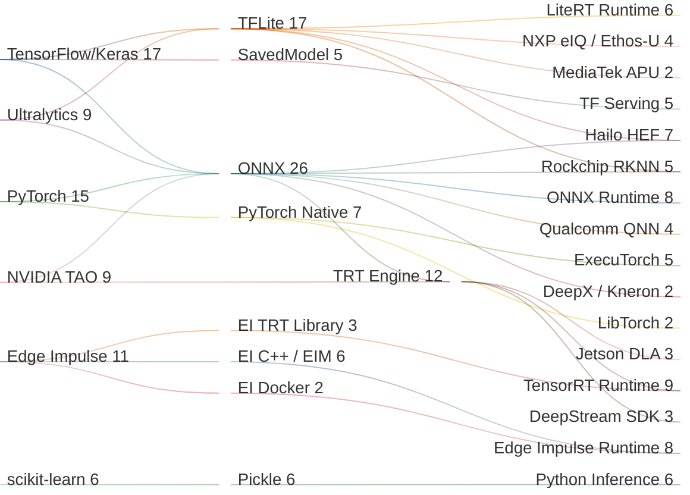
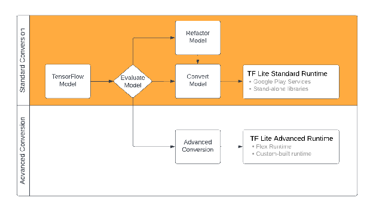
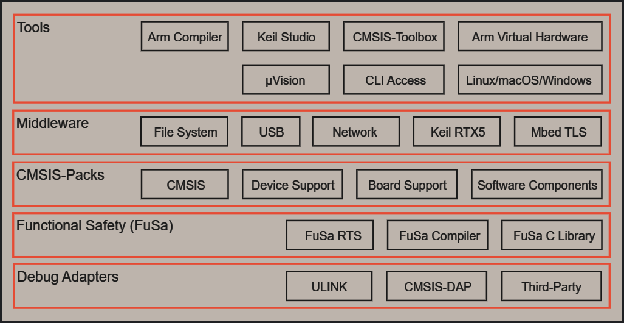
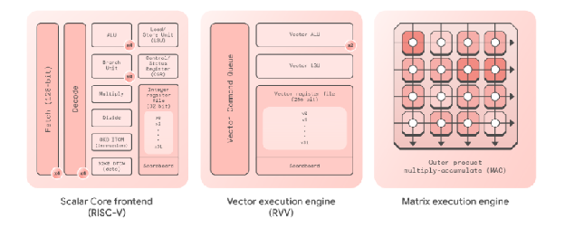
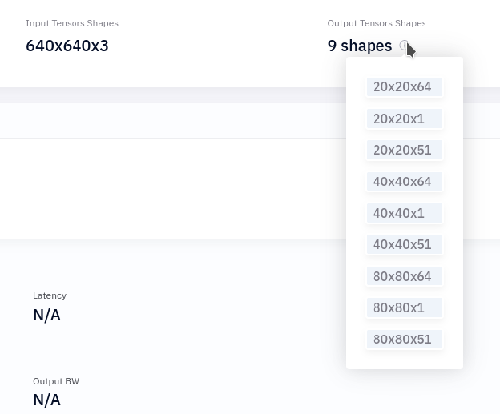
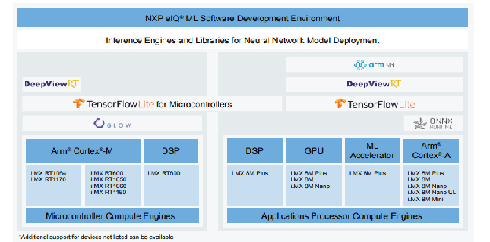
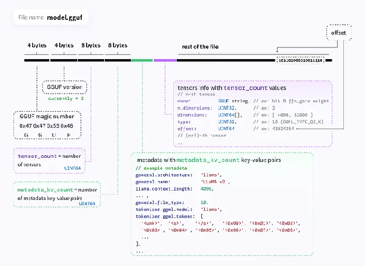

# inxware Edge Machine Learning

## Table of Contents

1. [Use Cases](#1-use-cases)
2. [Terminology](#2-terminology)
3. [Model Building Frameworks](#3-model-building-frameworks)
   - [TensorFlow / LiteRT (TFLite)](#31-tensorflow--litert-tflite)
   - [PyTorch / ExecuTorch](#32-pytorch--executorch)
   - [NVIDIA TensorRT / Jetson](#33-nvidia-tensorrt--jetson)
   - [Other Frameworks](#34-other-frameworks)
4. [Model Deployment Formats](#4-model-deployment-formats)
   - [Native Framework Formats](#41-native-framework-formats)
   - [ONNX (Open Neural Network Exchange)](#42-onnx-open-neural-network-exchange)
   - [Edge Impulse Formats](#43-edge-impulse-formats)
5. [NPU-Specific Formats](#5-npu-specific-formats)
   - [Hailo — HEF](#51-hailo--hef)
   - [DeepX — DXNN](#52-deepx--dxnn)
   - [Qualcomm — QNN / DLC (SNPE)](#53-qualcomm--qnn--dlc-snpe)
   - [Rockchip — RKNN](#54-rockchip--rknn)
   - [NXP — eIQ / Neutron NPU](#55-nxp--eiq--neutron-npu)
   - [Arm — Ethos-U (Vela)](#56-arm--ethos-u-vela)
   - [MediaTek — NeuroPilot / APU](#57-mediatek--neuropilot--apu)
   - [Kneron — NEF](#58-kneron--nef)
   - [Axelera — Metis (Voyager SDK)](#59-axelera--metis-voyager-sdk)
   - [Ambarella — CVflow](#510-ambarella--cvflow)
   - [BrainChip — Akida](#511-brainchip--akida)
   - [Large Integrations (Data Centre / Cloud)](#512-large-integrations-data-centre--cloud)
6. [Inference Pipeline](#6-inference-pipeline)
   - [Pipeline Overview](#61-pipeline-overview) — five-stage post-processing model
   - [Raw Output / Dequantisation](#62-raw-output--dequantisation) — stages 1 & 2 detail
   - [Model-Architecture Decoding](#63-model-type-decoding) — stage 3 detail (YOLO, pose models)
   - [Data Filtering — NMS](#64-data-filtering--nms) — stage 4 detail
   - [C++ and Python APIs per Format](#65-c-and-python-apis-per-format)
   - [Output Formats](#66-output-formats) — stage 5 detail
7. [LLM at the Edge](#7-llm-at-the-edge)
8. [inxware Implementation — Status, APIs and Source Roadmap](#8-inxware-implementation--status-apis-and-source-roadmap)
9. [Appendix: Runtime Dependencies Reference](#9-appendix-runtime-dependencies-reference)

---

# 1. Use Cases

Edge AI machine learning includes the following potential use-cases:

- **Machine Vision**
  - Object detection, recognition and location
  - Pose estimation of human movement (public space, sports & health)
  - Manufacturing QA and anomoloy detection
  - Medical & bioscience devices 
     - histology microscopy
     - cell culture incubation
     - radiography  
- **Natural Language Processing (SLMs and LLMs)**
  - Human machine interfaces (SLM)
  - Automation and agentic (function calling LLMs)
  - Device-side reasoning and context awareness
- **Vector data classification prediction**
  - Time series Anomly detection (MLPs)
  - Sensor (oSVM)
- V**ector data value prediction (regression)**
  - Fixed model sensor fusion and data compression
  - Adaptive non-linear models for prediction (oSVM)
  - Adaptive linear/non-linear predictors (Kalman filters)
  - Model predictive control systems
  - Condition monitoring (time series analysis and system identification)
- **Voice recognition (various)**
  - Feature space tranformations (FFTs,Wavelet, Periodogram)
  - Combinations of CNNs and LLMs


  Ther are many more applications of Edge-AI, where responsiveness, reliability, privacy and operating costs are improved sufficiently for operational deployment.
---

# 2. Terminology

| Term | Definition |
| :--- | :--- |
| **Model Creation** | Dataset input and model output. Includes data tagging, training, optimisation, and quantisation. |
| **Purpose** | Broad purpose of model usage: Text, Image, Audio, etc. |
| **Sub-Task** | What the ML model can do under a specific purpose. |
| **Primary Model Type** | Internal structure of a model with different task variants. E.g. `YOLOv8-pose` = YOLOv8 for pose estimation. |
| **SAM** | Segment Anything Model (Meta). |
| **Model Data Container** | How the inference model is stored on disk. |
| **Inference Data Container** | Container format of the inference output data. |
| **Model Data Structure** | Data structure of input/output data inside the container. |
| **Dequantisation** | Converting quantised INT8/INT4 outputs back to floating-point using stored scale and zero-point parameters. |
| **NMS** | Non-Maximum Suppression — filters duplicate/overlapping detections. |
| **QDQ** | QuantizeLinear / DequantizeLinear ONNX operator pair carrying quantisation parameters. |
| **HEF** | Hailo Executable Format — compiled binary for Hailo NPUs. |
| **EON** | Edge Optimised Neural — Edge Impulse's C++ code generator for ML models. |

## ML Workflow Entity

| Model Creation Examples                 | Purpose                      | Sub-Task | Primary Model Type | Model Data Container Format | Inference Data Container | Model Data Structure |
| :-------------------------------------- | :--------------------------- | :------- | :----------------- | :-------------------------- | :----------------------- | :---------- |
| Ultralytics, PyTorch, TensorFlow Lite, ROCm (AMD) | Image, Text, Audio | Detection, Image segmentation, Classification, Pose estimation | YOLOv3–11, YOLOv26, SAM (1–3), SVM, Transformer (LLM) | `.tflite` `.onnx` `.pb` `.hef` `.pte` | NumPy array, FlatBuffer, Protobuf | Combination of Primary Model Type and Task |
| NVIDIA TAO Toolkit, PyTorch, TensorFlow  | Image, Video | Detection, Segmentation, Classification, Pose, OCR, Tracking | YOLOv8, SSD, ResNet, EfficientDet, PeopleNet, BodyPoseNet | `.onnx` `.engine` `.plan` | CUDA tensor bindings (NumPy/CuPy), Protobuf (gRPC / Triton KServe v2) | TensorRT binding tensors; Triton inference protocol v2 |

### ML Pipeline Flow (Sankey)

The diagram below shows the flow from training framework → export/interchange format → compiled/device format → runtime / deployment target. Node widths are proportional to the number of downstream connections.



---

# 3. Model Building Frameworks
Model building is generally not done on edge devices, except for adaptive model types, whch are currently rarely deployed outside of earospace, automotive and defence. The model building frameowrks discuused here are alost exclusively Nueral Network based or more specifically variants of the Multi-Layer-Perceptron (MLP) model. 

These frameworks often set the scene of what options for deployment are available at the edge, which splits into different work-flow and processing pipelines sometimes independently of the training fraework, used but unfortunately not always the case. This can cause variouse issues for building devices with established model types from **model zoos** or custom models built with specific tooling. 

Unfortunately each silicon vendor, npu developer and ML technology has built end-2-end systems to improve accessability and/or add "stickyness" to their technology, but results in a highly fragmented eco-system, where seemingly easy transformations and generalisations are not easily practical.

## 3.1 TensorFlow / LiteRT (TFLite)

**TensorFlow** is Google's primary ML framework. Models are defined in Python using the Keras high-level API or the lower-level TF ops.

**LiteRT** (formerly TensorFlow Lite, still commonly called TFLite) is the lightweight inference runtime for mobile and edge devices. The model file format is `.tflite` — a FlatBuffer-serialised representation of the computation graph and weights.

**Training workflow:**

1. Train model in TensorFlow/Keras (Python)
2. Export via `tf.lite.TFLiteConverter` to `.tflite`
3. Optionally apply post-training quantisation (INT8, FP16, INT4) during conversion
4. Deploy with LiteRT C++ interpreter or TFLite Micro (TFLM) on microcontrollers

**LiteRT conversion (Python):**

```python
import tensorflow as tf

converter = tf.lite.TFLiteConverter.from_saved_model("saved_model/")
# Optional: quantise to INT8
converter.optimizations = [tf.lite.Optimize.DEFAULT]
converter.representative_dataset = representative_data_gen
converter.target_spec.supported_ops = [tf.lite.OpsSet.TFLITE_BUILTINS_INT8]
tflite_model = converter.convert()
with open("model.tflite", "wb") as f:
    f.write(tflite_model)
```

**LiteRT C++ inference:**

```cpp
// Load model
auto model = tflite::FlatBufferModel::BuildFromFile("model.tflite");
tflite::ops::builtin::BuiltinOpResolver resolver;
std::unique_ptr<tflite::Interpreter> interpreter;
tflite::InterpreterBuilder(*model, resolver)(&interpreter);
interpreter->AllocateTensors();

// Write input
float* input = interpreter->typed_input_tensor<float>(0);
// ... fill input ...

// Run inference
interpreter->Invoke();

// Read output
float* output = interpreter->typed_output_tensor<float>(0);
```

**TFLite Micro (TFLM):**
Designed for microcontrollers without OS or heap allocator. Memory arena is a static buffer. Op resolver is built by registering only the required ops.

```cpp
tflite::MicroMutableOpResolver<4> resolver;
resolver.AddConv2D();
resolver.AddDepthwiseConv2D();
// ... add only needed ops

tflite::MicroInterpreter interpreter(
    tflite::GetModel(model_data),
    resolver,
    tensor_arena,
    kTensorArenaSize
);
interpreter.AllocateTensors();
interpreter.Invoke();
float output = interpreter.output(0)->data.f[0];
```

**Documentation:** [TensorFlow Lite guide](https://www.tensorflow.org/lite/guide) · [TFLM](https://www.tensorflow.org/lite/microcontrollers)

**Flex runtime:** Extension allowing TFLite to run TF ops not natively supported, via TF runtime plugin. Not compatible with TFLM (too resource-heavy); not recommended for edge-only targets.

**Model conversion notes:**
- Keras `.h5` / SavedModel → `.tflite` via `TFLiteConverter`
- PyTorch models → `.tflite` via [ai-edge-torch](https://github.com/google-ai-edge/ai-edge-torch)
- Quantisation may reduce accuracy; calibration dataset needed for INT8 static quantisation



---

## 3.2 PyTorch / ExecuTorch

### TorchScript (`.pt`) — Deprecated

TorchScript serialises a `torch.jit.ScriptModule` to a `.pt` file containing the model graph and weights. **Status: deprecated in PyTorch 2.x.** Still functional but not recommended for new projects.

**C++ loading (LibTorch):**

```cpp
#include <torch/script.h>
auto module = torch::jit::load("model.pt");
auto output = module.forward({input_tensor}).toTensor();
```

**Limitations:** Not all PyTorch operations are scriptable; dynamic control flow causes issues; no standardised edge deployment path.

### `torch.export` — Recommended (PyTorch 2.x)

Captures a strict ahead-of-time graph (ExportedProgram) as a pure ATen/ATEN dialect IR — no Python interpreter at runtime. Multiple downstream uses:

- `torch.export` → AOTInductor → compiled `.so` (server-side AOT)
- `torch.export` → ExecuTorch (edge deployment, see below)
- `torch.export` → Qualcomm AI Engine backend
- `torch.export` → Arm Ethos-U backend

### ExecuTorch (`.pte`) — Edge Deployment

PyTorch's answer to TFLite. **ExecuTorch 1.0 GA** released late 2024.

**File format:** `.pte` — FlatBuffers-serialised model graph + weights.

**Build pipeline (Python):**

```python
from torch.export import export
from executorch.exir import to_edge_transform_and_lower
from executorch.backends.xnnpack.partition.xnnpack_partitioner import XnnpackPartitioner

exported = export(model, example_inputs)
edge = to_edge_transform_and_lower(exported, partitioner=[XnnpackPartitioner()])
pte_bytes = edge.to_executorch().buffer  # write to .pte file
```

**Runtime:** Minimal C++ runtime (~100 KB core); no dependency on LibTorch. Loadable via C++, Java (Android), Objective-C/Swift (iOS).

**Backends (delegates):**

| Backend | Hardware |
| :--- | :--- |
| XNNPACK | CPU, quantised INT8 (default in pip wheels >= 0.6) |
| Core ML | Apple Silicon |
| Qualcomm AI Engine | Snapdragon NPU |
| Arm Ethos-U | Via Vela compiler (Cortex-M embedded) |
| Vulkan | GPU (Android / Linux) |
| MPS | Apple GPU |

**LLM support:** Dedicated LLM C++/Java/ObjC/Swift APIs; KleidiAI INT4 micro-kernels integrated via XNNPACK for ARM.

**References:** [ExecuTorch GitHub](https://github.com/pytorch/executorch) · [Architecture](https://pytorch.org/executorch/stable/getting-started-architecture) · [C++ tutorial](https://pytorch.org/executorch/stable/running-a-model-cpp-tutorial.html)

### LibTorch (C++ Frontend)

Full PyTorch C++ API: tensors, autograd, `torch::jit::load`. **Not suitable for edge** — binary size ~500 MB+. Use ExecuTorch runtime for edge deployment.

---

## 3.3 NVIDIA TensorRT / Jetson

TensorRT is NVIDIA's inference optimisation library. It parses ONNX (or other formats), applies layer fusion, kernel auto-tuning, and precision calibration, then serialises to a hardware-specific engine file.

**Builder API — Python (TensorRT 10.x):**

```python
import tensorrt as trt

logger = trt.Logger(trt.Logger.WARNING)
builder = trt.Builder(logger)
network = builder.create_network(1 << int(trt.NetworkDefinitionCreationFlag.EXPLICIT_BATCH))
parser = trt.OnnxParser(network, logger)
parser.parse_from_file("model.onnx")

config = builder.create_builder_config()
config.set_memory_pool_limit(trt.MemoryPoolType.WORKSPACE, 1 << 30)

# Optional INT8
config.set_flag(trt.BuilderFlag.INT8)
config.int8_calibrator = MyCalibrator(calibration_data)

serialized_engine = builder.build_serialized_network(network, config)
with open("model.engine", "wb") as f:
    f.write(serialized_engine)
```

**Builder API — C++ (TensorRT 10.x):**

```cpp
auto builder = std::unique_ptr<nvinfer1::IBuilder>(nvinfer1::createInferBuilder(logger));
auto network = std::unique_ptr<nvinfer1::INetworkDefinition>(
    builder->createNetworkV2(1U << static_cast<uint32_t>(
        nvinfer1::NetworkDefinitionCreationFlag::kEXPLICIT_BATCH)));
auto parser = std::unique_ptr<nvonnxparser::IParser>(
    nvonnxparser::createParser(*network, logger));
parser->parseFromFile("model.onnx", static_cast<int>(trt::Logger::Severity::kWARNING));

auto config = std::unique_ptr<nvinfer1::IBuilderConfig>(builder->createBuilderConfig());
auto serialized = std::unique_ptr<nvinfer1::IHostMemory>(
    builder->buildSerializedNetwork(*network, *config));
// write serialized->data() / serialized->size() to file
```

**Engine file format:** Conventionally `.engine` or `.plan` (interchangeable). **Not portable** — engines are specific to GPU architecture, TRT version (major.minor.patch.build), CUDA, and cuDNN. Cannot be shared between host types.

**INT8 calibration:** Requires a calibrator implementing `IInt8EntropyCalibrator2`; first run writes a `.cache` file reused on subsequent builds.

**TensorRT 10 notable changes:**
- INT4 weight-only quantisation (block quantisation)
- Weight-stripped engines: small `.engine` + separate weight file; refitted at runtime
- `IStreamWriter` for serialising engine to custom streams
- `build_serialized_network` returns `IHostMemory`; `buildEngineWithConfig` removed

**Jetson / JetPack versions:**

| JetPack | TensorRT | CUDA | DLA version |
| :--- | :--- | :--- | :--- |
| JP 6.0 (May 2024) | 8.6 | 12.2 | 3.0 |
| JP 6.2 (current) | 10.3 | 12.6 | 3.1 |

**DLA (Deep Learning Accelerator):** Fixed-function accelerator alongside the GPU on Jetson AGX Orin. Configured per-layer via `config.set_device_type(layer, trt.DeviceType.DLA)`. Primary benefit is energy efficiency and throughput, not latency vs GPU. Engine files built for GPU and DLA are not interchangeable.

**Upgradable Compute Stack (JP6+):** TensorRT and CUDA can be upgraded independently of the BSP.

**`trtexec`:** CLI tool on Jetson for building and benchmarking engines.

---

## 3.4 Other Frameworks

### CMSIS-NN / KleidiAI

Arm CMSIS-NN provides highly optimised C/C++ kernels for inference on Arm Cortex-M. Designed for real-time fixed-model inference; no training or adaptive models. Fits standard ARM/pure C build environments.

[KleidiAI](https://gitlab.arm.com/kleidi/kleidiai) is a newer Arm library providing optimised INT4/INT8 micro-kernels for Cortex-A (including LLM inference), integrated in ExecuTorch via XNNPACK.



### scikit-learn

Python ML library for classical algorithms (SVM, Random Forest, logistic regression, etc.). Models serialised to `.pkl` (Python Pickle) or `.pmml` (XML). Not suitable for embedded/bare-metal without additional tooling.

### JAX

Google's composable function transformations framework (grad, jit, vmap, pmap). Can export models to XLA HLO or via `jax.export` → ONNX for downstream deployment.

### FEDML

Unified ML library for distributed training, model serving, and federated learning. Not suited for microcontrollers or resource-constrained edge environments. [FEDML GitHub](https://github.com/FedML-AI/FedML)

---

# 4. Model Deployment Formats

## 4.1 Native Framework Formats

| Format          | Extension | Producer | Notes        |
| :-------------- | :-------- | :------- | :----------- |
| TFLite / LiteRT | `.tflite` | TensorFlow Lite | FlatBuffer, Portable across CPU, GPU delegate, NNAPI, Edge TPU; quantisation supported |
| TorchScript     | `.pt`     | PyTorch | Deprecated; graph + weights; loads via `torch::jit::load` |
| ExecuTorch      | `.pte`    | PyTorch | FlatBuffers; minimal runtime; edge/embedded deployment |
| SavedModel      | directory | TensorFlow | Directory with `saved_model.pb` + variables; full TF graph |
| Frozen graph    | `.pb`     | TensorFlow | Serialised computation graph (Protobuf); static, no variables |
| Keras HDF5      | `.h5`, `.hdf5` | Keras / TF | Architecture + weights; Python-centric |
| TensorRT engine | `.engine`, `.plan` | TensorRT | Device-specific, version-locked; not portable |
| Pickle          | `.pkl`    | scikit-learn, Python | Python-only serialisation; unsafe for untrusted inputs |
| PMML            | `.xml`, `.pmml` | R, Python | XML-based model exchange for classical ML |
| GGUF            | `.gguf`   | llama.cpp | LLM weight format (successor to GGML); see §7 |
| ML.NET Native   | `.zip`    | ML.NET | Encapsulates model + preprocessing pipeline for .NET |

---

## 4.2 ONNX (Open Neural Network Exchange)

ONNX is a framework-agnostic, cross-platform model representation. It uses Protobuf serialisation and defines a standard operator set (`opset`). Most training frameworks can export to ONNX.

**File extension:** `.onnx`

**ONNX Runtime (ORT)** is the reference inference engine. Execution is dispatched to hardware via **Execution Providers (EPs)**; the same API is used regardless of EP.

**C++ API:**

```cpp
Ort::Env env(ORT_LOGGING_LEVEL_WARNING, "session");
Ort::SessionOptions session_options;
session_options.AppendExecutionProvider_CUDA(cuda_options); // optional EP
Ort::Session session(env, L"model.onnx", session_options);

std::vector<const char*> input_names = {"input"};
std::vector<const char*> output_names = {"output"};
auto outputs = session.Run(Ort::RunOptions{nullptr},
                           input_names.data(), &input_tensor, 1,
                           output_names.data(), 1);
```

**Python API:**

```python
import onnxruntime as ort
sess = ort.InferenceSession("model.onnx",
    providers=["CUDAExecutionProvider", "CPUExecutionProvider"])
outputs = sess.run(None, {"input": input_array})
```

**Execution Providers:**

| EP | Hardware |
| :--- | :--- |
| `CPUExecutionProvider` | Default x86/ARM CPU |
| `CUDAExecutionProvider` | NVIDIA GPU |
| `TensorRTExecutionProvider` | NVIDIA TensorRT |
| `QNNExecutionProvider` | Qualcomm Snapdragon NPU |
| `OpenVINOExecutionProvider` | Intel CPU/GPU/VPU |
| `VitisAIExecutionProvider` | AMD/Xilinx DPU |
| `CoreMLExecutionProvider` | Apple Silicon / ANE |
| `ROCMExecutionProvider` | AMD ROCm GPU |
| `DirectMLExecutionProvider` | Windows DirectML |
| `ArmNNExecutionProvider` | Arm Cortex / Mali |
| `NNAPIExecutionProvider` | Android NNAPI |

**Quantisation:**

- **Static PTQ:** `onnxruntime.quantization.quantize_static()` — requires calibration dataset; inserts QDQ nodes.
- **Dynamic quantisation:** `quantize_dynamic()` — quantises weights; activations quantised at runtime.
- **QDQ format:** `QuantizeLinear` + `DequantizeLinear` pairs carry per-tensor or per-channel `scale` (FP32) and `zero_point` (INT8/UINT8). Formula: `y = (x − zero_point) × scale`.
- **INT8 modes:** S8S8 with QDQ (default), U8S8, U8U8.
- **INT4:** Supported in ONNX opset 21+ via `QuantizeLinear` with 4-bit output; used with QNN EP and TRT EP for weight-only quantisation.



---

## 4.3 Edge Impulse Formats

Edge Impulse is an end-to-end MLOps platform covering data collection, DSP block design, model training, and deployment. It wraps trained models together with their signal-processing pipeline into hardware-specific deployment packages.

### Import Formats (Bring Your Own Model — BYOM)

Models trained outside Edge Impulse can be imported directly into a project:

| Input Format | Notes |
| :--- | :--- |
| **TFLite / LiteRT** | `.tflite` or `.lite` files; most common path for MCU deployment |
| **ONNX** | `.onnx`; automatic quantisation applied on import; input order converted automatically |
| **TensorFlow SavedModel** | `saved_model.zip` archive |
| **PyTorch** | Export to ONNX first, then import as ONNX |
| **Keras** | Export to SavedModel or TFLite, then import |
| **scikit-learn** | Via custom learning blocks (Python wrapper) |
| **Generic C++ / custom blocks** | Custom learning blocks can wrap any inference library |

### Built-in Learning Blocks

Edge Impulse provides the following native ML algorithms. No external training framework is required for these:

**Classification:**
- Softmax neural network classifier (tabular, image, audio)
- Transfer learning (MobileNet, EfficientNet backbones — image and audio)

**Object Detection:**

| Block | Description | Target |
| :--- | :--- | :--- |
| **FOMO** (Faster Objects, More Objects) | Lightweight centroid-based detection; 30× less compute/memory than MobileNet SSD; real-time on deeply constrained MCUs | Cortex-M, ESP32 |
| **YOLO-Pro** | Purpose-built edge YOLO family; optimised for latency and resource usage on embedded targets | MCU and Linux |
| **MobileNet SSD** | Single Shot MultiBox Detector with MobileNet V2 backbone; standard embedded object detection | MCU and Linux |

**Other blocks:** Anomaly detection (K-Means / GMM), time-series classification, audio event detection, regression.

### Export / Deployment Formats

| Format | Architectures / Targets | Notes |
| :--- | :--- | :--- |
| **C++ library** | Any with C++11 compiler | Standalone source; no OS, stdlib, or dynamic memory required; includes DSP + ML code as `.zip` |
| **Arduino library** | ARM-based Arduino boards | `.zip` for Arduino IDE / PlatformIO; includes examples |
| **Linux EIM executable** | x86_64, ARMv7, AARCH64 | Self-contained binary; IPC via Unix socket; NEON on ARM; 64-bit EIM does not run on 32-bit systems |
| **WebAssembly** | Browser, Node.js | Full in-browser inference; includes JS/WASM bundle |
| **Docker container** | x86_64, AARCH64 | Exposes HTTP inference server; hardware acceleration auto-compiled for Linux targets |
| **iOS SDK** | Apple ARM (A-series, M-series) | Native Objective-C/Swift; includes examples |
| **Android SDK** | ARM64-v8a, ARMv7 | Native Java/Kotlin; includes examples |
| **TensorRT library** | NVIDIA Jetson (AARCH64) | CUDA-accelerated model compiled to TensorRT for Jetson Nano/Xavier/Orin/Thor; see §Jetson below |
| **Rust FFI bindings** | x86_64, AARCH64 | FFI-safe Rust bindings wrapping the C++ library |
| **Pure C source** | Bare metal / any | MCU-friendly; no C++ runtime needed |
| **Platform SDKs** | STM32 (CubeAI), Syntiant NDP, Nordic nRF, Ethos-U | Vendor-specific bundles with HAL integration |

**EIM IPC (Linux):** The `.eim` binary opens a Unix socket. A client sends raw feature vectors; results arrive as JSON. No runtime dependency beyond glibc.

**Language SDKs for EIM (Linux / Jetson):** Python, Node.js, Go, C++.

### EON Compiler

The Edge Optimised Neural (EON) Compiler transforms TFLite-based ML models directly into **C++ source code** rather than shipping a runtime interpreter over a FlatBuffer.

| Mode | RAM saving vs TFLite Micro | ROM / Flash saving |
| :--- | :--- | :--- |
| Standard EON | 25–55% | up to 35% |
| RAM Optimised (2024+) | **40–65%** | up to 35% |

Zero accuracy loss in both modes.

**How it works:**
- Generates C++ that encodes the model graph statically; no TFLite FlatBuffer parsing at runtime.
- Slices the model graph into segments to minimise peak RAM — each slice reuses the same arena.
- Shifts weight data into ROM more aggressively than TFLite Micro.
- Uses the linker to eliminate dead code.

**Supported targets:** All ARM Cortex-M and ESP32/Xtensa embedded targets supported by Edge Impulse.

**EON Tuner:** Automatically searches the space of DSP block + model architecture + EON settings combinations for a given RAM/latency budget.

### Inference Runtimes (per target)

| Target class | Runtime | Notes |
| :--- | :--- | :--- |
| ARM Cortex-M MCUs | TFLite Micro (default) or EON Compiler | CMSIS-NN kernels; static arena; no OS |
| ESP32 / Xtensa | TFLite Micro or EON Compiler | ESP-NN SIMD kernels |
| Nordic nRF / STM32 | TFLite Micro or EON Compiler | CubeAI integration on STM32 |
| Syntiant NDP | Syntiant runtime | Dedicated NDP block |
| Arm Ethos-U | TFLite Micro + Vela-compiled kernels | Via Ethos-U driver |
| Linux x86_64 / ARM | Full TFLite or ONNX Runtime | `USE_FULL_TFLITE=1` build flag for full interpreter |
| NVIDIA Jetson | TensorRT (CUDA-accelerated) | AARCH64 EIM or TensorRT library export |
| Browser / Node.js | WASM runtime | Specialised WebAssembly inference path |

### NVIDIA Jetson Support

Edge Impulse provides official support for the full Jetson family (Nano, Xavier, Orin, Thor):

- **EIM deployment:** Download an AARCH64 `.eim` executable directly to the Jetson; run with the Linux SDK (Python, Node.js, Go, C++).
- **TensorRT library export:** Studio compiles the impulse to a TensorRT-optimised library with CUDA acceleration; link it into a custom C++ application.
- **Hardware acceleration:** GPU acceleration is automatically enabled when exporting or building for Jetson targets — no manual TRT configuration needed in the basic flow.
- **Docker:** Jetson Docker containers expose an HTTP inference endpoint.

**OTA model updates:** New impulses can be deployed as OTA updates; see [lifecycle management docs](https://docs.edgeimpulse.com/docs/tutorials/lifecycle-management/ota-model-updates).

### Supported Hardware (MCU / SoC Families)

| Family | Examples |
| :--- | :--- |
| ARM Cortex-M0+ | RAKwireless WisBlock RP2040, Raspberry Pi Pico |
| ARM Cortex-M4F | Nordic nRF52840, STM32F4 series (80 MHz default target) |
| ARM Cortex-M33 | Raspberry Pi Pico RP2350, STM32U5 |
| ARM Cortex-M7 | STM32H7, MIMXRT series |
| ARM Cortex-M55 + Ethos-U55/U65 | STM32N6 with AI accelerator |
| Espressif Xtensa | ESP32 (240 MHz LX6), ESP32-S3, ESP32-C3 |
| Nordic Semiconductor | nRF52840, nRF5340, nRF9160/9161/9151, nRF7002, Thingy:53/91 |
| STMicroelectronics | STM32N6570-DK, STM32F/H/U/L series |
| Syntiant | NDP101, NDP120 (always-on audio/sensor NPU) |
| NVIDIA Jetson | Nano, Xavier NX, AGX Xavier, Orin NX, AGX Orin, Thor |
| Linux x86_64 / ARM | Raspberry Pi, generic SBCs, desktop |

**References:** [Deployment docs](https://docs.edgeimpulse.com/docs/edge-impulse-studio/deployment) · [BYOM](https://docs.edgeimpulse.com/docs/edge-impulse-studio/bring-your-own-model-byom) · [EON Compiler](https://docs.edgeimpulse.com/docs/edge-impulse-studio/deployment/eon-compiler) · [Linux EIM](https://docs.edgeimpulse.com/docs/run-inference/linux-eim-executable) · [Jetson support](https://docs.edgeimpulse.com/hardware/boards/nvidia-jetson)

---

# 5. NPU-Specific Formats

## 5.1 Hailo — HEF

**Toolchain:** Hailo AI Software Suite; central tool is the **Hailo Dataflow Compiler (DFC)**.

**Compilation pipeline:**
1. Input: ONNX, TensorFlow (frozen graph / checkpoint), TFLite.
2. DFC parses the model into **HAR** (Hailo Archive) — the intermediate format used for optimisation and quantisation.
3. DFC compiles HAR → **HEF** (Hailo Executable Format) binary — the device-executable artifact.

**HEF is hardware-specific:** separate HEF files are required per target chip.

**Supported targets:** `hailo8`, `hailo8r`, `hailo8l`, `hailo15h`, `hailo15m`, `hailo15l`, `hailo10h`

**DFC / HailoRT versions:**

| Suite Release | DFC | HailoRT |
| :--- | :--- | :--- |
| March 2024 | v3.27.0 | 4.17 |
| October 2024 | v3.29.0 | 4.19 |
| January 2025 | v3.30.0 | 4.20 |

**Runtime:** HailoRT C/C++ and Python APIs consume HEF files. Outputs are quantised INT8; dequantisation uses `quant_info.qp_scale` and `quant_info.qp_zp` from the output VStream info (see §6.2).

**Post-processing:** NMS and other post-processing can be compiled into the HEF (on supported architectures) via model scripts, eliminating CPU post-processing overhead.

**Model Zoo:** Pre-compiled HEF files available; YOLOv8/v9/v10/v12, SigLIP, PaddleOCR-v5, StereoNet, and more.

**References:** [Hailo Model Zoo](https://github.com/hailo-ai/hailo_model_zoo) · [Application Code Examples (C++)](https://github.com/hailo-ai/hailo-apps/tree/main/hailo_apps/cpp/)



---

## 5.2 DeepX — DXNN

**Format:** Proprietary **DXNN** binary (`.dxnn`).

**SDK components (DXNN SDK):**

| Component | Role |
| :--- | :--- |
| **DX-COM** | Converts ONNX → DXNN; quantisation and graph optimisation |
| **DX-SIM** | Host-side model simulation |
| **DX-RT** | On-device C runtime; inference using DXNN binaries |
| **DX-NPU Driver** | Device driver layer |
| **DX-APP** | Sample application code |

**Core pipeline:** ONNX → Quantizer → DX-COM Compiler → `.dxnn` binary → DX-RT runtime

**Hardware targets:** DX-M1 (M.2 module), DX-H1 V-NPU

**References:** [DXNN SDK GitHub](https://github.com/DEEPX-AI/dx-all-suite) · [Developer Portal](https://developer.deepx.ai/)

---

## 5.3 Qualcomm — QNN / DLC (SNPE)

**Two SDK generations:**

| SDK | Format | Hardware | Portability |
| :--- | :--- | :--- | :--- |
| **SNPE** (legacy) | `.dlc` (Deep Learning Container) | CPU, GPU, DSP, NPU | Hardware-agnostic; forward-compatible across SDK versions |
| **QNN** (current) | Context binary (`.bin`) | NPU only (SOC-specific) | SOC-specific; not portable between chip generations |

**Key distinction:** DLC runs on any EP; QNN context binary targets only the NPU of a specific SOC.

**Pipeline:** `.onnx` → SNPE/QNN converter → `.dlc` → QNN compiler → `.bin`

**ONNX Runtime integration:** QNN EP embeds a pre-compiled QNN context binary within an ONNX model for deployment via ORT on Snapdragon devices.

**Qualcomm AI Hub:** Cloud-based compilation and profiling service for QNN/DLC targets.

**Quantisation:** INT8; W8A8 and W4A8 supported in QNN.

**References:** [QNN ORT EP](https://onnxruntime.ai/docs/execution-providers/QNN-ExecutionProvider.html) · [AI Hub](https://workbench.aihub.qualcomm.com/)

---

## 5.4 Rockchip — RKNN

**Format:** `.rknn` binary (device-specific).

**Toolchain:**

| Tool | Role |
| :--- | :--- |
| **RKNN-Toolkit2** (Python, host) | Model conversion, quantisation, simulation, performance profiling. Latest: v2.3.2 (April 2025). Python 3.6–3.12. |
| **RKNN-Toolkit-Lite2** | Python inference API for on-device use |
| **RKNN Runtime (C API)** | C/C++ inference on device |
| **rknn-llm** | Separate toolchain for LLM deployment on Rockchip NPUs |

**Input formats:** ONNX, TFLite, Caffe, PyTorch (via ONNX export), Keras

**Targets:** RK3588, RK3566, RK3568, RV1109, RV1126, etc.

**Quantisation:** INT8 (symmetric/asymmetric), INT4 (selected ops). Calibration dataset passed during conversion.

**Workflow:** `rknn-toolkit2` on host → `.rknn` file → deploy via RKNN Runtime C API or Toolkit-Lite2 Python API on device.

**References:** [RKNN-Toolkit2 GitHub](https://github.com/rockchip-linux/rknn-toolkit2) · [Ultralytics RKNN integration](https://docs.ultralytics.com/integrations/rockchip-rknn/)

---

## 5.5 NXP — eIQ / Neutron NPU

**Framework:** eIQ Toolkit (ML workflow tool, inference engines, neural network compilers).

**Primary NPU flow (i.MX93, MCX N-series with Neutron NPU):**

1. Train → Export quantised TFLite
2. Neutron Converter Tool → Neutron-optimised binary
3. Deploy on-device

**Note:** eIQ Portal (BYOM) does **not** support direct NPU export; separate conversion tool required after quantised TFLite export.

**Ethos-U path (i.MX93):** Uses Arm Vela compiler (see §5.6) after quantised TFLite export.

**Inference engines included in eIQ:** TensorFlow Lite / LiteRT, ONNX Runtime, PyTorch (via TFLite export).

**eIQ Toolkit current release:** Rev. 19 (April 2025)

**References:** [NXP eIQ Fact Sheet](https://www.nxp.com/docs/en/fact-sheet/EIQ-FS.pdf) · [eIQ Toolkit Release Notes](https://www.nxp.jp/docs/en/release-note/EIQTRN.pdf)



eIQ feeds into DeepViewRT, TensorFlow Lite, TFLite Micro, Glow, and Arm NN inference engines (Edgeverse processors).

---

## 5.6 Arm — Ethos-U (Vela)

**Target hardware:** Ethos-U55, Ethos-U65, Ethos-U85 (microNPU class, Cortex-M ecosystem).
Note: Ethos-N is a separate server/mobile-class NPU; Ethos-U is the embedded variant.

**Compiler:** **Ethos-U Vela** (Python package: `ethos-u-vela` on PyPI)

**Input formats:** Quantised TFLite / LiteRT, or TOSA. Quantised activations and weights are required.

**Output formats:**
- **TFLite output:** Replaces acceleratable ops with TFLite Custom operators for Ethos-U; CPU fallback ops left unchanged.
- **Raw (`.npz`):** Contains the Ethos-U command stream and weight data.

**ExecuTorch integration:** ExecuTorch has an Arm Ethos-U backend (`backends-arm-ethos-u`); workflow: `torch.export` → ExecuTorch edge dialect → Arm backend → Vela-compiled artifact.

**Deployment:** Ethos-U driver + compiled binary run via TFLite Micro or bare-metal runtimes.

**References:** [Vela compiler docs](https://developer.arm.com/documentation/109267/latest/) · [ethos-u-vela PyPI](https://pypi.org/project/ethos-u-vela/) · [ExecuTorch Arm backend](https://docs.pytorch.org/executorch/stable/backends-arm-ethos-u.html)

---

## 5.7 MediaTek — NeuroPilot / APU

**APU:** AI Processing Unit on Dimensity and Genio SoCs.

**Format:** **DLA (Deep Learning Archive)** — low-level binary for MDLA (Multi-Core DLA) and VPU compute devices.

**Compiler:** `ncc-tflite` (Neuron Compiler) transforms quantised TFLite → DLA binary.

**Two compilation modes:**

| Mode | Description |
| :--- | :--- |
| **On-device (JIT)** | TFLite loaded on device; compiled at first run via NNAPI or Neuron Adapter API |
| **Offline (AOT)** | TFLite compiled to DLA on host; DLA file deployed directly; platform-specific |

**2024 integration:** Google LiteRT + NeuroPilot Accelerator stack; MediaTek Dimensity NPUs become first-class LiteRT targets including LLM inference.

**Neuron SDK:** Available for Genio IoT platforms (Yocto-based).

**References:** [NeuroPilot](https://neuropilot.mediatek.com/) · [MediaTek NPU + LiteRT blog](https://developers.googleblog.com/mediatek-npu-and-litert-powering-the-next-generation-of-on-device-ai/)

---

## 5.8 Kneron — NEF

**Format:** **NEF (NPU Executable Format)** — can contain one or multiple models; hardware-specific to Kneron SoCs.

**Toolchain:**

| Component                        | Role                               |
| :------------------------------- | :--------------------------------- |
| `onnx2onnx.py` (ONNX Converter)  | Optimises ONNX graph; handles layer cutting via `editor.py` |
| **Quantizer**                    | INT8 post-training quantisation    |
| **Compiler**                     | ONNX (optimised) → NEF binary      |
| **Evaluator / Simulator**        | Host-side performance estimation   |

**Input:** ONNX (preferred); Caffe and TFLite via prior conversion.

**Hardware targets:** KL520, KL720, KL530, KL730 (KDP series NPUs).

**Runtime:** Kneron PLUS C/C++ API (`kp_*` functions) and Python bindings on host; on-device via KDP firmware. `kdp_host.h` C API for USB/PCIe device communication.

**References:** [Kneron Document Centre](https://doc.kneron.com/docs/)

---

## 5.9 Axelera — Metis (Voyager SDK)

**Hardware:** Metis AIPU — up to 214 TOPS on Metis Compute Board (paired with RK3588).

**SDK:** **Voyager SDK** — full compilation, optimisation, and deployment stack.

**Input formats:** PyTorch, ONNX, TensorFlow.

**Compilation:** Voyager SDK automatically quantises and compiles to Metis AIPU-optimised code; no separate PTQ step required by default.

**Pipeline description:** YAML files define AI pipeline topology; SDK auto-generates code runnable as GStreamer plugins or inference server components.

**Deployment:** One-click deployment to Metis-enabled devices from Voyager SDK.

**References:** [Axelera Metis](https://axelera.ai/) · [Technical deep-dive](https://community.axelera.ai/product-updates/the-metis-ai-platform-a-technical-deepdive-125)

---

## 5.10 Ambarella — CVflow

**Architecture:** Proprietary CNN accelerator, present in CV25, CV28, CV5, CV72, etc.

**Toolchain:** Ambarella CNN Generation Tool + Compiler (NDA tool, not publicly distributed).

**Input formats:** Caffe, TensorFlow, ONNX, PyTorch (via ONNX export), MXNet.

**Compilation pipeline:**
1. CNN Generation Tool: analyses, sparsifies, quantises the network.
2. Compiler: generates a high-level program → **DAG executable binary** for CVflow hardware.

**Output:** DAG executable binary (proprietary, device-specific).

**Cloud integration:** Amazon SageMaker Edge integration enables cloud-based compilation for Ambarella targets.

**References:** [Ambarella CVflow](https://www.ambarella.com/technology/) · [AWS SageMaker + CV25](https://aws.amazon.com/blogs/machine-learning/ml-inferencing-at-the-edge-with-amazon-sagemaker-edge-and-ambarella-cv25/)

---

## 5.11 BrainChip — Akida

Neuromorphic computing using Spiking Neural Networks (SNNs). AKD1000 is the production NPU chip. Low-power (milliwatt-class); suited for always-on inference.

Other neuromorphic / edge AI companies:
- **GrAI Matter Labs** (France/Netherlands): GrAI One chip, microsecond latency, NeuronFlow technology
- **SynSense** (Switzerland): Neuromorphic processors + Dynamic Vision Sensors
- **Prophesee** (France): Event-based Metavision sensors (Sony, Bosch partnerships)

---

## 5.12 Large Integrations (Data Centre / Cloud)

These are server/cloud inference platforms rather than edge NPUs, but relevant when edge devices offload to cloud or when models are compiled for deployment.

| Platform | Notes |
| :--- | :--- |
| **NVIDIA** (H100/A100/H200, DGX) | Dominant data-centre GPU; TensorRT for inference; CUDA ecosystem |
| **Google TPU** (v4, v5) | Tensor Processing Units via GCP; optimised for TF/JAX training and inference |
| **AMD** (MI300X) | ROCm software stack; growing as NVIDIA alternative |
| **Intel** (Gaudi, Xeon AI) | Gaudi accelerators (from Habana Labs); Arc + data centre GPU |
| **Qualcomm** (Cloud AI 100) | Edge and data-centre inference accelerators |
| **Cerebras** (WSE) | Wafer-scale engines; entire NN on single chip |
| **Graphcore** (IPU) | Intelligence Processing Units for sparse/graph ML workloads |
| **Groq** (TSP) | Tensor Streaming Processors; deterministic inference latency |
| **Tenstorrent**, **d-Matrix** | Specialised architectures in early market adoption |

---

# 6. Inference Pipeline

## 6.1 Pipeline Overview

A complete edge inference pipeline passes through up to five stages after the inference engine has computed output tensors. Vendor SDKs often conflate multiple stages into a single library or pipeline configuration. The inxware function block design tracks which stages a given glue-code module covers so that conflicting or duplicate stages are not selected.

```
Raw model output tensors (INT8 / UINT8 / FP16 / FP32)
         |
         v
1. Framework-specific raw output unpacking
         |
         v
2. Dequantisation  (scale × (value − zero_point) → float)
         |
         v
3. Model-architecture decoding  (anchor decode, DFL, grid offsets, tensor routing)
         |
         v
4. Logical post-processing  (confidence filter, NMS, plausibility checks)
         |
         v
5. Output formatting  (JSON, binary, Protobuf, ROS2 message, …)
```

### Stage 1 — Framework-specific raw output unpacking

Some inference backends do not deliver tensor output that maps 1:1 to the model's logical output layers. CPU-hosted runtimes (TFLite, ONNX Runtime) typically do, but dedicated NPUs often repack, transpose, or sub-divide tensors to match their internal data layout. This stage is the responsibility of the **framework layer** and is transparent to the model post-processing stages that follow.

Examples:
- **TFLite / ONNX Runtime (CPU):** output tensors match the model's output layers exactly; quantisation parameters are populated from model metadata.
- **HailoRT:** the HEF compiler may split or transpose output tensors relative to the original model; multiple vstreams correspond to a single logical output. The framework layer normalises these into a canonical tensor array.
- **Qualcomm QNN:** delivers a compiled SOC-specific binary context; the QNN SDK unpacks tensor outputs through its execution provider.
- **Rockchip RKNN, NXP eIQ, Ethos-U:** similar framework-specific output conventions requiring framework-layer normalisation before model decoding begins.

### Stage 2 — Dequantisation

Converts quantised integer output values to floating-point via the affine mapping:

```
float_value = (raw_value − zero_point) × scale
```

`scale` (FP32) and `zero_point` (INT8 or UINT8) are per-tensor quantisation parameters stored in the model file's metadata and populated into tensor descriptors by the framework layer. See §6.2 for format-specific dequantisation behaviour and the Hailo-specific API.

This stage is a no-op when the framework already delivers FP32 output (float-precision model, or an NPU that dequantises internally), in which case `scale = 1.0` and `zero_point = 0`.

**Important:** Some model post-processors assume FP32 output without applying this transform. This is only valid for non-quantised models; using such a post-processor with an INT8-quantised model will produce incorrect results.

### Stage 3 — Model-architecture decoding

Interprets the semantic content of each output tensor element according to the **model architecture** — not the inference framework. The same decoding logic is needed regardless of whether the model runs on TFLite, HailoRT, or ONNX Runtime. See §6.3 for detailed per-model tensor layouts and decoding steps.

This stage is **not framework-specific** — it is specific to how the neural network's output head was designed:

| Model | Output structure | Key decoding step |
| :--- | :--- | :--- |
| YOLOv5 ObjDet | Single tensor `[1, N_anchors, 5 + C]` — x, y, w, h, objectness, class scores | `score = objectness × max_class_score`; centre-format box |
| YOLOv8 ObjDet | Pre-decoded per-class grouped boxes with count prefixes | Count prefix per class; corner-format coordinates (ymin, xmin, ymax, xmax) |
| YOLOv8 Pose | Three tensors per scale head (DFL boxes, scores, keypoints) | Tensor routing by feature dimension; DFL softmax regression decode; 17-keypoint COCO layout |
| MoveNet | Direct coordinate regression (heatmap-free) | Single tensor; 17 × 3 (y, x, confidence) |
| OpenPose / HRNet | Heatmaps + Part Affinity Fields or heatmaps only | Argmax or Gaussian peak fitting on spatial heatmap grids |

New model types added to inxware must document their expected tensor layout and routing logic in the model implementation header.

### Stage 4 — Logical post-processing

Reduces the raw decoded candidate set to a final, application-ready result. Common operations:

- **Confidence threshold filtering** — drop detections below a score threshold. Applied before NMS to bound the NMS input size.
- **Non-Maximum Suppression (NMS)** — for object detection: collapse overlapping bounding boxes for the same class to a single best candidate using Intersection over Union (IoU) scoring. See §6.4.
- **OKS-NMS** — keypoint-aware suppression for pose models using Object Keypoint Similarity as the overlap metric instead of IoU.
- **Plausibility filtering** — semantic constraints on decoded output (e.g. bounding box aspect-ratio limits, joint-angle constraints for pose models, temporal consistency checks).
- **NMS-free models** — YOLOv10, YOLO26 and some newer architectures integrate end-to-end detection heads that eliminate the post-processing NMS step by design.

### Stage 5 — Output formatting

Serialises the post-processed results into the application-facing format. See §6.5 for API entry points per format and §6.6 for detailed format descriptions.

| Format | Relative serialisation cost | Notes |
| :--- | :--- | :--- |
| JSON | ~10× | Human-readable; widest tool support; highest overhead |
| Protocol Buffers | ~2.5× | Binary, schema-enforced; used by TF Serving, gRPC, Triton |
| FlatBuffers | ~1× | Zero-copy; used by TFLite and ExecuTorch model files |
| Raw binary / buffer | ~1× | Lowest latency; required for constrained MCU targets |
| ROS2 `vision_msgs` | varies | Algorithm-agnostic computer vision messages for robot systems |

> For inxware implementation details of all five stages see `target/Component-HAL/ml/README.md § Post-Processing Pipeline`.

**Example function block configuration options:**

*Stage 1 — Framework raw output unpacking:*
- `tflite-int8 (general)` / `tflite-fp16` / `tflite-fp32`
- `e-impulse-eon_yolopro_object`
- `hailo8-10_yolo8s_pose_json` / `hailo8-10_yolo8m_pose_json`
- `hailo8-10_yolo8_object_json`
- `hailo8-10_yolov5-11_objdet`
- `hailo8-10_onnxrt_general` (requires ONNX Runtime)

*Stage 3 — Model-architecture decoding:* YOLOv5-object, YOLOv8-object, YOLOv8-pose, YOLOv10, YOLOv11-objdet, YOLOv11-obb, MoveNet, SCDepthv3, CLIP, FCN16-ResNet-v1-18, ...

*Stage 4 — Logical post-processing:* None, Object Detection NMS, Pose OKS-NMS, ...

*Stage 5 — Output formatting:* JSON-flat, JSON-structured, Protobuf, FlatBuffers, ...

---

## 6.2 Raw Output / Dequantisation

### Core Formula

Quantisation maps FP32 tensors to low-bit integers:

```
quantized = clamp(round(float / scale) + zero_point, qmin, qmax)
```

Dequantisation is the inverse:

```
float_val = (quantized - zero_point) x scale
```

`scale` (FP32) and `zero_point` (INT8 or UINT8) are the quantisation parameters, stored per-tensor or per-channel (axis).

### When Dequantisation Happens

| Scenario | Location |
| :--- | :--- |
| General runtimes (ORT, TFLite) | On-device; QDQ nodes dequantise between layers or at model output |
| NPU hardware (Hailo, Rockchip, etc.) | NPU computes INT8; **host-side post-processing** reads INT8 outputs and applies dequant using scale/zero_point from model metadata |
| Weight-only quantisation (LLMs, INT4) | Weights stored INT4; dequantised to FP16/BF16 just before the GEMM kernel |
| TensorRT INT8 | Calibration establishes per-layer scale; TRT fuses QDQ into layers — no explicit dequant at output unless FP32 result needed |

### Hailo-Specific Dequantisation

HEF stores per-output-tensor quantisation parameters:

```cpp
// HailoRT C++ API
auto output_info = output_vstream.get_info();
float qp_scale = output_info.quant_info.qp_scale;  // FP32 scale
int   qp_zp    = output_info.quant_info.qp_zp;     // INT zero-point

// Apply dequantisation
float float_val = (raw_int8_val - qp_zp) * qp_scale;
```

Raw output from the Hailo device is INT8/UINT8. Post-processing (NMS, decode) can be compiled into the HEF to operate on dequantised values internally (supported architectures only).

### ONNX Runtime QDQ Behaviour

- `QuantizeLinear` / `DequantizeLinear` ops are fused by the runtime with adjacent compute ops where possible (kernel fusion).
- For INT4 weight-only: weights read from memory as 4-bit, dequantised to FP16 in-register before matrix multiply — a **compute-time** dequant, not a graph-level op.
- NPUs often do not support arbitrary quantisation granularity; weights must be dequantised to a supported format (e.g. channel-wise INT8) before dispatch.

---

## 6.3 Model-Architecture Decoding

### Yolo8-Pose Output Tensors

The Hailo Model Zoo YOLOv8-pose model produces 9 output tensors arranged in three resolution heads (P3=80, P4=40, P5=20 grid cells). For each head:

| Tensor shape | Content |
| :--- | :--- |
| `H x W x 64` | Bounding box regression (DFL format) |
| `H x W x 1` | Bounding box confidence score |
| `H x W x 51` | 17 keypoints x 3 values (x, y, visibility) — COCO format |

Post-processing steps:
1. **Dequantisation** — INT8 → FP32 using per-tensor scale/zero-point
2. **DFL bounding box decode** — `dist2bbox` conversion using softmax + projection range
3. **Anchor/grid decode** — multiply by strides (8, 16, 32) to recover image-space coordinates
4. **Keypoint decode** — offsets relative to anchor centres, scaled back to image coordinates
5. **Confidence filtering** — remove detections below score threshold
6. **NMS** — filter overlapping detections

**Model trained on:** `coco-pose.yaml` ([source](https://github.com/ultralytics/ultralytics/blob/main/ultralytics/cfg/datasets/coco-pose.yaml)). 17 COCO keypoints x 3 = 51 values.

**Decoding reference:** [yolov8pose_postprocess.cpp](https://github.com/hailo-ai/Hailo-Application-Code-Examples/blob/55c64bf291053cf1038cd28757cbb95cb98e6876/runtime/hailo-8/cpp/pose_estimation/yolov8_pose/yolov8pose_postprocess.cpp#L319)

### Yolo5-Object Detection

Output format is 80xN: 80 classes. Each detection vector contains: class ID, number of objects, coordinates, size, confidence.

### Pose Estimation Models Reference

Full implementation details: [pose_estimation_models_detailed.xlsx](https://docs.google.com/spreadsheets/d/1J45pZ4jxjasOX_7qpJLm7wz1VFZaD-Mg/edit?gid=741875983#gid=741875983)

| Model | Type | Keypoints | NN Output Format | Optimised Accelerators |
| :--- | :--- | :--- | :--- | :--- |
| OpenPose | Bottom-up | 18/25 body, 21 hand, 70 face | Heatmaps + Part Affinity Fields (PAFs) | NVIDIA GPU (CUDA), TensorRT, CPU |
| MoveNet Lightning | Top-down | 17 (COCO) | Direct coordinate regression (heatmap-free) | TFLite, Edge TPU (Coral), CPU, Mobile, ONNX |
| MoveNet Thunder | Top-down | 17 (COCO) | Direct coordinate regression (heatmap-free) | TFLite, Edge TPU, CPU, Mobile, ONNX, TensorRT |
| BlazePose (MediaPipe) | Top-down | 33 (body + face/hands) | Direct coordinate regression (heatmap-free) | TFLite, GPU delegate, NNAPI, CoreML, WebGL, WASM |
| RTMPose | Top-down | 17/26/133 (body/wholebody) | SimCC coordinate classification (softmax over x/y bins) | TensorRT, ORT, ncnn, OpenVINO, RKNN, CPU, GPU, Snapdragon, Jetson |
| YOLOv8 Pose | Single-stage | 17 (COCO) | Direct coordinate regression (heatmap-free) | TensorRT, ONNX, CoreML, OpenVINO, TFLite, ncnn |
| YOLOv11 Pose | Single-stage | 17 (COCO) | Direct coordinate regression (heatmap-free) | TensorRT, ONNX, CoreML, OpenVINO, TFLite, ncnn |
| HRNet | Top-down | 17 (COCO) | Heatmaps | CUDA, TensorRT, ONNX, CPU |
| Lite-HRNet | Top-down | 17 (COCO) | Heatmaps | CUDA, TensorRT, ONNX, CPU, Mobile |
| HigherHRNet | Bottom-up | 17 (COCO) | Multi-scale heatmaps + associative embeddings | CUDA, TensorRT |
| ViTPose | Top-down | 17/133 | Heatmaps (or SimCC with modified head) | CUDA, TensorRT, ONNX |
| DEKR | Bottom-up | 17 (COCO) | Heatmaps + offset regression | CUDA, TensorRT |
| PoseNet | Single/Multi | 17 (COCO) | Heatmaps + offset vectors | TF.js (WebGL/WASM), TFLite, CPU |
| AlphaPose (RMPE) | Top-down | 17/26/136 | Heatmaps | CUDA, TensorRT |
| SimpleBaseline | Top-down | 17 (COCO) | Heatmaps | CUDA, TensorRT, ONNX |
| RTMO | One-stage | 17 (COCO) | Direct regression | CUDA, TensorRT |
| TRTPose | Top-down | 18 (COCO) | Heatmaps + PAFs | TensorRT (native), Jetson (Xavier, Nano, Orin) |
| VideoPose3D | 2D->3D Lifting | 17 (3D) | Direct 3D coordinate regression | CUDA |
| MotionBERT | 2D->3D Lifting | 17 (3D) | Direct 3D coordinate regression | CUDA |
| DWPose | Top-down | 133 (wholebody) | SimCC coordinate classification | TensorRT, ONNX, CPU, GPU |

---

## 6.4 Data Filtering — NMS

Post-processing for YOLO pose models follows a well-defined set of standard operations. The algorithm is conceptually consistent across deployments; implementation details vary by platform.

### Standard NMS Algorithms

| Algorithm | Used For | Standard Implementations | Key Parameters |
| :--- | :--- | :--- | :--- |
| **Greedy NMS (Box)** | Bounding box deduplication | `torchvision.ops.nms`, `cv2.dnn.NMSBoxes`, `tf.image.non_max_suppression` | `iou_threshold`, `score_threshold` |
| **Soft-NMS** | Box deduplication (gentler suppression) | `torchvision.ops.batched_nms`, custom | `iou_threshold`, `sigma` (Gaussian), `score_threshold` |
| **Heatmap NMS (Max-Pool)** | Keypoint peak detection | Max-pool + comparison (PyTorch/NumPy) | `kernel_size` (typically 3, 5, or 7) |
| **OKS-NMS** | Pose-level deduplication | `pycocotools`, `xtcocotools` | `oks_threshold`, `score_threshold` |

**Platform notes:**
- For yolov8_pose on Hailo, post-processing is done on the CPU from raw output tensors, which can be computationally costly ([Hailo Community discussion](https://community.hailo.ai/t/running-yolo-pose-with-nms-postprocessing-on-hailo8/15800)).
- Different platforms optimise differently: SIMD on CPU, GPU kernels, NPU-specific implementations.
- YOLOv10 / YOLO26 are moving toward NMS-free end-to-end designs.

### Comparison of Post-Processing Across Platforms

| Aspect | Standard Ultralytics | Hailo TAPPAS | Edge TPU/TFLite | DeepX (DXNN) |
| :--- | :--- | :--- | :--- | :--- |
| **DFL Decoding** | In model | Often in post-process | Sometimes removed | Unknown (model-dependent) |
| **NMS Location** | Python/GPU | CPU (C++) | CPU | CPU (host) |
| **Keypoint Format** | 17x3 | 17x3 | 17x3 | Likely same |
| **Quantisation** | Optional | Required (INT8) | Required (INT8) | Required (IQ8) |
| **Post-Process Execution** | Python/CUDA | C++ (.so library) | Python/C++ | Python/C++ via DX-RT |
| **Model Format** | `.pt` / ONNX | `.hef` | `.tflite` | `.dxnn` |

---

## 6.5 C++ and Python APIs per Format

| Format | C++ API entry point | Python API entry point |
| :--- | :--- | :--- |
| **TFLite / LiteRT** | `tflite::Interpreter` (`tflite/interpreter.h`) | `tf.lite.Interpreter` |
| **TFLite Micro** | `tflite::MicroInterpreter` | Python wrapper via CPython extension (`tflite_micro`) |
| **ONNX Runtime** | `Ort::Session` (`onnxruntime_cxx_api.h`) | `onnxruntime.InferenceSession` |
| **TensorRT** | `nvinfer1::IRuntime::deserializeCudaEngine` | `trt.Runtime().deserialize_cuda_engine` |
| **ExecuTorch** | `executorch::runtime::Module` | Python build pipeline only; runtime is C++ |
| **LibTorch (TorchScript)** | `torch::jit::load` (`torch/script.h`) | `torch.jit.load` |
| **HailoRT** | `hailort::Device`, `InferModel` (C++ API) | `hailo_platform` Python package |
| **RKNN Runtime** | `rknn_init`, `rknn_run`, `rknn_outputs_get` | `rknn_toolkit_lite` |
| **QNN / SNPE** | `zdl::SNPE::SNPEFactory`, QNN context APIs | `snpe-net-run`, `qnn-net-run` CLI |
| **Edge Impulse EIM** | IPC via Unix socket / stdio | `edge_impulse_linux` Python runner |
| **Edge Impulse C++ lib** | `ei::run_classifier()` | N/A (C++ only) |
| **DeepX DX-RT** | `dx_rt_*` C functions | Python bindings via DXNN SDK |
| **Kneron PLUS** | `kp_*` functions (`kdp_host.h`) | Kneron PLUS Python API |

---

## 6.6 Output Formats

### JSON

- **Flat JSON:** `{"label": "cat", "confidence": 0.97, "bbox": [x, y, w, h]}` — human readable, largest payload.
- **Structured JSON:** Nested objects per detection; widely used in REST APIs and Python pipelines.
- **Serialisation latency:** ~7,045 ns/op (vs ~1,827 ns Protobuf, ~711 ns FlatBuffers).
- **Use cases:** REST inference APIs, logging, debugging, web service interop.

### Protocol Buffers (proto3)

Binary, schema-enforced serialisation. ~6x faster than JSON; ~3x smaller payloads.

```proto
message Detection {
  string label = 1;
  float confidence = 2;
  BoundingBox bbox = 3;
}
```

Used natively in **TensorFlow Serving** (SavedModel prediction requests), **gRPC** inference APIs (KServe, Triton v2 protocol). Forward/backward compatible via field numbering.

### FlatBuffers / FlexBuffers

Zero-copy: data accessed directly from buffer without a deserialisation step — ~2.5x faster than Protobuf for read-heavy use cases.

Used natively by: **TFLite** (model format), **ExecuTorch** (`.pte` format), **ONNX** (alternative serialisation).

| Feature | Protobuf | Cap'n Proto | SBE | FlatBuffers |
| :---: | :---: | :---: | :---: | :---: |
| Schema evolution | yes | yes | caveats | yes |
| Zero-copy | no | yes | yes | yes |
| Random-access reads | no | yes | no | yes |
| Safe against malicious input | yes | yes | yes | opt-in upfront |
| Reflection / generic algorithms | yes | yes | yes | yes |
| Unknown field retention | removed in proto3 | yes | no | no |
| Object-capability RPC | no | yes | no | no |
| Usable as mutable state | yes | no | no | no |
| Padding takes space on wire? | no | optional | yes | yes |
| Unset fields take space on wire? | no | yes | yes | no |
| C++ | yes | yes | yes | yes |
| Java | yes | yes | yes | yes |
| Go | yes | yes | no | yes |
| Authors' preferred use case | distributed computing | platforms/sandboxing | financial trading | games |

**FlexBuffers:** Dynamically-typed variant of FlatBuffers; no schema required; suited for variable model parameters (e.g. SVM kernel parameters `K`, `SV`, `numsvs`) that change frequently.

**Serialisation latency comparison:**

| Format | Serialise + Deserialise (ns) |
| :--- | :--- |
| FlatBuffers | ~711 |
| Protocol Buffers | ~1,827 |
| JSON | ~7,045 |

**FlatBuffers build:**

```sh
git clone https://github.com/google/flatbuffers.git
cd flatbuffers && mkdir build && cd build && cmake .. && make
```

**Schema example (`.fbs`):**

```
namespace Hparams;
table TrainingParams {
  eta: double;
  rho: double;
  epsilon: double;
}
table Hyperparams {
  xdim: int;
  epochs: int;
  kernel: string;
  kernparm: double;
  training: TrainingParams;
}
root_type Hyperparams;
```

Compile with `flatc --cpp hyperparameters.fbs` to auto-generate `hyperparameters_generated.h`.

### ROS2 — `vision_msgs`

The `vision_msgs` package provides algorithm-agnostic computer vision messages. Pipeline should emit `*Array` variants as the forward-facing interface.

| Message | Contents |
| :--- | :--- |
| `Detection2D` | `Header`, `ObjectHypothesisWithPose[] results`, `BoundingBox2D bbox` |
| `Detection3D` | `Header`, `ObjectHypothesisWithPose[] results`, `BoundingBox3D bbox` |
| `Detection2DArray` / `Detection3DArray` | Array wrappers — preferred pipeline output |
| `ObjectHypothesis` | `string class_id`, `float64 score` |
| `BoundingBox2D` | `Pose2D center`, `float64 size_x`, `float64 size_y` |
| `VisionInfo` | Model metadata, database location |

**Pose:** `geometry_msgs/PoseWithCovariance` embedded in `ObjectHypothesisWithPose` for 6-DOF pose results.

**Input streams:** `sensor_msgs/Image`, `sensor_msgs/CameraInfo`, `sensor_msgs/PointCloud2` (upstream from inference).

**References:** [vision_msgs GitHub](https://github.com/ros-perception/vision_msgs)

### Apache Arrow

Columnar in-memory format with IPC protocol. Designed to eliminate (de)serialisation overhead via shared memory / memory-mapping. Best for batch inference pipelines where large tensors or frame metadata tables are passed between processes without copying. Not suited to low-latency single-result dispatch.

**Languages:** C++, Python (`pyarrow`), Rust, Java, Go.

### MessagePack

Binary JSON superset; schema-less. ~2x smaller than JSON; lower serialisation cost than Protobuf for dynamic scenarios. Suited for structured inference results over constrained channels (MQTT, serial, UDP). Libraries: `msgpack-c`, `msgpack` (Python), `rmp` (Rust). Lacks backward compatibility guarantees without custom versioning.

---

# 7. LLM at the Edge

Large language models can be run locally on edge hardware using quantised weight formats and CPU/NPU-optimised runtimes.

**llama.cpp** — C++ LLaMA re-write with no dependencies; CPU-only by default but also supports GPUs and NPUs. Uses **GGUF** file format.

- Comprehensive guide: [https://blog.steelph0enix.dev/posts/llama-cpp-guide/](https://blog.steelph0enix.dev/posts/llama-cpp-guide/)

**GGUF format:** Successor to GGML. A self-contained binary format storing model weights + metadata + tokeniser configuration. Supports variable quantisation per tensor layer (Q4_K, Q8_0, F16, etc.).



**LLM runners / servers:**

| Runner | API | Notes |
| :--- | :--- | :--- |
| **Ollama** | OpenAI-compatible HTTP API | Wraps llama.cpp; supports most GGUF models; easy model management |
| **vLLM** | OpenAI-compatible | HuggingFace suggestion; GPU-focused; paged KV-cache |
| **LiteLLM** | Unified proxy | Routes requests to different LLM APIs via single interface |
| **OpenRouter** | API proxy | Cloud router to multiple LLM providers |

**Models:** Gemma (Google), Llama 3.x (Meta), Qwen (Alibaba), LocalLLaMA community models.

**ExecuTorch LLM:** ExecuTorch 1.0 provides dedicated LLM inference APIs in C++, Java, Objective-C, Swift. KleidiAI INT4 micro-kernels via XNNPACK for ARM acceleration.

---

# 8. inxware Implementation — Status, APIs and Source Roadmap

This section gives a map of where the inxware ML implementation lives in the repository, summarises implementation status, documents the public C API, and describes the utility scripts. The authoritative narrative for the HAL structure is `target/Component-HAL/ml/README.md` — this section cross-references it without duplicating it.

---

## 8.1 Source Tree Overview

```
ert-components/
├── Common/HAL/include/
│   └── hal_ml.h                        ← Public C API: EhsML_* functions, types, enums
│
├── target/Component-HAL/ml/
│   ├── README.md                        ← Authoritative HAL structure reference
│   ├── ml_common.mk                     ← Top-level ML build entry point (EHS_ML_SUPPORT switch)
│   ├── ml_common.h / ml_common.c        ← Highest-level abstraction; called from function block
│   │
│   ├── framework/                       ← Inference engine (backend) implementations
│   │   ├── ml_framework.mk              ← Framework selection logic
│   │   ├── tensorflow-lite/             ← TFLite C API wrapper          [implemented]
│   │   │   ├── ert_hal_tflite.h/.c
│   │   │   └── ml_fw_tflite.mk
│   │   ├── tensorflow-lite-micro/       ← TFLite Micro wrapper          [TODO]
│   │   │   ├── ert_hal_tflite_micro.h/.c
│   │   │   └── ml_fw_tflite_micro.mk
│   │   └── hailo/                       ← HailoRT C++ wrapper           [implemented]
│   │       ├── ert_hal_hailo.h/.c
│   │       ├── hailo_thread.h
│   │       └── ml_fw_hailo.mk
│   │
│   ├── model/                           ← Post-processor per model type
│   │   ├── ml_models.h                  ← Conditional header aggregator
│   │   ├── ml_model.mk                  ← Model build configuration
│   │   ├── ml_model_common.h/.c         ← Boilerplate: create/destroy/setinput/run
│   │   ├── ml_model_template.{h,c}.template  ← Starting point for new models
│   │   ├── yolov5_objdet.h/.c           ← YOLOv5 object detection       [implemented]
│   │   ├── yolov8_objdet.h/.c           ← YOLOv8 object detection       [implemented]
│   │   ├── yolov8_pose.h/.c             ← YOLOv8 pose estimation        [in progress]
│   │   └── ml_utils/
│   │       ├── ehs_ml_nms.h/.c          ← NMS implementation            [implemented]
│   │       └── ehs_ml_utils.h/.c        ← General ML utilities          [implemented]
│   │
│   ├── hailo/
│   │   └── hailo_ml.c                   ← Hailo ML session management   [implemented]
│   │
│   └── stubbed/                         ← No-op stubs for ML-less builds
│       ├── stubbed_ml.h/.c
│       └── ml_stubbed.mk
│
└── scripts/ai-utilities/
    ├── yolo-model-utils/                ← YOLO SavedModel → TFLite export scripts
    ├── hailo-utils/                     ← TFLite → HEF compilation script
    └── apriltag-model-trainer/          ← AprilTag dataset generator + training guide
```

---

## 8.2 HAL API (`Common/HAL/include/hal_ml.h`)

The public C API uses the `EhsML_` prefix throughout. All functions are callable from C and C++.

### Core lifecycle

```c
// Initialise a context for the given model type and backend.
EhsML_Err EhsML_Create(EhsML_Context* ctx,
                        const ehs_char* model_path,
                        EhsML_Type      model_type,   // e.g. EHS_ML_YOLOV8_OBJ_DETECTOR
                        ehs_float       conf_thres,   // 0.0–1.0
                        ehs_sint32      thread_count);

// Release all resources.
void EhsML_Destroy(EhsML_Context* ctx);
```

### Inference

```c
// Feed raw input data (image bytes, feature vector, etc.).
EhsML_Err EhsML_SetInputData(EhsML_Context* ctx,
                              const void*   data,
                              ehs_uint32    size);

// Run inference; write JSON result into caller-supplied buffer.
// Structured output: {"type":1000,"res":[{"cls":0,"cnf":0.92,"x":...},...]}
// Flat output (ctx->enable_flat_json=true):
//   {"type":0,...,"cls0":0,"cnf0":0.92,"x0":...,"cls1":...}
EhsML_Err EhsML_RunOutputJson(EhsML_Context* ctx,
                               ehs_char*     json,
                               ehs_uint32    size);

// Query which hardware accelerator is active on this build.
EhsML_HWAccel_t EhsML_HWAccel_supported(void);
```

**Note:** `EhsML_RunOutputData()` (raw buffer output) is declared as TODO in the header and not yet implemented. JSON is the only current output path.

### Tensor helpers

```c
EhsML_Err EhsML_Tensor_Alloc  (EhsML_Tensor_t* t, EhsML_DataType_t dtype,
                                const ehs_uint32* dims, ehs_uint32 num_dims);
void      EhsML_Tensor_Free   (EhsML_Tensor_t* t);
EhsML_Err EhsML_Tensor_FillRaw(EhsML_Tensor_t* t, ehs_char* value, size_t size);
```

### Key types

| Type | Description |
| :--- | :--- |
| `EhsML_Context` | Per-session context: framework handle, input/output tensor arrays (up to `EHS_ML_LAYER_TENSORS_MAX` each), `EhsML_Type`, `EhsML_HWAccel_t`, `conf_thres`, `enable_flat_json` |
| `EhsML_Type` | Enum selecting model variant (see §8.4). Range `1000–1999` = image, `2000–2999` = text, `3000–3999` = audio |
| `EhsML_HWAccel_t` | `NONE`, `HAILO`, `NVIDIA`, `AMD`, `EIQ`, `DEEPX`, `GEMMA`, `CUSTOM_NPU` |
| `EhsML_Err` | `EHS_ML_OK`, `EHS_ML_FAILED`, `EHS_ML_INIT_ERR`, `EHS_ML_MODEL_LOAD_ERR`, `EHS_ML_NOT_IMPLEMENTED`, `EHS_ML_JSON_STRSIZE_ERR`, … |
| `EhsML_Tensor_t` | Data pointer union (u8/s8/f16/f32/…), `dims[4]`, `num_dims`, `data_type`, `quantisation_params` (scale, offset) |

---

## 8.3 Build Configuration

Set these variables in your platform `config.mk` or on the `make` command line.

### Top-level switch

| Variable | Values | Effect |
| :--- | :--- | :--- |
| `EHS_ML_SUPPORT` | `yes` | Enable ML with framework + model selection |
| | `stubbed` | Include stub symbols only — links without an ML backend |
| | `none` / unset | Exclude ML entirely |

### Framework selection

| Variable | Values | Notes |
| :--- | :--- | :--- |
| `EHS_ML_IE_IMAGE_SUPPORT` | `tensorflow-lite` | TFLite C API wrapper (implemented) |
| | `tensorflow-lite-micro` | TFLite Micro (TODO — emits build error if set) |
| `EHS_ML_HARDWARE_ACCELERATION` | `hailo` | Adds HailoRT backend alongside TFLite; sets `EHS_ML_HWACCEL_SUPPORT_HAILO` |

**Note:** Only a single framework and single hardware accelerator are selected per build currently. Supporting multiple simultaneous accelerators is a documented TODO.

### Model selection

Enable models by adding `DEFS += EHS_ML_MODEL_SUPPORT_<NAME>` in `config.mk`:

| Macro | Status |
| :--- | :--- |
| `EHS_ML_MODEL_SUPPORT_YOLOV5_OBJDET` | **Implemented** |
| `EHS_ML_MODEL_SUPPORT_YOLOV8_OBJDET` | **Implemented** |
| `EHS_ML_MODEL_SUPPORT_YOLOV8_POSE` | Source present; post-processor in progress |
| `EHS_ML_MODEL_SUPPORT_YOLOV8_INSTSEG` | Not implemented |
| `EHS_ML_MODEL_SUPPORT_YOLOV9_*` | Not implemented |
| `EHS_ML_MODEL_SUPPORT_YOLOV10_*` | Not implemented |
| `EHS_ML_MODEL_SUPPORT_YOLOV11_*` | Not implemented |
| `EHS_ML_MODEL_SUPPORT_YOLOV12_*` | Not implemented |
| `EHS_ML_MODEL_SUPPORT_YOLOV26_*` | Not implemented |
| `EHS_ML_MODEL_SUPPORT_SAM_IMGSEG` | Not implemented |
| Text / Audio model types | Enumerated in `hal_ml.h`; no implementations yet |

### Tunable limits

Override in `config.mk` with `DEFS += <MACRO>=<value>`:

| Macro | Default | Purpose |
| :--- | :--- | :--- |
| `EHS_ML_OBJ_DETECTIONS_MAX` | 20 | Max objects returned per inference call |
| `EHS_ML_TENSOR_MAX_DIMS` | 4 | Max tensor rank |
| `EHS_ML_LAYER_TENSORS_MAX` | 128 | Max input or output tensors per model |

---

## 8.4 Utility Scripts (`scripts/ai-utilities/`)

### YOLO Model Export (`yolo-model-utils/`)

Three scripts convert a YOLO `best_saved_model/` directory (produced by Ultralytics training) to TFLite:

| Script | Output filename | Quantisation |
| :--- | :--- | :--- |
| `export_tflite.py` | `best.tflite` | Default optimisations (dynamic range) |
| `export_tflite_float16.py` | `best_float16.tflite` | FP16 weights |
| `export_tflite_int8.py` | `best_int8.tflite` | Full INT8 static — U8 input/output |

```sh
python3 export_tflite.py        <weights_dir>
python3 export_tflite_float16.py <weights_dir>
python3 export_tflite_int8.py   <weights_dir>
```

`<weights_dir>` is the Ultralytics run output directory containing `best_saved_model/`.

> **Note:** `export_tflite_int8.py` currently uses synthetic random calibration data. For production use replace `representative_data_gen()` with real representative input frames to improve quantisation accuracy.

### Hailo Compilation (`hailo-utils/`)

`tflite2hef.py` wraps the Hailo Dataflow Compiler (DFC) SDK to compile a `.tflite` model to a device-specific `.hef` binary.

**Setup:**
```sh
python3 -m venv venv && source venv/bin/activate
# Download the DFC wheel from https://hailo.ai/developer-zone/software-downloads/
pip install ./<hailo_dataflow_compiler_vX.Y.Z>.whl
pip install click
```

**Usage:**
```sh
python3 tflite2hef.py --hw_arch hailo8 -o model.hef <model_name> model.tflite
# --hw_arch choices: hailo8 (default), hailo8l, hailo8r
```

The script parses the TFLite model into HAR via `ClientRunner.translate_tf_model()`, then calls `runner.compile()` to produce the HEF binary. The optimisation pass between parse and compile is currently a no-op placeholder — add Hailo optimisation steps there as needed.

### AprilTag Model Trainer (`apriltag-model-trainer/`)

End-to-end pipeline for training a custom YOLOv5 object detection model on AprilTag fiducials, suited to robotic and industrial vision applications.

**Stages:**
1. Record or supply a 1:1-aspect-ratio video containing AprilTags.
2. Run `generate_dataset.sh <video> <N>` to extract labelled frames and produce a YOLO-format dataset (`dataset/xN/`). Use a stride-aligned N (multiples of 32); N=192 gives ~16–20 ms inference on RPi4.
3. Clone Ultralytics YOLOv5 and train with the generated `data.yaml`.
4. Export the resulting `best_saved_model/` using the YOLO model-utils scripts above.

See `apriltag-model-trainer/README.md` and `AprilTag_training.ipynb` for the full walkthrough.

---

## 8.5 Implementation Status Summary

| Component | Path | Status |
| :--- | :--- | :--- |
| Public C API | `Common/HAL/include/hal_ml.h` | Complete |
| ML common layer | `target/Component-HAL/ml/ml_common.*` | Implemented |
| TFLite C API backend | `…/framework/tensorflow-lite/` | Implemented (C API + XNNPACK delegate) |
| TFLite Micro backend | `…/framework/tensorflow-lite-micro/` | TODO |
| Hailo HRT backend | `…/framework/hailo/` | Implemented |
| Hailo session management | `…/hailo/hailo_ml.c` | Implemented |
| YOLOv5 object detection | `…/model/yolov5_objdet.*` | Implemented |
| YOLOv8 object detection | `…/model/yolov8_objdet.*` | Implemented |
| YOLOv8 pose estimation | `…/model/yolov8_pose.*` | Source present; post-processor in progress |
| NMS utilities | `…/model/ml_utils/ehs_ml_nms.*` | Implemented |
| ML utilities | `…/model/ml_utils/ehs_ml_utils.*` | Implemented |
| Stubbed (no-op) build | `…/stubbed/` | Implemented |
| YOLO → TFLite export | `scripts/ai-utilities/yolo-model-utils/` | Implemented (FP32, FP16, INT8) |
| TFLite → HEF compiler | `scripts/ai-utilities/hailo-utils/` | Implemented |
| AprilTag trainer pipeline | `scripts/ai-utilities/apriltag-model-trainer/` | Implemented |
| YOLOv9–v26 model types | `hal_ml.h` (enumerated only) | Not implemented |
| Text / Audio model types | `hal_ml.h` (enumerated only) | Not implemented |
| Raw data output path | `hal_ml.h` (TODO comment) | Not implemented (JSON only) |
| Multiple simultaneous frameworks | Build system | TODO |

---

# 9. Appendix: Runtime Dependencies Reference

| Library | Memory (RAM) | OS Support | Language | Notes |
| :--- | :--- | :--- | :--- | :--- |
| **TFLite / LiteRT** | ~50 KB – 2 MB | Android, iOS, Linux | C++, Python | Optimised for mobile/embedded; integrates with Google Cloud; can run TF, PyTorch (via ai-edge-torch), JAX models |
| **TFLite Micro (TFLM)** | ~10 KB – 256 KB | Bare metal, FreeRTOS | C++ | Microcontroller-first; static tensor arena; no heap allocator |
| **ExecuTorch** | ~100 KB core | Linux, Android, iOS, bare metal | C++, Java, ObjC/Swift | Minimal PyTorch edge runtime; XNNPACK default; Arm/Qualcomm backends |
| **ONNX Runtime** | ~2–20 MB | Linux, Windows, Android, iOS | C++, Python, C#, Java | Execution Provider system; QDQ quantisation; broad EP support |
| **TensorRT** | depends on model | Linux (NVIDIA GPU required) | C++, Python | Device-specific engine files; highest GPU inference performance |
| **HailoRT** | device-side | Linux, Windows | C++, Python | Hailo NPU runtime; HEF format; INT8 dequantisation API |
| **Edge Impulse C++ lib** | 30 KB – 1 MB | FreeRTOS, Zephyr, RTEMS, Linux | C++, Python (EIM) | Complete DSP + ML ecosystem; OTA updates; EON compiler |
| **CMSIS-NN** | ~10 KB – 1 MB | Bare metal, RTOS | C/C++ | Arm Cortex-M optimised kernels; fixed-model inference only |
| **KleidiAI** | minimal | Linux (Cortex-A) | C++ | Arm INT4/INT8 micro-kernels; integrated via XNNPACK in ExecuTorch |
| **ArduinoTensorFlowLite** | ~256 KB | Arduino, FreeRTOS | C++ | TFLite on Arduino ecosystem |
| **MicroPython** | ~256 KB | Bare metal, FreeRTOS | Python | General-purpose embedded Python; not primarily an ML runtime |
| **FEDML** | large | Linux, cloud | Python | Distributed/federated learning; not edge-embedded |
| **PyTorch LibTorch** | ~500 MB+ | Linux, Windows, macOS | C++ | Full C++ PyTorch; server-side only; not suited for edge |
| **NVIDIA TAO** | GPU-side | Linux (NVIDIA GPU) | Python | Transfer-learning toolkit; training/fine-tuning on edge GPU models |
