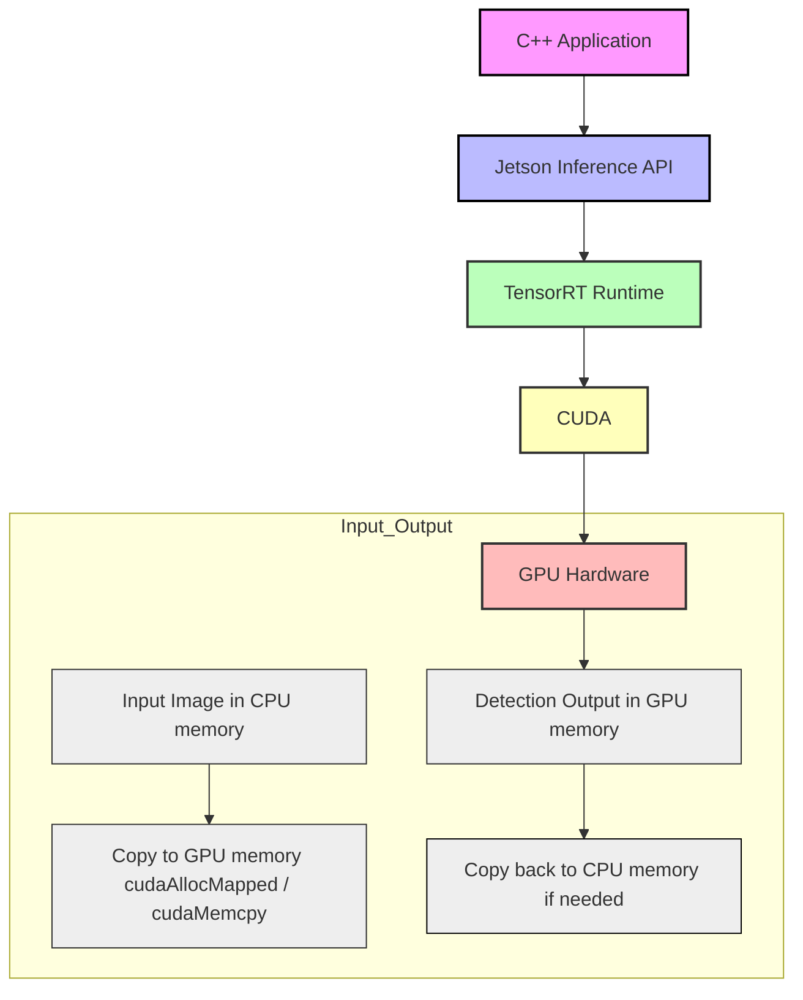

# Machine Learning Implementation
This directory contains specific implementations of machine learning frameworks and models.

# Structure
## Terminology

- **Framework** : The inference engine backend — executes the model's arithmetic on the chosen hardware (CPU, GPU, NPU). Examples: TensorFlow Lite, HailoRT. May be a tightly-linked library, a dynamically loaded `.so`, a compiled executable model, or a containerised service. Framework selection is a **build-time** decision via `EHS_ML_FRAMEWORK_IMAGE_SUPPORT` / `EHS_ML_HARDWARE_ACCELERATION`.
- **Model**     : The model implementation layer. Responsible for the full post-processing pipeline that converts raw inference engine output into structured, application-ready data. This is **model-architecture-specific**, not framework-specific. See §Post-Processing Pipeline below.
- **ML Common** : The top-level HAL abstraction (`ml_common.*`). Routes `EhsML_Create` / `EhsML_RunOutputJson` / `EhsML_Destroy` calls to the correct framework and model implementations via `switch(ctx->type)`.

# TODO
- The stubbed code should jsut be another framework that does nothing with inouts, models and inference. Remove the weird build options
- Jetson tensorRT porting.
 
# Key Inference Engine Entities
## Inference Engine execution
Inference engines can form many 
- Tightly integrated RTE libraries
- Executable libraries (Staic libraries for MCUs)
- Executable dynamic libraries (for linux, windows)
- Executable source code generated for with embedded model
- Staticly integrate executable source code that can run models (an RTE library compiled in the application build envirnment) 
- Linux container based services (socket, REST, or other RPC based access)


## Post-Processing Pipeline

Tightly-integrated inference engines deliver raw tensor output that must pass through a model-specific post-processing pipeline before the application receives usable data. For broader context see `docs/inxware-edge-ml.md`.

```
Raw model output tensors (INT8 / UINT8 / FP16 / FP32)
         |
         v
1. Framework-specific raw output unpacking
         |
         v
2. Dequantisation  (scale × (value − zero_point) → float)
         |
         v
3. Model-architecture decoding  (anchor decode, DFL, grid offsets, tensor routing)
         |
         v
4. Logical post-processing  (confidence filter, NMS, plausibility checks)
         |
         v
5. Output formatting  (JSON, binary, Protobuf, ROS2 message, …)
```

### Stage 1 — Framework-specific raw output unpacking

Some inference backends deliver output that does not map 1:1 to the model's logical output tensors. Examples:

- **TFLite (CPU)**: output tensors match the model's output layers exactly, with `EhsML_Tensor_t.quantisation_params` populated from the `.tflite` metadata when the model is quantised.
- **HailoRT**: the HEF compiler may split or transpose output tensors relative to the original model. The Hailo framework layer in `framework/hailo/` is responsible for unpacking this into the canonical `ctx->output_tensor[]` array before the model layer is called.
- **Other NPUs (future)**: similar framework-layer unpacking will be needed for Qualcomm QNN, NXP eIQ, and Rockchip RKNN backends where tensor packing conventions differ from the training framework.

This stage is implemented entirely inside the framework layer (`framework/<name>/`) and is **transparent to the model layer**.

### Stage 2 — Dequantisation

Converts quantised integer output values to floating-point using the affine mapping:

```
float_value = scale × (raw_value − zero_point)
```

`scale` and `zero_point` are stored in `EhsML_Tensor_t.quantisation_params` (populated by the framework layer from model metadata).

**Implementations:**

- `_EHS_ML_TYPED_DATA_ASSIGN` macro (`yolov5_objdet.c`): type-dispatched dequantisation covering all `EHS_ML_DATATYPE_*` variants (UINT8, INT8, INT16, INT32, FP32, FP64, …). Used element-by-element during output tensor iteration.
- `dequantise_box_values()` (`yolov8_pose.c`): a reusable function operating on a full `EhsML_Tensor_t`, suitable for bulk dequantisation of a box or keypoint tensor.

**When this stage is skipped:** if the framework delivers FP32 output (e.g. TFLite with a float model, or a hardware backend that dequantises internally), `quantisation_params.scale == 1.0` and `zero_point == 0`, making the transform a no-op. `yolov8_objdet.c` currently assumes FP32 output and casts `data_ptr.f32` directly without applying the affine transform — this must be noted when using with quantised models.

### Stage 3 — Model-architecture decoding

Interprets the semantic meaning of each output tensor element. This is **determined by the model architecture**, not the framework. Examples:

| Model | Output layout | Decoding required |
|---|---|---|
| YOLOv5 ObjDet | Single tensor `[1, N_anchors, 5 + C]` — x, y, w, h, objectness, class_scores | `score = objectness × max_class_score`; class lookup |
| YOLOv8 ObjDet | Pre-decoded per-class grouped boxes with counts | Count prefix per class; corner coordinates (ymin, xmin, ymax, xmax) |
| YOLOv8 Pose | Multiple tensors per scale; routed by `dims[0]`: 64 = boxes (DFL), 1 = scores, 51 = keypoints | Tensor routing by feature dimension; DFL regression decode; 17-keypoint layout |

New model implementations must document the expected tensor layout, the routing logic, and any magic-number dimension checks so that future maintainers can verify correctness when the inference backend changes.

### Stage 4 — Logical post-processing

Reduces raw decoded candidates to a final, application-ready detection set.

**Confidence threshold filtering** — applied first using `ctx->conf_thres` (set at `EhsML_Create` time). Candidates below the threshold are discarded before NMS to bound memory and compute.

**Non-Maximum Suppression (NMS)** — for object detection models, overlapping bounding boxes for the same object must be collapsed to a single best detection. The utility function:

```c
// model/ml_utils/ehs_ml_nms.h
size_t EhsApply_Greedy_NMS(const NMSBox* in_boxes, size_t N,
                            float conf_thr, float iou_thr,
                            int class_aware,
                            size_t* keep_idx, size_t max_keep,
                            size_t* scratch_idx, uint8_t* scratch_flag);
```

provides greedy class-aware IoU-based NMS. Used in `yolov5_objdet.c` with `iou_thr = 0.45`. `yolov8_objdet.c` currently relies on the model's own pre-NMS output format and does not call `EhsApply_Greedy_NMS`.

**Plausibility filtering** (TODO) — semantic checks on decoded output (e.g. bounding box aspect ratio limits, keypoint joint-angle constraints) are not yet implemented in any model but belong in this stage.

**Soft-NMS** (TODO) — alternative to greedy NMS that decays scores of overlapping boxes instead of suppressing them outright. Not yet implemented.

### Stage 5 — Output formatting

Serialises the post-processed results into the output format requested by the caller.

**JSON** (`EhsML_RunOutputJson`) — the currently implemented path. Output schema is model-specific:

| Model | JSON fields |
|---|---|
| YOLOv5 ObjDet | `{type, det_cnt, cls0, cnf0, x0, y0, w0, h0, …}` — centre-format box (x, y, w, h) |
| YOLOv8 ObjDet | `{cls0, cnf0, ymin0, xmin0, ymax0, xmax0, …, det_cnt}` — corner-format box |
| YOLOv8 Pose | Not yet serialised (implementation in progress) |

Note: the coordinate formats differ between YOLOv5 (centre + width/height) and YOLOv8 (corner min/max). API consumers must be aware of the model type when parsing the JSON output.

**Raw binary** (`EhsML_RunOutputData`) — documented in `Common/HAL/include/hal_ml.h` but not yet implemented (TODO). Intended for MCU targets or high-throughput pipelines where JSON serialisation overhead is unacceptable.

**Future formats** (TODO): Protobuf, FlatBuffers, ROS2 message types.


## Code Tree Overview

```
- ml/
  |- framework/
    |- tensorflow-lite
    |- ml_fw_tflite.mk
    |- xxx.h
    |- xxx.c
    |- hailo/
    |- ml_fw_hailo.mk
    |- xxx.h
    |- xxx.c
    ...
  |- model/
    |- ml_models.h                     # include gate for all model headers
    |- ml_model_template.c.template    # starting point for new model implementations
    |- ml_model_template.h.template
    |- ml_model.mk                     # build inclusion for model sources
    |- yolov5_objdet.c / .h            # YOLOv5 object detection (implemented)
    |- yolov8_objdet.c / .h            # YOLOv8 object detection (implemented)
    |- yolov8_pose.c / .h              # YOLOv8 pose estimation (in progress)
    |- ml_utils/
       |- ehs_ml_nms.h / .c            # NMSBox struct + EhsApply_Greedy_NMS()
       |- ehs_ml_utils.h / .c          # TfLiteTimeNow_ms() and general utilities
    ...
  |- stubbed # TODO THIS SHOULD JUST BE A NEW FRAMEWORK.
    |- ml.mk
    |- stubbed_ml.c
  |- ml_common.mk
  |- ml_common.h
  |- ml_common.c
  |- README.md
```

## Framework
This is the backend where the model data is processed. A few examples are Tensorflow Lite and Hailo.
The `framework` folder contains the code where each framework is implemented in its own folder.

## Model

The model layer implements the full post-processing pipeline (stages 2–5 above) for a specific neural network architecture. It is independent of the inference framework — the same YOLOv5 model implementation should work whether the framework backend is TFLite or HailoRT, as long as the framework layer populates `ctx->output_tensor[]` correctly.

Each model implements four functions following the boilerplate pattern:

```c
EhsML_Err EhsML_<Model>_Create(EhsML_Context*, const ehs_char*, EhsML_Type, ehs_float, ehs_sint32);
void      EhsML_<Model>_Destroy(EhsML_Context*);
EhsML_Err EhsML_<Model>_SetInputData(EhsML_Context*, const void*, ehs_uint32);
EhsML_Err EhsML_<Model>_RunOutputJson(EhsML_Context*, ehs_char*, ehs_uint32);
```

**Adding a new model:**
1. Copy `ml_model_template.c.template` and `ml_model_template.h.template` to new source files.
2. Define a new `EhsML_Type` enum value in `Common/HAL/include/hal_ml.h`.
3. Add a `case` for the new type in the `ml_common.c` dispatch switch.
4. Add the new source to `ml_model.mk` with appropriate `EHS_ML_MODEL_SUPPORT_*` build guards.
5. Include the new header in `ml_models.h` under the same build guard.
6. Document the expected output tensor layout and the post-processing stages implemented.

## Stubbed
This contains universal code when Machine Learning feature is stubbed. It must run on any type of target and platform.

## ML Common
The `ml_common.*` contains the highest level of abstraction to be called from inference function block. It is to make sure that all the exported functions must be universal and not linked to a specific target.

## README
This file, which describes the structure of EHS Machine Learning infrastructure.

# Makefile Definition
## General
`EHS_ML_SUPPORT` states overall state of machine learning support. There are three values:
- `yes`
- `stubbed`
- `none` or undefined
#TODO propose this also chooses the framework instead of the thing below which seem to choose the data type, which is a model paramter not really a framework.
EHS_ML_SUPPORT=none|stubbed|tflite|hailo|...
 
`EHS_ML_LAYER_TENSORS_MAX` defines the maximum number of input or output tensors a model can have. If the actual number exceeds it, this parameter must increase or initialisation will throw init error. The default value is 128. In order to set this, add `DEFS += EHS_ML_LAYER_TENSORS_MAX=<number>` in platform makefile.

## Framework

Selects the inference engine backend. These are build-time variables set in the platform `config.mk`.

- `EHS_ML_FRAMEWORK_IMAGE_SUPPORT` — framework for image/vision models:
  - `tensorflow-lite` (implemented)
  - `tensorflow-lite-micro` (TODO)
- `EHS_ML_FRAMEWORK_TEXT_SUPPORT` — framework for text/LLM models (TODO)
- `EHS_ML_FRAMEWORK_AUDIO_SUPPORT` — framework for audio models (TODO)

### Hardware Acceleration
`EHS_ML_HARDWARE_ACCELERATION` defines the available hardware acceleration supported on the platform. This should be defined in the platform `config.mk` file as a single choice. It can be chosen from one of the choices in the following list:
- `hailo`

TODO: The following shouldn't be build time variables necessarilly (unless it is an MCU executable model) 
If we do need to know at build time  then this should just use a make variable EHS_ML_MODEL=EHS_ML_MODEL_SUPPORT_YOLOV3_OBJDET, which may set the following (or we define an enumeration)

## Model Type Suport
The following are the list of makefile variables. The value is either `yes` or `no`:
- `EHS_ML_MODEL_SUPPORT_YOLOV3_OBJDET` (Not Implemented)
- `EHS_ML_MODEL_SUPPORT_YOLOV4_OBJDET` (Not Implemented)
- `EHS_ML_MODEL_SUPPORT_YOLOV5_OBJDET`
- `EHS_ML_MODEL_SUPPORT_YOLOV6_OBJDET` (Not Implemented)
- `EHS_ML_MODEL_SUPPORT_YOLOV7_OBJDET` (Not Implemented)
- `EHS_ML_MODEL_SUPPORT_YOLOV8_OBJDET`
- `EHS_ML_MODEL_SUPPORT_YOLOV8_INSTSEG` (Not Implemented)
- `EHS_ML_MODEL_SUPPORT_YOLOV8_POSE` (Not Implemented)
- `EHS_ML_MODEL_SUPPORT_YOLOV8_OOB` (Not Implemented)
- `EHS_ML_MODEL_SUPPORT_YOLOV8_CLASS` (Not Implemented)
- `EHS_ML_MODEL_SUPPORT_YOLOV9_OBJDET` (Not Implemented)
- `EHS_ML_MODEL_SUPPORT_YOLOV9_INSTSEG` (Not Implemented)
- `EHS_ML_MODEL_SUPPORT_YOLOV10_OBJDET` (Not Implemented)
- `EHS_ML_MODEL_SUPPORT_YOLOV11_OBJDET` (Not Implemented)
- `EHS_ML_MODEL_SUPPORT_YOLOV11_INSTSEG` (Not Implemented)
- `EHS_ML_MODEL_SUPPORT_YOLOV11_POSE` (Not Implemented)
- `EHS_ML_MODEL_SUPPORT_YOLOV11_OOB` (Not Implemented)
- `EHS_ML_MODEL_SUPPORT_YOLOV11_CLASS` (Not Implemented)
- `EHS_ML_MODEL_SUPPORT_YOLOV12_OBJDET` (Not Implemented)
- `EHS_ML_MODEL_SUPPORT_YOLOV12_INSTSEG` (Not Implemented)
- `EHS_ML_MODEL_SUPPORT_YOLOV12_POSE` (Not Implemented)
- `EHS_ML_MODEL_SUPPORT_YOLOV12_OOB` (Not Implemented)
- `EHS_ML_MODEL_SUPPORT_YOLOV12_CLASS` (Not Implemented)
- `EHS_ML_MODEL_SUPPORT_YOLOV26_OBJDET` (Not Implemented)
- `EHS_ML_MODEL_SUPPORT_YOLOV26_INSTSEG` (Not Implemented)
- `EHS_ML_MODEL_SUPPORT_YOLOV26_POSE` (Not Implemented)
- `EHS_ML_MODEL_SUPPORT_YOLOV26_OOB` (Not Implemented)
- `EHS_ML_MODEL_SUPPORT_YOLOV26_CLASS` (Not Implemented)
- `EHS_ML_MODEL_SUPPORT_YOLOV26_CLASS` (Not Implemented)
- `EHS_ML_MODEL_SUPPORT_SAM_IMGSEG` (Not Implemented)


# Hardware Accleration

## GPU

## Hailo

## DeepX

## Nvidia Jetson

**Dependencies**

These would bebuild in `ert-contrib-middleware`

```bash
git clone https://github.com/dusty-nv/jetson-inference.git
cd jetson-inference
mkdir build && cd build
cmake ../
make -j$(nproc)
sudo make install
```

**Code Examples**

The following would be built in `ert-components`

```c
// header requirements
#include "jetson-inference/detectNet.h"
#include "jetson-inference/cudaUtility.h"
#include "jetson-utils/videoSource.h"
#include "jetson-utils/videoOutput.h"
```
The C/C++ code (to go into the ml component-HAL):
```c++
#include <iostream>
#include "jetson-inference/detectNet.h"

int main()
{
    // Load a pre-trained network (SSD-Mobilenet example)
    detectNet* net = detectNet::Create("ssd-mobilenet-v2", 0, nullptr);

    if (!net) {
        std::cerr << "Failed to load detectNet model.\n";
        return -1;
    }

    std::cout << "Network loaded successfully!\n";

    // Set up input image
    uchar3* inputImage = nullptr; // CUDA GPU memory for input
    int width = 640, height = 480;

    // allocate memory on GPU
    cudaAllocMapped((void**)&inputImage, width * height * sizeof(uchar3));

    // ... fill inputImage with data from camera or image file

    // Run inference
    detectNet::Detection* detections = nullptr;
    int numDetections = net->Detect(inputImage, width, height, &detections);

    std::cout << "Detected " << numDetections << " objects.\n";

    // Cleanup
    delete net;
    return 0;
}
```



### Notes:

`detectNet::Create()` - automatically loads the TensorRT engine for the network.

`The Detect()` - function runs inference on GPU memory and returns detected objects.

Input images should reside in GPU memory (CUDA uchar3 or float3).

**Memory Management**

Jetson Inference relies on CUDA-managed memory:

Allocate input and output buffers on GPU using cudaAllocMapped().

Optionally, convert CPU images to GPU memory with cudaMemcpy().

Example:
```c++
cudaMemcpy(inputImage, cpuImage, width*height*sizeof(uchar3), cudaMemcpyHostToDevice);
```

**Linking Libraries**

In CMakeLists.txt (NOT USED HERE _ JUST AN EXAMPLE):

```cmake
find_package(CUDA REQUIRED)
find_package(JetsonInference REQUIRED)

add_executable(my_app main.cpp)
target_link_libraries(my_app jetson-inference)
```

Or with g++ manually:
```bash

g++ main.cpp -o my_app -I/usr/local/include/jetson-inference \
    -L/usr/local/lib -ljetson-inference -lcuda -lcudart
```

This ensures the Jetson Inference runtime is linked.

**Optional: Using Video Streams**

```c++
videoSource* input = videoSource::Create("csi://0");   // Jetson camera
videoOutput* output = videoOutput::Create("display://0");

while (input->IsStreaming() && output->IsStreaming())
{
    uchar3* frame = nullptr;
    input->Capture(&frame, 1000); // timeout in ms
    net->Detect(frame, input->GetWidth(), input->GetHeight(), &detections);
    output->Render(frame);
}
```

**Summary:**

1. Include Jetson Inference headers (`detectNet.h`, `cudaUtility.h`).
2. Initialise the network with `detectNet::Create()`.
3. Prepare input in GPU memory (`cudaAllocMapped` / `cudaMemcpy`).
4. Call `Detect()` to run inference.
5. Manage GPU memory and clean up.
6. Link against the Jetson Inference library.
